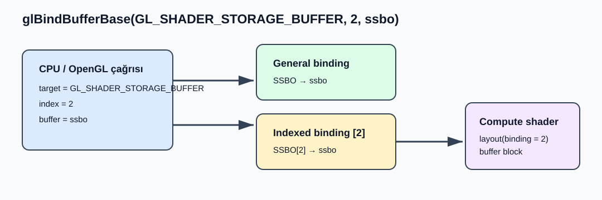

# OpenGL ES 3.1: `glBindBufferBase`

```c
void glBindBufferBase(GLenum target, GLuint index, GLuint buffer);
```

## Amaç

`glBindBufferBase`, bir buffer nesnesinin tamamını `target` ile seçilen indexed buffer binding point'e bağlar. Compute shader bir Shader Storage Buffer Object (SSBO) kullanacaksa, CPU tarafındaki buffer ile shader tarafındaki `binding` değeri arasındaki ilişki bu çağrıyla kurulur. Fonksiyon shader'ı çalıştırmaz, buffer'a veri yazmaz ve CPU'ya sonuç döndürmez; yalnızca hangi buffer'ın hangi binding point'te kullanılacağını belirleyen OpenGL state'ini değiştirir.

> OpenGL ES 3.1 ile kullanılan shader sürüm satırı `#version 310 es` olmalıdır. `#version 310 core`, masaüstü OpenGL GLSL'ine ait bir biçimdir.

## Kavramsal Akış



Başarılı çağrıda aynı `buffer` iki noktaya bağlanır: `target`ın general binding point'i ve `index` ile seçilen indexed binding point. Önceki bağlar kaldırılır, fakat bağlanan buffer nesnesinin içeriği veya diğer state'i değiştirilmez.

## Compute Shader Örneği: Her Değeri 2 ile Çarpma

Bu örnekte CPU başlangıç verisi olarak `[1, 2, 3, 4]` dizisini buffer'a yükler. `glBindBufferBase(GL_SHADER_STORAGE_BUFFER, 0, ssbo)` çağrısı bu buffer'ı binding point `0`a bağlar. Shader'daki `layout(std430, binding = 0)` bildirimi aynı binding point'i kullanır. Ardından compute shader dört invocation ile her elemanı `2` ile çarpar; işlem sonunda buffer'ın GPU tarafındaki içeriği `[2, 4, 6, 8]` olur.

### 1. CPU tarafında buffer oluşturma ve bağlama

```c
GLuint ssbo = 0;
GLuint input[] = { 1, 2, 3, 4 };

glGenBuffers(1, &ssbo);
glBindBuffer(GL_SHADER_STORAGE_BUFFER, ssbo);
glBufferData(GL_SHADER_STORAGE_BUFFER, sizeof(input), input, GL_DYNAMIC_COPY);

glBindBufferBase(GL_SHADER_STORAGE_BUFFER, 0, ssbo);
```

`glBufferData` buffer'a veri deposu ayırır ve başlangıç değerlerini yükler. Son satırdaki `glBindBufferBase` çağrısı, `ssbo`yu hem `GL_SHADER_STORAGE_BUFFER` general binding point'ine hem de bu hedefin `0` numaralı indexed binding point'ine bağlar. Bu çağrı yapılmazsa shader'daki `binding = 0` için kullanılacak SSBO bağlantısı kurulmamış olur.

### 2. GLSL ES 3.10 compute shader

```glsl
#version 310 es

layout(local_size_x = 4, local_size_y = 1, local_size_z = 1) in;

layout(std430, binding = 0) buffer Numbers {
    uint values[];
};

void main()
{
    uint index = gl_GlobalInvocationID.x;
    values[index] = values[index] * 2u;
}
```

Shader'daki `binding = 0`, CPU tarafındaki `glBindBufferBase` çağrısının `index = 0` parametresiyle eşleşir. `glDispatchCompute(1, 1, 1)` çalıştırıldığında `local_size_x = 4` nedeniyle dört invocation oluşur; her invocation kendisine ait `values[index]` elemanını günceller. `glBindBufferBase`ın bu örnekteki tek görevi, bu dört invocation'ın üzerinde çalışacağı buffer'ı shader'a bağlamaktır.

### 3. Dispatch sonrasındaki sonuç

```c
glUseProgram(compute_program);
glDispatchCompute(1, 1, 1);
```

Dispatch çağrısından sonra sonuç `ssbo` içindedir; `glBindBufferBase` sonucu CPU dizisine taşımaz. GPU sonucunu CPU'da okumak için OpenGL ES 3.1'de `glMapBufferRange` gibi ayrı bir readback akışı gerekir. Bu ayrım önemlidir: `glBindBufferBase` kaynak bağlar, `glDispatchCompute` işi başlatır, readback çağrısı ise sonucu CPU'ya alır.

## Parametreler

| Parametre | C tipi | Görevi |
| --- | --- | --- |
| `target` | `GLenum` | Indexed binding dizisinin türünü seçer. |
| `index` | `GLuint` | Seçilen hedef dizisindeki binding point numarasını belirtir. |
| `buffer` | `GLuint` | Seçilen binding point'e bağlanacak buffer nesnesinin adını belirtir. |

## `target` Parametresi

`target` yalnızca indexed buffer binding destekleyen aşağıdaki dört değerden biri olabilir.

| Değer | Anlamı | Compute shader açısından sonuç |
| --- | --- | --- |
| `GL_SHADER_STORAGE_BUFFER` | Shader Storage Buffer Object hedefi | Compute shader'ın buffer değişkenlerini okuyup yazdığı SSBO bağlantısını kurar. |
| `GL_ATOMIC_COUNTER_BUFFER` | Atomic counter storage | Atomic counter'lar için buffer bağlar; SSBO bağlantısı oluşturmaz. |
| `GL_TRANSFORM_FEEDBACK_BUFFER` | Transform feedback buffer | Vertex çıktılarının yakalanacağı buffer'ı bağlar. |
| `GL_UNIFORM_BUFFER` | Uniform block storage | Uniform block verisi için buffer bağlar; shader storage block değildir. |
| Başka bir enum | — | Çağrı başarısız olur ve `GL_INVALID_ENUM` oluşur. |

Compute shader ile `layout(..., binding = N) buffer` bildirimi kullanıldığında doğru hedef `GL_SHADER_STORAGE_BUFFER`dır.

## `index` Parametresi

`index`, `target`a ait indexed binding point dizisindeki elemanı seçer. Shader'ın kullanacağı `binding` değeri ile CPU tarafındaki `index` değeri eşleşmelidir.

| `index` değeri | Sonuç |
| --- | --- |
| `0 .. limit - 1` | Geçerlidir; seçilen indexed binding point güncellenir. |
| Shader storage block'un `binding` değeriyle aynı değer | Shader, bu binding point'e bağlanan buffer'ı kullanır. |
| `index >= limit` | Çağrı başarısız olur ve `GL_INVALID_VALUE` oluşur. |
| Aynı `index` ile yeni çağrı | Önceki buffer ayrılır ve yeni `buffer` bu binding point'e bağlanır. |

Her `target` için desteklenen binding point sayısı farklıdır.

| `target` | Sorgulanacak limit |
| --- | --- |
| `GL_SHADER_STORAGE_BUFFER` | `GL_MAX_SHADER_STORAGE_BUFFER_BINDINGS` |
| `GL_ATOMIC_COUNTER_BUFFER` | `GL_MAX_ATOMIC_COUNTER_BUFFER_BINDINGS` |
| `GL_TRANSFORM_FEEDBACK_BUFFER` | `GL_MAX_TRANSFORM_FEEDBACK_SEPARATE_ATTRIBS` |
| `GL_UNIFORM_BUFFER` | `GL_MAX_UNIFORM_BUFFER_BINDINGS` |

```c
GLint binding_count = 0;
glGetIntegerv(GL_MAX_SHADER_STORAGE_BUFFER_BINDINGS, &binding_count);
```

## `buffer` Parametresi

`buffer`, bağlanacak buffer nesnesinin adıdır. OpenGL ES 3.1'de sıfır olmayan, daha önce hiç kullanılmamış bir adın ilk kez bağlanması o ad için sıfır boyutlu veri deposuna sahip yeni buffer state'i oluşturur.

| `buffer` değeri | Sonuç |
| --- | --- |
| `0` | General ve seçilen indexed binding point'teki buffer ayrılır. |
| Var olan buffer nesnesinin adı | Buffer hem general hem indexed binding point'e bağlanır. |
| Daha önce hiç bağlanmamış, sıfır olmayan ad | Geçerlidir; yeni ve sıfır boyutlu buffer state'i oluşturulur. |
| Daha önce silinmiş ad | Geçerlidir; ad yeniden kullanıldığında yeni ve sıfır boyutlu buffer state'i oluşturulur. |

`glBindBufferBase` buffer için veri deposu ayırmaz. Shader'ın gerçekten kullanacağı buffer alanı, örneğin `glBufferData` ile ayrıca hazırlanmalıdır. Yalnızca buffer'ın belirli bir byte aralığı kullanılacaksa `glBindBufferBase` yerine `glBindBufferRange` kullanılır.

## Tüm Buffer'ın Bağlanması

`glBindBufferBase` buffer'ın tamamını bağlar; başlangıç ofseti `0`dır ve erişilebilecek veri miktarı buffer'ın kullanım anındaki güncel boyutudur. Buffer boyutu binding sonrasında değişse bile binding geçerli kalır. Shader storage block'u çalıştırılırken ilgili binding point'te yeterli büyüklükte bir buffer bulunmuyorsa shader erişiminin sonucu tanımsız veya değiştirilmiş olabilir.

## Hata Kodları

| Hata | Oluşma koşulu |
| --- | --- |
| `GL_INVALID_ENUM` | `target`, dört geçerli indexed buffer hedefinden biri değilse. |
| `GL_INVALID_VALUE` | `index`, hedefe özgü indexed binding point sayısına eşit veya büyükse. |

## Kaynak

- [OpenGL ES 3.1 Specification](../../others%20(for%20Compute)/es_spec_3.1.withchanges.pdf)
