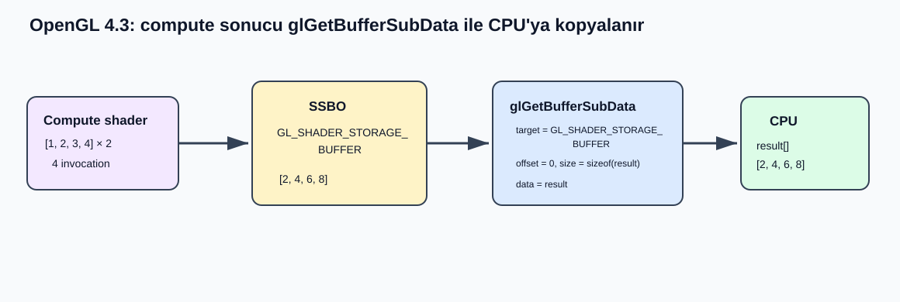

# OpenGL 4.3 Core: `glGetBufferSubData`

```c
void glGetBufferSubData(GLenum target, GLintptr offset, GLsizeiptr size, void *data);
```

## Amaç

`glGetBufferSubData`, `target` için o anda bağlı olan buffer nesnesinin veri deposundan seçilen bir byte aralığını CPU/client belleğine kopyalar. GPU/OpenGL tarafındaki buffer verisini değiştirmez; buffer'dan okur ve sonucu `data` ile gösterilen uygulama belleğine yazar. Compute shader bir SSBO'ya sonuç yazdıktan sonra CPU'nun bu sonucu incelemesi, kaydetmesi veya bir sonraki CPU işlemine girdi yapması gerektiğinde kullanılabilir.

> **OpenGL ES 3.1 kapsamı:** `glGetBufferSubData`, OpenGL ES 3.1 core API'sinde yoktur. Bu doküman fonksiyonu masaüstü OpenGL 4.3 Core Profile bağlamında açıklar. Bu nedenle aşağıdaki compute örneği ES 3.1 uygulamasında kullanılamaz.

## Kavramsal Akış



Fonksiyon **indexed binding point'i değil**, `target`ın general binding point'ini kullanır. Örneğin compute shader'a `glBindBufferBase(GL_SHADER_STORAGE_BUFFER, 0, ssbo)` ile bağlanan buffer, bu çağrının başarılı olması hâlinde aynı zamanda `GL_SHADER_STORAGE_BUFFER` general binding point'ine de bağlanır. Okunacak buffer'ın açıkça belli olması için `glGetBufferSubData` öncesinde `glBindBuffer(GL_SHADER_STORAGE_BUFFER, ssbo)` çağrısı yapmak okunabilir ve güvenli bir kullanım şeklidir.

## Compute Shader Örneği: Her Değeri 2 ile Çarpma

Bu örnekte CPU başlangıçta `[1, 2, 3, 4]` değerlerini bir SSBO'ya yükler. Compute shader dört invocation çalıştırır; her invocation kendi indeksindeki değeri `2` ile çarpar. Dispatch sonrasında buffer'ın beklenen içeriği `[2, 4, 6, 8]` olur. `glGetBufferSubData` bu sonucu CPU'daki `result` dizisine kopyalayan adımdır.

### 1. SSBO oluşturma ve compute shader'a bağlama

```c
GLuint ssbo = 0;
GLuint input[] = { 1, 2, 3, 4 };

glGenBuffers(1, &ssbo);
glBindBuffer(GL_SHADER_STORAGE_BUFFER, ssbo);
glBufferData(GL_SHADER_STORAGE_BUFFER, sizeof(input), input, GL_DYNAMIC_COPY);
glBindBufferBase(GL_SHADER_STORAGE_BUFFER, 0, ssbo);
```

Bu aşamada `glBufferData` GPU/OpenGL buffer'ında dört adet `GLuint` için veri deposu oluşturur ve başlangıç verisini yükler. `glBindBufferBase` ile SSBO binding point `0`a bağlanır; shader'daki `binding = 0` bu nedenle aynı buffer'ı görür.

### 2. Compute shader'ın buffer'a yazması

```glsl
#version 430 core

layout(local_size_x = 4, local_size_y = 1, local_size_z = 1) in;

layout(std430, binding = 0) buffer Numbers {
    uint values[];
};

void main()
{
    uint index = gl_GlobalInvocationID.x;
    values[index] = values[index] * 2u;
}
```

`glDispatchCompute(1, 1, 1)` çağrısı bu shader için dört invocation üretir; çünkü `local_size_x = 4` ve X ekseninde bir work group vardır. Invocation'ların yaptığı yazılar sırasıyla `values[0] = 2`, `values[1] = 4`, `values[2] = 6` ve `values[3] = 8` olur. Bu fonksiyonun rolü burada başlamaz: `glGetBufferSubData` shader'ı başlatmaz veya çarpma yapmaz; tamamlanmış buffer verisinin istenen bölümünü client belleğine alır.

### 3. Sonucu `glGetBufferSubData` ile CPU'ya kopyalama

```c
GLuint result[4] = { 0 };

glUseProgram(compute_program);
glDispatchCompute(1, 1, 1);

glBindBuffer(GL_SHADER_STORAGE_BUFFER, ssbo);
glGetBufferSubData(
    GL_SHADER_STORAGE_BUFFER,
    0,
    sizeof(result),
    result
);

/* result: { 2, 4, 6, 8 } */
```

Bu çağrıda `target`, okunacak general binding point'i seçer; `offset = 0` buffer'ın ilk byte'ından başlanacağını belirtir; `size = sizeof(result)` dört `GLuint` kadar byte'ın okunmasını ister; `data = result` ise kopyanın hedefini belirtir. Dolayısıyla fonksiyon yalnızca `[0, sizeof(result))` byte aralığını CPU belleğine taşır.

## Compute Yazısı Sonrası Görünürlük Notu

Shader store işlemleri otomatik olarak diğer GL işlemleriyle senkronize edilmez. `GL_BUFFER_UPDATE_BARRIER_BIT` bazı buffer erişim türlerini kapsar; ancak `glGetBufferSubData` için bu biti zorunlu kılan açık bir kural yoktur. Bu nedenle doküman belirli bir barrier bitini “zorunlu çözüm” diye sunmaz; readback senkronizasyon stratejisi sonraki HLR/TP çalışmasında hedef sürücü ve kullanım senaryosuyla birlikte belirlenmelidir.

## Parametreler

| Parametre | C tipi | Görevi |
| --- | --- | --- |
| `target` | `GLenum` | Okunacak buffer'ın bağlı olduğu general binding point'i seçer. |
| `offset` | `GLintptr` | Buffer veri deposunda okunacak ilk byte'ın konumudur. |
| `size` | `GLsizeiptr` | `offset`tan başlayarak CPU belleğine kopyalanacak byte sayısıdır. |
| `data` | `void *` | Okunan byte'ların yazılacağı client bellek bölgesidir. |

## `target` Parametresi

`target`, geçerli bir buffer hedefi olmalıdır. Fonksiyon, bu hedefin **general binding point**'inde hangi buffer bağlıysa onu okur.

| Geçerli `target` | Buffer'ın tipik amacı | `glGetBufferSubData` sonucu |
| --- | --- | --- |
| `GL_ARRAY_BUFFER` | Vertex attribute verisi | Bu hedefe bağlı buffer'dan seçilen aralık CPU'ya kopyalanır. |
| `GL_ATOMIC_COUNTER_BUFFER` | Atomic counter depolaması | Bağlı atomic counter buffer'ının byte aralığı okunur. |
| `GL_COPY_READ_BUFFER` | Buffer kopya kaynağı | Bu hedefe bağlı buffer'ın aralığı okunur. |
| `GL_COPY_WRITE_BUFFER` | Buffer kopya hedefi | Bu hedefe bağlı buffer'ın aralığı okunur. |
| `GL_DISPATCH_INDIRECT_BUFFER` | Indirect compute dispatch komutu | Bağlı command buffer'ın aralığı okunur. |
| `GL_DRAW_INDIRECT_BUFFER` | Indirect draw komutu | Bağlı command buffer'ın aralığı okunur. |
| `GL_ELEMENT_ARRAY_BUFFER` | Vertex indeksleri | Bağlı index buffer'ın aralığı okunur. |
| `GL_PIXEL_PACK_BUFFER` | Pixel readback hedefi | Bağlı pixel-pack buffer'ın aralığı okunur. |
| `GL_PIXEL_UNPACK_BUFFER` | Texture yükleme kaynağı | Bağlı pixel-unpack buffer'ın aralığı okunur. |
| `GL_SHADER_STORAGE_BUFFER` | Shader için okuma-yazma depolama | SSBO sonucu CPU'ya alınır; compute örneğindeki değer budur. |
| `GL_TEXTURE_BUFFER` | Buffer texture verisi | Bağlı texture-buffer'ın aralığı okunur. |
| `GL_TRANSFORM_FEEDBACK_BUFFER` | Transform feedback çıktısı | Bağlı transform-feedback buffer'ının aralığı okunur. |
| `GL_UNIFORM_BUFFER` | Uniform block depolaması | Bağlı uniform buffer'ın aralığı okunur. |
| Table 6.1 dışında bir değer | — | `GL_INVALID_ENUM` oluşur. |
| Geçerli hedef fakat bu hedefte `0` bağlı | — | `GL_INVALID_OPERATION` oluşur. |

Önemli sonuç: Aynı buffer farklı hedeflerde bağlı olsa bile fonksiyon yalnızca verilen `target`ın general binding point'ine bakar. Bu nedenle compute sonucu için `GL_SHADER_STORAGE_BUFFER` seçilir ve doğru buffer bu hedefe bağlanır.

## `offset` Parametresi

`offset`, byte cinsinden başlangıç konumudur; eleman indeksi değildir. Örneğin `GLuint` dört byte ise üçüncü `GLuint` değeri için başlangıç ofseti `2 * sizeof(GLuint)` olur.

| `offset` değeri | Sonuç |
| --- | --- |
| `0` | Okuma buffer'ın ilk byte'ından başlar. |
| `0 < offset < GL_BUFFER_SIZE` | `offset + size` buffer sınırını aşmıyorsa bu byte'tan başlanır. |
| Negatif değer | `GL_INVALID_VALUE` oluşur. |
| `offset + size > GL_BUFFER_SIZE` olacak değer | `GL_INVALID_VALUE` oluşur. |

## `size` Parametresi

`size`, kopyalanacak byte sayısıdır; eleman sayısı değildir. Örneğin dört adet `GLuint` okumak için `size = 4 * sizeof(GLuint)` veya `sizeof(result)` verilir.

| `size` değeri | Sonuç |
| --- | --- |
| Pozitif ve aralık sınırları içinde | Tam olarak bu kadar byte `data` alanına kopyalanır. |
| `0` | `offset` buffer sınırları içindeyse sıfır byte okunur; `size` negatif olamaz. |
| Negatif değer | `GL_INVALID_VALUE` oluşur. |
| `offset + size > GL_BUFFER_SIZE` | `GL_INVALID_VALUE` oluşur. |

## `data` Parametresi

`data`, sonuçların yazılacağı client bellek bölgesidir. Uygulama en az `size` byte ayırmış geçerli bir adres vermelidir.

| `data` durumu | Sonuç |
| --- | --- |
| En az `size` byte kapasiteli geçerli CPU belleği | Okunan veri bu belleğe yazılır. |
| Yetersiz bellek veya geçersiz pointer | Bunun için ayrı bir GL hata kodu tanımlanmaz; uygulama geçerli bölge sağlamakla sorumludur. |
| `size == 0` | Kopyalanacak byte olmadığından hedef belleğe veri yazılmaz. |

## Ek Ön Koşul: Buffer Mapped Olmamalıdır

`target` için bağlı buffer, çağrı anında mapped durumdaysa `glGetBufferSubData` başarısız olur ve `GL_INVALID_OPERATION` üretir. Buffer'ın mapped olup olmadığını `GL_BUFFER_MAPPED` ile sorgulamak mümkündür; mapped buffer üzerinde bu okuma için önce mapping sonlandırılmalıdır.

## Hata Kodları

| Hata | Oluşma koşulu |
| --- | --- |
| `GL_INVALID_ENUM` | `target`, geçerli bir buffer hedefi değilse. |
| `GL_INVALID_OPERATION` | `target` için reserved buffer adı `0` bağlıysa. |
| `GL_INVALID_VALUE` | `offset` veya `size` negatifse ya da toplamları bağlı buffer'ın `GL_BUFFER_SIZE` değerini aşıyorsa. |
| `GL_INVALID_OPERATION` | `target` için bağlı buffer nesnesi mapped durumdaysa. |

## Kaynak

- [OpenGL 4.3 Core Profile Specification](../../others%20(for%20Compute)/glspec43.core.pdf)
