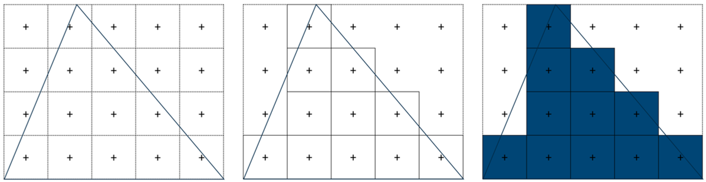
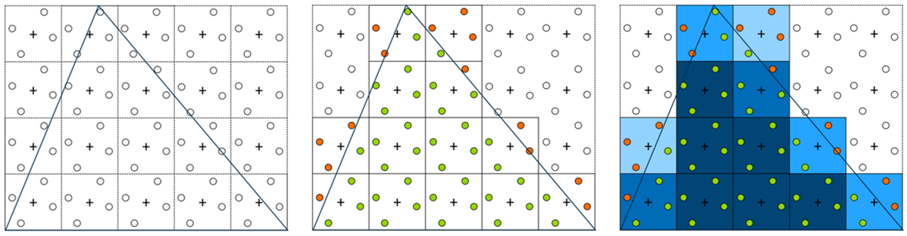

<!--
AUTO-GENERATED FILE. DO NOT EDIT DIRECTLY.
Run: python scripts/build_presentation.py
Source order: docs/presentation-order.txt
-->

# EGL 1.0 Fonksiyonları

Bu rapor, temel EGL 1.0 fonksiyonlarını tipik EGL yaşam döngüsüne göre sıralı biçimde sunar. Her fonksiyon bölümü bağımsız olarak sunulabilecek şekilde fonksiyonun amacı, parametreleri, dönüş değeri ve ilgili EGL kavramlarını içerir.

## İçindekiler

1. `eglGetDisplay`
2. `eglInitialize`
3. `eglGetConfigs`
4. `eglChooseConfig`
5. `eglGetConfigAttrib`
6. `eglCreateWindowSurface`
7. `eglCreateContext`
8. `eglMakeCurrent`
9. `eglGetCurrentDisplay`
10. `eglGetCurrentContext`
11. `eglSwapBuffers`
12. `eglDestroyContext`
13. `eglDestroySurface`
14. `eglTerminate`
15. `eglGetError`

---

# EGL 1.0: `eglGetDisplay`

```c
EGLDisplay eglGetDisplay(EGLNativeDisplayType display_id);
```

`eglGetDisplay`, native görüntüleme sistemine ait bir display tanımlayıcısını EGL tarafından kullanılabilecek bir `EGLDisplay` handle'ı ile ilişkilendirmek için kullanılır.

Kısa özet:

- Girdi: `EGLNativeDisplayType`
- Çıktı: `EGLDisplay`
- Başarısızlık değeri: `EGL_NO_DISPLAY`
- `EGL_DEFAULT_DISPLAY`, varsayılan native display'i istemek için kullanılır.
- `EGLDisplay`, fiziksel monitörün kendisi değil, EGL'nin kullandığı opaque handle'dır.
- `eglGetDisplay` display'i initialize etmez; bunun için `eglInitialize` gerekir.

## Kavramsal Akış

```text
Native display
    |
    v
eglGetDisplay
    |
    v
EGLDisplay handle
    |
    v
eglInitialize
```

`eglGetDisplay` native platform ile EGL arasındaki ilk bağlantı noktalarından biridir.

## Parametreler

### `display_id`

`display_id`, hangi native display'in EGL tarafında temsil edileceğini belirtir.

`EGLNativeDisplayType` platforma bağımlıdır. Ubuntu header dosyalarında farklı platformlar için örneğin şu tanımlar bulunur:

```c
typedef struct wl_display *EGLNativeDisplayType;
typedef Display *EGLNativeDisplayType;
typedef void *EGLNativeDisplayType;
typedef int EGLNativeDisplayType;
```

Aynı anda bunların hepsi aktif değildir; platform header'ları uygun tanımı seçer.

`EGL_DEFAULT_DISPLAY` yaygın EGL başlıklarında şu şekilde tanımlanır:

```c
#define EGL_DEFAULT_DISPLAY EGL_CAST(EGLNativeDisplayType,0)
```

| `display_id` değeri           | Anlamı                                                                  |
| -------------------------------- | ------------------------------------------------------------------------ |
| `EGL_DEFAULT_DISPLAY`          | Varsayılan native display için bir`EGLDisplay` istenir.              |
| Geçerli Wayland`wl_display *` | Belirtilen native Wayland bağlantısı için bir`EGLDisplay` istenir. |

## `EGLDisplay` Nedir?

`EGLDisplay`, uygulamanın iç yapısını yorumlamaması gereken bir EGL handle'ıdır.

Örnek:

```text
0x629b25a1cdf0
```

Bu değer:

- çözünürlük değildir,
- ekran numarası değildir,
- GPU numarası değildir,
- EGL sürümü değildir.

Uygulama bu handle'ı daha sonraki EGL çağrılarına geçirir:

```c
eglInitialize(display, &major, &minor);
```

`eglInitialize` ayrıntıları için ilgili bölüme bakınız.

## `EGL_DEFAULT_DISPLAY`

En temel kullanım:

```c
EGLDisplay dpy = eglGetDisplay(EGL_DEFAULT_DISPLAY);

if (dpy == EGL_NO_DISPLAY) {
    /* Display elde edilemedi. */
}
```

Bu kullanımda native display bağlantısını uygulamanın kendisinin açması gerekmez.

## Açık Wayland Display Bağlantısı

Wayland kullanıldığında açık bir native display bağlantısı şu şekilde oluşturulabilir:

```c
struct wl_display *wayland_display = wl_display_connect(NULL);

EGLDisplay dpy =
    eglGetDisplay((EGLNativeDisplayType)wayland_display);
```

`wl_display_connect` bir EGL fonksiyonu değildir; Wayland API'sine aittir.

## `eglGetDisplay` ve `eglInitialize` İlişkisi

```text
eglGetDisplay
    |
    v
EGLDisplay handle elde edilir
    |
    v
eglInitialize
    |
    v
Display EGL kullanımı için initialize edilir
```

`eglGetDisplay` başarılı olsa bile display henüz initialize edilmiş sayılmaz.

## Temel Kullanım

```c
EGLDisplay dpy = eglGetDisplay(EGL_DEFAULT_DISPLAY);

if (dpy == EGL_NO_DISPLAY) {
    EGLint err = eglGetError();
}
```

## Bölüm Özeti

- `eglGetDisplay` bir native display'den `EGLDisplay` handle'ı elde eder.
- Tek parametresi `display_id`'dir.
- `display_id`, `EGLNativeDisplayType` türündedir ve platforma bağımlıdır.
- `EGL_DEFAULT_DISPLAY`, varsayılan native display'i istemek için kullanılır.
- Geçerli explicit native display değerleri de verilebilir.
- Başarısızlıkta `EGL_NO_DISPLAY` döner.
- `EGLDisplay` opaque handle'dır; sayısal değeri yorumlanmamalıdır.
- `eglGetDisplay` display'i initialize etmez; sonraki adım tipik olarak `eglInitialize`'dır.

---

# EGL 1.0: `eglInitialize`

```c
EGLBoolean eglInitialize(EGLDisplay dpy,
                         EGLint *major,
                         EGLint *minor);
```

`eglInitialize`, bir `EGLDisplay` bağlantısını EGL kullanımı için initialize eder ve istenirse EGL implementation sürümünü `major` ve `minor` output parametreleri üzerinden döndürür.

Kısa özet:

- `dpy`: initialize edilecek EGL display.
- `major`: major sürüm output pointer'ı.
- `minor`: minor sürüm output pointer'ı.
- Başarılı çağrı: `EGL_TRUE`
- Başarısız çağrı: `EGL_FALSE`
- Geçersiz display için hata kodu: `EGL_BAD_DISPLAY`

## Kavramsal Akış

```text
Native display
    |
    v
eglGetDisplay
    |
    v
EGLDisplay
    |
    v
eglInitialize
    |
    +-- EGL bağlantısı initialize edilir
    |
    +-- major/minor istenirse sürüm bilgisi alınır
```

## Parametreler

### `dpy`

`dpy`, initialize edilecek geçerli bir `EGLDisplay` olmalıdır.

| `dpy`                                   | Sonuç                                                           |
| ----------------------------------------- | ---------------------------------------------------------------- |
| Geçerli, başlatılmamış`EGLDisplay` | Başlatma işlemi yapılabilir.                                  |
| `EGL_NO_DISPLAY`                        | `EGL_FALSE` döner ve `EGL_BAD_DISPLAY` hata durumu oluşur. |

Normal akış:

```c
EGLDisplay dpy = eglGetDisplay(EGL_DEFAULT_DISPLAY);
eglInitialize(dpy, &major, &minor);
```

`eglGetDisplay` için ilgili bölüme bakınız.

### `major`

`major`, major EGL sürüm numarasının yazılabileceği `EGLint *` output parametresidir.

```c
EGLint major = -1;
eglInitialize(dpy, &major, &minor);
```

Başlangıç değeri verilmesi, fonksiyonun output parametresini güncelleyip güncellemediğinin izlenmesini kolaylaştırır.

### `minor`

`minor`, minor EGL sürüm numarasının yazılabileceği `EGLint *` output parametresidir.

```c
EGLint minor = -1;
eglInitialize(dpy, &major, &minor);
```

## `NULL` Kullanımı

Sürüm numarası bilgisine ihtiyaç duyulmuyorsa output pointer'ları `NULL` olarak verilebilir:

```c
eglInitialize(dpy, &major, &minor);
eglInitialize(dpy, NULL, &minor);
eglInitialize(dpy, &major, NULL);
eglInitialize(dpy, NULL, NULL);
```

## Hata Matrisi

| Durum                                        | Sonuç                                                          |
| -------------------------------------------- | --------------------------------------------------------------- |
| Geçerli display, iki output pointer         | `EGL_TRUE`; sürüm bilgisi output parametrelerine yazılır. |
| Geçerli display, iki output pointer`NULL` | `EGL_TRUE`; sürüm bilgisi alınmadan display başlatılır. |
| `dpy == EGL_NO_DISPLAY`                    | `EGL_FALSE`, `EGL_BAD_DISPLAY`                              |

## Temel Kullanım

```c
EGLDisplay dpy = eglGetDisplay(EGL_DEFAULT_DISPLAY);

if (dpy == EGL_NO_DISPLAY) {
    return 1;
}

EGLint major;
EGLint minor;

if (!eglInitialize(dpy, &major, &minor)) {
    EGLint err = eglGetError();
    return 1;
}

printf("EGL version: %d.%d\n", major, minor);
```

## Bölüm Özeti

- `eglInitialize`, `EGLDisplay` bağlantısını EGL kullanımı için initialize eder.
- `dpy`, geçerli bir `EGLDisplay` olmalıdır.
- `major` ve `minor`, sürüm bilgisini almak için kullanılan output pointer'larıdır.
- `major` ve `minor`, istenirse `NULL` verilerek sürüm bilgisi alınmadan başlatma yapılabilir.
- `EGL_NO_DISPLAY` kullanımı `EGL_FALSE` ve `EGL_BAD_DISPLAY` üretti.
- Driver warning mesajları ile EGL API hata sonucu aynı şey değildir.

---

# EGL 1.0: `eglGetConfigs`

```c
EGLBoolean eglGetConfigs(EGLDisplay dpy,
                         EGLConfig *configs,
                         EGLint config_size,
                         EGLint *num_config);
```

`eglGetConfigs`, daha önceden başlatılmış (initialized) bir EGL görüntüleme bağlantısı (`EGLDisplay`) üzerinden, sistemin donanımsal olarak desteklediği tüm geçerli framebuffer yapılandırmalarının (`EGLConfig`) listesini veya yalnızca mevcut konfigürasyonların toplam sayısını elde etmek için kullanılan temel bir EGL fonksiyonudur.

## Kavramsal Akış

EGL mimarisinde `eglGetConfigs` fonksiyonu, işletim sisteminin native pencereleme sistemi (X11, Wayland, DRM/GBM veya gömülü pencerelendirme sistemleri) ile EGL arasındaki uyumlu framebuffer formatlarının bir envanterini sunar.

```text
[İşletim Sistemi / Windowing System]        [EGL State Machine]
      Native Display (ör. X11 Display)  --->  EGLDisplay
                                                  |
                                                  +---> [EGLConfig Havuzu] (eglGetConfigs buradan okur)
                                                          |
                                                          +-- EGLConfig #1 (RGB565, Z16, Single Buffer)
                                                          |    +-- EGL_BUFFER_SIZE: 16
                                                          |    +-- EGL_DEPTH_SIZE: 16
                                                          |
                                                          +-- EGLConfig #2 (RGBA8888, Z24, Back Buffer)
                                                          |    +-- EGL_BUFFER_SIZE: 32
                                                          |    +-- EGL_DEPTH_SIZE: 24
                                                          |
                                                          +-- EGLConfig #N ...
```

Bu fonksiyon havuz üzerinde herhangi bir filtreleme veya sıralama yapmaz (bu görev `eglChooseConfig`'e aittir); yalnızca sistemin native konfigürasyonlarına karşılık gelen tüm EGLConfig handle'larını olduğu gibi kullanıcıya sunar.

## Parametreler

### `dpy` (EGLDisplay)

EGL ortamını temsil eden opaque (kapalı) bir handle'dır. İşletim sisteminin native display'i (örneğin X11 `Display*` veya DRM dosya tanımlayıcısı) kullanılarak `eglGetDisplay` ile elde edilir ve `eglInitialize` ile başlatılmış olmalıdır.

| Değer                                    | Sonuç                                                                               |
| ----------------------------------------- | ------------------------------------------------------------------------------------ |
| Geçerli ve Başlatılmış`EGLDisplay` | İşlem devam eder, diğer argümanlar da doğruysa sorgu başarılıdır.           |
| `EGL_NO_DISPLAY`                        | Fonksiyon`EGL_FALSE` döner. `eglGetError()` -> `EGL_BAD_DISPLAY` üretir.     |
| Geçersiz Handle                          | Fonksiyon`EGL_FALSE` döner. `eglGetError()` -> `EGL_BAD_DISPLAY` üretir.     |
| Başlatılmamış (Uninitialized) Display | Fonksiyon`EGL_FALSE` döner. `eglGetError()` -> `EGL_NOT_INITIALIZED` üretir. |

### `configs` (EGLConfig*)

EGL konfigürasyonlarının handle'larının (tanımlayıcılarının) yazılacağı bellek bölgesini (diziyi) işaret eder.

| Değer                 | Sonuç                                                                                                                                |
| ---------------------- | ------------------------------------------------------------------------------------------------------------------------------------- |
| Geçerli Bellek Adresi | Sistemdeki mevcut konfigürasyonlar (en fazla`config_size` kadar) bu diziye kopyalanır.                                            |
| `NULL`               | Konfigürasyonlar kopyalanmaz. Sadece toplam config sayısı hesaplanıp`num_config` adresine yazılır (2 adımlı sorgu paterni). |

### `config_size` (EGLint)

`configs` dizisine kopyalanabilecek maksimum `EGLConfig` sayısını belirten tam sayıdır.

| Değer                         | Sonuç                                                                                                                                                                               |
| ------------------------------ | ------------------------------------------------------------------------------------------------------------------------------------------------------------------------------------ |
| `0`                          | Eğer`configs` geçerli bir dizi ise hiçbir veri kopyalanmaz, `num_config` değeri `0` olur. (Fakat `configs` `NULL` ise EGL standardınca dikkate alınmaz).             |
| Toplam Config <`config_size` | Sistemdeki tüm config'ler diziye yazılır.`num_config` içine kopyalanan miktar yazılır. Kalan dizi kapasitesi değiştirilmez.                                                |
| Toplam Config >`config_size` | EGL yalnızca`config_size` kadar config'i diziye kopyalar. Taşanlar göz ardı edilir, herhangi bir hata üretilmez. `num_config` değeri `config_size` değerine eşit olur. |

### `num_config` (EGLint*)

EGL'nin "Bu diziye kaç konfigürasyon yazdım?" (eğer `configs != NULL` ise) veya "Sistemde toplam kaç konfigürasyon var?" (eğer `configs == NULL` ise) sorusuna cevabını ilettiği çıkış (output) parametresidir.

| Değer                     | Sonuç                                                               |
| -------------------------- | -------------------------------------------------------------------- |
| Geçerli`EGLint*` adresi | Elde edilen sayı bu bellek adresine başarıyla yazılır.          |
| `NULL`                   | Geçerli değildir ve`EGL_BAD_PARAMETER` hata durumuna neden olur. |

## Geçerli Attribute Listesi ve Tampon (Buffer) Tipleri

`eglGetConfigs` fonksiyonu herhangi bir nitelik (attribute) listesi argümanı almaz. Sistemin desteklediği tüm EGL konfigürasyonlarını filtresiz döndürür. Elde edilen her bir `EGLConfig`, `eglGetConfigAttrib` kullanılarak tek tek incelenebilir.

Elde edilecek konfigürasyonlar donanımın desteklediği aşağıdaki tampon tiplerine sahip olabilir:

* **Back Buffered (Çift Tamponlu):** Pencere yüzeyleri (Window Surfaces) için uygundur. Ekranda yırtılma (tearing) olmaması için `eglSwapBuffers` işlemi gerektirir.
* **Single Buffered (Tek Tamponlu):** Pixmap yüzeyleri (Pixmap Surfaces) için uygundur. Çizilen her şey anında native belleğe yansır.

Hangisinin hangi tampon tipini desteklediğini anlamak için dönen config'lerin `EGL_SURFACE_TYPE` niteliği (`EGL_WINDOW_BIT`, `EGL_PIXMAP_BIT`, `EGL_PBUFFER_BIT`) kontrol edilmelidir.

## Ayrıntılar ve Yaşam Döngüsü

**Thread Güvenliği (Thread Safety):**
EGL'de konfigürasyon elde etme işlemleri (örneğin `eglGetConfigs`) thread-safe'tir. Birden fazla thread aynı `EGLDisplay` üzerinden eşzamanlı (concurrent) olarak bu fonksiyonu çağırabilir. Veri EGL state machine'ini modifiye etmeyip sadece okunup döndürüldüğü için bir yarış koşulu yaratmaz.

**Eşzamanlama (Synchronization):**
Bu fonksiyon donanıma veya Native render motoruna komut (command buffer) göndermez, sürücünün (driver) önceden oluşturduğu statik konfigürasyon listesini okur. Bu yüzden `glFinish()`, `eglWaitGL()` veya `eglWaitNative()` gibi komutların çağrılmasına gerek yoktur.

**Yaşam Döngüsü:**
Döndürülen `EGLConfig` handle'ları, o handle'ları barındıran `EGLDisplay` var olduğu sürece geçerlidir. Display `eglTerminate` ile sonlandırıldığında bu config'ler geçersizleşir ve bir daha kullanılamazlar.

## Hata Matrisi

EGL spesifikasyonunun katı kuralları gereği `eglGetConfigs` başarısız olduğunda **hiçbir yan etki (side effect) bırakmamalıdır.** Argümanlardaki bellek alanları değiştirilmez ve state machine mevcut durumunu aynen korur.

| Durum                                                       | Sonuç (Fonksiyon Dönüşü) | EGL Hata Kodu (`eglGetError()`) |
| ----------------------------------------------------------- | ----------------------------- | --------------------------------- |
| Her şey geçerli ve başarılı                            | `EGL_TRUE`                  | `EGL_SUCCESS`                   |
| `dpy` geçerli bir display değil veya `EGL_NO_DISPLAY` | `EGL_FALSE`                 | `EGL_BAD_DISPLAY`               |
| `dpy` henüz `eglInitialize` ile başlatılmamış      | `EGL_FALSE`                 | `EGL_NOT_INITIALIZED`           |
| `num_config` parametresinin `NULL` olması              | `EGL_FALSE`                 | `EGL_BAD_PARAMETER`             |

## Güvenli Kullanım Örneği

Aşağıdaki C kodu, config sayısının ve config listesinin iki ayrı çağrıyla alındığı iki adımlı sorgu yaklaşımını gösterir.

```c
#include <EGL/egl.h>
#include <stdio.h>
#include <stdlib.h>

/*
 * Sistemdeki tüm konfigürasyonları elde edip ekrana sayısını yazdıran güvenli fonksiyon.
 * Başarılı olursa EGL_TRUE, aksi halde EGL_FALSE döner.
 */
EGLBoolean SafeGetEGLConfigs(EGLDisplay dpy) {
    EGLint total_configs = 0;
    EGLConfig *configs = NULL;

    // 1. ADIM: Sadece toplam config sayısını sor (configs = NULL geçirerek)
    if (eglGetConfigs(dpy, NULL, 0, &total_configs) != EGL_TRUE) {
        fprintf(stderr, "[Hata] EGL config sayısı okunamadı. Hata: 0x%04X\n", eglGetError());
        return EGL_FALSE;
    }

    if (total_configs == 0) {
        printf("[Bilgi] EGL başlatılmış ancak desteklenen konfigürasyon yok.\n");
        return EGL_TRUE; // Bu bir donanım limitidir, API hatası değil.
    }

    // 2. ADIM: Dönen sayı kadar heap'ten dinamik bellek tahsis et
    configs = (EGLConfig*) malloc(total_configs * sizeof(EGLConfig));
    if (configs == NULL) {
        fprintf(stderr, "[Hata] Bellek yetersizliği (Out of memory).\n");
        return EGL_FALSE;
    }

    // 3. ADIM: Ayrılan belleği gerçek konfigürasyonlarla doldur
    if (eglGetConfigs(dpy, configs, total_configs, &total_configs) != EGL_TRUE) {
        fprintf(stderr, "[Hata] EGL config verileri okunamadı. Hata: 0x%04X\n", eglGetError());
        free(configs);
        return EGL_FALSE;
    }

    printf("Başarılı: Sistemden %d adet EGLConfig çekildi.\n", total_configs);

    // TODO: Burada 'configs' dizisi eglGetConfigAttrib ile filtrelenip
    // projenin ihtiyaç duyduğu Back Buffered veya pBuffer özellikli config seçilebilir.

    // İşlem bittikten sonra ayrılan belleği serbest bırak
    free(configs);
  
    return EGL_TRUE;
}
```

## Bölüm Özeti

- **Amaç ve Sınırlar:** `eglGetConfigs`, tüm konfigürasyonları filtre uygulamadan listeler. Belirli niteliklere göre seçim yapmak için `eglChooseConfig` kullanılır.
- **İki Adımlı Sorgu:** Önce `configs = NULL` ile config sayısı öğrenilebilir, ardından gerekli büyüklükte bir dizi ayrılarak config handle'ları alınabilir.
- **Output Parametresi:** `num_config`, yalnızca config sayısı sorgulanırken de geçerli bir adres göstermelidir; `NULL` kullanımı geçerli değildir.
- **Yan Etkisizlik:** Fonksiyon config listesini okur; başarılı bir çağrı EGL state'ini değiştirmez.

---

# EGL 1.0: `eglChooseConfig`

```c
EGLBoolean eglChooseConfig(EGLDisplay dpy,
                           const EGLint *attrib_list,
                           EGLConfig *configs,
                           EGLint config_size,
                           EGLint *num_config);
```

`eglChooseConfig`, bir `EGLDisplay` üzerinde bulunan EGL configuration'ları uygulamanın verdiği attribute kriterlerine göre filtreleyip sıralamak için kullanılır.

Kısa özet:

- `dpy`: config'lerin aranacağı initialized display.
- `attrib_list`: attribute/value çiftleri.
- `configs`: eşleşen `EGLConfig` handle'larının yazılacağı buffer.
- `config_size`: output buffer kapasitesi.
- `num_config`: döndürülen config sayısının yazıldığı output pointer.
- Uygun config bulunmaması API hatası olmak zorunda değildir.
- `EGL_TRUE` + `num_config = 0` geçerli bir sonuçtur.

## Kavramsal Akış

```text
EGLDisplay
    |
    +-- Config #1
    +-- Config #2
    +-- Config #3
    +-- ...
            |
            v
      attrib_list kriterleri
            |
            v
      eglChooseConfig
            |
            v
      Eşleşen EGLConfig'ler
```

## Parametreler

### `dpy`

`dpy`, config seçim işleminin yapılacağı initialized `EGLDisplay`'dir.

| Değer                       | Sonuç                                                           |
| ---------------------------- | ---------------------------------------------------------------- |
| Geçerli initialized display | Config seçimi yapılabilir.                                     |
| `EGL_NO_DISPLAY`           | `EGL_FALSE` döner ve `EGL_BAD_DISPLAY` hata durumu oluşur. |

### `attrib_list`

`attrib_list`, attribute/value çiftlerinden oluşur ve `EGL_NONE` ile sonlandırılır.

Örnek:

```c
const EGLint attrs[] = {
    EGL_RED_SIZE,   8,
    EGL_GREEN_SIZE, 8,
    EGL_BLUE_SIZE,  8,
    EGL_NONE
};
```

Kavramsal görünüm:

```text
Attribute         Value
-----------------------
EGL_RED_SIZE        8
EGL_GREEN_SIZE      8
EGL_BLUE_SIZE       8
EGL_NONE            -
```

#### `EGL_NONE`

Listenin sonunu belirtir:

```c
const EGLint attrs[] = {
    EGL_RED_SIZE, 8,
    EGL_NONE
};
```

#### `attrib_list = NULL`

`attrib_list` parametresine `NULL` verildiğinde belirtilmeyen attribute'lar EGL'nin varsayılan seçim değerleriyle değerlendirilir:

```c
eglChooseConfig(dpy, NULL, NULL, 0, &num_config);
```

### `configs`

`configs`, eşleşen `EGLConfig` handle'larının yazılacağı output buffer'dır.

```c
EGLConfig configs[5];
```

Yalnızca toplam eşleşme sayısını öğrenmek için `NULL` kullanılabilir:

```c
eglChooseConfig(dpy, attrs, NULL, 0, &count);
```

### `config_size`

`config_size`, `configs` buffer'ının kapasitesidir.

```c
EGLConfig configs[5];
eglChooseConfig(dpy, attrs, configs, 5, &num_config);
```

`config_size = 5`, “5 config bul” değil, “output buffer en fazla 5 config alabilir” anlamına gelir.

### `num_config`

`num_config`, döndürülen config sayısının yazıldığı `EGLint *` output parametresidir.

```c
EGLint num_config = -1;
eglChooseConfig(dpy, attrs, configs, 5, &num_config);
```

`num_config` geçerli bir output pointer olmalıdır. `NULL` verilmesi `EGL_BAD_PARAMETER` hata durumuna neden olur.

## EGL 1.0 Seçim Attribute'ları

Yaygın EGL 1.0 seçim attribute'ları aşağıda verilmiştir:

| Attribute            | Anlam                                             |
| -------------------- | ------------------------------------------------- |
| `EGL_RED_SIZE`     | Red component bit sayısı için minimum kriter   |
| `EGL_GREEN_SIZE`   | Green component bit sayısı için minimum kriter |
| `EGL_BLUE_SIZE`    | Blue component bit sayısı için minimum kriter  |
| `EGL_ALPHA_SIZE`   | Alpha component bit sayısı için minimum kriter |
| `EGL_DEPTH_SIZE`   | Depth buffer bit sayısı için minimum kriter    |
| `EGL_STENCIL_SIZE` | Stencil buffer bit sayısı için minimum kriter  |
| `EGL_LEVEL`        | Framebuffer level                                 |
| `EGL_NONE`         | Attribute listesinin sonu                         |
| `EGL_DONT_CARE`    | Uygun attribute'larda bu kriteri önemseme        |

> Seçilen config'in gerçek attribute değerlerini okumak için `eglGetConfigAttrib` kullanılır. Ayrıntılar için `eglGetConfigAttrib` bölümüne bakınız.

## Boyut Attribute'larının Değerlendirilmesi

Şu ifade:

```c
EGL_RED_SIZE, 8
```

“red değeri kesin olarak 8 olmalı” şeklinde yorumlanmamalıdır.

Size attribute'larında istek minimum gereksinim olarak değerlendirilir.

Bu nedenle:

```text
EGL_RED_SIZE >= 8
```

şeklinde düşünmek daha doğrudur.

## Hata Matrisi

| Durum                                         | Sonuç                               |
| --------------------------------------------- | ------------------------------------ |
| Geçerli display + geçerli attribute listesi | `EGL_TRUE`                         |
| Uygun config yok                              | `EGL_TRUE`, `num_config = 0`     |
| `dpy == EGL_NO_DISPLAY`                     | `EGL_FALSE`, `EGL_BAD_DISPLAY`   |
| Tanınmayan attribute                         | `EGL_FALSE`, `EGL_BAD_ATTRIBUTE` |
| Geçersiz attribute/value                     | `EGL_FALSE`, `EGL_BAD_ATTRIBUTE` |
| `num_config == NULL`                        | `EGL_FALSE`, `EGL_BAD_PARAMETER` |

## Temel Sayı Sorgulama

```c
EGLint count = 0;

if (!eglChooseConfig(
        dpy,
        attrs,
        NULL,
        0,
        &count)) {
    EGLint err = eglGetError();
}
```

## Temel Config Alma

```c
EGLConfig configs[5];
EGLint count = 0;

if (!eglChooseConfig(
        dpy,
        attrs,
        configs,
        5,
        &count)) {
    EGLint err = eglGetError();
}
```

## `eglGetConfigAttrib` ile İlişki

`eglChooseConfig`, config seçer.

Seçilen config'in gerçek özelliklerini okumak için:

```c
eglGetConfigAttrib(dpy, config, EGL_RED_SIZE, &value);
```

kullanılır.

`eglGetConfigAttrib` fonksiyonunun ayrıntıları için ilgili bölüme bakınız.

## Bölüm Özeti

- `eglChooseConfig` beş parametre alır.
- `attrib_list`, attribute/value çiftlerinden oluşur ve `EGL_NONE` ile biter.
- Size attribute'ları minimum gereksinim gibi değerlendirilir.
- `configs = NULL`, yalnızca eşleşme sayısını sorgulamak için kullanılabilir.
- `config_size`, output buffer kapasitesidir.
- `num_config`, döndürülen config sayısını verir.
- `EGL_TRUE` dönüşü, tek başına eşleşen bir config bulunduğunu göstermez.
- `EGL_TRUE` + `num_config = 0` geçerli bir sonuçtur.
- `num_config = NULL`, `EGL_BAD_PARAMETER` hata durumuna neden olur.
- Geçersiz display, `EGL_BAD_DISPLAY` hata durumuna neden olur.
- Geçersiz attribute veya attribute/value kombinasyonu, `EGL_BAD_ATTRIBUTE` hata durumuna neden olur.
- Config sayıları ve handle değerleri implementasyona bağlıdır.

---

# EGL 1.0: `eglGetConfigAttrib`

```c
EGLBoolean eglGetConfigAttrib(EGLDisplay dpy,
                              EGLConfig config,
                              EGLint attribute,
                              EGLint *value);
```

`eglGetConfigAttrib`, bir `EGLConfig` içindeki tek bir attribute değerini sorgular.

`EGLConfig`, oluşturulacak `EGLSurface` için şu özellikleri tarif eder:

- color buffer component boyutları
- depth/stencil buffer boyutları
- multisampling bilgisi
- desteklenen surface tipleri
- native visual bilgileri
- transparency bilgileri
- pbuffer limitleri

## Kavramsal Akış

```text
EGLDisplay
  |
  +-- EGLConfig #1
  |     +-- EGL_RED_SIZE
  |     +-- EGL_GREEN_SIZE
  |     +-- EGL_SURFACE_TYPE
  |     +-- ...
  |
  +-- EGLConfig #2
        +-- EGL_RED_SIZE
        +-- EGL_GREEN_SIZE
        +-- EGL_SURFACE_TYPE
        +-- ...
```

`eglGetConfigAttrib` sadece bir `EGLConfig` ve bir `attribute` için değer döndürür.

Bu fonksiyon bir ayar yapmaz ve config'i değiştirmez. Örneğin
`EGL_SAMPLES` değerini sorgulamak multisampling'i açmaz; yalnızca config'in
kaç sample sağlayacağını bildirir. Kullanılacak özellikler surface ve context
oluşturulmadan önce config seçimiyle belirlenir.

## Parametreler

### `dpy`

| Değer                                | Sonuç                                                                  |
| ------------------------------------- | ----------------------------------------------------------------------- |
| Geçerli ve initialized`EGLDisplay` | Diğer parametreler de geçerliyse sorgu başarılıdır.               |
| `EGL_NO_DISPLAY`                    | Başarısız. Genel EGL hata modeliyle`EGL_BAD_DISPLAY` beklenir.     |
| Geçersiz display handle              | Başarısız. Genel EGL hata modeliyle`EGL_BAD_DISPLAY` beklenir.     |
| Initialize edilmemiş display         | Başarısız. Genel EGL hata modeliyle`EGL_NOT_INITIALIZED` beklenir. |

### `config`

| Değer                                               | Sonuç                                        |
| ---------------------------------------------------- | --------------------------------------------- |
| `dpy` üzerinden alınmış geçerli `EGLConfig` | Attribute değeri`*value` içine yazılır. |
| `eglGetConfigs` ile alınmış config              | Geçerli.                                     |
| `eglChooseConfig` ile alınmış config            | Geçerli.                                     |
| Başka`EGLDisplay`'e ait config                    | Geçerli config sayılmaz; başarısız.      |
| Geçersiz config handle                              | Başarısız. Tipik hata`EGL_BAD_CONFIG`.   |

EGL 1.0 notu:

```text
EGLConfig handle'ları, ait oldukları EGLDisplay terminate edilene kadar geçerlidir.
```

### `attribute`

`attribute`, EGL 1.0 Table 3.1 içinde tanımlı bir `EGLConfig` attribute'u olmalıdır. Geçersizse:

```text
eglGetConfigAttrib(...) == EGL_FALSE
eglGetError() == EGL_BAD_ATTRIBUTE
```

### `value`

| Değer               | Sonuç                                                                   |
| -------------------- | ------------------------------------------------------------------------ |
| Geçerli`EGLint *` | Sonuç bu adrese yazılır.                                              |
| `NULL`             | EGL 1.0 bunu geçerli kullanım olarak tanımlamaz; gerçek storage ver. |

Doğru kullanım:

```c
EGLint red_bits = 0;
if (!eglGetConfigAttrib(dpy, config, EGL_RED_SIZE, &red_bits)) {
    EGLint err = eglGetError();
}
```

## EGL 1.0 Geçerli Attribute Listesi

| Attribute                       |     Tip | Anlam                                                             |
| ------------------------------- | ------: | ----------------------------------------------------------------- |
| `EGL_BUFFER_SIZE`             | integer | Color buffer toplam bit derinliği.                               |
| `EGL_RED_SIZE`                | integer | Red component bit sayısı.                                       |
| `EGL_GREEN_SIZE`              | integer | Green component bit sayısı.                                     |
| `EGL_BLUE_SIZE`               | integer | Blue component bit sayısı.                                      |
| `EGL_ALPHA_SIZE`              | integer | Alpha component bit sayısı.                                     |
| `EGL_CONFIG_CAVEAT`           |    enum | `EGL_NONE`, `EGL_SLOW_CONFIG`, `EGL_NON_CONFORMANT_CONFIG`. |
| `EGL_CONFIG_ID`               | integer | Unique config id.                                                 |
| `EGL_DEPTH_SIZE`              | integer | Depth buffer bit sayısı.                                        |
| `EGL_LEVEL`                   | integer | Framebuffer level.                                                |
| `EGL_MAX_PBUFFER_WIDTH`       | integer | Maksimum pbuffer genişliği.                                     |
| `EGL_MAX_PBUFFER_HEIGHT`      | integer | Maksimum pbuffer yüksekliği.                                    |
| `EGL_MAX_PBUFFER_PIXELS`      | integer | Maksimum pbuffer pixel sayısı.                                  |
| `EGL_NATIVE_RENDERABLE`       | boolean | Native rendering API surface'e render edebilir mi?                |
| `EGL_NATIVE_VISUAL_ID`        | integer | Platform-dependent native visual id.                              |
| `EGL_NATIVE_VISUAL_TYPE`      | integer | Platform-dependent native visual type.                            |
| `EGL_SAMPLE_BUFFERS`          | integer | Multisample buffer sayısı;`0` veya `1`.                     |
| `EGL_SAMPLES`                 | integer | Pixel başına sample sayısı.                                   |
| `EGL_STENCIL_SIZE`            | integer | Stencil buffer bit sayısı.                                      |
| `EGL_SURFACE_TYPE`            | bitmask | Desteklenen surface tipleri.                                      |
| `EGL_TRANSPARENT_TYPE`        |    enum | `EGL_NONE` veya `EGL_TRANSPARENT_RGB`.                        |
| `EGL_TRANSPARENT_RED_VALUE`   | integer | Transparent red key.                                              |
| `EGL_TRANSPARENT_GREEN_VALUE` | integer | Transparent green key.                                            |
| `EGL_TRANSPARENT_BLUE_VALUE`  | integer | Transparent blue key.                                             |

## Attribute Ayrıntıları

### Color Buffer: bit sayısı gerçekte neyi değiştirir?

```text
EGL_BUFFER_SIZE = EGL_RED_SIZE
                + EGL_GREEN_SIZE
                + EGL_BLUE_SIZE
                + EGL_ALPHA_SIZE
```

Örnek:

```text
R=8, G=8, B=8, A=8 -> EGL_BUFFER_SIZE = 32
R=5, G=6, B=5, A=0 -> EGL_BUFFER_SIZE = 16
```

Buradaki bit sayıları bir rengin bellekte kaç farklı tamsayı seviyesiyle
tutulabildiğini belirler. Bir component `n` bit ise alabileceği değer sayısı
`2^n`, saklanan tamsayı aralığı ise `0 ... 2^n - 1` olur.

| Component bit sayısı | Ayrı seviye sayısı | Tamsayı aralığı | Normalize edilmiş iki komşu seviye arası |
| --------------------: | ------------------: | ---------------: | -----------------------------------------: |
| 3 bit                 |                   8 |          `0..7` | `1/7 ≈ 0,1429`                           |
| 5 bit                 |                  32 |         `0..31` | `1/31 ≈ 0,0323`                          |
| 6 bit                 |                  64 |         `0..63` | `1/63 ≈ 0,0159`                          |
| 8 bit                 |                 256 |        `0..255` | `1/255 ≈ 0,00392`                        |

Örneğin kırmızı component 3 bit olduğunda yalnızca şu normalize edilmiş
değerler temsil edilebilir:

```text
0/7, 1/7, 2/7, 3/7, 4/7, 5/7, 6/7, 7/7
```

OpenGL ES işlemleri veya `glClearColor` ara bir değer üretse bile sonuç color buffer'a
yazılırken en yakın temsil edilebilir seviyeye quantize edilir. Dolayısıyla 3
bit kırmızı, yumuşak bir kırmızı gradyanda basamakların belirginleşmesine
(`color banding`) yol açabilir. 5 bitte 32, 8 bitte 256 seviye bulunduğu için
geçiş giderek daha pürüzsüz görünür.

#### Yaygın color format karşılaştırması

| Format       | Config değerleri       | Alpha | Toplam teorik RGB renk | Tipik sonuç |
| ------------ | ---------------------- | ----: | ----------------------: | ----------- |
| RGB332       | R3 G3 B2 A0            |   Yok |                     256 | Çok düşük bellek, belirgin banding |
| RGB565       | R5 G6 B5 A0            |   Yok |                  65.536 | 16 bit ekranlarda yaygın; yeşile insan gözü daha duyarlı olduğu için 6 bit ayrılır |
| RGB888       | R8 G8 B8 A0            |   Yok |              16.777.216 | Yüksek renk doğruluğu, alpha kanalı yok |
| RGBA8888     | R8 G8 B8 A8            | 8 bit |              16.777.216 | Renge ek olarak 256 alpha seviyesi |

`EGL_BUFFER_SIZE`, yalnızca bir pixel'in color buffer kısmındaki toplam bit
sayısıdır. Ekran çözünürlüğü, depth/stencil buffer'ları, MSAA sample'ları ve
kaç adet sunum buffer'ı bulunduğu bu değere dahil değildir.

1920 × 1080 tek bir color buffer için kaba alt sınır hesabı:

```text
RGB565:   1920 * 1080 * 16 / 8 = 4.147.200 byte ≈ 3,96 MiB
RGBA8888: 1920 * 1080 * 32 / 8 = 8.294.400 byte ≈ 7,91 MiB
```

Bu yalnızca teorik payload hesabıdır. Satır hizalama, tiling, sıkıştırma,
driver metadata'sı ve birden fazla buffer gerçek bellek kullanımını
değiştirebilir.

#### `EGL_ALPHA_SIZE` ne sağlar, ne sağlamaz?

Alpha component genellikle saydamlık/opaklık bilgisini taşır:

| `EGL_ALPHA_SIZE` | Saklanabilen alpha seviyeleri |
| ----------------: | ----------------------------- |
| 0                 | Alpha component yoktur. |
| 1                 | Yalnızca tamamen saydam veya tamamen opak gibi iki değer vardır. |
| 8                 | `0..255`, yani 256 alpha seviyesi vardır. |

Ancak alpha buffer bulunması tek başına blending'i açmaz, pencereyi masaüstüne
karşı saydam yapmaz ve `EGL_TRANSPARENT_RGB` anlamına gelmez. OpenGL ES
blending ayrı bir render state'idir; native pencere kompozisyonu da platformun
pencere sistemi/compositor kurallarına bağlıdır. EGL 1.0'ın aşağıda anlatılan
transparent RGB özelliği ise alpha değil, exact RGB color key kullanır.

### Ancillary buffer'lar: depth ve stencil

Depth ve stencil, color buffer'ın parçaları değildir; bu yüzden bitleri
`EGL_BUFFER_SIZE` toplamına girmez.

#### `EGL_DEPTH_SIZE`

Depth buffer her fragment'ın kameraya göre derinlik değerini saklar ve öndeki
yüzeyin arkadakini kapatmasını sağlar.

| Değer | Anlam ve pratik etki |
| ----: | -------------------- |
| 0     | Depth buffer yoktur; `GL_DEPTH_TEST` ile güvenilir gizli yüzey eleme yapılamaz. |
| 16    | Daha az bellek/bant genişliği, fakat birbirine yakın yüzeylerde `z-fighting` riski daha yüksek. |
| 24    | Daha yüksek depth hassasiyeti; 3B sahnelerde sık tercih edilir. |

`n` bit depth teorik olarak `2^n` saklama kodu verir: 16 bit 65.536, 24 bit
16.777.216 kod. Fakat perspektif projeksiyonda bu hassasiyet dünya uzayına
eşit dağılmaz; near plane yakınında daha fazla, far plane tarafında daha az
hassasiyet vardır. Bu nedenle yalnızca 16 bitten 24 bite çıkmak yerine gereksiz
derecede küçük `near` ve çok büyük `far` değerlerinden de kaçınmak gerekir.

#### `EGL_STENCIL_SIZE`

Stencil buffer pixel başına küçük bir tamsayı/bit maskesi tutar. Maskeleme,
ayna/portal bölgeleri, outline ve çok geçişli render tekniklerinde kullanılır.

```text
0 bit -> stencil buffer yok
1 bit -> 0 veya 1
8 bit -> 0..255; sekiz ayrı bit bayrak olarak da kullanılabilir
```

8 bit stencil “sekiz kat daha kaliteli görüntü” demek değildir; uygulamanın
daha çok stencil değeri veya bağımsız maske biti kullanabilmesi demektir.

### Multisampling: `EGL_SAMPLE_BUFFERS` ve `EGL_SAMPLES`

Normal, tek sample'lı rasterization'da pixel için çoğunlukla tek coverage örneği
vardır. Üçgen o örnek noktasını kapsıyorsa pixel tamamen boyanır, kapsamıyorsa
boyanmaz. Eğik kenarlar bu yüzden merdiven biçiminde (`aliasing`) görünebilir.

MSAA'da her pixel içinde birden fazla sample konumu test edilir. 4× MSAA için
bir kenarın pixel içindeki dört sample'dan ikisini kaplaması yaklaşık yüzde 50
coverage üretir. Sunum öncesindeki resolve işleminde sample sonuçları tek pixel
rengine birleştirilir; kenar daha yumuşak görünür.

| Attribute | Örnek değer | Doğru yorum |
| --------- | -----------: | ----------- |
| `EGL_SAMPLE_BUFFERS` | 0 | Multisample buffer yoktur ve `EGL_SAMPLES` da 0'dır. |
| `EGL_SAMPLE_BUFFERS` | 1 | Bir multisample buffer vardır. Bu değer sample sayısı değildir. |
| `EGL_SAMPLES` | 4 | Multisample buffer içinde pixel başına dört sample vardır: 4× MSAA. |

Önemli ayrım:

```text
EGL_SAMPLE_BUFFERS = 1, EGL_SAMPLES = 4
```

“Dört ayrı framebuffer” veya “quad buffering” demek değildir. Bir multisample
buffer ve onun her pixel'inde dört sample demektir. EGL 1.0'da
`EGL_SAMPLE_BUFFERS` yalnızca `0` ya da `1` olabilir. Multisample config'te
color, depth ve stencil bit büyüklükleri sample başına ilgili `EGL_*_SIZE`
attribute'larıyla tarif edilir; ayrı single-sample depth/stencil buffer bulunmaz.



Yukarıdaki ilk diyagramda artı işaretleri tek sample konumunu gösterir. Ortadaki
karar tamamen içeride/dışarıda, sağdaki sonuç ise sert basamaklı kenardır.



İkinci diyagramda her pixel'deki dört daire dört sample konumudur. Kapsanan
sample sayısı 0/4, 1/4, 2/4, 3/4 veya 4/4 olabildiği için kenarda ara coverage
değerleri oluşur.

MSAA'nın bedeli daha fazla sample coverage/depth/stencil çalışması, bellek ve
bant genişliğidir. 4× her durumda tam dört kat yavaşlık demek değildir; GPU'nun
mimarisi, sıkıştırma ve sahnenin shader maliyeti sonucu değiştirir. MSAA esas
olarak geometri kenarlarını düzeltir; texture içindeki yüksek frekans, shader
aliasing'i veya hareket aliasing'ini tek başına tamamen çözmez.

Config seçerken:

```c
const EGLint attrs[] = {
    EGL_SAMPLE_BUFFERS, 1,
    EGL_SAMPLES,        4,
    EGL_NONE
};
```

Bu liste en az bir sample buffer ve en az dört sample ister. Seçilen config'in
gerçekte kaç sample verdiği yine `eglGetConfigAttrib` ile okunmalıdır; istek 4
iken dönen değer implementation'ın config listesine göre 4 veya daha büyük
olabilir.

### `EGL_SURFACE_TYPE`: tek değer değil bitmask

Bitmask döner:

```c
EGLint surface_type = 0;
eglGetConfigAttrib(dpy, config, EGL_SURFACE_TYPE, &surface_type);

if (surface_type & EGL_WINDOW_BIT) {
    /* eglCreateWindowSurface için uygundur */
}

if (surface_type & EGL_PIXMAP_BIT) {
    /* eglCreatePixmapSurface için uygundur */
}

if (surface_type & EGL_PBUFFER_BIT) {
    /* eglCreatePbufferSurface için uygundur */
}
```

Geçerli bitler:

| Bit                 | Anlam                             |
| ------------------- | --------------------------------- |
| `EGL_WINDOW_BIT`  | Window surface oluşturulabilir.  |
| `EGL_PIXMAP_BIT`  | Pixmap surface oluşturulabilir.  |
| `EGL_PBUFFER_BIT` | Pbuffer surface oluşturulabilir. |

Örneğin sonuç `EGL_WINDOW_BIT | EGL_PBUFFER_BIT` ise aynı config window ve
pbuffer surface oluşturabilir, fakat pixmap oluşturamaz. Bu nedenle eşitlik
yerine bit testi yapılır:

```c
/* Yanlış: başka destek bitleri de set ise false olur. */
if (surface_type == EGL_WINDOW_BIT) { /* ... */ }

/* Doğru: window desteği maskenin içinde var mı? */
if ((surface_type & EGL_WINDOW_BIT) != 0) { /* ... */ }
```

### Pbuffer limitleri

Üç limit birlikte sağlanmalıdır:

```text
width  <= EGL_MAX_PBUFFER_WIDTH
height <= EGL_MAX_PBUFFER_HEIGHT
width * height <= EGL_MAX_PBUFFER_PIXELS
```

Örneğin width ve height limiti 4096, pixel limiti 4.194.304 ise 4096 × 4096
boyutlar ayrı ayrı limite uysa bile çarpım 16.777.216 olduğu için bu pbuffer
istenemez. 2048 × 2048 ise pixel limitine tam uyar.

Bu değerler garanti edilmiş boş bellek miktarı değildir. EGL 1.0'a göre
`EGL_MAX_PBUFFER_PIXELS` statik bir üst sınırdır ve başka kaynakların framebuffer
belleğiyle yarışmadığını varsayar; limit içindeki bir istek bile çalışma anında
`EGL_BAD_ALLOC` ile başarısız olabilir.

### `EGL_CONFIG_ID`, `EGL_LEVEL` ve `EGL_CONFIG_CAVEAT`

#### `EGL_CONFIG_ID`

Display içindeki config'i ayırt eden küçük pozitif tamsayıdır. Loglarda bir
config'i tekrar tanımak veya `eglChooseConfig` ile tam o ID'yi istemek için
kullanışlıdır. Bir kalite puanı değildir; ID 12'nin ID 4'ten daha iyi olduğu
anlamına gelmez.

#### `EGL_LEVEL`

Native framebuffer katmanını belirtir. `0` normal katmandır; pozitif değerler
overlay, negatif değerler underlay katmanlarını temsil edebilir. Bunun görünür
etkisi ve desteklenip desteklenmediği native pencere sistemine bağlıdır. Bu değer
3B sahnedeki object Z sırası veya `EGL_DEPTH_SIZE` ile ilgili değildir.

#### `EGL_CONFIG_CAVEAT`

| Değer | Anlam |
| ----- | ----- |
| `EGL_NONE` | Config için bilinen caveat yoktur; genellikle ilk tercih budur. |
| `EGL_SLOW_CONFIG` | Render düşük performanslı olabilir; örneğin format donanımda doğal olmayıp dönüşüm veya yazılım yolu gerektirebilir. |
| `EGL_NON_CONFORMANT_CONFIG` | Bu config'e render etmek gerekli OpenGL ES conformance testlerini geçmez. “Kesin çalışmaz” değil, standart uyumluluk garantisi yok demektir. |

### Native Visual

`EGL_NATIVE_VISUAL_ID` ve `EGL_NATIVE_VISUAL_TYPE` platforma bağlıdır.

EGL 1.0 davranışı:

| Durum                                            | `EGL_NATIVE_VISUAL_ID` | `EGL_NATIVE_VISUAL_TYPE` |
| ------------------------------------------------ | -----------------------: | -------------------------: |
| Config window destekliyor ve native visual varsa |     Platform-specific id |     Platform-specific type |
| Config window desteklemiyor                      |                    `0` |               `EGL_NONE` |
| Associated native visual yok                     |                    `0` |               `EGL_NONE` |

GBM kullanırken modern Mesa EGL tarafında `EGL_NATIVE_VISUAL_ID` pratikte GBM/DRM formatını seçmek için kullanışlı olabilir. Bu EGL 1.0 spec'in platform-dependent native visual alanına girer.

### `EGL_NATIVE_RENDERABLE`

`EGL_TRUE`, native pencere sisteminin rendering API'lerinin bu config ile
oluşturulan surface'e render edebildiğini bildirir. Bu EGL/OpenGL ES
rendering'inin hızlı olduğu anlamına gelmez ve native API ile GL'nin aynı
surface'e eşzamanlı, senkronizasyonsuz yazabileceği anlamına da gelmez. İki API
aynı buffer'ı kullanıyorsa sıralama için EGL 1.0'daki `eglWaitNative` ve
`eglWaitGL` gibi senkronizasyon kuralları gerekir.

### Transparency: alpha blending değil, color key

| Attribute | Anlam |
| --------- | ----- |
| `EGL_TRANSPARENT_TYPE == EGL_NONE` | Bu config ile oluşturulan window'larda transparent pixel yoktur. |
| `EGL_TRANSPARENT_TYPE == EGL_TRANSPARENT_RGB` | Framebuffer'daki RGB değerleri üç key değeriyle tam eşleşen pixel transparent kabul edilir. |

`EGL_TRANSPARENT_TYPE == EGL_NONE` ise şu değerler tanımsızdır:

- `EGL_TRANSPARENT_RED_VALUE`
- `EGL_TRANSPARENT_GREEN_VALUE`
- `EGL_TRANSPARENT_BLUE_VALUE`

`EGL_TRANSPARENT_TYPE == EGL_TRANSPARENT_RGB` ise bu değerler component bit derinliği aralığında integer framebuffer değerleridir.

Her component için aralık ayrı hesaplanır:

```text
red key   : 0 .. (2^EGL_RED_SIZE)   - 1
green key : 0 .. (2^EGL_GREEN_SIZE) - 1
blue key  : 0 .. (2^EGL_BLUE_SIZE)  - 1
```

RGB565 config'te key değerleri `(0, 63, 0)` ise framebuffer'da saklanan tam
yeşil pixel transparent olur:

```text
(R=0, G=63, B=0)  -> transparent
(R=0, G=62, B=0)  -> opaque; key ile tam eşleşmedi
```

Bu mekanizma kısmi saydamlık üretmez: pixel ya key ile eşleşir ve transparent
olur ya da eşleşmez. Kenar yumuşatma veya blending sonucu key renginin biraz
değişmesi eşleşmeyi bozabilir. Bu nedenle `EGL_TRANSPARENT_RGB`, 8 bit alpha
kanalındaki 256 opacity seviyesinin yerine geçen bir özellik değildir.

Transparency bilgisi config'in window davranışını tarif eder; pbuffer'ın zaten
native ekranda görünen bir penceresi yoktur.

## Config'leri somut olarak karşılaştırma

Aşağıdaki iki varsayımsal config de pencere oluşturabilir, fakat kullanım
amaçları farklıdır:

| Attribute | Config A | Config B | Sonuç |
| --------- | -------: | -------: | ----- |
| R/G/B/A | 5/6/5/0 | 8/8/8/8 | A daha az color belleği kullanır; B daha hassas renk ve alpha saklar. |
| Depth | 16 | 24 | B karmaşık 3B sahnelerde daha az z-fighting riski taşır. |
| Stencil | 0 | 8 | Yalnızca B stencil tekniklerini destekler. |
| Sample buffers / samples | 0/0 | 1/4 | B 4× MSAA ile geometri kenarlarını yumuşatabilir. |
| Caveat | `EGL_NONE` | `EGL_NONE` | İkisinde de bildirilen performans/uyumluluk caveat'i yoktur. |

Config B daha çok özellik sağladığı için otomatik olarak her uygulamada “daha
iyi” değildir. Basit 2B arayüzde Config A bellek ve bant genişliği tasarrufu
sağlayabilir; alpha, stencil, yüksek depth hassasiyeti ve MSAA gereken 3B
sahnede Config B doğru seçim olabilir.

Bir config'i seçtikten sonra en kritik değerleri birlikte doğrulamak için:

```c
static EGLBoolean get_attrib(EGLDisplay dpy, EGLConfig config,
                             EGLint name, EGLint *out)
{
    if (eglGetConfigAttrib(dpy, config, name, out) == EGL_TRUE) {
        return EGL_TRUE;
    }

    fprintf(stderr, "eglGetConfigAttrib(0x%04x) failed: 0x%04x\n",
            name, eglGetError());
    return EGL_FALSE;
}

EGLint red, green, blue, alpha;
EGLint depth, stencil, sample_buffers, samples, surface_type;

if (get_attrib(dpy, config, EGL_RED_SIZE, &red) &&
    get_attrib(dpy, config, EGL_GREEN_SIZE, &green) &&
    get_attrib(dpy, config, EGL_BLUE_SIZE, &blue) &&
    get_attrib(dpy, config, EGL_ALPHA_SIZE, &alpha) &&
    get_attrib(dpy, config, EGL_DEPTH_SIZE, &depth) &&
    get_attrib(dpy, config, EGL_STENCIL_SIZE, &stencil) &&
    get_attrib(dpy, config, EGL_SAMPLE_BUFFERS, &sample_buffers) &&
    get_attrib(dpy, config, EGL_SAMPLES, &samples) &&
    get_attrib(dpy, config, EGL_SURFACE_TYPE, &surface_type)) {
    printf("RGBA=%d/%d/%d/%d depth=%d stencil=%d MSAA=%d x%d window=%s\n",
           red, green, blue, alpha, depth, stencil,
           sample_buffers, samples,
           (surface_type & EGL_WINDOW_BIT) ? "yes" : "no");
}
```

## EGL 1.0 Dışındaki Attribute'lar

Şu token'lar modern EGL header'larında olabilir ama EGL 1.0 Table 3.1 config attribute listesinde yoktur:

| Token                          | Neden dikkat edilmeli                                                               |
| ------------------------------ | ----------------------------------------------------------------------------------- |
| `EGL_RENDERABLE_TYPE`        | EGL 1.0 config attribute listesinde yoktur; sonraki EGL sürümlerinde yaygındır. |
| `EGL_BIND_TO_TEXTURE_RGB`    | EGL 1.0 Table 3.1 parçası değildir.                                              |
| `EGL_BIND_TO_TEXTURE_RGBA`   | EGL 1.0 Table 3.1 parçası değildir.                                              |
| `EGL_MIN_SWAP_INTERVAL`      | EGL 1.0 Table 3.1 parçası değildir.                                              |
| `EGL_MAX_SWAP_INTERVAL`      | EGL 1.0 Table 3.1 parçası değildir.                                              |
| `EGL_CONTEXT_CLIENT_VERSION` | Context creation attribute'tur; EGL 1.0 Table 3.1 config attribute'u değildir.     |
| `EGL_WIDTH`                  | Surface attribute'tur; config attribute değildir.                                  |
| `EGL_HEIGHT`                 | Surface attribute'tur; config attribute değildir.                                  |

EGL 1.0 uyumu hedefleniyorsa `eglGetConfigAttrib` için yukarıdaki geçerli liste dışına çıkma.

## `eglChooseConfig` ile İlişki

`eglGetConfigAttrib`, seçilmiş config'i okur. Config seçme işi `eglChooseConfig` veya `eglGetConfigs` ile yapılır.

EGL 1.0 default/match davranışlarından bazıları:

| Attribute                |            Default | Match tipi                                     |
| ------------------------ | -----------------: | ---------------------------------------------- |
| `EGL_BUFFER_SIZE`      |              `0` | En az istenen değeri karşılayan config'ler. |
| `EGL_RED_SIZE`         |              `0` | En az istenen değeri karşılayan config'ler. |
| `EGL_GREEN_SIZE`       |              `0` | En az istenen değeri karşılayan config'ler. |
| `EGL_BLUE_SIZE`        |              `0` | En az istenen değeri karşılayan config'ler. |
| `EGL_ALPHA_SIZE`       |              `0` | En az istenen değeri karşılayan config'ler. |
| `EGL_DEPTH_SIZE`       |              `0` | En az istenen değeri karşılayan config'ler. |
| `EGL_STENCIL_SIZE`     |              `0` | En az istenen değeri karşılayan config'ler. |
| `EGL_SURFACE_TYPE`     | `EGL_WINDOW_BIT` | Mask match.                                    |
| `EGL_TRANSPARENT_TYPE` |       `EGL_NONE` | Exact match.                                   |

Bu tablo `eglGetConfigAttrib` çağrısının kendisini değil, sorguladığın config'in nasıl seçilmiş olabileceğini anlamayı kolaylaştırır.

## Hata Matrisi

| Durum                                                                             | Sonuç                                                   |
| --------------------------------------------------------------------------------- | -------------------------------------------------------- |
| `dpy` geçerli, `config` geçerli, `attribute` geçerli, `value` geçerli | `EGL_TRUE`, `*value` yazılır.                      |
| `attribute` EGL 1.0 config attribute'u değil                                   | `EGL_FALSE`, `EGL_BAD_ATTRIBUTE`.                    |
| `config` geçersiz                                                              | `EGL_FALSE`, tipik hata `EGL_BAD_CONFIG`.            |
| `dpy` geçersiz                                                                 | `EGL_FALSE`, tipik hata `EGL_BAD_DISPLAY`.           |
| `dpy` initialize edilmemiş                                                     | `EGL_FALSE`, tipik hata `EGL_NOT_INITIALIZED`.       |
| `value == NULL`                                                                 | EGL 1.0 geçerli kullanım olarak tanımlamaz; kullanma. |

## Temel Kullanım

```c
EGLint red = 0;
EGLint green = 0;
EGLint blue = 0;
EGLint surface_type = 0;

eglGetConfigAttrib(dpy, config, EGL_RED_SIZE, &red);
eglGetConfigAttrib(dpy, config, EGL_GREEN_SIZE, &green);
eglGetConfigAttrib(dpy, config, EGL_BLUE_SIZE, &blue);
eglGetConfigAttrib(dpy, config, EGL_SURFACE_TYPE, &surface_type);
```

## Tüm EGL 1.0 Attribute'larını Sorgulama

```c
static const EGLint attrs[] = {
    EGL_BUFFER_SIZE,
    EGL_RED_SIZE,
    EGL_GREEN_SIZE,
    EGL_BLUE_SIZE,
    EGL_ALPHA_SIZE,
    EGL_CONFIG_CAVEAT,
    EGL_CONFIG_ID,
    EGL_DEPTH_SIZE,
    EGL_LEVEL,
    EGL_MAX_PBUFFER_WIDTH,
    EGL_MAX_PBUFFER_HEIGHT,
    EGL_MAX_PBUFFER_PIXELS,
    EGL_NATIVE_RENDERABLE,
    EGL_NATIVE_VISUAL_ID,
    EGL_NATIVE_VISUAL_TYPE,
    EGL_SAMPLE_BUFFERS,
    EGL_SAMPLES,
    EGL_STENCIL_SIZE,
    EGL_SURFACE_TYPE,
    EGL_TRANSPARENT_TYPE,
};

for (unsigned i = 0; i < sizeof(attrs) / sizeof(attrs[0]); ++i) {
    EGLint value = 0;
    if (eglGetConfigAttrib(dpy, config, attrs[i], &value)) {
        printf("attr 0x%04x = %d\n", attrs[i], value);
    } else {
        printf("attr 0x%04x failed: 0x%04x\n", attrs[i], eglGetError());
    }
}

EGLint transparent_type = EGL_NONE;
if (eglGetConfigAttrib(dpy, config,
                       EGL_TRANSPARENT_TYPE, &transparent_type) &&
    transparent_type == EGL_TRANSPARENT_RGB) {
    EGLint key_r, key_g, key_b;
    eglGetConfigAttrib(dpy, config, EGL_TRANSPARENT_RED_VALUE, &key_r);
    eglGetConfigAttrib(dpy, config, EGL_TRANSPARENT_GREEN_VALUE, &key_g);
    eglGetConfigAttrib(dpy, config, EGL_TRANSPARENT_BLUE_VALUE, &key_b);
    printf("transparent RGB key = (%d, %d, %d)\n", key_r, key_g, key_b);
}
```

Transparent component değerleri `EGL_TRANSPARENT_TYPE == EGL_NONE` iken
tanımsız olduğu için örnek kod bunları yalnızca type gerçekten
`EGL_TRANSPARENT_RGB` olduğunda okur.

## Bölüm Özeti

- Bu fonksiyon config seçmez; seçilmiş config'i okur.
- Attribute sorgulamak ilgili özelliği açmaz veya config'i değiştirmez.
- Her çağrı tek attribute döndürür.
- `n` bit component `2^n` ayrı tamsayı seviyesi saklar; daha az bit daha fazla color banding oluşturabilir.
- `EGL_ALPHA_SIZE` ile `EGL_TRANSPARENT_RGB` aynı özellik değildir; ikincisi exact RGB color key'dir.
- `EGL_SAMPLE_BUFFERS = 1, EGL_SAMPLES = 4`, dört buffer değil pixel başına dört sample kullanan bir multisample buffer demektir.
- EGL 1.0 uyumu için sadece Table 3.1 attribute'larını kullan.
- `EGL_SURFACE_TYPE` bitmask'tir; exact integer gibi yorumlama.
- `EGL_NATIVE_VISUAL_ID` platform-dependent olduğundan anlamı X11, GBM veya başka native platforma göre değişebilir.

## Kaynak

Attribute tanımları, sınırlar ve EGL 1.0'a özgü davranışlar için Khronos'un
[EGL 1.0 Specification](https://registry.khronos.org/EGL/specs/eglspec.1.0.pdf)
belgesindeki 3.4 “Configuration Management” bölümü esas alınmıştır.

---

# EGL 1.0: `eglCreateWindowSurface`

```c
EGLSurface eglCreateWindowSurface(EGLDisplay dpy,
                                  EGLConfig config,
                                  NativeWindowType win,
                                  const EGLint *attrib_list);
```

`eglCreateWindowSurface`, önceden oluşturulmuş bir native window üzerinde ekrana çizim yapılabilecek bir `EGLSurface` oluşturur.

EGL 1.0 standardı `NativeWindowType` nesnesinin gerçek türünü platforma bırakır. Bu projede X11 veya Wayland kullanılmadığı için native window rolünü Mesa/GBM tarafındaki `struct gbm_surface *` üstlenir.

Bu projedeki temel kullanım:

```c
EGLSurface egl_surface = eglCreateWindowSurface(
    egl_display,
    egl_config,
    (EGLNativeWindowType)gbm_surface,
    NULL
);
```

## Kavramsal Akış

EGL 1.0 açısından `eglCreateWindowSurface` native window'u kendisi oluşturmaz. Daha önce native platform tarafından oluşturulmuş window nesnesinin üzerine bir EGL rendering surface oluşturur.

```text
Native Platform
      |
      +-- Native Display
      |
      +-- Native Window
              |
              v
      eglCreateWindowSurface
              |
              v
          EGLSurface
```

Bu projedeki karşılığı:

```text
/dev/dri/card*
      |
      v
    DRM/KMS
      |
      v
 gbm_device
      |
      v
 gbm_surface
      |
      | NativeWindowType olarak EGL'e verilir
      v
eglCreateWindowSurface
      |
      v
  EGLSurface
      |
      v
 OpenGL ES 2.0
```

Burada iki farklı surface kavramı vardır:

```text
struct gbm_surface *  -> Mesa/GBM native surface
EGLSurface            -> EGL rendering surface
```

`gbm_surface`, EGL'in bağlanacağı native platform nesnesidir. `EGLSurface` ise OpenGL ES context'inin çizim yapacağı EGL nesnesidir.

## Parametreler

### `dpy`

`dpy`, surface'in oluşturulacağı initialized `EGLDisplay` nesnesidir.

| Değer                                 | Sonuç                                                   |
| -------------------------------------- | -------------------------------------------------------- |
| Geçerli ve initialized`EGLDisplay`  | Diğer parametreler de uygunsa surface oluşturulabilir. |
| GBM tabanlı initialized`EGLDisplay` | Bu projede kullanılacak normal durumdur.                |

Bu projede display zinciri kabaca:

```text
DRM file descriptor
        |
        v
gbm_create_device()
        |
        v
struct gbm_device *
        |
        v
EGLDisplay
```

Örnek:

```c
EGLSurface egl_surface = eglCreateWindowSurface(
    egl_display,
    egl_config,
    (EGLNativeWindowType)gbm_surface,
    NULL
);
```

`dpy` çözünürlük, renk formatı veya buffer tipi seçmez. Hangi EGL display bağlantısında çalışılacağını belirtir.

Pratik kural:

```text
dpy = GBM native platformuna bağlı ve eglInitialize() ile başlatılmış EGLDisplay
```

### `config`

`config`, oluşturulacak surface ile kullanılacak framebuffer/pixel yapılandırmasını temsil eden `EGLConfig` nesnesidir.

Bu handle genellikle `eglChooseConfig` veya `eglGetConfigs` ile elde edilir. Window surface oluşturulabilmesi için config'in `EGL_SURFACE_TYPE` özelliğinde `EGL_WINDOW_BIT` bulunmalıdır.

Örnek seçim:

```c
const EGLint config_attribs[] = {
    EGL_SURFACE_TYPE, EGL_WINDOW_BIT,
    EGL_RED_SIZE,     8,
    EGL_GREEN_SIZE,   8,
    EGL_BLUE_SIZE,    8,
    EGL_ALPHA_SIZE,   8,
    EGL_NONE
};

EGLConfig egl_config;
EGLint num_configs;

eglChooseConfig(
    egl_display,
    config_attribs,
    &egl_config,
    1,
    &num_configs
);
```

Sonra:

```c
EGLSurface egl_surface = eglCreateWindowSurface(
    egl_display,
    egl_config,
    (EGLNativeWindowType)gbm_surface,
    NULL
);
```

#### Farklı `config` değerleri

`eglCreateWindowSurface` içine RGB değerleri doğrudan verilmez. Farklı özelliklere sahip `EGLConfig` handle'ları seçilir.

Örneğin:

```text
Config A
R = 8
G = 8
B = 8
A = 8
Surface Type = EGL_WINDOW_BIT
```

ve:

```text
Config B
R = 5
G = 6
B = 5
Surface Type = EGL_WINDOW_BIT
```

Sonra:

```c
eglCreateWindowSurface(dpy, config_a, win, NULL);
eglCreateWindowSurface(dpy, config_b, win, NULL);
```

şeklinde farklı config'ler denenebilir.

Bu projede seçilen `EGLConfig` ile GBM surface'in pixel formatının da uyumlu olması gerekir.

Örneğin GBM tarafında:

```c
gbm_surface_create(
    gbm,
    width,
    height,
    GBM_FORMAT_XRGB8888,
    GBM_BO_USE_SCANOUT | GBM_BO_USE_RENDERING
);
```

kullanılıyorsa native GBM surface ile seçilen EGL config'in uyumlu olması gerekir.

### `win`

`win`, EGL 1.0 standardında platforma özgü native window handle'ıdır.

EGL 1.0, bu parametrenin gerçek C türünü tek başına belirlemez. Platform entegrasyonu hangi native window türünü kullanıyorsa o nesne buraya verilir.

Klasik örnekler:

```text
X11       -> X11 Window
Wayland   -> Wayland surface
Windows   -> native window handle
```

Bu projede ise:

```text
Mesa/GBM  -> struct gbm_surface *
```

kullanılır.

Önce GBM surface oluşturulur:

```c
struct gbm_surface *gbm_surface =
    gbm_surface_create(
        gbm,
        mode.hdisplay,
        mode.vdisplay,
        GBM_FORMAT_XRGB8888,
        GBM_BO_USE_SCANOUT | GBM_BO_USE_RENDERING
    );
```

Daha sonra:

```c
EGLSurface egl_surface = eglCreateWindowSurface(
    egl_display,
    egl_config,
    (EGLNativeWindowType)gbm_surface,
    NULL
);
```

Burada:

```text
win = (EGLNativeWindowType)gbm_surface
```

olur.

#### Farklı `win` değerleri

İki farklı GBM surface:

```c
struct gbm_surface *gbm_surface_a;
struct gbm_surface *gbm_surface_b;
```

için:

```c
EGLSurface surface_a = eglCreateWindowSurface(
    egl_display,
    egl_config,
    (EGLNativeWindowType)gbm_surface_a,
    NULL
);

EGLSurface surface_b = eglCreateWindowSurface(
    egl_display,
    egl_config,
    (EGLNativeWindowType)gbm_surface_b,
    NULL
);
```

Sonuç:

```text
gbm_surface_a -> EGLSurface A
gbm_surface_b -> EGLSurface B
```

Yani `win` değişirse EGLSurface'in bağlı olduğu native surface değişir.

#### DRM mode ile boyut ilişkisi

Direct-to-display kullanımda GBM surface boyutu seçilen DRM mode ile eşleştirilebilir:

```text
mode.hdisplay = 1920
mode.vdisplay = 1080
```

```c
gbm_surface_create(
    gbm,
    mode.hdisplay,
    mode.vdisplay,
    GBM_FORMAT_XRGB8888,
    GBM_BO_USE_SCANOUT | GBM_BO_USE_RENDERING
);
```

Bu 1920x1080 GBM surface daha sonra `win` olarak EGL'e verilir.

### `attrib_list`

`attrib_list`, window surface attribute listesidir.

EGL 1.0 core standardında `eglCreateWindowSurface` için tanımlanmış bir window attribute'u yoktur. Bu nedenle normal kullanımlar:

```c
NULL
```

veya:

```c
const EGLint surface_attribs[] = {
    EGL_NONE
};
```

şeklindedir.

#### 1. `NULL`

```c
EGLSurface egl_surface = eglCreateWindowSurface(
    egl_display,
    egl_config,
    (EGLNativeWindowType)gbm_surface,
    NULL
);
```

Sonuç:

```text
Ek window surface attribute'u belirtilmez.
```

#### 2. `{ EGL_NONE }`

```c
const EGLint surface_attribs[] = {
    EGL_NONE
};

EGLSurface egl_surface = eglCreateWindowSurface(
    egl_display,
    egl_config,
    (EGLNativeWindowType)gbm_surface,
    surface_attribs
);
```

`EGL_NONE`, attribute listesinin bittiğini belirtir.

EGL 1.0 core açısından:

```text
NULL
```

ve:

```text
{ EGL_NONE }
```

ek window attribute verilmediğini ifade eder.

> Not: Platform extension'ları ek attribute'lar tanımlayabilir. Bunlar EGL 1.0 core davranışı değildir.

## Geçerli Kombinasyonlar

### 1. GBM surface + `NULL`

```c
EGLSurface egl_surface = eglCreateWindowSurface(
    egl_display,
    egl_config,
    (EGLNativeWindowType)gbm_surface,
    NULL
);
```

```text
dpy         = initialized GBM tabanlı EGLDisplay
config      = EGL_WINDOW_BIT destekleyen uyumlu EGLConfig
win         = gbm_surface
attrib_list = NULL
```

### 2. GBM surface + boş attribute listesi

```c
const EGLint attrs[] = {
    EGL_NONE
};

EGLSurface egl_surface = eglCreateWindowSurface(
    egl_display,
    egl_config,
    (EGLNativeWindowType)gbm_surface,
    attrs
);
```

### 3. Farklı config

```c
EGLSurface surface_a = eglCreateWindowSurface(
    egl_display,
    config_a,
    (EGLNativeWindowType)gbm_surface,
    NULL
);
```

```c
EGLSurface surface_b = eglCreateWindowSurface(
    egl_display,
    config_b,
    (EGLNativeWindowType)gbm_surface,
    NULL
);
```

### 4. Farklı native GBM surface

```c
EGLSurface surface_a = eglCreateWindowSurface(
    egl_display,
    egl_config,
    (EGLNativeWindowType)gbm_surface_a,
    NULL
);

EGLSurface surface_b = eglCreateWindowSurface(
    egl_display,
    egl_config,
    (EGLNativeWindowType)gbm_surface_b,
    NULL
);
```

## Parametre Matrisi

| `dpy`                          | `config`           | `win`           | `attrib_list`  | Sonuç                          |
| -------------------------------- | -------------------- | ----------------- | ---------------- | ------------------------------- |
| GBM tabanlı initialized display | Uyumlu window config | `gbm_surface`   | `NULL`         | Bu proje için temel kullanım  |
| GBM tabanlı initialized display | Uyumlu window config | `gbm_surface`   | `{ EGL_NONE }` | Geçerli boş attribute listesi |
| Aynı display                    | Config A             | Aynı GBM surface | `NULL`         | Config A kullanılır           |
| Aynı display                    | Config B             | Aynı GBM surface | `NULL`         | Config B kullanılır           |
| Aynı display                    | Aynı config         | GBM surface A     | `NULL`         | Surface A'ya bağlanır         |
| Aynı display                    | Aynı config         | GBM surface B     | `NULL`         | Surface B'ye bağlanır         |

## Dönüş Değeri

Fonksiyonun dönüş tipi:

```c
EGLSurface
```

Başarılı olduğunda oluşturulan surface handle'ını döndürür.

Başarısız olduğunda:

```c
EGL_NO_SURFACE
```

döndürür.

Örnek kontrol:

```c
EGLSurface egl_surface =
    eglCreateWindowSurface(
        egl_display,
        egl_config,
        (EGLNativeWindowType)gbm_surface,
        NULL
    );

if (egl_surface == EGL_NO_SURFACE) {
    EGLint err = eglGetError();
}
```

## EGL 1.0 Hata Kodları

| Hata                      | Ne zaman                                                                                                                          |
| ------------------------- | --------------------------------------------------------------------------------------------------------------------------------- |
| `EGL_BAD_MATCH`         | `win` özellikleri `config` ile uyuşmuyorsa veya config window rendering desteklemiyorsa.                                    |
| `EGL_BAD_CONFIG`        | `config` geçerli bir `EGLConfig` değilse.                                                                                   |
| `EGL_BAD_NATIVE_WINDOW` | `win` geçerli bir native window handle değilse.                                                                               |
| `EGL_BAD_ALLOC`         | Aynı native window ile daha önce bir EGLConfig ilişkilendirilmişse veya yeni surface için gerekli kaynaklar ayrılamıyorsa. |

Window surface için config'in:

```text
EGL_SURFACE_TYPE
```

özelliğinin:

```text
EGL_WINDOW_BIT
```

içermesi gerekir.

## GBM ile EGL 1.0 Arasındaki Sınır

EGL 1.0 core standardı şunları tanımlar:

```text
EGLDisplay
EGLConfig
NativeWindowType kavramı
EGLSurface
eglCreateWindowSurface()
```

GBM, EGL 1.0 core standardının parçası değildir.

Bu projede Mesa/GBM entegrasyonu native platform tarafını sağlar:

```text
EGL 1.0:
"Platform bana bir NativeWindowType sağlayacak."
                 |
                 v
Mesa / GBM:
Native window = struct gbm_surface *
```

Bu nedenle kullanılan yapı:

```text
EGL 1.0 API
    +
Mesa/GBM native platform entegrasyonu
    +
DRM/KMS display yönetimi
```

şeklindedir.

`eglCreateWindowSurface` fonksiyonunun kendisi değiştirilmez. Değişen nokta, native platformun X11/Wayland yerine GBM olmasıdır.

## Doğrudan Görüntüleme Akışındaki Yeri

```text
open("/dev/dri/card*")
        |
        v
drmModeGetResources()
        |
        v
Connector / Encoder / CRTC / Mode
        |
        v
gbm_create_device()
        |
        v
gbm_surface_create()
        |
        v
EGLDisplay
        |
        v
eglInitialize()
        |
        v
eglChooseConfig()
        |
        v
eglCreateWindowSurface()
        |
        v
eglCreateContext()
        |
        v
eglMakeCurrent()
        |
        v
OpenGL ES 2.0 Render
        |
        v
eglSwapBuffers()
        |
        v
gbm_surface_lock_front_buffer()
        |
        v
GBM BO
        |
        v
DRM Framebuffer
        |
        v
drmModeSetCrtc() / drmModePageFlip()
        |
        v
Physical Monitor
```

`eglCreateWindowSurface` monitör connector'ını, CRTC'yi veya display mode'u seçmez. Bu görevler DRM/KMS tarafındadır.

## Temel Kullanım

```c
/* DRM device daha önce açılmıştır. */
int drm_fd = /* open("/dev/dri/card0", ...) */;

/* GBM device */
struct gbm_device *gbm = gbm_create_device(drm_fd);

/* DRM mode'dan alınan boyutlar */
uint32_t width  = mode.hdisplay;
uint32_t height = mode.vdisplay;

/* Native GBM surface */
struct gbm_surface *gbm_surface =
    gbm_surface_create(
        gbm,
        width,
        height,
        GBM_FORMAT_XRGB8888,
        GBM_BO_USE_SCANOUT | GBM_BO_USE_RENDERING
    );

/* Daha önce GBM platformundan elde edilmiş ve initialize edilmiş EGLDisplay */
EGLDisplay egl_display = /* ... */;

/* eglChooseConfig ile seçilmiş uyumlu config */
EGLConfig egl_config = /* ... */;

EGLSurface egl_surface =
    eglCreateWindowSurface(
        egl_display,
        egl_config,
        (EGLNativeWindowType)gbm_surface,
        NULL
    );

if (egl_surface == EGL_NO_SURFACE) {
    EGLint err = eglGetError();
}
```

## Bölüm Özeti

- `eglCreateWindowSurface`, mevcut bir native window üzerinde on-screen `EGLSurface` oluşturur.
- Fonksiyon native window'u kendisi oluşturmaz.
- `dpy`, initialized `EGLDisplay` nesnesidir.
- `config`, surface'in EGL framebuffer/pixel yapılandırmasını belirler.
- `config`, window rendering için `EGL_WINDOW_BIT` desteklemelidir.
- `win`, platformun sağladığı native window handle'ıdır.
- Bu projede `win`, Mesa/GBM tarafından oluşturulan `struct gbm_surface *` nesnesidir.
- `attrib_list`, EGL 1.0 core'da normal olarak `NULL` veya `{ EGL_NONE }` kullanılır.
- Başarılı çağrı `EGLSurface`, başarısız çağrı `EGL_NO_SURFACE` döndürür.
- GBM, EGL 1.0 core standardının parçası değildir; native platform entegrasyonunu sağlar.
- DRM/KMS fiziksel display ve scan-out işlemlerini yönetir; EGL/OpenGL ES rendering tarafını yönetir.
- 

---

# EGL 1.0: `eglCreateContext`

```c
EGLContext eglCreateContext(EGLDisplay dpy,
                            EGLConfig config,
                            EGLContext share_context,
                            const EGLint *attrib_list);
```

`eglCreateContext`, OpenGL ES veya diğer Khronos API'lerinin komutlarını çalıştıracağı durumu (state machine) ve bellek alanını (rendering context) temsil eden soyut bir bağlam oluşturur.

## Kavramsal Akış

```text
       [İşletim Sistemi / Native Pencerelendirme (X11, DRM, vs.)]
                              |
                        Native Display
                              |
[EGL Katmanı]                 v
                      +---------------+
                      |  EGLDisplay   |
                      +-------+-------+
                              |
                      +-------v-------+
                      |   EGLConfig   | (Frame buffer yetenekleri: RGB565 vs)
                      +-------+-------+
                              |
        +---------------------+---------------------+
        |                                           |
+-------v-------+                           +-------v-------+
|  EGLContext   | (Main)                    |  EGLContext   | (Shared)
+-------+-------+                           +-------+-------+
        |  - OpenGL State                           |  - Kendi OpenGL State'i
        |  - Kendi VRAM Objeleri (FBO, PBO)         |
        |                                           |
        +--< Paylaşılan (Shared) VRAM Objeleri >----+ (Texture, VBO)
                    (VRAM Bellek Tasarrufu)
```

## Parametreler

### `dpy` (EGLDisplay)

Bağlantı kurulan fiziksel veya sanal ekranın (display) tanıtıcısıdır.

| Değer                                        | Sonuç                                               |
| --------------------------------------------- | ---------------------------------------------------- |
| Geçerli ve initialize edilmiş`EGLDisplay` | İşlem diğer parametreler de doğruysa devam eder. |
| `EGL_NO_DISPLAY` veya sahte display handle  | Başarısız.`EGL_BAD_DISPLAY` hatası döner.     |
| `eglInitialize` çağrılmamış display    | Başarısız.`EGL_NOT_INITIALIZED` hatası döner. |

### `config` (EGLConfig)

Oluşturulacak bağlamın renk, derinlik (depth) ve stencil tampon gereksinimlerini belirleyen donanım konfigürasyonudur.

| Değer                                                                       | Sonuç                                                            |
| ---------------------------------------------------------------------------- | ----------------------------------------------------------------- |
| `dpy` üzerinden `eglChooseConfig` ile alınmış geçerli `EGLConfig` | Başarılı. Context bu formatta render yapmak üzere ayarlanır. |
| Geçersiz veya uyuşmaz config handle                                        | Başarısız.`EGL_BAD_CONFIG` hatası döner.                   |

### `share_context` (EGLContext)

Doku ve vertex buffer object (VBO) gibi paylaşılabilir grafik kaynaklarının ortak kullanılacağı mevcut context'tir.

| Değer                                              | Sonuç                                                                                                       |
| --------------------------------------------------- | ------------------------------------------------------------------------------------------------------------ |
| `EGL_NO_CONTEXT`                                  | İzolasyon. Context hiçbir VRAM verisini paylaşmaz, izole çalışır.                                     |
| Geçerli bir`EGLContext` handle                   | Paylaşım. İki context texture gibi objelere ortak erişim sağlar. State'ler (viewport vb.) ayrı kalır. |
| Geçersiz handle veya farklı`dpy`'ye ait context | Başarısız.`EGL_BAD_CONTEXT` veya `EGL_BAD_MATCH` hatası döner.                                      |

### `attrib_list` (const EGLint *)

Context oluşturulurken istenen ekstra özellikleri (API sürümü vb.) belirten anahtar-değer (key-value) çifti listesidir.

| Değer                                             | Sonuç                                                                                          |
| -------------------------------------------------- | ----------------------------------------------------------------------------------------------- |
| `NULL` veya `{ EGL_NONE }`                     | EGL 1.0 standart kullanımı. Varsayılan (default) context (genellikle GLES 1.x) oluşturulur. |
| Geçerli attribute listesi (Örn: GLES 2.0 talebi) | İlgili gereksinimleri karşılayan bağlam oluşturulur.                                       |
| Geçersiz/Desteklenmeyen attribute                 | Başarısız.`EGL_BAD_ATTRIBUTE` hatası döner.                                              |

## Geçerli Attribute Listesi

`attrib_list`, `{ anahtar, değer, ..., EGL_NONE }` formatında sonlanan bir dizidir.

| Attribute                      | Tip        | Anlam                                                                                                                                     |
| ------------------------------ | ---------- | ----------------------------------------------------------------------------------------------------------------------------------------- |
| `EGL_CONTEXT_CLIENT_VERSION` | `EGLint` | İstenen OpenGL ES sürümünü belirtir. EGL 1.0 core attribute kümesinin parçası değildir; sonraki EGL sürümlerinde kullanılır. |
| `EGL_NONE`                   | `EGLint` | Liste sonlandırıcı belirteç.**Zorunludur.**                                                                                     |

*Not: `eglCreateContext` doğrudan buffer tiplerine (single buffered pixmap veya back buffered window) bağımlı değildir; bu uyumluluk yüzey (surface) oluşturulurken (`eglCreateWindowSurface`) ve bağlam yüzeye bağlanırken (`eglMakeCurrent`) denetlenir.*

## Ayrıntılar ve Yaşam Döngüsü

- **Thread Güvenliği (Thread Safety):** EGLContext aynı anda (concurrently) sadece bir iş parçacığında (thread) aktif (`current`) olabilir. Başka bir thread bu context'i `eglMakeCurrent` ile aktif etmek isterse, mevcut thread'in önce bağlamı serbest bırakması (unbind) gerekir. EGL spesifikasyonu, bir context'in birden fazla thread'de kullanılmasını yasaklar (`EGL_BAD_ACCESS` döner).
- **Yaşam Döngüsü:** Context oluşturulduğunda bellek tahsisi yapılır ancak ekrana çizim yapamaz. Çizim için `eglMakeCurrent` şarttır. Yok edilmesi ise `eglDestroyContext` ile yapılır.
- **Eşzamanlama (Synchronization):** `share_context` ile VRAM paylaşımı yapıldığında, OpenGL ES komutları otomatik olarak senkronize olmaz. İki farklı thread, paylaşılan bir dokuya (texture) aynı anda yazmaya/okumaya çalışırsa Undefined Behavior (tanımsız davranış) oluşur. Bu durumu engellemek için `glFinish()`, `eglWaitGL()` veya `eglWaitNative()` gibi açık eşzamanlama bariyerleri kullanılmalıdır.

## Hata Matrisi

Khronos spesifikasyonu (Bölüm 3.6.1) kuralı gereği: Fonksiyon başarısız olduğunda state machine'de hiçbir değişiklik olmaz, VRAM veya RAM sızıntısı yaşanmaz (No side effects). Hata durumunda `EGL_NO_CONTEXT` döner. Hatayı okumak için `eglGetError()` çağrılmalıdır.

| Durum                                                                       | Sonuç (EGL Hata Kodu)                      |
| --------------------------------------------------------------------------- | ------------------------------------------- |
| Geçerli parametreler ve yeterli donanım/bellek                            | Başarılı (Geçerli`EGLContext` döner) |
| `dpy` geçerli bir display değilse                                       | `EGL_BAD_DISPLAY`                         |
| `dpy` EGL ile initialize edilmemişse                                     | `EGL_NOT_INITIALIZED`                     |
| `config` geçersiz bir EGL konfigürasyonu ise                            | `EGL_BAD_CONFIG`                          |
| `share_context` geçersizse (`EGL_NO_CONTEXT` değilse)                 | `EGL_BAD_CONTEXT`                         |
| Context'ler paylaşılamıyorsa (uyuşmaz API veya donanım kısıtlaması) | `EGL_BAD_MATCH`                           |
| `attrib_list` geçersiz bir attribute içeriyorsa                         | `EGL_BAD_ATTRIBUTE`                       |
| İşletim sistemi veya GPU belleğinde yer kalmadıysa                      | `EGL_BAD_ALLOC`                           |

## Güvenli Kullanım Örneği

```c
#include <EGL/egl.h>
#include <stdio.h>
#include <stdlib.h>

// Context oluşturma ve hata kontrolü
EGLContext CreateSecureContext(EGLDisplay dpy, EGLConfig config, EGLContext shared_ctx) {
    // EGL 1.0 uyumlu null-terminated liste
    const EGLint attrib_list[] = {
        EGL_NONE // GLES 1.x / EGL 1.0 Default
    };

    // Context oluştur (Thread güvenli ve state-protected çağrı)
    EGLContext context = eglCreateContext(dpy, config, shared_ctx, attrib_list);

    // Error checking (Hata kontrolü) - Zero Side Effect kuralı denetimi
    if (context == EGL_NO_CONTEXT) {
        EGLint err = eglGetError();
        switch (err) {
            case EGL_BAD_DISPLAY:
                fprintf(stderr, "Hata: Gecersiz Display Handle.\n");
                break;
            case EGL_NOT_INITIALIZED:
                fprintf(stderr, "Hata: EGL sistemi baslatilmamis.\n");
                break;
            case EGL_BAD_CONFIG:
                fprintf(stderr, "Hata: Donanim konfigürasyonu gecersiz veya uyuşmuyor.\n");
                break;
            case EGL_BAD_ALLOC:
                fprintf(stderr, "OOM (Out of Memory): GPU veya Sistem bellegi yetersiz!\n");
                // Aviyonik sistemlerde bu durum watchdog timer veya soft-reset tetiklemelidir.
                break;
            case EGL_BAD_MATCH:
                fprintf(stderr, "Hata: Paylasimli context konfigürasyonu uyusmazligi.\n");
                break;
            case EGL_BAD_ATTRIBUTE:
                fprintf(stderr, "Hata: Desteklenmeyen EGL_ATTRIBUTE (API surumu vb.).\n");
                break;
            case EGL_BAD_CONTEXT:
                fprintf(stderr, "Hata: Paylasilmak istenen kaynak context gecersiz.\n");
                break;
            default:
                fprintf(stderr, "Bilinmeyen EGL hatasi: 0x%04x\n", err);
                break;
        }
        return EGL_NO_CONTEXT;
    }

    // Basarili: Bellek tahsisi ve state machine hazir.
    return context;
}
```

## Bölüm Özeti

- **State Yönetimi:** `eglCreateContext`, rendering state'ini oluşturur. OpenGL ES komutlarının işlenebilmesi için context daha sonra `eglMakeCurrent` ile bir thread'e ve uygun surface'lere bağlanmalıdır.
- **Kaynak Paylaşımı:** `share_context`, texture, buffer ve benzeri paylaşılabilir grafik kaynaklarının birden fazla context tarafından kullanılmasını sağlar.
- **Thread Kısıtlaması:** Bir context aynı anda yalnızca bir thread üzerinde current olabilir. Başka bir thread'de kullanılmadan önce mevcut bağlantısı kaldırılmalıdır.
- **Hata Kontrolü:** Dönüş değeri `EGL_NO_CONTEXT` ile karşılaştırılmalı; başarısızlık durumunun ayrıntısı `eglGetError()` ile alınmalıdır.

---

# EGL 1.0: `eglMakeCurrent`

```c
EGLBoolean eglMakeCurrent(EGLDisplay dpy,
                          EGLSurface draw,
                          EGLSurface read,
                          EGLContext ctx);
```

`eglMakeCurrent`, bir `EGLContext` nesnesini çağıran thread'in current rendering context'i yapar. Aynı çağrıda iki surface bağlanır:

- `draw`: OpenGL ES çizim komutlarının yazdığı framebuffer.
- `read`: `glReadPixels` gibi okuma komutlarının okuduğu framebuffer.

En yaygın kullanımda `draw` ve `read` aynı surface'tir:

```c
eglMakeCurrent(dpy, surface, surface, ctx);
```

## Kavramsal Akış

EGL 1.0 açısından current context thread-local bir durumdur:

```text
Thread
  |
  +-- current EGLDisplay
  +-- current EGLContext
  +-- current draw EGLSurface
  +-- current read EGLSurface
```

`eglMakeCurrent` bu dörtlüyü değiştirir. OpenGL ES komutları doğrudan `EGLContext` handle'ına parametre olarak verilmez; komutlar çağıran thread'in current context'i üzerinden çalışır.

Context'i bir “OpenGL ES makinesinin durumu”, surface'i ise bu makinenin
okuduğu/yazdığı pixel depoları gibi düşünmek yararlıdır:

```text
EGLContext -> renk, depth test, blending, texture binding gibi GL state
draw       -> sonuçların yazıldığı color/depth/stencil buffer'ları
read       -> pixel okuma işlemlerinin kaynak buffer'ı
thread     -> GL komutlarını hangi current bağlantının yorumlayacağını belirler
```

Depth, stencil ve multisample buffer'lar context'in içinde değil, surface ile
ilişkilidir. Aynı uyumlu surface'e farklı zamanlarda farklı context'ler bağlanırsa
bu surface buffer'larını paylaşırlar; her context'in GL state'i ise kendisine aittir.

## Parametreler

### `dpy`

`dpy`, context ve surface nesnelerinin ait olduğu initialized `EGLDisplay` olmalıdır.

| Değer                                | Sonuç                                                                  |
| ------------------------------------- | ----------------------------------------------------------------------- |
| Geçerli ve initialized`EGLDisplay` | Diğer parametreler de geçerliyse çağrı başarılıdır.            |
| `EGL_NO_DISPLAY`                    | Başarısız. Genel EGL hata modeliyle`EGL_BAD_DISPLAY` beklenir.     |
| Geçersiz display handle              | Başarısız. Genel EGL hata modeliyle`EGL_BAD_DISPLAY` beklenir.     |
| Initialize edilmemiş display         | Başarısız. Genel EGL hata modeliyle`EGL_NOT_INITIALIZED` beklenir. |

Pratik kural:

```c
EGLDisplay dpy = eglGetDisplay(native_display);
eglInitialize(dpy, &major, &minor);
```

`eglInitialize` başarılı olmadan `eglMakeCurrent` çağırma.

### `draw`

`draw`, çizim hedefidir.

| Değer                                                                        | Sonuç                                                         |
| ----------------------------------------------------------------------------- | -------------------------------------------------------------- |
| `ctx` ile uyumlu geçerli `EGLSurface`                                    | Geçerli. OpenGL ES draw komutları buraya yazar.              |
| `read` ile aynı surface                                                    | Geçerli ve normal kullanım.                                  |
| `read`'den farklı ama uyumlu surface                                       | Geçerli.                                                      |
| `EGL_NO_SURFACE` ve `ctx == EGL_NO_CONTEXT` ve `read == EGL_NO_SURFACE` | Geçerli. Current context release edilir.                      |
| `EGL_NO_SURFACE` ve `ctx != EGL_NO_CONTEXT`                               | Başarısız,`EGL_BAD_MATCH`.                                |
| Geçersiz surface                                                             | Başarısız,`EGL_BAD_SURFACE`.                              |
| Yok edilmiş surface                                                          | Başarısız veya sonraki framebuffer davranışı tanımsız. |
| Native window'u geçersiz window surface                                      | Başarısız,`EGL_BAD_NATIVE_WINDOW`.                        |
| `ctx` ile uyumsuz surface                                                   | Başarısız,`EGL_BAD_MATCH`.                                |
| Başka thread'de başka context'e bağlı surface                             | Başarısız,`EGL_BAD_ACCESS`.                               |

### `read`

`read`, framebuffer okuma kaynağıdır.

| Değer                                                                        | Sonuç                                        |
| ----------------------------------------------------------------------------- | --------------------------------------------- |
| `ctx` ile uyumlu geçerli `EGLSurface`                                    | Geçerli.`glReadPixels` buradan okur.       |
| `draw` ile aynı surface                                                    | Geçerli ve normal kullanım.                 |
| `draw`'dan farklı ama uyumlu surface                                       | Geçerli.                                     |
| `EGL_NO_SURFACE` ve `ctx == EGL_NO_CONTEXT` ve `draw == EGL_NO_SURFACE` | Geçerli. Current context release edilir.     |
| `EGL_NO_SURFACE` ve `ctx != EGL_NO_CONTEXT`                               | Başarısız,`EGL_BAD_MATCH`.               |
| Geçersiz surface                                                             | Başarısız,`EGL_BAD_SURFACE`.             |
| Yok edilmiş surface                                                          | Başarısız veya readback sonucu tanımsız. |
| Native window'u geçersiz window surface                                      | Başarısız,`EGL_BAD_NATIVE_WINDOW`.       |
| `ctx` ile uyumsuz surface                                                   | Başarısız,`EGL_BAD_MATCH`.               |
| Başka thread'de başka context'e bağlı surface                             | Başarısız,`EGL_BAD_ACCESS`.              |

### `ctx`

`ctx`, current yapılacak rendering context'tir.

| Değer                                                                     | Sonuç                                       |
| -------------------------------------------------------------------------- | -------------------------------------------- |
| Geçerli`EGLContext`                                                     | Çağıran thread'in current context'i olur. |
| `EGL_NO_CONTEXT`, `draw == EGL_NO_SURFACE`, `read == EGL_NO_SURFACE` | Geçerli. Current context kaldırılır.     |
| `EGL_NO_CONTEXT`, ama `draw` veya `read` gerçek surface             | Başarısız,`EGL_BAD_MATCH`.              |
| Geçersiz context                                                          | Başarısız,`EGL_BAD_CONTEXT`.            |
| Başka thread'de current olan context                                      | Başarısız,`EGL_BAD_ACCESS`.             |
| Surface'lerle uyumsuz context                                              | Başarısız,`EGL_BAD_MATCH`.              |

## Geçerli Kombinasyonlar

### 1. Normal bind

```c
eglMakeCurrent(dpy, surface, surface, ctx);
```

Sonuç:

```text
Thread current context = ctx
Thread draw surface    = surface
Thread read surface    = surface
```

### 2. Ayrı draw/read surface

```c
eglMakeCurrent(dpy, draw_surface, read_surface, ctx);
```

Sonuç:

```text
Draw commands -> draw_surface
Read commands -> read_surface
```

Bu kullanım daha nadirdir ama EGL 1.0 tarafından desteklenir.

### 3. Current context'i bırakma

```c
eglMakeCurrent(dpy, EGL_NO_SURFACE, EGL_NO_SURFACE, EGL_NO_CONTEXT);
```

Bu, EGL 1.0'da current context'i release etmenin doğru biçimidir.

## “Context ile surface uyumlu” ne demektir?

EGL 1.0'da yalnızca handle'ların geçerli olması yetmez. Context ve surface:

- aynı `EGLDisplay` ile oluşturulmuş olmalı,
- color ve ancillary buffer derinlikleri uyumlu olmalıdır.

Ancillary buffer; depth, stencil ve multisample buffer gibi color dışındaki
buffer'ları kapsar. Örneğin context'in config'i RGBA8888 + depth24 + stencil8
iken surface RGB565 + depth16 ise ikisi geçerli EGL nesneleri olsa bile birlikte
current yapılamaz ve `EGL_BAD_MATCH` oluşur.

Config ID'lerinin aynı olması zorunlu değildir. İki farklı config handle'ı aynı
display üzerinde aynı color/ancillary buffer derinliklerini tarif ediyorsa uyumlu
olabilir. Buna karşılık bit büyüklükleri aynı olsa bile farklı display'lerde
oluşturulan nesneler uyumlu değildir.

| Context config | Surface config | Display | Sonuç |
| -------------- | -------------- | ------- | ----- |
| RGBA8, D24, S8 | RGBA8, D24, S8 | Aynı | Uyumlu olabilir. |
| RGBA8, D24, S8 | RGB565, D16, S0 | Aynı | `EGL_BAD_MATCH` |
| RGBA8, D24, S8 | RGBA8, D24, S8 | Farklı | `EGL_BAD_MATCH` |

## Ayrı draw/read surface için somut örnek

İki surface de context ile uyumluysa çizim ve okuma hedefleri ayrılabilir:

```c
eglMakeCurrent(dpy, window_surface, pbuffer_surface, ctx);

/* Çizim komutları window_surface'e gider. */
glClear(GL_COLOR_BUFFER_BIT);

/* Pixel okuma pbuffer_surface'ten gelir. */
glReadPixels(0, 0, width, height, GL_RGBA, GL_UNSIGNED_BYTE, pixels);
```

Bu çağrı pbuffer içeriğini window'a kopyalamaz. Yalnızca aynı context için draw
ve read yönlerinin hangi surface'i kullandığını belirler.

## İki thread arasında context devretme

Bir context aynı anda yalnızca bir thread'de current olabilir. Thread A'da
current olan `ctx` doğrudan Thread B'de bağlanırsa `EGL_BAD_ACCESS` oluşur.
Güvenli mantıksal sıra şöyledir:

```text
Thread A: GL işini bitir
Thread A: eglMakeCurrent(dpy, EGL_NO_SURFACE, EGL_NO_SURFACE, EGL_NO_CONTEXT)
Thread A -> Thread B: uygulama düzeyinde mutex/condition ile haber ver
Thread B: eglMakeCurrent(dpy, surface, surface, ctx)
```

EGL çağrıları uygulamanın thread'leri arasındaki iş teslim protokolünün yerini
almaz; aynı context'e erişimi uygulama ayrıca senkronize etmelidir.

## Geçersiz Kombinasyon Matrisi

| `draw`             | `read`             | `ctx`            | Sonuç                        |
| -------------------- | -------------------- | ------------------ | ----------------------------- |
| surface              | surface              | context            | Geçerli, uyumluysalar.       |
| surface A            | surface B            | context            | Geçerli, ikisi de uyumluysa. |
| `EGL_NO_SURFACE`   | `EGL_NO_SURFACE`   | `EGL_NO_CONTEXT` | Geçerli release çağrısı. |
| surface              | surface              | `EGL_NO_CONTEXT` | `EGL_BAD_MATCH`             |
| `EGL_NO_SURFACE`   | surface              | context            | `EGL_BAD_MATCH`             |
| surface              | `EGL_NO_SURFACE`   | context            | `EGL_BAD_MATCH`             |
| `EGL_NO_SURFACE`   | `EGL_NO_SURFACE`   | context            | `EGL_BAD_MATCH`             |
| invalid surface      | surface              | context            | `EGL_BAD_SURFACE`           |
| surface              | invalid surface      | context            | `EGL_BAD_SURFACE`           |
| surface              | surface              | invalid context    | `EGL_BAD_CONTEXT`           |
| incompatible surface | surface              | context            | `EGL_BAD_MATCH`             |
| surface              | incompatible surface | context            | `EGL_BAD_MATCH`             |

## Hata Kodları

| Hata                        | Ne zaman                                                                                                                               |
| --------------------------- | -------------------------------------------------------------------------------------------------------------------------------------- |
| `EGL_BAD_MATCH`           | Surface/context uyumsuzsa;`EGL_NO_CONTEXT`/`EGL_NO_SURFACE` kombinasyonu yanlışsa; draw/read aynı anda belleğe sığamıyorsa. |
| `EGL_BAD_ACCESS`          | `ctx` başka thread'de current ise; `draw` veya `read` başka thread'de bir context'e bağlıysa.                                |
| `EGL_BAD_CONTEXT`         | `ctx` geçerli EGL context değilse.                                                                                                 |
| `EGL_BAD_SURFACE`         | `draw` veya `read` geçerli EGL surface değilse.                                                                                  |
| `EGL_BAD_NATIVE_WINDOW`   | Surface'in altında yatan native window artık geçerli değilse.                                                                      |
| `EGL_BAD_CURRENT_SURFACE` | Önceki current context'in flush edilmemiş komutları varsa ve önceki surface artık geçerli değilse.                              |
| `EGL_BAD_ALLOC`           | Draw/read için gerekli ancillary buffer'lar ayrılamazsa.                                                                             |

## Durum Değişimi

Başarılı çağrı öncesi:

```text
Thread current context = old_ctx
Thread draw surface    = old_draw
Thread read surface    = old_read
```

Başarılı `eglMakeCurrent(dpy, draw, read, ctx)` sonrası:

```text
old_ctx flush edilir
old_ctx artık current değildir

Thread current context = ctx
Thread draw surface    = draw
Thread read surface    = read
```

Başarılı release sonrası:

```text
eglMakeCurrent(dpy, EGL_NO_SURFACE, EGL_NO_SURFACE, EGL_NO_CONTEXT)

Thread current context = EGL_NO_CONTEXT
Thread draw surface    = EGL_NO_SURFACE
Thread read surface    = EGL_NO_SURFACE
```

## Viewport ve Scissor Notu

EGL 1.0 spec'ine göre bir context ilk kez current yapıldığında viewport ve scissor boyutları draw surface boyutuna ayarlanır:

```text
glViewport(0, 0, draw_width, draw_height)
glScissor(0, 0, draw_width, draw_height)
```

Bu yalnızca context'in ilk current yapılma anı için önemlidir. Sonraki bind işlemlerinde viewport/scissor'ın otomatik güncelleneceğini varsayma.

## Yok Etme Sonrası Davranış

`eglMakeCurrent` başarılı olduktan sonra:

- `draw` destroy edilirse render komutları işlenebilir ama framebuffer state tanımsız olur.
- `read` destroy edilirse `glReadPixels` gibi okuma sonuçları tanımsız olur.
- Native window/pixmap destroy edilirse de ilgili surface için aynı mantık geçerlidir.

Bu yüzden güvenli kapanış sırası genelde şudur:

```c
eglMakeCurrent(dpy, EGL_NO_SURFACE, EGL_NO_SURFACE, EGL_NO_CONTEXT);
eglDestroySurface(dpy, surface);
eglDestroyContext(dpy, ctx);
eglTerminate(dpy);
```

## Temel Kullanım

```c
EGLDisplay dpy = eglGetDisplay(native_display);
eglInitialize(dpy, &major, &minor);

EGLConfig config = /* eglChooseConfig ile alınmış config */;
EGLSurface surface = /* eglCreateWindowSurface veya eglCreatePbufferSurface */;
EGLContext ctx = eglCreateContext(dpy, config, EGL_NO_CONTEXT, NULL);

if (!eglMakeCurrent(dpy, surface, surface, ctx)) {
    EGLint err = eglGetError();
}

/* OpenGL ES komutları */

eglMakeCurrent(dpy, EGL_NO_SURFACE, EGL_NO_SURFACE, EGL_NO_CONTEXT);
```

## Bölüm Özeti

- `eglMakeCurrent` thread-local current context'i değiştirir.
- OpenGL ES komutlarının hangi context/surface üzerinde çalışacağını bu çağrı belirler.
- `draw` çizim hedefidir, `read` okuma hedefidir.
- Context GL state'ini, surface ise color/depth/stencil gibi framebuffer depolarını taşır.
- Uyum için nesnelerin aynı display'e ait olması ve color/ancillary buffer derinliklerinin eşleşmesi gerekir.
- `EGL_NO_CONTEXT` sadece iki surface de `EGL_NO_SURFACE` ise geçerlidir.
- Context veya surface başka thread'de bağlıysa `EGL_BAD_ACCESS` beklenir.
- Surface/context format ve display açısından uyumsuzsa `EGL_BAD_MATCH` beklenir.

## Kaynak

Bağlama, uyumluluk, thread ve hata kuralları için Khronos'un
[EGL 1.0 Specification](https://registry.khronos.org/EGL/specs/eglspec.1.0.pdf)
belgesindeki 2.2 ve 3.6.3 bölümleri esas alınmıştır.

---

# EGL 1.0: `eglGetCurrentDisplay`

```c
EGLDisplay eglGetCurrentDisplay(void);
```

`eglGetCurrentDisplay`, çağıran thread üzerinde current durumda olan EGL context ile ilişkili `EGLDisplay` handle'ını döndürür.

Kısa özet:

- Parametre almaz.
- Current context varsa ilişkili `EGLDisplay` döner.
- Current context yoksa `EGL_NO_DISPLAY` döner.
- Display'in yalnızca initialize edilmiş olması yeterli değildir.
- Davranışı parametreye değil current EGL state'e bağlıdır.

## Kavramsal Akış

```text
Thread
  |
  +-- current EGLContext
  |
  +-- current draw EGLSurface
  |
  +-- current read EGLSurface
  |
  +-- current EGLDisplay
```

`eglGetCurrentDisplay`, bu thread-local current state içindeki display'i sorgular.

## Parametreler

Fonksiyon parametre almaz:

```c
eglGetCurrentDisplay(void);
```

Bu nedenle görevdeki “parametreleri değiştirerek davranışı gözlemleme” yaklaşımı burada uygulanamaz.

Bunun yerine current EGL state değiştirildi.

## `eglGetDisplay` ile Farkı

`eglGetDisplay`:

```c
EGLDisplay eglGetDisplay(EGLNativeDisplayType display_id);
```

Native display'den EGL display handle'ı elde eder.

`eglGetCurrentDisplay`:

```c
EGLDisplay eglGetCurrentDisplay(void);
```

Current context'in bağlı olduğu display'i sorgular.

```text
eglGetDisplay
native display -> EGLDisplay

eglGetCurrentDisplay
current context -> ilişkili EGLDisplay
```

## `eglInitialize` ile Farkı

```text
eglInitialize
    |
    v
Display EGL kullanımı için initialize edilir
```

Bu işlem tek başına current state oluşturmaz:

```text
eglInitialize başarılı
    |
    v
eglGetCurrentDisplay == EGL_NO_DISPLAY
```

## `eglMakeCurrent` ile İlişki

`eglMakeCurrent`, current state'i değiştirir:

```c
eglMakeCurrent(dpy, surface, surface, ctx);
```

Başarılı bir çağrıdan sonra `eglGetCurrentDisplay()` ilgili display'i döndürür.

Release:

```c
eglMakeCurrent(
    dpy,
    EGL_NO_SURFACE,
    EGL_NO_SURFACE,
    EGL_NO_CONTEXT
);
```

sonrasında `eglGetCurrentDisplay()` tekrar `EGL_NO_DISPLAY` döndürür.

`eglMakeCurrent` ayrıntıları için ilgili bölüme bakınız.

## `EGL_NO_DISPLAY` Her Zaman Hata Değildir

`eglGetCurrentDisplay()` için:

```c
EGL_NO_DISPLAY
```

current context bulunmadığında normal bir state sonucudur.

Örneğin:

```text
Program yeni başladı
Current context yok
eglGetCurrentDisplay -> EGL_NO_DISPLAY
```

Bu tek başına “EGL API hatası oluştu” anlamına gelmez.

## Thread-Local Durum

Current state thread-local'dır.

`eglGetCurrentDisplay`:

```text
“Programın herhangi bir yerinde kullanılan display hangisi?”
```

sorusunu değil:

```text
“Bu çağrıyı yapan thread'in current context'i hangi display'e bağlı?”
```

sorusunu cevaplar.

## Temel Kullanım

```c
EGLDisplay current = eglGetCurrentDisplay();

if (current == EGL_NO_DISPLAY) {
    printf("Current EGL display yok.\n");
} else {
    printf("Current EGLDisplay: %p\n", (void *)current);
}
```

## Bölüm Özeti

- `eglGetCurrentDisplay` parametre almaz.
- Dönüş tipi `EGLDisplay`'dir.
- Current context varsa onun bağlı olduğu display'i döndürür.
- Current context yoksa `EGL_NO_DISPLAY` döndürür.
- Display'in yalnızca oluşturulmuş veya initialize edilmiş olması yeterli değildir.
- Current state `eglMakeCurrent` ile oluşturulur/değiştirilir.
- Current context release edilince sonuç tekrar `EGL_NO_DISPLAY` olur.
- `EGL_NO_DISPLAY` bu fonksiyonda normal bir state sonucu olabilir.
- Current state thread-local'dır.

---

# EGL 1.0: `eglGetCurrentContext`

```c
EGLContext eglGetCurrentContext(void);
```

`eglGetCurrentContext`, çağrıyı yapan thread (iş parçacığı) için o anda aktif olan (state machine'e bağlanmış) `EGLContext` nesnesinin handle (tanıtıcı) değerini döndürür. Bu fonksiyon, herhangi bir argüman almadan doğrudan thread-local bellek üzerinden durumu okuduğu için sistem durumunu sorgulamada en düşük maliyetli EGL fonksiyonlarından biridir.

## Kavramsal Akış

```text
İşletim Sistemi (OS) - Thread Local Storage (TLS)
 └── İş Parçacığı (Thread ID: 0x1234)
      ├── Aktif EGL State Makinesi
      │    └── EGLContext (Current Context - eglGetCurrentContext() ile sorgulanır)
      │         ├── EGLDisplay (Örn: DRM/GBM Display veya X11 Display)
      │         ├── EGLSurface (DRAW - Çizim Hedefi)
      │         │    └── NativeWindowType (Örn: gbm_surface veya Window)
      │         └── EGLSurface (READ - Okuma Hedefi)
      │              └── NativePixmapType / NativeWindowType
      └── [Alternatif] EGL_NO_CONTEXT (Hiçbir context bağlanmamış durumu)
```

## Parametreler

Bu fonksiyon spesifikasyona göre hiçbir parametre almaz (`void`).

### Parametre Yok

| Değer                   | Sonuç                                                                                                       |
| ------------------------ | ------------------------------------------------------------------------------------------------------------ |
| `void` (Parametre yok) | Thread'e bağlı geçerli bir`EGLContext` varsa o döndürülür, aksi takdirde `EGL_NO_CONTEXT` döner. |

*Not: Fonksiyon parametre almadığı için NativeWindowType veya NativePixmapType gibi platforma bağımlı tipleri doğrudan etkilemez veya kabul etmez. Ancak dönen context'in dolaylı olarak bağlı olduğu yüzeyler (surface) X11'de Window, DRM/GBM sistemlerinde ise `gbm_surface` gibi yapılara tekabül eder.*

## Geçerli Attribute Listesi ve Tampon (Buffer) Tipleri

`eglGetCurrentContext` fonksiyonu konfigürasyon veya flag dizisi almaz. Ancak dönen context'in durumunu değerlendirirken tampon yapıları büyük önem taşır:

| Attribute / Durum              | Tip            | Anlam                                                                                                                                                      |
| ------------------------------ | -------------- | ---------------------------------------------------------------------------------------------------------------------------------------------------------- |
| Konfigürasyon Listesi         | Yok            | Fonksiyon attribute dizisi kabul etmez.                                                                                                                    |
| Back Buffered (Çift Tamponlu) | Surface Durumu | Dönen context bir Window yüzeyine bağlıysa, çizimler arka tampona (back buffer) yapılır ve`eglSwapBuffers` beklenir.                              |
| Single Buffered (Tek Tamponlu) | Surface Durumu | Dönen context bir Pixmap veya Pbuffer (off-screen) yüzeyine bağlıysa, çizimler anında gerçekleşebilir ve frame eşzamanlaması farklı yönetilir. |

## Ayrıntılar ve Yaşam Döngüsü

**Thread Güvenliği (Thread Safety):**
Bir `EGLContext` aynı anda yalnızca bir thread üzerinde current olabilir. Context başka bir thread üzerinde current durumdaysa mevcut bağlantı kaldırılmadan farklı bir thread tarafından kullanılamaz. `eglGetCurrentContext`, yalnızca çağıran thread'in durumunu okur ve diğer thread'leri bloklamaz.

**Eşzamanlama (Synchronization):**
Dönen context üzerinden çizim komutları gönderilirken, OpenGL ile Native API (Örn: DRM veya X11 2D render komutları) arasında eşzamanlama gerekiyorsa `eglWaitGL` (OpenGL komutlarının bitmesini bekler) ve `eglWaitNative` (Native render komutlarının bitmesini bekler) kullanılmalıdır. Native objeler (Window/Pixmap) üzerinde OpenGL harici bir API işlem yapacaksa, context üzerinde `glFinish()` çağırmak da alternatif bir donanım bazlı eşzamanlama garantisidir.

## Hata Matrisi

Khronos spesifikasyonlarına göre `eglGetCurrentContext`, state machine üzerinde hiçbir değişiklik yapmayan **yan etkisiz (side-effect free)** bir okuma (getter) operasyonudur. Başarısızlık durumunda dahi EGL error flag'lerini modifiye etmez.

| Durum                                                   | Sonuç (EGL Hata Kodu)                                      |
| ------------------------------------------------------- | ----------------------------------------------------------- |
| EGL hiç initialize edilmediyse                         | `EGL_NO_CONTEXT` döner, `eglGetError()` değişmez.    |
| Başka thread'de context aktif, mevcut thread'de boşsa | `EGL_NO_CONTEXT` döner, `eglGetError()` değişmez.    |
| `eglMakeCurrent` başarıyla çalıştıysa           | Aktif`EGLContext` handle'ı döner, hata kodu değişmez. |

> `eglGetCurrentContext`, `EGL_BAD_MATCH` veya `EGL_BAD_NATIVE_WINDOW` gibi hata durumları üretmez. Current context bulunmaması `EGL_NO_CONTEXT` dönüş değeriyle belirtilir.

## Güvenli Kullanım Örneği

Aşağıdaki örnekte, fonksiyonun DRM/GBM veya gömülü sistemler fark etmeksizin nasıl güvenli kullanılacağı gösterilmiştir:

```c
#include <EGL/egl.h>
#include <stdio.h>

// Context'in doğru şekilde current olup olmadığını doğrulayan yardımcı fonksiyon
void perform_safe_rendering(EGLDisplay dpy, EGLSurface draw, EGLSurface read, EGLContext ctx) {
    // 1. Context'i aktif yapmayi dene
    if (!eglMakeCurrent(dpy, draw, read, ctx)) {
        EGLint err = eglGetError();
        fprintf(stderr, "Hata: eglMakeCurrent basarisiz oldu. Hata Kodu: 0x%04X\n", err);
        return;
    }

    // 2. State machine'in gercekten context'i kabul ettigini dogrula (Cifte Kontrol)
    EGLContext current_ctx = eglGetCurrentContext();
  
    if (current_ctx == EGL_NO_CONTEXT) {
        // eglMakeCurrent basarili donse bile spesifikasyon disi donanim surucusu hatasi
        fprintf(stderr, "Hata: Aktif context bulunamadi.\n");
        // Guvenli cikis (Memory leak ve undefined behavior onleme)
        eglMakeCurrent(dpy, EGL_NO_SURFACE, EGL_NO_SURFACE, EGL_NO_CONTEXT);
        return;
    }

    if (current_ctx != ctx) {
        fprintf(stderr, "Hata: Aktif context (%p), beklenen context (%p) ile eslesmiyor.\n",
                (void*)current_ctx, (void*)ctx);
        eglMakeCurrent(dpy, EGL_NO_SURFACE, EGL_NO_SURFACE, EGL_NO_CONTEXT);
        return;
    }

    // 3. Guvenli bolge: Context kesin olarak bu thread'e bagli
    printf("Context basariyla dogrulandi (%p). Cizim islemleri basliyor...\n", (void*)current_ctx);
  
    // glClear(GL_COLOR_BUFFER_BIT) vs...
  
    // 4. Gerekiyorsa açık eşzamanlama uygula
    // eglWaitGL();
  
    // 5. Cizim bittikten sonra context'i guvenli sekilde ayir (Cleanup)
    eglMakeCurrent(dpy, EGL_NO_SURFACE, EGL_NO_SURFACE, EGL_NO_CONTEXT);
}
```

## Bölüm Özeti

- **Yan Etki:** Fonksiyon current context bilgisini okur ve EGL hata durumunu değiştirmez.
- **Thread-Local Davranış:** Her thread yalnızca kendi current context'ini sorgular.
- **Doğrulama:** `eglMakeCurrent` sonrasında beklenen context'in current olup olmadığını denetlemek için kullanılabilir.
- **Platform Bağımsızlığı:** Dönen `EGLContext`, native pencereleme sisteminden bağımsız bir EGL handle'ıdır.

---

# EGL 1.0: `eglSwapBuffers`

```c
EGLBoolean eglSwapBuffers(EGLDisplay dpy,
                          EGLSurface surface);
```

`eglSwapBuffers`, EGL 1.0'da rendering sonrası color buffer'ı native window'a post etmek için kullanılır.

Kısa özet:

- Window surface için: color buffer native window'a post edilir.
- Pbuffer surface için: etkisi yoktur.
- Pixmap surface için: etkisi yoktur.
- EGL 1.0'da `surface`, çağıran thread'in current context'ine bağlı olmalıdır.

## Kavramsal Akış

Window surface için:

```text
OpenGL ES draw commands
        |
        v
EGL window surface back/color buffer
        |
        v
eglSwapBuffers
        |
        v
native window'a post/copy
```

Somut olarak bir frame boyunca ön ve arka buffer'ı şöyle düşünebiliriz:

```text
Frame N çizilirken:
  front buffer -> ekranda önceki frame görünür
  back buffer  -> OpenGL ES yeni frame'i çizer

eglSwapBuffers çağrısı:
  back buffer'daki tamamlanmış renk görüntüsü native window'a post edilir

Çağrıdan sonra:
  uygulama önceki color buffer içeriğinin korunduğunu varsayamaz
```

“Swap” adı her implementation'ın iki bellek adresini mutlaka değiştirdiği
anlamına gelmez. EGL 1.0'ın gözlemlenebilir garantisi color buffer'ın native
window'a post edilmesidir; driver copy, buffer exchange veya page flip benzeri
bir yöntem seçebilir.

GBM + DRM/KMS için daha uzun zincir gerekir:

```text
OpenGL ES
   |
   v
EGLSurface
   |
   v
GBM surface
   |
   v
eglSwapBuffers
   |
   v
GBM front BO hazır olur
   |
   v
gbm_surface_lock_front_buffer
   |
   v
DRM framebuffer
   |
   v
drmModeSetCrtc / drmModePageFlip
   |
   v
monitor
```

## Parametreler

### `dpy`

| Değer                                | Sonuç                                                                  |
| ------------------------------------- | ----------------------------------------------------------------------- |
| Geçerli ve initialized`EGLDisplay` | Diğer parametreler de geçerliyse çağrı çalışır.                |
| `EGL_NO_DISPLAY`                    | Başarısız. Genel EGL hata modeliyle`EGL_BAD_DISPLAY` beklenir.     |
| Geçersiz display handle              | Başarısız. Genel EGL hata modeliyle`EGL_BAD_DISPLAY` beklenir.     |
| Initialize edilmemiş display         | Başarısız. Genel EGL hata modeliyle`EGL_NOT_INITIALIZED` beklenir. |

### `surface`

| Değer                                                 | Sonuç                                                         |
| ------------------------------------------------------ | -------------------------------------------------------------- |
| Current context'e bağlı geçerli window surface      | Color buffer native window'a post edilir.                      |
| Current context'e bağlı geçerli pbuffer surface     | EGL 1.0'a göre etkisi yoktur.                                 |
| Current context'e bağlı geçerli pixmap surface      | EGL 1.0'a göre etkisi yoktur.                                 |
| Geçerli ama current context'e bağlı olmayan surface | Başarısız,`EGL_BAD_SURFACE`.                              |
| `EGL_NO_SURFACE`                                     | Başarısız,`EGL_BAD_SURFACE`.                              |
| Geçersiz surface                                      | Başarısız,`EGL_BAD_SURFACE`.                              |
| Yok edilmiş ve artık current olmayan surface          | Başarısız,`EGL_BAD_SURFACE`.                              |
| Native window'u geçersiz window surface               | Başarısız,`EGL_BAD_NATIVE_WINDOW`.                        |

Current durumdayken `eglDestroySurface` ile silinmek üzere işaretlenmiş bir
surface hemen yok olmaz; current kaldığı sürece geçerlidir. İlgili thread'deki
sonraki geçerli `eglMakeCurrent` ile bağlantı değiştiğinde gerçek silme
tamamlanır ve bundan sonraki swap girişimi `EGL_BAD_SURFACE` olur.

## EGL 1.0 Current Surface Şartı

EGL 1.0 spec'i için önemli kural:

```text
surface, çağıran thread'in current context'ine bağlı olmalıdır.
```

Doğru sıra:

```c
eglMakeCurrent(dpy, surface, surface, ctx);

/* OpenGL ES çizimleri */

eglSwapBuffers(dpy, surface);
```

Yanlış sıra:

```c
/* surface current yapılmadı */
eglSwapBuffers(dpy, surface);
```

Beklenen hata:

```text
EGL_FALSE
EGL_BAD_SURFACE
```

## Surface Tiplerine Göre Davranış

### Window Surface

```c
eglSwapBuffers(dpy, window_surface);
```

Başarı için:

- `dpy` initialized olmalı.
- `window_surface` geçerli olmalı.
- `window_surface` current context'e bağlı olmalı.
- Native window hala geçerli olmalı.

Başarı sonucu:

- `EGL_TRUE` döner.
- Color buffer native window'a post edilir.
- Surface color buffer içeriği swap sonrası tanımsız olur.
- Current context için implicit `glFlush` yapılır.

EGL 1.0 metni “color buffer copied to the native window” şeklinde tarif eder. Gerçek implementation bunu copy, page flip, buffer exchange veya platform-specific başka bir yolla gerçekleştirebilir; uygulama EGL 1.0 seviyesinde bu mekanizmaya güvenmemelidir.

### Pbuffer Surface

```c
eglSwapBuffers(dpy, pbuffer_surface);
```

EGL 1.0'a göre etkisi yoktur.

Pbuffer offscreen surface'tir:

```text
pbuffer -> native visible window yok
```

Bu yüzden `eglSwapBuffers` fiziksel görüntü üretmez. Pbuffer içeriğini kullanmak istiyorsan tipik yollar:

- aynı context içinde texture/copy/readback akışı
- `glReadPixels`
- başka EGL/OpenGL ES mekanizmaları

EGL 1.0 açısından `eglSwapBuffers` pbuffer için görüntü post etmez.

### Pixmap Surface

```c
eglSwapBuffers(dpy, pixmap_surface);
```

EGL 1.0'a göre etkisi yoktur.

Pixmap'e copy yapmak için ilişkili fonksiyon `eglCopyBuffers`'tır:

```c
eglCopyBuffers(dpy, surface, native_pixmap);
```

`eglSwapBuffers`, pixmap hedefli copy fonksiyonu değildir.

## Hata Matrisi

| Durum                                            | Sonuç                                             |
| ------------------------------------------------ | -------------------------------------------------- |
| Window surface current ve native window geçerli | `EGL_TRUE`; post yapılır.                      |
| Pbuffer surface current                          | `EGL_TRUE` dönebilir; etkisi yoktur.            |
| Pixmap surface current                           | `EGL_TRUE` dönebilir; etkisi yoktur.            |
| Surface current değil                           | `EGL_FALSE`, `EGL_BAD_SURFACE`.                |
| Surface geçersiz                                | `EGL_FALSE`, `EGL_BAD_SURFACE`.                |
| `surface == EGL_NO_SURFACE`                    | `EGL_FALSE`, `EGL_BAD_SURFACE`.                |
| Native window artık geçersiz                   | `EGL_FALSE`, `EGL_BAD_NATIVE_WINDOW`.          |
| `dpy` geçersiz                                | `EGL_FALSE`, tipik hata `EGL_BAD_DISPLAY`.     |
| `dpy` initialized değil                       | `EGL_FALSE`, tipik hata `EGL_NOT_INITIALIZED`. |

## Swap Sonrası Color Buffer Durumu

EGL 1.0 spec'i başarılı `eglSwapBuffers` sonrası surface color buffer içeriğinin tanımsız olduğunu söyler.

Yani şu varsayım yanlıştır:

```c
eglSwapBuffers(dpy, surface);

/* Yanlış varsayım: eski color buffer içeriği hala korunuyor */
```

Doğru pratik:

```c
/* Her frame'de gerekli içeriği yeniden çiz */
glClear(...);
draw_scene();
eglSwapBuffers(dpy, surface);
```

EGL 1.0 seviyesinde buffer preservation garantisi yoktur.

## Örtük `glFlush` Davranışı

EGL 1.0 posting semantics:

```text
Eğer dpy ve surface çağıran thread'in current context'ine aitse,
eglSwapBuffers implicit glFlush yapar.
```

Bu `glFinish` değildir.

| Fonksiyon          | Anlam                                                                                                |
| ------------------ | ---------------------------------------------------------------------------------------------------- |
| `glFlush`        | Komutların GPU'ya gönderilmesini başlatır; tamamlanmasını beklemek zorunda değildir.          |
| `glFinish`       | Önceki GL komutlarının tamamlanmasını bekler.                                                   |
| `eglSwapBuffers` | Posting sırasında implicit`glFlush` yapar; swap/post tamamlanması implementation'a bağlıdır. |

EGL 1.0 metni, sonraki OpenGL ES komutlarının hemen verilebileceğini ama posting bitene kadar yürütülmeyebileceğini belirtir. Window surface için bu zamanlama tipik olarak vertical retrace ile ilişkilidir.

Buradaki “typically” önemlidir: EGL 1.0 tek başına her swap'ın VSync beklediğini,
tearing'in kesin engellendiğini veya swap'ın monitör yenileme hızında sabit FPS
üreteceğini garanti etmez. Sunum yöntemi ve bloklama davranışı implementation ve
native platforma bağlıdır.

## Swap ne yapmaz?

- Yeni bir frame çizmez; o ana kadar üretilmiş color buffer'ı post eder.
- `glFinish` gibi bütün GPU işlerinin tamamlanmasını zorunlu olarak beklemez.
- Pbuffer'ı görünür pencereye dönüştürmez.
- GBM/DRM yolunda tek başına KMS scanout veya page flip programlamaz.
- Başarılı dönmesi, bir sonraki frame'de eski color içeriğinin korunacağını garanti etmez.

## Native Window Boyut Değişimi

Eğer native window swap öncesinde resize edilmişse, EGL surface native window ile uyumlu hale gelmelidir.

EGL implementation resize'ı daha önce şeffaf şekilde yapamadıysa, `eglSwapBuffers` bunu fark edip surface'i post öncesinde resize etmelidir.

Sonuçlar:

- Surface küçülürse bazı çizilmiş pixel'ler kaybolur.
- Surface büyürse yeni buffer alanlarının içeriği tanımsızdır.
- Uygulama kendi viewport/scissor ayarlarını güncellemekten sorumludur.

Örnek:

```c
/* Native window 800x600 -> 1024x768 olduysa */
glViewport(0, 0, 1024, 768);
draw_scene();
eglSwapBuffers(dpy, surface);
```

EGL surface resize edebilir, ama GL viewport'u senin uygulamanın sorumluluğundadır.

## `eglSwapBuffers` ve DRM/KMS

EGL tek başına fiziksel monitörü yönetmez. Bu özellikle GBM + DRM/KMS tarafında önemlidir.

`eglSwapBuffers` sonrası:

```text
GBM surface içinde render edilmiş front buffer hazır olur.
```

Ama fiziksel monitör için hala şu gerekir:

```c
struct gbm_bo *bo = gbm_surface_lock_front_buffer(gbm_surface);

/* bo handle/stride/format -> DRM framebuffer */
drmModeAddFB2(fd, width, height, format, handles, strides, offsets, &fb_id, 0);

/* CRTC artık bu framebuffer'ı scanout etsin */
drmModeSetCrtc(fd, crtc_id, fb_id, 0, 0, &connector_id, 1, &mode);
```

Animasyonda sonraki buffer'a geçmek için:

```c
drmModePageFlip(fd, crtc_id, next_fb_id, DRM_MODE_PAGE_FLIP_EVENT, user_data);
```

Özet:

| Katman    | Sorumluluk                                                       |
| --------- | ---------------------------------------------------------------- |
| OpenGL ES | Pixel üretir.                                                   |
| EGL       | Context/surface bağlar ve swap/post işlemini yapar.            |
| GBM       | GPU/display paylaşılabilir buffer nesneleri sağlar.           |
| DRM/KMS   | Framebuffer'ı CRTC/connector üzerinden monitöre scanout eder. |

## Temel Window Surface Kullanımı

```c
eglMakeCurrent(dpy, window_surface, window_surface, ctx);

glViewport(0, 0, width, height);
glClearColor(0.0f, 0.2f, 0.8f, 1.0f);
glClear(GL_COLOR_BUFFER_BIT);

if (!eglSwapBuffers(dpy, window_surface)) {
    EGLint err = eglGetError();
}
```

## Temel Pbuffer Kullanımı

```c
eglMakeCurrent(dpy, pbuffer_surface, pbuffer_surface, ctx);

glClearColor(1.0f, 0.0f, 0.0f, 1.0f);
glClear(GL_COLOR_BUFFER_BIT);

eglSwapBuffers(dpy, pbuffer_surface); /* EGL 1.0: no effect */
```

Pbuffer için `eglSwapBuffers` çağrısı öğretici olabilir ama görünür output beklenmemelidir.

## Bölüm Özeti

- `eglSwapBuffers` window surface için anlamlıdır.
- Pbuffer ve pixmap surface için etkisi yoktur.
- EGL 1.0'da surface current context'e bağlı olmalıdır.
- Başarılı swap sonrası color buffer içeriğini korunmuş sayma.
- `eglSwapBuffers` implicit `glFlush` yapar ama `glFinish` değildir.
- “Swap” fiziksel olarak mutlaka pointer değişimi demek değildir; gözlemlenebilir işlem window'a post edilmesidir.
- EGL 1.0 VSync, tearing engelleme veya sabit FPS garantisi vermez.
- GBM/DRM kullanıyorsan swap sonrası ayrıca BO alma ve KMS scanout gerekir.

## Kaynak

Posting, resize, implicit flush ve hata kuralları için Khronos'un
[EGL 1.0 Specification](https://registry.khronos.org/EGL/specs/eglspec.1.0.pdf)
belgesindeki 3.8 bölümü esas alınmıştır.

---

# EGL 1.0: `eglDestroyContext`

```c
EGLBoolean eglDestroyContext(EGLDisplay dpy,
                             EGLContext ctx);
```

`eglDestroyContext`, daha önce oluşturulmuş bir `EGLContext` nesnesini yok edilmek üzere işaretler.

EGL 1.0'a göre context o anda herhangi bir thread üzerinde current değilse kaynakları mümkün olan en kısa sürede serbest bırakılır. Context current durumdaysa `eglDestroyContext` çağrısından sonra hemen ortadan kalkmaz; current kaldığı sürece kullanılmaya devam eder ve ilgili thread üzerinde sonraki geçerli `eglMakeCurrent` çağrısında gerçek anlamda yok edilir.

## Kavramsal Akış

Normal context yaşam döngüsü:

```text
eglCreateContext()
       |
       v
  EGLContext
       |
       v
eglMakeCurrent()
       |
       v
OpenGL ES rendering
       |
       v
eglMakeCurrent(... EGL_NO_CONTEXT)
       |
       v
eglDestroyContext()
       |
       v
Context kaynakları serbest bırakılır
```

Context current iken destroy edilirse:

```text
EGLContext current
       |
       v
eglDestroyContext()
       |
       v
"silinmek üzere işaretli"
       |
       | current olduğu sürece yaşamaya devam eder
       v
sonraki geçerli eglMakeCurrent()
       |
       v
gerçek kaynak serbest bırakma
```

## Parametreler

### `dpy`

`dpy`, yok edilecek context'in ait olduğu `EGLDisplay` nesnesidir.

| Değer                                            | Sonuç                                       |
| ------------------------------------------------- | -------------------------------------------- |
| Context'in oluşturulduğu geçerli`EGLDisplay` | Normal kullanım.                            |
| GBM tabanlı initialized`EGLDisplay`            | Bu projede kullanılacak display türüdür. |

Bu projede:

```text
/dev/dri/card*
      |
      v
gbm_device
      |
      v
EGLDisplay
      |
      +-- EGLContext
```

Örnek:

```c
EGLBoolean ok = eglDestroyContext(
    egl_display,
    egl_context
);
```

Pratik olarak:

```text
dpy = egl_context'in ait olduğu initialized EGLDisplay
```

olmalıdır.

### `ctx`

`ctx`, yok edilmek üzere işaretlenecek rendering context handle'ıdır.

Normal olarak daha önce:

```c
EGLContext egl_context = eglCreateContext(
    egl_display,
    egl_config,
    EGL_NO_CONTEXT,
    NULL
);
```

ile oluşturulmuş bir context verilir.

Ardından:

```c
eglDestroyContext(
    egl_display,
    egl_context
);
```

çağrılır.

#### Context current değilse

```c
eglMakeCurrent(
    egl_display,
    EGL_NO_SURFACE,
    EGL_NO_SURFACE,
    EGL_NO_CONTEXT
);

eglDestroyContext(
    egl_display,
    egl_context
);
```

Bu en temiz kapanış biçimidir.

#### Context current ise

EGL 1.0'a göre:

```c
eglDestroyContext(
    egl_display,
    egl_context
);
```

çağrısı context'i hemen kullanılamaz hale getirmez.

Context:

```text
current
  +
destroy çağrılmış
```

durumunda ise kaynakları current kaldığı sürece tutulur.

Thread üzerinde daha sonra geçerli bir:

```c
eglMakeCurrent(...)
```

çağrısı yapıldığında eski context artık current olmaktan çıkar ve silme işlemi tamamlanabilir.

## Dönüş Değeri

Fonksiyonun dönüş tipi:

```c
EGLBoolean
```

Başarılı çağrı:

```text
EGL_TRUE
```

Başarısız çağrı:

```text
EGL_FALSE
```

Örnek:

```c
if (!eglDestroyContext(egl_display, egl_context)) {
    EGLint err = eglGetError();
}
```

## Parametre Matrisi

| `dpy`             | `ctx`                             | Sonuç                                                                        |
| ------------------- | ----------------------------------- | ----------------------------------------------------------------------------- |
| Geçerli EGLDisplay | Current olmayan geçerli EGLContext | Context yok edilir.                                                           |
| Geçerli EGLDisplay | Current olan geçerli EGLContext    | Silinmek üzere işaretlenir; current kaldığı sürece kaynakları tutulur. |
| Geçerli EGLDisplay | Geçersiz context                   | Çağrı başarısız olur.                                                   |

## EGL 1.0 Hata Kodu

EGL 1.0 bu fonksiyon için doğrudan şu hatayı tanımlar:

| Hata                | Ne zaman                                             |
| ------------------- | ---------------------------------------------------- |
| `EGL_BAD_CONTEXT` | `ctx` geçerli bir EGL rendering context değilse. |

Fonksiyon başarısız olduğunda:

```c
EGLint err = eglGetError();
```

ile hata kodu okunabilir.

## GBM / DRM ile İlişkisi

`eglDestroyContext` yalnızca EGL context nesnesini yönetir.

Şunları yok etmez:

```text
gbm_surface
gbm_device
GBM BO
DRM framebuffer
DRM connector
DRM CRTC
DRM file descriptor
```

Yani:

```text
eglDestroyContext()
        |
        +-- EGLContext temizliği
        |
        X-- GBM surface temizliği değil
        X-- DRM/KMS temizliği değil
```

GBM için ayrıca:

```c
gbm_surface_destroy(gbm_surface);
gbm_device_destroy(gbm);
```

gibi ilgili GBM fonksiyonları kullanılır.

## Temel Kullanım

```c
/* Context'i thread'den ayır */
if (!eglMakeCurrent(
        egl_display,
        EGL_NO_SURFACE,
        EGL_NO_SURFACE,
        EGL_NO_CONTEXT)) {
    EGLint err = eglGetError();
}

/* Context'i yok et */
if (!eglDestroyContext(
        egl_display,
        egl_context)) {
    EGLint err = eglGetError();
}
```

## Bölüm Özeti

- `eglDestroyContext`, bir `EGLContext` nesnesini yok edilmek üzere işaretler.
- `dpy`, context'in ait olduğu `EGLDisplay` nesnesidir.
- `ctx`, yok edilecek rendering context'tir.
- Başarılı çağrı `EGL_TRUE`, başarısız çağrı `EGL_FALSE` döndürür.
- `ctx` current değilse kaynakları serbest bırakılabilir.
- `ctx` current ise hemen yok edilmez.
- Current context'in gerçek silinmesi, thread üzerinde sonraki geçerli `eglMakeCurrent` çağrısıyla tamamlanır.
- Bu fonksiyon GBM veya DRM/KMS kaynaklarını yok etmez.

---

# EGL 1.0: `eglDestroySurface`

```c
EGLBoolean eglDestroySurface(EGLDisplay dpy,
                             EGLSurface surface);
```

`eglDestroySurface`, daha önce oluşturulmuş bir `EGLSurface` nesnesini yok edilmek üzere işaretler.

Fonksiyon window, pbuffer veya pixmap türündeki EGL surface'lerde kullanılabilir. Bu projede ise `eglCreateWindowSurface` ile GBM native surface üzerinde oluşturulan window `EGLSurface` yok edilir.

## Kavramsal Akış

Bu projedeki surface zinciri:

```text
struct gbm_surface *
        |
        v
eglCreateWindowSurface()
        |
        v
    EGLSurface
        |
        v
eglMakeCurrent()
        |
        v
OpenGL ES rendering
        |
        v
eglDestroySurface()
```

Önemli ayrım:

```text
eglDestroySurface()  -> EGLSurface'i yönetir
gbm_surface_destroy() -> struct gbm_surface * nesnesini yönetir
```

Bunlar aynı nesne değildir.

## Parametreler

### `dpy`

`dpy`, yok edilecek surface'in ait olduğu `EGLDisplay` nesnesidir.

Bu projede:

```text
GBM native platform
       |
       v
   EGLDisplay
       |
       +-- EGLSurface
```

Örnek:

```c
eglDestroySurface(
    egl_display,
    egl_surface
);
```

Pratik kullanım:

```text
dpy = egl_surface'in oluşturulduğu initialized EGLDisplay
```

### `surface`

`surface`, yok edilmek üzere işaretlenecek `EGLSurface` handle'ıdır.

Bu projede daha önce:

```c
EGLSurface egl_surface =
    eglCreateWindowSurface(
        egl_display,
        egl_config,
        (EGLNativeWindowType)gbm_surface,
        NULL
    );
```

ile oluşturulmuştur.

Sonra:

```c
eglDestroySurface(
    egl_display,
    egl_surface
);
```

çağrılır.

#### Surface current değilse

Surface hiçbir thread'de current draw/read surface değilse, kaynakları mümkün olan en kısa sürede bırakılabilir.

```text
EGLSurface
   |
   | current değil
   v
eglDestroySurface()
   |
   v
kaynaklar serbest bırakılır
```

#### Surface current ise

EGL 1.0'a göre current bir surface destroy edildiğinde kaynakları hemen serbest bırakılmaz.

```text
surface current
      |
      v
eglDestroySurface()
      |
      v
silinmek üzere işaretlenir
      |
      | current kaldığı sürece yaşamaya devam eder
      v
sonraki geçerli eglMakeCurrent()
      |
      v
gerçek yok etme tamamlanabilir
```

Bu nedenle güvenli kullanımda önce context/surface bağı kaldırılır.

## Dönüş Değeri

Fonksiyon:

```c
EGLBoolean
```

döndürür.

Başarı:

```text
EGL_TRUE
```

Başarısızlık:

```text
EGL_FALSE
```

Örnek:

```c
if (!eglDestroySurface(
        egl_display,
        egl_surface)) {
    EGLint err = eglGetError();
}
```

## Parametre Matrisi

| `dpy`             | `surface`                         | Sonuç                                                                        |
| ------------------- | ----------------------------------- | ----------------------------------------------------------------------------- |
| Geçerli EGLDisplay | Current olmayan geçerli EGLSurface | Surface yok edilir.                                                           |
| Geçerli EGLDisplay | Current geçerli EGLSurface         | Silinmek üzere işaretlenir; current kaldığı sürece kaynakları tutulur. |
| Geçerli EGLDisplay | Geçersiz EGLSurface                | Başarısız.                                                                 |

## EGL 1.0 Hata Kodu

EGL 1.0 bu fonksiyon için doğrudan:

| Hata                | Ne zaman                                                 |
| ------------------- | -------------------------------------------------------- |
| `EGL_BAD_SURFACE` | `surface` geçerli bir EGL rendering surface değilse. |

tanımlar.

Başarısız çağrı:

```c
EGL_FALSE
```

döndürür.

Ardından:

```c
EGLint err = eglGetError();
```

ile hata alınabilir.

## Doğrudan Görüntüleme Projesinde Kapanış

Örneğin:

```c
eglMakeCurrent(
    egl_display,
    EGL_NO_SURFACE,
    EGL_NO_SURFACE,
    EGL_NO_CONTEXT
);

eglDestroyContext(
    egl_display,
    egl_context
);

eglDestroySurface(
    egl_display,
    egl_surface
);

eglTerminate(
    egl_display
);

gbm_surface_destroy(
    gbm_surface
);

gbm_device_destroy(
    gbm
);
```

DRM/KMS tarafındaki framebuffer, connector/CRTC state ve file descriptor da kendi API'leriyle ayrıca temizlenir.

## GBM BO Notu

Direct-to-display akışında render sonrasında:

```c
struct gbm_bo *bo =
    gbm_surface_lock_front_buffer(gbm_surface);
```

ile front buffer kilitlenmiş olabilir.

Bu buffer'ın yaşam döngüsü `EGLSurface` yaşam döngüsünden farklıdır.

Dolayısıyla cleanup sırasında:

```text
EGLSurface
GBM surface
GBM BO
DRM framebuffer
```

nesnelerinin aynı şey olmadığı unutulmamalıdır.

`eglDestroySurface()` yalnızca ilkini yönetir.

## Temel Kullanım

```c
/* EGL surface/context bağını kaldır */
if (!eglMakeCurrent(
        egl_display,
        EGL_NO_SURFACE,
        EGL_NO_SURFACE,
        EGL_NO_CONTEXT)) {
    EGLint err = eglGetError();
}

/* EGL surface'i yok et */
if (!eglDestroySurface(
        egl_display,
        egl_surface)) {
    EGLint err = eglGetError();
}

/* EGL surface artık GBM surface'i kullanmıyor */
gbm_surface_destroy(gbm_surface);
```

## Bölüm Özeti

- `eglDestroySurface`, herhangi bir türdeki `EGLSurface` nesnesini yok edilmek üzere işaretler.
- `dpy`, surface'in ait olduğu `EGLDisplay` nesnesidir.
- `surface`, yok edilecek EGL rendering surface'tir.
- Başarıda `EGL_TRUE`, başarısızlıkta `EGL_FALSE` döner.
- Current olmayan surface mümkün olan en kısa sürede serbest bırakılır.
- Current surface hemen silinmez; current kaldığı sürece kaynakları tutulur.
- Bu projede `eglDestroySurface` GBM surface'i yok etmez.
- `struct gbm_surface *` ayrıca GBM API ile temizlenmelidir.

---

# EGL 1.0: `eglTerminate`

```c
EGLBoolean eglTerminate(EGLDisplay dpy);
```

`eglTerminate`, belirtilen EGL görüntü (display) bağlantısı ile ilişkili tüm EGL kaynaklarını (context, surface vb.) serbest bırakarak donanım/pencere sistemi ile olan EGL oturumunu sonlandırır. EGL API kullanım döngüsünün en son adımıdır ve başlatılmış bir state machine'i bellekten tamamen temizleyerek "uninitialized" (başlatılmamış) durumuna geri döndürür.

## Kavramsal Akış

```text
 İşletim Sistemi (OS) & Native Katman               EGL Soyutlama Katmanı (EGL 1.0)
 ====================================               ===============================
                                                
 [Native Display] (X11 Display / DRM fd) <---------- EGLDisplay (Initialized Durumda)
       |                                                   |
       |                                                   |-- EGLContext (Not Current) ---> [Anında Yok Edilir]
       |                                                   |
       +-- [Native Window / GBM Surface] <---------------- |-- EGLSurface (Not Current) ---> [Anında Yok Edilir]
       |                                                   |
       |                                                   |-- EGLContext (Current) -------> [Pending Destruction (Bekleyen Yıkım)]*
       |                                                   |
       +-- [Native Pixmap / GBM BO] <--------------------- |-- EGLSurface (Current) -------> [Pending Destruction (Bekleyen Yıkım)]*
   
* Current olan nesneler, ilgili thread `eglMakeCurrent(dpy, EGL_NO_SURFACE, EGL_NO_SURFACE, EGL_NO_CONTEXT)` çağrısı yapana kadar veya thread tamamen sonlanana kadar bellekten tam olarak silinmez.

[ eglTerminate(dpy) Çağrılır ] 

EGLDisplay ---> [Uninitialized Duruma Döner]
```

## Parametreler

### `dpy`

| `dpy` değeri                                    | Sonuç                                                                                                                                                     |
| :------------------------------------------------- | :--------------------------------------------------------------------------------------------------------------------------------------------------------- |
| **Geçerli ve başlatılmış display**      | Display'e bağlı kaynaklar temizlenir veya yok edilmek üzere işaretlenir. Display başlatılmamış duruma geçer ve fonksiyon`EGL_TRUE` döndürür. |
| **Geçerli fakat başlatılmamış display** | EGL 1.0 kurallarına göre işlem güvenlidir; fonksiyon hata üretmeden`EGL_TRUE` döndürür.                                                          |
| **`EGL_NO_DISPLAY` veya geçersiz handle** | Bağlantı reddedilir; fonksiyon`EGL_FALSE` döndürür ve hata durumu güncellenir.                                                                     |

**Native Tip Kısıtlamaları ve Platform Karşılıkları:**
`EGLDisplay`, EGL'nin native donanım ile kurduğu bağlantıyı temsil eder.

- **DRM/GBM Sistemlerinde (Projemizdeki Altyapı):** Bu parametre doğrudan Linux Kernel DRM file descriptor'unu (`/dev/dri/card0`) ve GBM aygıtını (`gbm_device`) sarmalayan soyut yapıdır. `eglTerminate` çağrıldıktan sonra EGL katmanı kapanır, ancak donanımsal DRM fd ve GBM objeleri EGL'nin sorumluluğunda olmadığından, sonrasında native C fonksiyonları (`gbm_device_destroy`, `close`) ile manuel olarak kapatılmalıdır.
- **X11 / Wayland:** Bu pencere sistemlerinde display pointer'ını temsil eder. `eglTerminate`, `XOpenDisplay` ile açılmış pencere sistemini kapatmaz, sadece EGL wrapper'ını siler.

## Geçerli Attribute Listesi

`eglTerminate` fonksiyonu herhangi bir attribute (konfigürasyon) listesi veya flag dizisi **almaz**. Sadece bir adet `EGLDisplay` parametresi ile çalışır.

**Yüzey Tiplerine Göre Davranış Farkı:**
Arka tamponlu (back-buffered) pencere yüzeyleri veya tek tamponlu (single-buffered) pixmap/pbuffer yüzeyleri fark etmeksizin; `eglTerminate` çağrıldığında bu yüzeyler herhangi bir thread'de **aktif (current) değilse anında silinirler**. Ancak bir thread üzerinde o an render işlemi gerçekleştiriliyorsa ("current" ise), yüzey tipi gözetilmeksizin "pending destruction" sürecine girerler. Çift tamponlu sistemlerde page-flip mekanizması yarıda kesilmez, takas işleminin güvenle bitmesi beklenir.

## Ayrıntılar ve Yaşam Döngüsü

**Thread Güvenliği (Thread Safety) ve Pending Destruction:**
EGL 1.0 spesifikasyonuna göre `eglTerminate` thread-safe bir fonksiyondur. Bir `EGLContext` aynı anda yalnızca bir thread'de current olabilir. Başka bir thread üzerinde current olan context ve ilişkili surface'ler, `eglTerminate` çağrısıyla hemen yok edilmez.
Bunun yerine nesneler **"Pending Destruction" (Bekleyen Yıkım)** statüsüne alınır. İlgili thread `eglMakeCurrent` ile context bağlantısını koparana kadar render edilebilir durumda kalırlar, fakat o display için yeni kaynak (yeni bir surface veya context) oluşturulmasına izin verilmez.

**Eşzamanlama (Synchronization):**
`eglTerminate` çağrılmadan önce bekleyen tüm render işlemlerinin bitmiş olduğundan emin olmak, donanım asenkronizasyonundan kaynaklı race condition veya native obje hatası almamak için şarttır. Bu eşzamanlamayı (synchronization) sağlamak için:

1. **`eglWaitGL()`**: Eğer OpenGL(ES) kullanılıyorsa, kuyruktaki komutların grafik donanımında tamamen yürütülmesini bekler (bir nevi `glFinish` muadilidir).
2. **`eglWaitNative()`**: Eğer 2D native grafik API'leri ile aynı anda EGL üzerinden yüzey çizimi yapıldıysa, native sistemin (örneğin X11 veya DRM'nin) işlemlerini bitirmesi için beklenir.

## Hata Matrisi

EGL 1.0 spesifikasyonunun "fonksiyon başarısız olduğunda hiçbir yan etki (side effect) bırakmamalıdır" kuralı gereği, hatalı çağrılarda state machine'de hiçbir değişiklik olmaz, kaynaklar varlığını sürdürür.

| Durum                                                                          | Sonuç (EGL Hata Kodu)               | Yan Etkiler                                                                                   |
| :----------------------------------------------------------------------------- | :----------------------------------- | :-------------------------------------------------------------------------------------------- |
| `dpy` geçerli bir görüntü (display) değilse veya `EGL_NO_DISPLAY` ise | `EGL_BAD_DISPLAY`                  | Hiçbir kaynak silinmez, display'in state machine'i değişmez. Hata bayrağı set edilir.    |
| `dpy` zaten sonlandırılmış (uninitialized) ise                           | **Hata Yok (`EGL_SUCCESS`)** | EGL 1.0'da uninitialized bir display'i terminate etmek geçerli kabul edilir ve hata dönmez. |

> [!WARNING]
> `EGLDisplay` başlatılmamış duruma geçtikten sonra, aynı display üzerinde `eglInitialize`, `eglMakeCurrent` ve `eglTerminate` dışındaki EGL fonksiyonlarının kullanılması `EGL_NOT_INITIALIZED` hata durumuna neden olur.

## Güvenli Kullanım Örneği

Aşağıdaki örnek, current bağlantıların kaldırılmasını, EGL display'in sonlandırılmasını ve hata kontrolünü gösterir:

```c
#include <EGL/egl.h>
#include <GLES/gl.h>
#include <stdio.h>
#include <stdlib.h>

void safe_egl_cleanup(EGLDisplay dpy) {
    if (dpy == EGL_NO_DISPLAY) {
        printf("HATA: Geçersiz EGL Display (EGL_NO_DISPLAY).\n");
        return;
    }

    // 1. Eşzamanlama (Synchronization) - Donanım kuyruğunun bitmesini bekle
    // OpenGL komutlarının tamamlandığından donanım seviyesinde emin olunur.
    eglWaitGL();
  
    // Opsiyonel: Native rendering işlemlerinin EGL'yi beklemesini sağla
    // eglWaitNative(EGL_CORE_NATIVE_ENGINE);

    // 2. Mevcut thread üzerindeki tüm context ve surface bağlarını çöz
    // Bu sayede eglTerminate nesneleri "pending destruction" yerine anında siler.
    if (eglMakeCurrent(dpy, EGL_NO_SURFACE, EGL_NO_SURFACE, EGL_NO_CONTEXT) == EGL_FALSE) {
        printf("Uyarı: Context bağlantıları çözülemedi! Hata Kodu: 0x%04X\n", eglGetError());
    }

    // 3. EGLDisplay bağlantısını sonlandır (eglTerminate)
    EGLBoolean result = eglTerminate(dpy);
  
    if (result == EGL_FALSE) {
        EGLint err = eglGetError();
        printf("KRİTİK HATA: eglTerminate başarisiz oldu.\n");
        if (err == EGL_BAD_DISPLAY) {
            printf("Sebep: EGL_BAD_DISPLAY (Geçersiz veya bozuk EGLDisplay parametresi)\n");
        }
    } else {
        printf("BAŞARILI: EGL kaynakları ve oturum sorunsuz bir şekilde kapatıldı.\n");
    }

    // 4. Native kaynakların manuel olarak temizlenmesi
    // EGLTerminate'den sonra GBM/DRM nesneleri serbest bırakılır.
    // gbm_device_destroy(gbm_dev);
    // close(drm_fd);
}

int main(void) {
    // EGL bağlantısını başlat
    EGLDisplay dpy = eglGetDisplay(EGL_DEFAULT_DISPLAY);
  
    if (dpy != EGL_NO_DISPLAY) {
        if (eglInitialize(dpy, NULL, NULL) == EGL_TRUE) {
            // ... Yüzey oluşturma, Context Atama, Render döngüsü ...
        
            // Program kapatılırken veya EGL'ye ihtiyaç bittiğinde:
            safe_egl_cleanup(dpy);
        }
    }
    return 0;
}
```

## Bölüm Özeti

- **Oturumun Sonlandırılması:** `eglTerminate`, `eglInitialize` ile başlatılan EGL display bağlantısını sonlandırır ve display'i başlatılmamış duruma döndürür.
- **Bekleyen Yok Etme:** Başka bir thread'de current olan nesneler hemen silinmez; ilgili bağlantı kaldırılana kadar yaşamaya devam eder. Bu nedenle `eglTerminate` öncesinde current bağlantıların `eglMakeCurrent` ile kaldırılması önerilir.
- **Başlatılmamış Display Davranışı:** EGL 1.0 kurallarına göre `eglTerminate`, başlatılmamış bir `dpy` parametresiyle çağrıldığında `EGL_TRUE` döner ve hata üretmez.
- **Geçersiz Display Davranışı:** `EGL_NO_DISPLAY` veya geçersiz bir handle verilmesi durumunda fonksiyon `EGL_FALSE` döner ve `EGL_BAD_DISPLAY` hata durumunu kaydeder.
- **State Machine İzolasyonu:** İşlem başarıyla sonuçlandıktan sonra EGLDisplay "uninitialized" duruma geçer. Bu durumdayken display üzerinden yeni bağlam veya yüzey (örn. `eglCreateContext`) oluşturulmaya kalkışılırsa anında `EGL_NOT_INITIALIZED` hatası alınır.
- **Donanımsal Ayırma (DRM/KMS):** `eglTerminate` sadece EGL objelerinin temizlenmesinden sorumludur. Native yapınızdaki pencere sistemini (X11 Display) veya Kernel Mode Setting dosya tanımlayıcılarını (DRM fd, GBM Buffer) native API'ler (`close`, `gbm_surface_destroy`) kullanarak yok etmeniz gerekir.

---

# EGL 1.0: `eglGetError`

```c
EGLint eglGetError(void);
```

`eglGetError`, çağıran thread üzerinde en son EGL çağrısıyla ilişkili EGL hata durumunu döndürür.

Fonksiyon parametre almaz. Bunun nedeni hata bilgisinin belirli bir `EGLDisplay`, `EGLContext` veya `EGLSurface` handle'ı üzerinden değil, çağıran thread'in EGL hata durumu üzerinden okunmasıdır.

## Kavramsal Akış

```text
Thread
  |
  +-- EGL fonksiyon çağrısı
  |       |
  |       +-- başarılı / başarısız
  |       |
  |       v
  |    error state
  |
  +-- eglGetError()
          |
          v
      EGLint hata kodu
```

Örnek:

```c
EGLSurface surface =
    eglCreateWindowSurface(
        egl_display,
        egl_config,
        (EGLNativeWindowType)gbm_surface,
        NULL
    );

if (surface == EGL_NO_SURFACE) {
    EGLint err = eglGetError();
}
```

## Parametreler

`eglGetError` parametre almaz:

```c
eglGetError();
```

Dolayısıyla bu fonksiyonda diğer EGL fonksiyonlarındaki gibi:

```text
dpy
config
surface
context
attribute
```

parametreleri yoktur.

İncelenecek ana konu fonksiyonun döndürebileceği `EGLint` değerleridir.

## Dönüş Değeri

Fonksiyonun dönüş tipi:

```c
EGLint
```

EGL 1.0'da dönebilecek hata kodları:

| Değer                      | Anlamı                                                                                |
| --------------------------- | -------------------------------------------------------------------------------------- |
| `EGL_SUCCESS`             | Son ilgili EGL işlemi başarılıdır / hata yoktur.                                  |
| `EGL_NOT_INITIALIZED`     | EGL ilgili display için initialize edilmemiştir veya initialize edilememiştir.      |
| `EGL_BAD_ACCESS`          | İstenen kaynağa erişilememiştir.                                                   |
| `EGL_BAD_ALLOC`           | İstenen işlem için gerekli kaynak ayrılamamıştır.                               |
| `EGL_BAD_ATTRIBUTE`       | Tanınmayan attribute veya attribute değeri kullanılmıştır.                       |
| `EGL_BAD_CONTEXT`         | Bir`EGLContext` argümanı geçerli context değildir.                               |
| `EGL_BAD_CONFIG`          | Bir`EGLConfig` argümanı geçerli config değildir.                                 |
| `EGL_BAD_CURRENT_SURFACE` | Thread'in current surface'i artık geçerli değildir.                                 |
| `EGL_BAD_DISPLAY`         | Bir`EGLDisplay` argümanı geçerli değildir veya display initialize edilmemiştir. |
| `EGL_BAD_SURFACE`         | Bir`EGLSurface` argümanı geçerli surface değildir.                               |
| `EGL_BAD_MATCH`           | Fonksiyon argümanları birbirleriyle uyumlu değildir.                                |
| `EGL_BAD_PARAMETER`       | Bir veya daha fazla argüman değeri geçersizdir.                                     |
| `EGL_BAD_NATIVE_PIXMAP`   | Native pixmap geçerli değildir.                                                      |
| `EGL_BAD_NATIVE_WINDOW`   | Native window geçerli değildir.                                                      |

## `EGL_SUCCESS`

```c
EGLint err = eglGetError();

if (err == EGL_SUCCESS) {
    /* EGL hata durumu yok */
}
```

Anlamı:

```text
EGL_SUCCESS
    |
    v
Fonksiyon başarılı / kayıtlı EGL hatası yok
```

## `EGL_NOT_INITIALIZED`

Örneğin ilgili EGLDisplay initialize edilmeden EGL işlemi yapılmaya çalışılırsa görülebilir.

Doğru temel sıra:

```c
EGLDisplay dpy = /* display'i elde et */;

EGLint major;
EGLint minor;

if (!eglInitialize(dpy, &major, &minor)) {
    EGLint err = eglGetError();

    if (err == EGL_NOT_INITIALIZED) {
        /* Initialize başarısız */
    }
}
```

Bu projede EGL display GBM platformuyla ilişkili olduğundan GBM/EGL platform kurulumunun başarılı olması gerekir.

## `EGL_BAD_ACCESS`

Bir EGL kaynağına erişim kuralları ihlal edildiğinde dönebilir.

Örneğin bir context başka thread üzerinde current ise:

```text
Thread A
  |
  +-- ctx current

Thread B
  |
  +-- aynı ctx'yi current yapmaya çalışır
          |
          v
      EGL_BAD_ACCESS
```

Örnek kontrol:

```c
if (!eglMakeCurrent(dpy, surface, surface, ctx)) {
    EGLint err = eglGetError();

    if (err == EGL_BAD_ACCESS) {
        /* Kaynak başka thread tarafından kullanılıyor olabilir */
    }
}
```

## `EGL_BAD_ALLOC`

EGL istenen işlem için yeterli kaynak ayıramazsa döner.

Örneğin:

```c
EGLSurface surface =
    eglCreateWindowSurface(
        dpy,
        config,
        (EGLNativeWindowType)gbm_surface,
        NULL
    );

if (surface == EGL_NO_SURFACE) {
    EGLint err = eglGetError();

    if (err == EGL_BAD_ALLOC) {
        /* Surface için gerekli kaynak ayrılamadı */
    }
}
```

Bu, GBM fonksiyonlarının kendi hata modelinden ayrıdır. `eglGetError()` yalnızca EGL hata durumunu verir.

## `EGL_BAD_ATTRIBUTE`

EGL attribute listesinde geçersiz attribute veya değer kullanıldığında oluşabilir.

Örnek genel EGL modeli:

```c
const EGLint attribs[] = {
    /* EGL 1.0 tarafından desteklenmeyen/geçersiz bir attribute */
    0x12345678, 1,
    EGL_NONE
};
```

İlgili EGL fonksiyonu başarısız olduktan sonra:

```c
EGLint err = eglGetError();

if (err == EGL_BAD_ATTRIBUTE) {
    /* Attribute listesi geçersiz */
}
```

## `EGL_BAD_CONTEXT`

Bir EGL fonksiyonuna geçerli olmayan `EGLContext` verildiğinde oluşur.

Örneğin `eglDestroyContext`:

```c
if (!eglDestroyContext(dpy, invalid_context)) {
    EGLint err = eglGetError();

    if (err == EGL_BAD_CONTEXT) {
        /* ctx geçerli EGLContext değil */
    }
}
```

## `EGL_BAD_CONFIG`

Geçersiz `EGLConfig` handle'ı kullanıldığında oluşur.

Örneğin:

```c
EGLSurface surface =
    eglCreateWindowSurface(
        dpy,
        invalid_config,
        (EGLNativeWindowType)gbm_surface,
        NULL
    );

if (surface == EGL_NO_SURFACE) {
    EGLint err = eglGetError();

    if (err == EGL_BAD_CONFIG) {
        /* config geçersiz */
    }
}
```

## `EGL_BAD_CURRENT_SURFACE`

Thread üzerinde current olan surface artık geçerli olmadığında bazı EGL işlemlerinde görülebilir.

Kavramsal akış:

```text
Thread
  |
  +-- current EGLSurface
          |
          X native/current surface geçersiz hale geldi
          |
          v
EGL_BAD_CURRENT_SURFACE
```

## `EGL_BAD_DISPLAY`

Geçersiz veya uygun şekilde initialized edilmemiş display ile işlem yapılırsa görülebilir.

Örneğin:

```c
if (!eglInitialize(dpy, &major, &minor)) {
    EGLint err = eglGetError();

    if (err == EGL_BAD_DISPLAY) {
        /* dpy geçerli EGLDisplay değil */
    }
}
```

## `EGL_BAD_SURFACE`

Bir EGL fonksiyonuna geçerli olmayan surface verilirse oluşur.

Bu grubunuzdaki `eglDestroySurface` için doğrudan örnek:

```c
if (!eglDestroySurface(dpy, invalid_surface)) {
    EGLint err = eglGetError();

    if (err == EGL_BAD_SURFACE) {
        /* surface geçerli değil */
    }
}
```

## `EGL_BAD_MATCH`

Argümanlar tek tek geçerli olsa bile birbirleriyle uyumsuz olduğunda oluşabilir.

Örneğin:

```text
EGLContext geçerli
EGLSurface geçerli
        |
        v
ancak birbirleriyle uyumsuz
        |
        v
EGL_BAD_MATCH
```

`eglMakeCurrent` çağrısında context ile surface uyumsuzsa:

```c
if (!eglMakeCurrent(dpy, surface, surface, ctx)) {
    EGLint err = eglGetError();

    if (err == EGL_BAD_MATCH) {
        /* context / surface eşleşmesi uygun değil */
    }
}
```

Bu projede `eglCreateWindowSurface` sırasında native GBM surface ile EGLConfig uyumsuzluğu da `EGL_BAD_MATCH` üretebilir.

## `EGL_BAD_PARAMETER`

Bir veya daha fazla parametre değeri ilgili fonksiyon açısından geçersiz olduğunda kullanılır.

```c
EGLint err = eglGetError();

if (err == EGL_BAD_PARAMETER) {
    /* İlgili EGL fonksiyonunda parametre değeri geçersiz */
}
```

Hangi fonksiyonun hangi durumda bu hatayı ürettiği o fonksiyonun EGL 1.0 tanımına göre değerlendirilmelidir.

## `EGL_BAD_NATIVE_PIXMAP`

Geçerli olmayan bir native pixmap handle'ı kullanıldığında oluşur.

Bu direct-to-display GBM projesinde native pixmap kullanılmadığından normal akışta beklenen bir hata değildir.

```text
Bu proje:
GBM native window -> kullanılıyor
Native pixmap     -> kullanılmıyor
```

## `EGL_BAD_NATIVE_WINDOW`

`NativeWindowType` geçerli native window'u temsil etmiyorsa oluşur.

Bu projede `eglCreateWindowSurface` çağrısında native window:

```c
(EGLNativeWindowType)gbm_surface
```

olduğu için GBM surface native window rolündedir.

Örneğin:

```c
EGLSurface surface =
    eglCreateWindowSurface(
        dpy,
        config,
        (EGLNativeWindowType)gbm_surface,
        NULL
    );

if (surface == EGL_NO_SURFACE) {
    EGLint err = eglGetError();

    if (err == EGL_BAD_NATIVE_WINDOW) {
        /* Native window geçerli değil */
    }
}
```

## Projedeki Kullanım Modeli

En faydalı kullanım, her EGL fonksiyonunun dönüş değerini önce kontrol edip sadece başarısız durumda `eglGetError()` çağırmaktır.

Örneğin initialize:

```c
if (!eglInitialize(egl_display, &major, &minor)) {
    EGLint err = eglGetError();
}
```

Surface oluşturma:

```c
EGLSurface egl_surface =
    eglCreateWindowSurface(
        egl_display,
        egl_config,
        (EGLNativeWindowType)gbm_surface,
        NULL
    );

if (egl_surface == EGL_NO_SURFACE) {
    EGLint err = eglGetError();
}
```

Context oluşturma:

```c
EGLContext egl_context =
    eglCreateContext(
        egl_display,
        egl_config,
        EGL_NO_CONTEXT,
        NULL
    );

if (egl_context == EGL_NO_CONTEXT) {
    EGLint err = eglGetError();
}
```

Make current:

```c
if (!eglMakeCurrent(
        egl_display,
        egl_surface,
        egl_surface,
        egl_context)) {
    EGLint err = eglGetError();
}
```

Swap:

```c
if (!eglSwapBuffers(
        egl_display,
        egl_surface)) {
    EGLint err = eglGetError();
}
```

## Hata Yazdırma Yardımcı Fonksiyonu

Projede okunabilirlik için küçük bir yardımcı fonksiyon yazılabilir:

```c
const char *egl_error_string(EGLint error)
{
    switch (error) {
        case EGL_SUCCESS:
            return "EGL_SUCCESS";

        case EGL_NOT_INITIALIZED:
            return "EGL_NOT_INITIALIZED";

        case EGL_BAD_ACCESS:
            return "EGL_BAD_ACCESS";

        case EGL_BAD_ALLOC:
            return "EGL_BAD_ALLOC";

        case EGL_BAD_ATTRIBUTE:
            return "EGL_BAD_ATTRIBUTE";

        case EGL_BAD_CONTEXT:
            return "EGL_BAD_CONTEXT";

        case EGL_BAD_CONFIG:
            return "EGL_BAD_CONFIG";

        case EGL_BAD_CURRENT_SURFACE:
            return "EGL_BAD_CURRENT_SURFACE";

        case EGL_BAD_DISPLAY:
            return "EGL_BAD_DISPLAY";

        case EGL_BAD_SURFACE:
            return "EGL_BAD_SURFACE";

        case EGL_BAD_MATCH:
            return "EGL_BAD_MATCH";

        case EGL_BAD_PARAMETER:
            return "EGL_BAD_PARAMETER";

        case EGL_BAD_NATIVE_PIXMAP:
            return "EGL_BAD_NATIVE_PIXMAP";

        case EGL_BAD_NATIVE_WINDOW:
            return "EGL_BAD_NATIVE_WINDOW";

        default:
            return "UNKNOWN_EGL_ERROR";
    }
}
```

Kullanım:

```c
EGLint err = eglGetError();

printf(
    "EGL error: %s (0x%x)\n",
    egl_error_string(err),
    err
);
```

## GBM ve DRM Hatalarıyla Ayrımı

Bu proje üç ayrı API ailesi içerir:

```text
OpenGL ES / EGL
GBM
DRM/KMS
```

`eglGetError()` sadece:

```text
EGL hata state
```

bilgisini verir.

Şunların hata sistemini okumaz:

```text
gbm_surface_create()
drmModeGetResources()
drmModeAddFB()
drmModeSetCrtc()
drmModePageFlip()
open("/dev/dri/card*")
```

DRM/Linux hatalarında genellikle fonksiyon dönüş değeri ve gerektiğinde `errno` kullanılır.

Yani:

```text
EGL fonksiyonu başarısız -> eglGetError()
DRM/Linux çağrısı        -> return value / errno
GBM çağrısı              -> GBM fonksiyonunun dönüş kontrolü
```

## Temel Kullanım

```c
if (!eglMakeCurrent(
        egl_display,
        egl_surface,
        egl_surface,
        egl_context)) {

    EGLint err = eglGetError();

    printf(
        "eglMakeCurrent failed: 0x%x\n",
        err
    );
}
```

## Bölüm Özeti

- `eglGetError()` parametre almaz.
- Dönüş tipi `EGLint`'tir.
- Thread'in EGL hata durumunu okumak için kullanılır.
- `EGL_SUCCESS`, EGL hata durumu olmadığını belirtir.
- EGL 1.0 tüm temel EGL hata kodlarını bu fonksiyon üzerinden raporlar.
- En doğru kullanım, önce ilgili EGL fonksiyonunun başarısız olup olmadığını kontrol etmek ve ardından `eglGetError()` çağırmaktır.
- GBM veya DRM/KMS hataları `eglGetError()` ile alınmaz.
- Direct-to-display projede EGL, GBM ve DRM/KMS hata kontrolleri birbirinden ayrı tutulmalıdır.

---

# Kaynakça

[EGL Spec 1.0](./eglspec.1.0.pdf)
