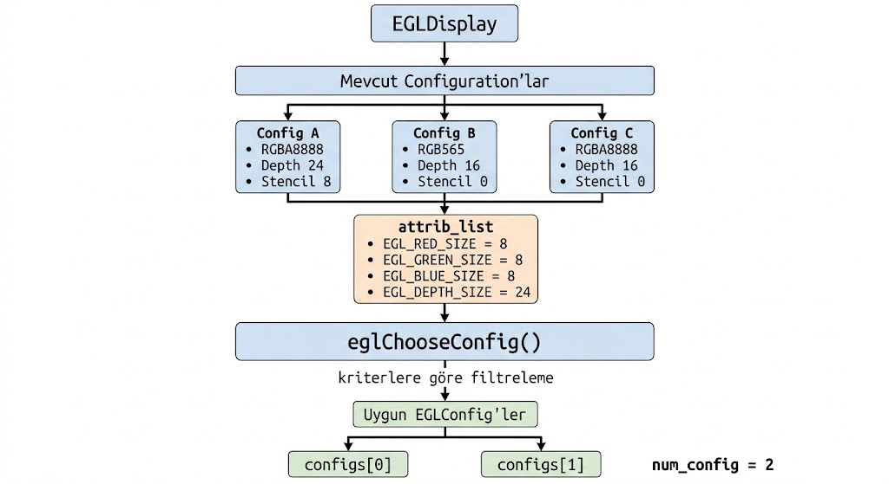
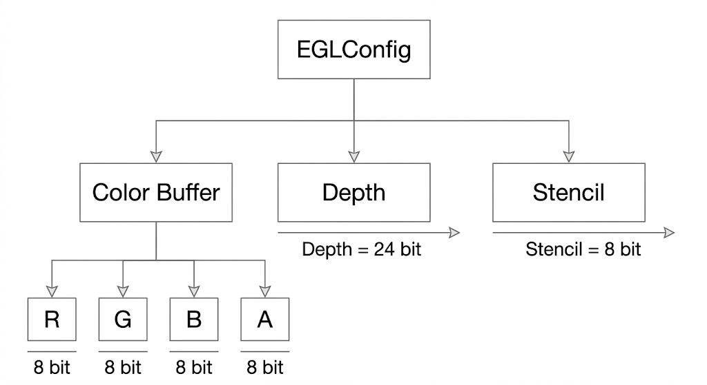
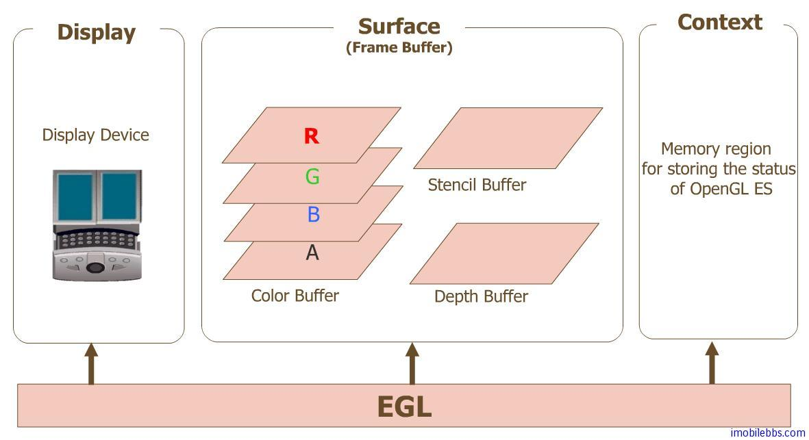

# EGL 1.0: `eglChooseConfig`

```c
EGLBoolean eglChooseConfig(EGLDisplay dpy,
                           const EGLint *attrib_list,
                           EGLConfig *configs,
                           EGLint config_size,
                           EGLint *num_config);
```

`eglChooseConfig`, bir `EGLDisplay` üzerinde bulunan EGL configuration'larını uygulamanın verdiği **attribute kriterlerine göre filtrelemek ve uygun olanları seçmek** için kullanılır.

Başka bir ifadeyle, EGL implementation'ının sunduğu farklı configuration seçenekleri arasından uygulamanın istediği özelliklere uygun olan `EGLConfig` handle'larını bulur.

Kısa özet:

* `dpy`: config'lerin aranacağı initialized display.
* `attrib_list`: attribute/value çiftlerinden oluşan seçim kriterleri.
* `configs`: eşleşen `EGLConfig` handle'larının yazılacağı output buffer.
* `config_size`: output buffer'ın kapasitesi.
* `num_config`: döndürülen config sayısının yazıldığı output pointer.
* Uygun config bulunmaması API hatası olmak zorunda değildir.
* `EGL_TRUE` + `num_config = 0` geçerli bir sonuçtur.



## Kavramsal Akış

```text
EGLDisplay
    |
    +-- Config #1
    +-- Config #2
    +-- Config #3
    +-- Config #4
    +-- ...
            |
            v
      attrib_list kriterleri
            |
            v
      eglChooseConfig
            |
            v
     Eşleşen EGLConfig'ler
```

### Configuration / Config Nedir?

Bir **configuration**, EGL'nin rendering için sunduğu belirli bir özellikler kümesidir.

Her config; renk bileşenleri, depth buffer, stencil buffer ve benzeri özellikler açısından farklı değerlere sahip olabilir.

Bir configin örnek iç yapısı:



Örneğin kavramsal olarak:

```text
Config A
-------
Red      = 8 bit
Green    = 8 bit
Blue     = 8 bit
Alpha    = 8 bit
Depth    = 24 bit
Stencil  = 8 bit
```

başka bir configuration:

```text
Config B
-------
Red      = 5 bit
Green    = 6 bit
Blue     = 5 bit
Alpha    = 0 bit
Depth    = 16 bit
Stencil  = 0 bit
```

şeklinde olabilir.

Dolayısıyla bir `EGLDisplay` üzerinde birden fazla configuration bulunabilir:

```text
EGLDisplay
   |
   +-- Config A → RGBA8888, Depth 24, Stencil 8
   |
   +-- Config B → RGB565, Depth 16, Stencil 0
   |
   +-- Config C → RGBA8888, Depth 16, Stencil 0
   |
   +-- ...
```

Uygulama bu config'lerin iç yapısına doğrudan erişmez. EGL, her configuration'ı bir `EGLConfig` handle'ı ile temsil eder.

`eglChooseConfig`'in görevi de bu seçenekleri uygulamanın kriterlerine göre filtreleyerek uygun `EGLConfig` handle'larını döndürmektir.

> **Not:** Burada geçen rendering surface, OpenGL ES gibi bir rendering API'nin piksellerini yazdığı hedef yüzeydir. Bu yüzey bir pencereye bağlı olabilir veya Pbuffer gibi ekranda görünmeyen off-screen bir yüzey olabilir. `EGLConfig`, surface'in kendisi değildir; surface'in hangi özelliklerle oluşturulabileceğini belirleyen configuration seçeneğidir.

## Parametreler

### `dpy`

`dpy`, config seçim işleminin yapılacağı initialized `EGLDisplay`'dir.

| Değer                       | Sonuç                                                           |
| ---------------------------- | ---------------------------------------------------------------- |
| Geçerli initialized display | Config seçimi yapılabilir.                                     |
| `EGL_NO_DISPLAY`           | `EGL_FALSE` döner ve `EGL_BAD_DISPLAY` hata durumu oluşur. |

### `attrib_list`

`attrib_list`, attribute/value çiftlerinden oluşur ve `EGL_NONE` ile sonlandırılır.

Örnek:

```c
const EGLint attrs[] = {
    EGL_RED_SIZE,   8,
    EGL_GREEN_SIZE, 8,
    EGL_BLUE_SIZE,  8,
    EGL_NONE
};
```

Kavramsal görünüm:

```text
Attribute         Value
-----------------------
EGL_RED_SIZE        8
EGL_GREEN_SIZE      8
EGL_BLUE_SIZE       8
EGL_NONE            -
```

Burada **attribute**, bir configuration'ın tek bir özelliğini ifade eder.

Örneğin:

```text
EGL_RED_SIZE
```

config'in red component'iyle ilgili özelliğini belirtir.

```text
EGL_DEPTH_SIZE
```

depth buffer boyutunu ifade eder.

Attribute'ların tam anlamı, değerlerinin nasıl okunacağı ve config'in gerçek attribute değerlerinin nasıl sorgulanacağı `eglGetConfigAttrib` bölümünde daha ayrıntılı olarak açıklanmıştır.

`eglChooseConfig` açısından attribute/value çiftleri birer **seçim kriteri** oluşturur.

Örneğin:

```c
EGL_RED_SIZE, 8
```

şu şekilde düşünülebilir:

```text
Attribute = EGL_RED_SIZE
Value     = 8
Kriter    = Red component için en az 8 bit
```

#### `EGL_NONE`

Attribute listesinin sonunu belirtir:

```c
const EGLint attrs[] = {
    EGL_RED_SIZE, 8,
    EGL_NONE
};
```

#### `attrib_list = NULL`

`attrib_list` parametresine `NULL` verildiğinde belirtilmeyen attribute'lar EGL'nin varsayılan seçim değerleriyle değerlendirilir:

```c
eglChooseConfig(dpy, NULL, NULL, 0, &num_config);
```

### `configs`

`configs`, eşleşen `EGLConfig` handle'larının yazılacağı output buffer'dır.

Örneğin:

```c
EGLConfig configs[5];
```

ifadesi, bellekte en fazla 5 adet `EGLConfig` handle'ı saklayabilecek bir alan oluşturur.

Başlangıçta kavramsal olarak:

```text
configs[0] = ?
configs[1] = ?
configs[2] = ?
configs[3] = ?
configs[4] = ?
```

şeklindedir.

Daha sonra:

```c
eglChooseConfig(
    dpy,
    attrs,
    configs,
    5,
    &num_config
);
```

çağrısı sonucunda uygun config handle'ları bu buffer'a yazılır.

Örneğin üç config döndürülmüşse:

```text
configs[0] = EGLConfig A
configs[1] = EGLConfig C
configs[2] = EGLConfig F

num_config = 3
```

şeklinde düşünülebilir.

Buradaki `configs` dizisinin içine config'in tüm özellikleri kopyalanmaz. Diziye yazılan değerler, EGL içerisindeki configuration nesnelerini temsil eden `EGLConfig` handle'larıdır.

Yalnızca toplam eşleşme sayısını öğrenmek için `configs = NULL` kullanılabilir:

```c
eglChooseConfig(dpy, attrs, NULL, 0, &count);
```

Bu durumda EGLConfig handle'ları uygulamaya yazılmaz; yalnızca uygun config sayısı `count` içerisine yazılır.

### `config_size`

`config_size`, `configs` buffer'ının kapasitesidir.

Örneğin:

```c
EGLConfig configs[5];

eglChooseConfig(
    dpy,
    attrs,
    configs,
    5,
    &num_config
);
```

Buradaki:

```text
config_size = 5
```

“5 config bul” anlamına gelmez.

Anlamı:

```text
configs buffer'ı en fazla 5 EGLConfig handle'ı alabilir.
```

şeklindedir.

Sistemde kriterlere uyan daha fazla config bulunabilir; ancak output buffer yalnızca verilen kapasite kadar sonuç alabilir.

### `num_config`

`num_config`, döndürülen config sayısının yazıldığı `EGLint *` output parametresidir.

Örneğin:

```c
EGLint num_config = -1;

eglChooseConfig(
    dpy,
    attrs,
    configs,
    5,
    &num_config
);
```

çağrısı sonunda:

```text
num_config = 3
```

olmuşsa, `configs` buffer'ına üç adet uygun `EGLConfig` handle'ı yazılmıştır.

Kavramsal olarak:

```text
configs[0] → 1. uygun config
configs[1] → 2. uygun config
configs[2] → 3. uygun config

num_config → 3
```

şeklinde düşünülebilir.

`num_config` geçerli bir output pointer olmalıdır. `NULL` verilmesi `EGL_BAD_PARAMETER` hata durumuna neden olur.

## EGL 1.0 Seçim Attribute'ları

Yaygın EGL 1.0 seçim attribute'ları aşağıda verilmiştir:

| Attribute            | Anlam                                             |
| -------------------- | ------------------------------------------------- |
| `EGL_RED_SIZE`     | Red component bit sayısı için minimum kriter   |
| `EGL_GREEN_SIZE`   | Green component bit sayısı için minimum kriter |
| `EGL_BLUE_SIZE`    | Blue component bit sayısı için minimum kriter  |
| `EGL_ALPHA_SIZE`   | Alpha component bit sayısı için minimum kriter |
| `EGL_DEPTH_SIZE`   | Depth buffer bit sayısı için minimum kriter    |
| `EGL_STENCIL_SIZE` | Stencil buffer bit sayısı için minimum kriter  |
| `EGL_LEVEL`        | Framebuffer level                                 |
| `EGL_NONE`         | Attribute listesinin sonu                         |
| `EGL_DONT_CARE`    | Uygun attribute'larda bu kriteri önemseme        |



### RGBA Component'leri

RGBA, bir pikselin renk ve alpha bilgisini oluşturan dört temel component'i ifade eder:

```text
R = Red
G = Green
B = Blue
A = Alpha
```

Örneğin:

```text
RGBA8888
```

şu anlama gelir:

```text
Red   = 8 bit
Green = 8 bit
Blue  = 8 bit
Alpha = 8 bit
```

8 bitlik bir component:

```text
2^8 = 256
```

farklı değer temsil edebilir.

Bu nedenle bit sayısı, ilgili component'in ne kadar hassas temsil edilebildiğini ifade eder.

Örneğin:

```c
EGL_RED_SIZE, 8
EGL_GREEN_SIZE, 8
EGL_BLUE_SIZE, 8
EGL_ALPHA_SIZE, 8
```

kriterleri en az RGBA8888 özelliklerini sağlayan config'leri istemek için kullanılabilir.

### Depth Buffer

Depth buffer, 3D sahnede hangi fragment veya nesnenin diğerinin önünde olduğunu belirlemek için kullanılan derinlik bilgisini saklar.

Örneğin iki üçgen ekranda aynı piksele denk geliyorsa, depth değerleri karşılaştırılarak hangisinin kameraya daha yakın olduğu belirlenebilir.

```text
Kamera
  |
  |   Nesne A
  |        |
  |        |       Nesne B
  |        |           |
```

`EGL_DEPTH_SIZE` depth buffer'ın bit sayısı için minimum kriter belirtir.

Örneğin:

```c
EGL_DEPTH_SIZE, 24
```

en az 24 bit depth buffer desteği sağlayan config'leri istemek için kullanılabilir.

16, 24 veya 32 bit gibi depth seçenekleri, depth bilgisinin temsil edilme hassasiyetini etkiler. Daha ayrıntılı değerlendirme ilgili attribute açıklamasında ele alınır.

### Stencil Buffer

Stencil buffer, pikseller üzerinde ek kontrol veya maskeleme işlemleri yapılmasına yardımcı olan bir buffer'dır.

Örneğin uygulama yalnızca belirli bir bölgeye rendering yapılmasını istiyorsa stencil değerleri kullanılabilir.

Kavramsal olarak:

```text
Stencil = 1 → çizime izin ver
Stencil = 0 → çizimi engelle
```

şeklinde düşünülebilir.

Örneğin:

```c
EGL_STENCIL_SIZE, 8
```

en az 8 bit stencil buffer desteği isteyen bir kriterdir.

Depth, stencil ve diğer configuration attribute'larının gerçek değerleri ve daha ayrıntılı anlamları `eglGetConfigAttrib` bölümünde ele alınmaktadır.

> Seçilen config'in gerçek attribute değerlerini okumak için `eglGetConfigAttrib` kullanılır.

## Boyut Attribute'larının Değerlendirilmesi

Şu ifade:

```c
EGL_RED_SIZE, 8
```

“red değeri kesin olarak 8 olmalı” şeklinde yorumlanmamalıdır.

Size attribute'larında istek minimum gereksinim olarak değerlendirilir.

Bu nedenle:

```text
EGL_RED_SIZE >= 8
```

şeklinde düşünmek daha doğrudur.

Örneğin iki config olsun:

```text
Config A:
Red = 8 bit

Config B:
Red = 10 bit
```

Uygulama:

```c
EGL_RED_SIZE, 8
```

kriterini verdiğinde her iki config de bu kriteri karşılayabilir.

## Hata Matrisi

| Durum                                         | Sonuç                               |
| --------------------------------------------- | ------------------------------------ |
| Geçerli display + geçerli attribute listesi | `EGL_TRUE`                         |
| Uygun config yok                              | `EGL_TRUE`, `num_config = 0`     |
| `dpy == EGL_NO_DISPLAY`                     | `EGL_FALSE`, `EGL_BAD_DISPLAY`   |
| Tanınmayan attribute                         | `EGL_FALSE`, `EGL_BAD_ATTRIBUTE` |
| Geçersiz attribute/value                     | `EGL_FALSE`, `EGL_BAD_ATTRIBUTE` |
| `num_config == NULL`                        | `EGL_FALSE`, `EGL_BAD_PARAMETER` |

Uygun configuration bulunamaması her zaman EGL API hatası anlamına gelmez.

Örneğin çok yüksek veya desteklenmeyen kriterler verilmişse:

```text
eglChooseConfig → EGL_TRUE
num_config      → 0
```

sonucu alınabilir.

Bu durumda fonksiyon seçim işlemini başarıyla gerçekleştirmiştir; ancak verilen kriterlere uyan configuration bulunmamıştır.

## Temel Sayı Sorgulama

```c
EGLint count = 0;

if (!eglChooseConfig(
        dpy,
        attrs,
        NULL,
        0,
        &count)) {
    EGLint err = eglGetError();
}
```

Bu kullanımda:

```text
configs = NULL
config_size = 0
```

olduğu için config handle'ları alınmaz.

Yalnızca:

```text
count
```

içerisine kaç uygun config bulunduğu yazılır.

## Temel Config Alma

```c
EGLConfig configs[5];
EGLint count = 0;

if (!eglChooseConfig(
        dpy,
        attrs,
        configs,
        5,
        &count)) {
    EGLint err = eglGetError();
}
```

Bu kullanımda EGL:

1. `attrs` içerisindeki kriterleri değerlendirir.
2. Uygun configuration'ları bulur.
3. En fazla 5 adet `EGLConfig` handle'ını `configs` buffer'ına yazar.
4. Döndürülen config sayısını `count` içerisine yazar.

## `eglGetConfigAttrib` ile İlişki

`eglChooseConfig`, verilen kriterlere göre config'leri seçer.

Ancak bu fonksiyon seçilen config'in bütün gerçek özelliklerini doğrudan uygulamaya vermez.

Seçilen bir `EGLConfig`'in gerçek attribute değerlerini okumak için:

```c
eglGetConfigAttrib(
    dpy,
    config,
    EGL_RED_SIZE,
    &value
);
```

kullanılır.

Örneğin uygulama seçim sırasında:

```c
EGL_RED_SIZE, 8
```

kriteri vermiş olabilir.

Ancak seçilen config'in gerçek değeri:

```text
8
```

veya minimum kriteri karşılayan daha büyük başka bir değer olabilir.

Bu gerçek değer `eglGetConfigAttrib` ile sorgulanır.

Attribute kavramı, RGBA component'leri, depth buffer, stencil buffer ve configuration özelliklerinin ayrıntılı açıklamaları `eglGetConfigAttrib` bölümünde ele alınmaktadır.

## Bölüm Özeti

* `eglChooseConfig`, bir `EGLDisplay` üzerindeki configuration'ları uygulamanın verdiği attribute kriterlerine göre filtreler.
* Configuration, rendering için kullanılabilecek özellikler kümesidir.
* Bir display üzerinde farklı RGBA, depth, stencil ve diğer özelliklere sahip birden fazla configuration bulunabilir.
* Her configuration EGL tarafında bir `EGLConfig` handle'ı ile temsil edilir.
* `attrib_list`, attribute/value çiftlerinden oluşur ve `EGL_NONE` ile biter.
* Attribute, configuration'ın tek bir özelliğini ifade eder.
* Size attribute'ları minimum gereksinim gibi değerlendirilir.
* RGBA bit sayıları renk ve alpha component'lerinin hassasiyetini belirtir.
* Depth buffer, 3D derinlik karşılaştırmalarında kullanılır.
* Stencil buffer, piksel bazlı maskeleme ve kontrol işlemlerinde kullanılabilir.
* Rendering surface, çizimin gerçekleştirildiği hedef yüzeydir; `EGLConfig` surface'in kendisi değildir.
* `configs`, eşleşen `EGLConfig` handle'larının yazıldığı output buffer'dır.
* `config_size`, bu buffer'ın kapasitesidir.
* `num_config`, döndürülen config sayısını verir.
* `configs = NULL`, yalnızca eşleşme sayısını sorgulamak için kullanılabilir.
* `EGL_TRUE` dönüşü tek başına config bulunduğu anlamına gelmez.
* `EGL_TRUE` + `num_config = 0` geçerli bir sonuçtur.
* Config'in gerçek attribute değerleri `eglGetConfigAttrib` ile sorgulanır.
* `num_config = NULL`, `EGL_BAD_PARAMETER` hata durumuna neden olur.
* Geçersiz display, `EGL_BAD_DISPLAY` hata durumuna neden olur.
* Geçersiz attribute veya attribute/value kombinasyonu, `EGL_BAD_ATTRIBUTE` hata durumuna neden olur.
* Config sayıları ve handle değerleri implementation'a bağlıdır.
