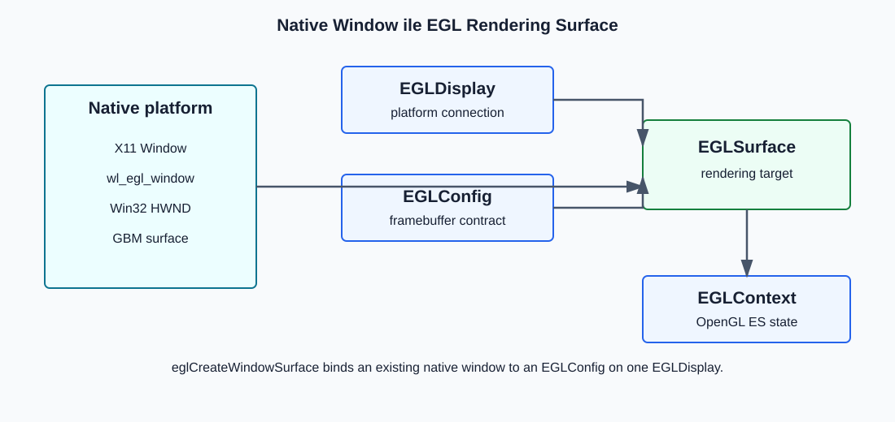
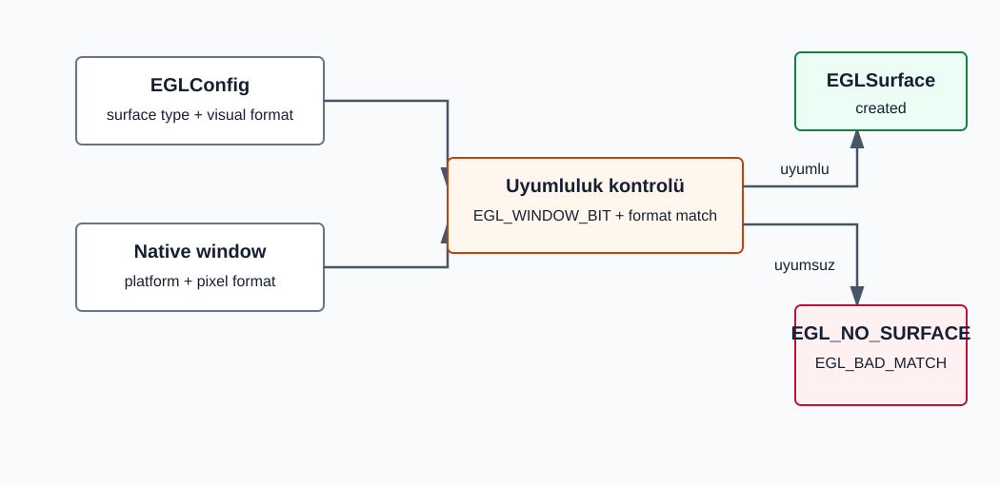
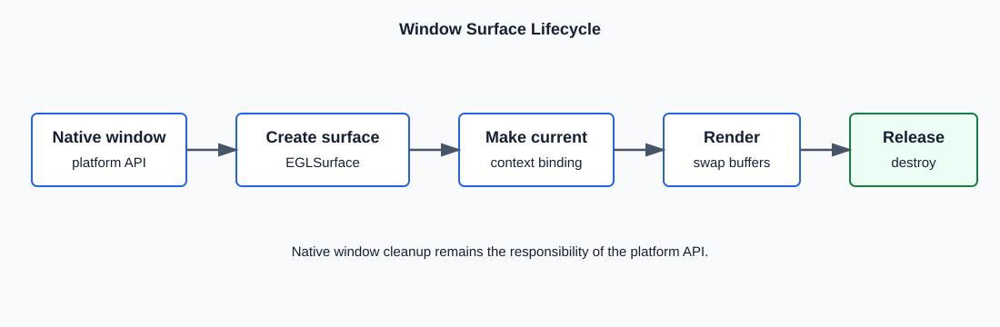

# EGL 1.0: `eglCreateWindowSurface`

```c
EGLSurface eglCreateWindowSurface(EGLDisplay dpy,
                                  EGLConfig config,
                                  NativeWindowType win,
                                  const EGLint *attrib_list);
```

`eglCreateWindowSurface`, native pencere sistemi tarafından daha önce
oluşturulmuş bir pencereyi EGL rendering surface'i ile ilişkilendirir.
Başarılı olduğunda OpenGL ES context'inin draw/read hedefi olarak
kullanılabilecek bir `EGLSurface` handle'ı döndürür.

Fonksiyon native pencereyi oluşturmaz, ekranda gösterecek compositor veya KMS
ayarını yapmaz ve rendering context oluşturmaz. Yalnızca mevcut native nesne
ile EGL tarafındaki surface arasındaki bağı kurar.



## Kavramsal Model

```text
Native window ----\
EGLDisplay --------+--> eglCreateWindowSurface --> EGLSurface
EGLConfig --------/                                  ^
                                                       |
EGLContext ---------------- eglMakeCurrent ------------+
                                                       |
                                                       v
                                              OpenGL ES rendering
```

Native window; X11 Window, `wl_egl_window`, Win32 `HWND` veya GBM surface gibi
platforma özgü bir nesnedir. `NativeWindowType` platforma bağlıdır. Modern
header'larda aynı kavram `EGLNativeWindowType` typedef'iyle görülebilir.
Uygulama, kullandığı EGL platformunun beklediği native nesneyi vermelidir.

## Parametreler

Fonksiyonun dört parametresi birlikte şu cümleyi kurar:

> `dpy` EGL ortamında, `config` ile tarif edilen tampon özelliklerini kullanarak,
> `win` native penceresine bağlı ve `attrib_list` ek ayarlarına sahip bir
> `EGLSurface` oluştur.

| Parametre       | En temel anlamı                            | Cevapladığı soru                                    |
| --------------- | ------------------------------------------- | ------------------------------------------------------ |
| `dpy`         | EGL ile platform arasındaki bağlantı     | Hangi EGL ortamı kullanılacak?                       |
| `config`      | Surface'in framebuffer tarifi               | OpenGL ES hangi tür tamponlara çizecek?              |
| `win`         | Platformun daha önce oluşturduğu pencere | Çizilen görüntü hangi native pencereye ait olacak? |
| `attrib_list` | Surface oluşturulurken verilen ek ayarlar  | Bu surface için ek bir oluşturma seçeneği var mı? |

### `dpy`

`dpy`, EGL'nin native platformla konuştuğu initialize edilmiş bağlantıdır.
Adında "display" geçse de yalnızca fiziksel monitörü ifade etmez; X11,
Wayland veya GBM gibi platforma ait EGL kaynaklarının hangi ortamda
oluşturulacağını belirler.

Tipik olarak önce alınır ve initialize edilir:

```c
EGLDisplay dpy = eglGetDisplay(native_display);

if (dpy == EGL_NO_DISPLAY ||
    eglInitialize(dpy, NULL, NULL) == EGL_FALSE) {
    /* EGL ortamı kullanıma hazır değil. */
}
```

`eglCreateWindowSurface`, hangi EGL ortamını kullanacağını `dpy`
parametresinden anlar. Hem `config` hem de dönen `EGLSurface` bu display'in
namespace'ine aittir.

| Durum                                         | Sonuç                                               |
| --------------------------------------------- | ---------------------------------------------------- |
| Geçerli ve initialize edilmiş`EGLDisplay` | Diğer argümanlar uygunsa surface oluşturulabilir. |
| `EGL_NO_DISPLAY` veya geçersiz handle      | `EGL_NO_SURFACE`, `EGL_BAD_DISPLAY`.             |
| Geçerli fakat initialize edilmemiş display  | `EGL_NO_SURFACE`, `EGL_NOT_INITIALIZED`.         |

Display, config, context ve surface nesneleri arasındaki sahiplik ilişkisi
önemlidir:

```text
EGLDisplay A
  +-- EGLConfig A1
  +-- EGLContext A2
  +-- EGLSurface A3

EGLDisplay B
  +-- EGLConfig B1
  +-- EGLContext B2
  +-- EGLSurface B3
```

Bir display'den alınan config başka display'de kullanılamaz.

### `config`

`config`, oluşturulacak surface'in **framebuffer tarifidir**. Native pencerenin
boyutunu veya ekrandaki konumunu belirlemez; OpenGL ES'in o pencereye çizerken
kullanacağı color, depth, stencil ve multisample tamponlarının özelliklerini
belirler.

Örneğin bir config kavramsal olarak şunları tarif edebilir:

```text
Red / green / blue / alpha  -> kanal başına 8 bit
Depth buffer               -> 24 bit
Stencil buffer             -> 8 bit
Surface desteği            -> window surface
Rendering desteği          -> OpenGL ES
```

`EGLConfig`, uygulamanın alanlarını doldurduğu bir C `struct` değildir.
Uygulama istediği özellikleri `eglChooseConfig` fonksiyonuna bildirir; EGL de
uygun config handle'larını döndürür:

```c
const EGLint config_attributes[] = {
    EGL_RED_SIZE,       8,
    EGL_GREEN_SIZE,     8,
    EGL_BLUE_SIZE,      8,
    EGL_ALPHA_SIZE,     8,
    EGL_DEPTH_SIZE,    24,
    EGL_STENCIL_SIZE,   8,
    EGL_SURFACE_TYPE,   EGL_WINDOW_BIT,
    EGL_NONE
};

EGLConfig config;
EGLint config_count = 0;

eglChooseConfig(dpy, config_attributes, &config, 1, &config_count);
```

Burada elde edilen `config`, daha sonra `eglCreateWindowSurface` fonksiyonuna
verilir. Dolayısıyla `config` parametresi fonksiyona kabaca şunu söyler:

> Bu native pencere için oluşturacağın çizim yüzeyinde, EGL'nin daha önce
> seçtiği bu framebuffer özelliklerini kullan.

Window surface oluşturabilmek için config'in `EGL_SURFACE_TYPE` bitmask'i
`EGL_WINDOW_BIT` içermelidir. Config ayrıca native pencerenin pixel formatıyla
uyumlu olmalıdır.

```c
EGLint surface_type = 0;

if (eglGetConfigAttrib(dpy, config,
                       EGL_SURFACE_TYPE, &surface_type) == EGL_TRUE &&
    (surface_type & EGL_WINDOW_BIT) != 0) {
    /* config supports window surfaces */
}
```

Config ayrıca color, depth, stencil ve multisample buffer özelliklerini
belirler. Bu değerlerin tamamı
[`eglGetConfigAttrib`](eglGetConfigAttrib.md) ile sorgulanabilir.

| Config durumu                          | Sonuç                                            |
| -------------------------------------- | ------------------------------------------------- |
| Geçerli ve`EGL_WINDOW_BIT` destekli | Native window ile uyumluysa surface oluşturulur. |
| Geçersiz config handle                | `EGL_NO_SURFACE`, `EGL_BAD_CONFIG`.           |
| `EGL_WINDOW_BIT` içermiyor          | `EGL_NO_SURFACE`, `EGL_BAD_MATCH`.            |
| Native window formatıyla uyumsuz      | `EGL_NO_SURFACE`, `EGL_BAD_MATCH`.            |



#### Config Attribute'u ile Surface Attribute'u Farkı

`EGL_RED_SIZE`, `EGL_DEPTH_SIZE` ve `EGL_SURFACE_TYPE` gibi değerler
`eglChooseConfig` için config seçim kriteridir. Bunlar
`eglCreateWindowSurface` fonksiyonunun `attrib_list` parametresine yazılmaz.

```text
EGL_RED_SIZE, EGL_DEPTH_SIZE, EGL_SURFACE_TYPE
                    |
                    v
             eglChooseConfig
                    |
                    v
               EGLConfig
                    |
                    v
         eglCreateWindowSurface
```

### `win`

`win`, OpenGL ES görüntüsünün ait olacağı geçerli native window
nesnesidir. Bu pencereyi EGL oluşturmaz; uygulama pencereyi daha önce X11,
Wayland, Win32 veya GBM gibi platformun kendi API'siyle oluşturur ve elde
ettiği handle/pointer değerini bu parametreyle EGL'ye verir.

```text
Platform API'si              EGL
---------------              ---
native window oluşturulur
        |
        +---- win ---------> eglCreateWindowSurface
                                  |
                                  v
                              EGLSurface
```

`win` ve fonksiyonun döndürdüğü `EGLSurface` aynı nesne değildir:

- Native window; pencerenin platformdaki varlığını, boyutunu ve olaylarını
  temsil eder.
- `EGLSurface`; OpenGL ES'in color/depth/stencil tamponlarına eriştiği ve
  `eglSwapBuffers` ile sunum yaptığı EGL çizim hedefidir.

Fonksiyon bu iki ayrı nesneyi birbirine bağlar; native window'u kopyalamaz
veya sahipliğini devralmaz.

| Platform | Yaygın native nesne       | Not                                                                   |
| -------- | -------------------------- | --------------------------------------------------------------------- |
| X11      | `Window`                 | X server tarafında oluşturulmuş pencere ID'si.                     |
| Wayland  | `struct wl_egl_window *` | Genellikle`wl_surface` üzerinden `wayland-egl` ile oluşturulur. |
| Win32    | `HWND`                   | Win32 pencere handle'ı.                                              |
| Mesa/GBM | `struct gbm_surface *`   | DRM/KMS tabanlı platform entegrasyonunda kullanılabilir.            |

Native nesnenin gerçek türü, `EGLDisplay` elde edilirken seçilen
platformla uyumlu olmalıdır. X11 display ile Wayland window veya GBM display
ile X11 Window kullanmak geçerli bir platform eşleşmesi değildir.

Ayrıca `win` ile `config` birbiriyle uyumlu olmalıdır. Örneğin native
pencerenin pixel formatı, config'in color buffer/native visual beklentisiyle
uyuşmazsa surface oluşturulamaz ve `EGL_BAD_MATCH` oluşabilir.

Geçersiz native window implementation tarafından algılanabilirse fonksiyon
`EGL_NO_SURFACE` döndürür ve `EGL_BAD_NATIVE_WINDOW` kaydeder. EGL 1.0,
geçersiz native handle'ların her platformda mutlaka algılanmasını garanti
etmez.

#### GBM ve DRM/KMS İlişkisi

Bu projede native window rolünü `struct gbm_surface *` üstlenir:

```text
DRM device fd
      |
      v
gbm_create_device
      |
      v
gbm_surface_create
      |
      v
eglCreateWindowSurface
      |
      v
EGLSurface
```

`eglCreateWindowSurface` monitör connector'ı, CRTC, mode veya page flip
seçmez. GBM front buffer'ını DRM framebuffer'a bağlamak ve ekranda sunmak
DRM/KMS katmanının işidir.

### `attrib_list`

`attrib_list`, oluşturulacak window surface'e ait **ek oluşturma ayarlarını**
taşıyan listedir. Genel EGL attribute listeleri şu düzende yazılır:

```text
attribute_adı, değer,
attribute_adı, değer,
EGL_NONE
```

Fonksiyona ayrıca liste uzunluğu verilmediği için dolu bir listenin sonuna
`EGL_NONE` yazılması gerekir. `NULL` ise "ek ayar vermiyorum" anlamına gelir.

Ancak bu dokümanın ele aldığı **EGL 1.0 core**, `eglCreateWindowSurface`
için değiştirilebilir bir window surface creation attribute'u tanımlamaz.
Bu nedenle EGL 1.0 core kullanımında pratik seçenekler yalnızca şunlardır:

```c
NULL
```

veya boş liste:

```c
const EGLint attributes[] = {
    EGL_NONE
};
```

şeklindedir. İki biçim de ek attribute verilmediğini ifade eder.

#### `config` ile `attrib_list` Neden Aynı Şey Değil?

Bu iki parametre kolayca karıştırılabilir:

| Kavram                | Ne zaman kullanılır?                    | Neyi belirler?                                                                                   |
| --------------------- | ----------------------------------------- | ------------------------------------------------------------------------------------------------ |
| Config seçim listesi | `eglChooseConfig` çağrısında        | Color, depth, stencil ve desteklenen surface türü gibi framebuffer gereksinimlerini            |
| `config`            | `eglCreateWindowSurface` çağrısında | EGL'nin seçtiği framebuffer tariflerinden hangisinin kullanılacağını                       |
| `attrib_list`       | `eglCreateWindowSurface` çağrısında | Oluşturulan surface'e ait, EGL sürümü veya extension tarafından tanımlanmış ek ayarları |

Bu nedenle `EGL_RED_SIZE` veya `EGL_DEPTH_SIZE` gibi config seçim
attribute'ları bu parametreye yazılmaz:

```c
/* Wrong: EGL_RED_SIZE is a config selection attribute. */
const EGLint wrong_attributes[] = {
    EGL_RED_SIZE, 8,
    EGL_NONE
};
```

Tanınmayan bir attribute veya değer kullanılması `EGL_BAD_ATTRIBUTE`
oluşturabilir. Sonraki EGL sürümleri veya extension'lar yeni surface
attribute'ları tanımlayabilir. Bu tür bir attribute ancak kullanılan EGL
sürümü veya extension onu açıkça destekliyorsa geçerlidir; EGL 1.0 core
davranışı sayılmaz.

## Native Window ile Config Uyumluluğu

Config'in color formatı ile native window'un beklediği format birbiriyle
uyumlu olmalıdır. Örneğin GBM tarafında seçilen pixel formatı, EGL config'in
native visual bilgisiyle eşleştirilebilir.

```c
EGLint native_visual_id = 0;

if (eglGetConfigAttrib(dpy, config,
                       EGL_NATIVE_VISUAL_ID,
                       &native_visual_id) == EGL_TRUE) {
    /* Use the platform-specific value when creating the native window. */
}
```

`EGL_NATIVE_VISUAL_ID` platforma bağlıdır. GBM/Mesa ortamında pratikte
DRM fourcc/GBM format seçimini yönlendirebilir; X11'de native visual ID anlamı
taşır. Taşınabilir kod bu değeri kendi başına evrensel bir pixel format
numarası gibi yorumlamamalıdır.

## Oluşturulan Surface'in Özellikleri

Window surface'in boyutu genellikle native window boyutundan gelir.
`eglCreateWindowSurface` çağrısına width/height verilmez. Oluşturulduktan
sonra surface bilgileri `eglQuerySurface` ile sorgulanabilir:

```c
EGLint width = 0;
EGLint height = 0;

eglQuerySurface(dpy, surface, EGL_WIDTH, &width);
eglQuerySurface(dpy, surface, EGL_HEIGHT, &height);
```

`EGL_WIDTH` ve `EGL_HEIGHT`, config attribute'u değil surface query
attribute'udur.

## Context ile Bağlama ve Sunum

Surface oluşturulması onu current yapmaz. Rendering için uyumlu bir context
ile bağlanması gerekir:

```c
if (eglMakeCurrent(dpy, surface, surface, context) == EGL_FALSE) {
    EGLint error = eglGetError();
}
```

Rendering sonrası `eglSwapBuffers` window surface'in color buffer'larını
native platformun sunum mekanizmasına iletir:

```c
glDrawArrays(GL_TRIANGLES, 0, 3);
eglSwapBuffers(dpy, surface);
```



## Bir Native Window'a Birden Fazla EGLSurface

EGL 1.0'a göre aynı native window zaten daha önce oluşturulmuş bir EGL
config ile ilişkiliyse yeni surface oluşturma kaynak ayıramayabilir ve
`EGL_BAD_ALLOC` oluşabilir. Uygulama aynı native window için yeni surface
oluşturmadan önce eski EGLSurface'in yaşam döngüsünü tamamlamalıdır.

## Hata Matrisi

Başarısız durumda dönüş değeri `EGL_NO_SURFACE` olur.

| Koşul                                                | Hata                      |
| ----------------------------------------------------- | ------------------------- |
| EGL ilgili display için initialize edilmemiş        | `EGL_NOT_INITIALIZED`   |
| `dpy` geçerli display değil                       | `EGL_BAD_DISPLAY`       |
| `config` geçerli config değil                     | `EGL_BAD_CONFIG`        |
| Config`EGL_WINDOW_BIT` içermiyor                   | `EGL_BAD_MATCH`         |
| Native window attribute'ları config ile uyuşmuyor   | `EGL_BAD_MATCH`         |
| Native window geçersiz ve durum algılanabiliyor     | `EGL_BAD_NATIVE_WINDOW` |
| Native window zaten EGL config ile ilişkili          | `EGL_BAD_ALLOC`         |
| Yeni surface için kaynak ayrılamıyor               | `EGL_BAD_ALLOC`         |
| Attribute listesinde tanınmayan attribute/değer var | `EGL_BAD_ATTRIBUTE`     |

## Temel Kullanım

```c
EGLSurface surface = eglCreateWindowSurface(
    dpy,
    config,
    native_window,
    NULL
);

if (surface == EGL_NO_SURFACE) {
    EGLint error = eglGetError();
    /* Handle the error. */
}
```

Kullanım tamamlandığında:

```c
eglMakeCurrent(dpy,
               EGL_NO_SURFACE,
               EGL_NO_SURFACE,
               EGL_NO_CONTEXT);
eglDestroySurface(dpy, surface);
```

Native window ayrı bir nesnedir ve kendi platform API'siyle ayrıca yok
edilmelidir.

## Bölüm Özeti

- Fonksiyon mevcut native window üzerinde bir EGL window surface oluşturur.
- `dpy`, `config` ve dönen surface aynı EGLDisplay namespace'ine aittir.
- Config `EGL_WINDOW_BIT` içermeli ve native window formatıyla uyuşmalıdır.
- Native window türü EGL platformuna bağlıdır.
- EGL 1.0 core'da `attrib_list` için tanımlı window attribute'u yoktur.
- Surface oluşturmak context'i current yapmaz ve fiziksel sunumu tek başına gerçekleştirmez.
