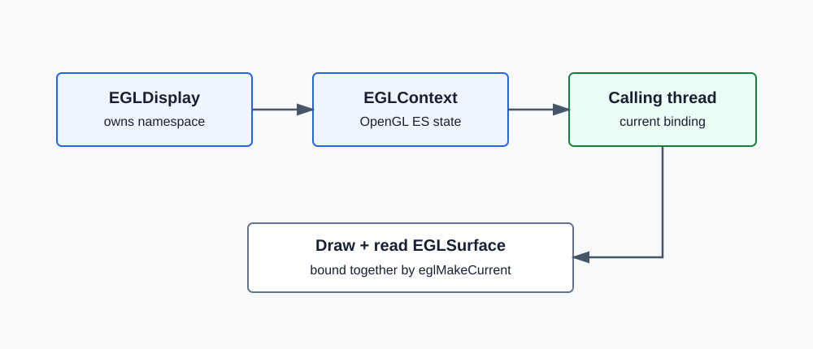
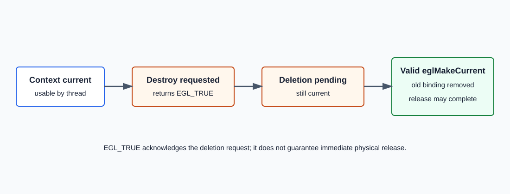

# EGL 1.0: `eglDestroyContext`

```c
EGLBoolean eglDestroyContext(EGLDisplay dpy,
                             EGLContext ctx);
```

`eglDestroyContext`, bir EGL rendering context ile ilişkili kaynakları
silinmek üzere işaretler. Fonksiyonun başarılı olması, context belleğinin
aynı anda fiziksel olarak serbest bırakıldığı anlamına gelmez.

EGL 1.0, current context için deferred destruction uygular: context herhangi
bir thread'de current ise gerçek silme, o thread başka bir geçerli
`eglMakeCurrent` çağrısı yapana kadar ertelenir.



## EGLContext Neyi Temsil Eder?

`EGLContext`, OpenGL ES rendering state'ini taşıyan opaque bir handle'dır.
Program, texture ve buffer binding'leri, etkin render state'leri ve paylaşılan
nesne namespace'leri context yaşam döngüsüyle ilişkilidir.

```text
EGLDisplay
  |
  +-- EGLConfig
  |
  +-- EGLContext
        |
        +-- OpenGL ES state
        +-- object bindings
        +-- shared object relationship
```

Context oluşturmak onu otomatik olarak current yapmaz. `eglMakeCurrent`,
context'i calling thread ile draw/read surface'lere bağlar.

## Parametreler

### `dpy`

`dpy`, context'in oluşturulduğu initialize edilmiş `EGLDisplay` olmalıdır.
EGL nesne handle'ları display namespace'leri arasında taşınamaz.

| Durum | Sonuç |
| --- | --- |
| Geçerli, initialize edilmiş ve context'in sahibi display | `ctx` geçerliyse işlem yürütülür. |
| `EGL_NO_DISPLAY` veya geçersiz handle | `EGL_FALSE`, `EGL_BAD_DISPLAY`. |
| Initialize edilmemiş display | `EGL_FALSE`, `EGL_NOT_INITIALIZED`. |

### `ctx`

`ctx`, `dpy` üzerinde `eglCreateContext` ile oluşturulmuş geçerli bir
context handle'ı olmalıdır.

| Durum | `eglDestroyContext` davranışı |
| --- | --- |
| Context current değil | Kaynaklar silinmek üzere işaretlenir ve en kısa sürede serbest bırakılabilir. |
| Context herhangi bir thread'de current | İşlem `EGL_TRUE`; gerçek silme ertelenir. |
| Geçersiz context handle | `EGL_FALSE`, `EGL_BAD_CONTEXT`. |

## Current Context ve Thread Bağı

Bir context aynı anda en fazla bir thread'de current olabilir. Calling thread
üzerindeki current state kavramsal olarak şu üçlüyü tutar:

```text
current context
current draw surface
current read surface
```

```c
eglMakeCurrent(dpy, draw_surface, read_surface, context);
```

Context current iken `eglDestroyContext` çağrılırsa:

1. Context silinmek üzere işaretlenir.
2. Fonksiyon `EGL_TRUE` döndürür.
3. Mevcut thread binding'i geçerliliğini korur.
4. Context yalnızca current kaldığı sürece kullanılabilir.
5. Thread'in sonraki geçerli `eglMakeCurrent` çağrısı eski binding'i kaldırır ve silme tamamlanabilir.



## Context'i Release Etmek ve Destroy Etmek

Bu iki işlem farklıdır:

```c
eglMakeCurrent(dpy,
               EGL_NO_SURFACE,
               EGL_NO_SURFACE,
               EGL_NO_CONTEXT);
```

Calling thread'in current binding'ini bırakır; context'i silmez.

```c
eglDestroyContext(dpy, context);
```

Context'i silinmek üzere işaretler; current ise binding'i o anda kaldırmaz.

| İşlem | Thread binding | Context yaşam döngüsü |
| --- | --- | --- |
| Release | Current binding kaldırılır | Context destroy edilmediyse yaşar. |
| Destroy, current değil | Değişmez | Silme başlatılır. |
| Destroy, current | Binding korunur | Silme release/rebind sonrasına ertelenir. |

## Shared Context İlişkisi

`eglCreateContext` sırasında `share_context` kullanılması iki context'in
belirli OpenGL ES nesnelerini paylaşmasını sağlayabilir. Bir context'i destroy
etmek, paylaşım grubundaki diğer context handle'larını otomatik olarak destroy
etmez. Paylaşılan nesnelerin gerçek yaşam süresi GL nesne referanslarına ve
paylaşım grubundaki kalan context'lere bağlıdır.

```text
Share group
  +-- Context A (destroyed)
  +-- Context B (still alive)
  +-- Shared textures/buffers may remain reachable through B
```

## Doğru Cleanup Sırası

Tek thread'li yaygın kapanış sırası:

```c
eglMakeCurrent(dpy,
               EGL_NO_SURFACE,
               EGL_NO_SURFACE,
               EGL_NO_CONTEXT);

eglDestroyContext(dpy, context);
```

Bu sıra zorunlu tek sıra değildir; current context destroy edilebilir.
Ancak önce release etmek kaynak yaşam döngüsünü daha açık hale getirir.

Birden fazla thread kullanılıyorsa her thread kendi current binding'ini uygun
şekilde bırakmalı ve uygulama destroy sırasını senkronize etmelidir.

## Dönüş Değeri ve Hatalar

| Sonuç | Anlam |
| --- | --- |
| `EGL_TRUE` | Silme isteği kabul edildi. Fiziksel release ertelenmiş olabilir. |
| `EGL_FALSE` | İşlem başarısız; hata `eglGetError` ile okunur. |

| Koşul | Hata |
| --- | --- |
| EGL `dpy` için initialize edilmemiş | `EGL_NOT_INITIALIZED` |
| `dpy` geçerli display değil | `EGL_BAD_DISPLAY` |
| `ctx` geçerli context değil | `EGL_BAD_CONTEXT` |

## Temel Kullanım

```c
if (eglDestroyContext(dpy, context) == EGL_FALSE) {
    EGLint error = eglGetError();
    /* Handle the error. */
}

context = EGL_NO_CONTEXT;
```

Uygulama, başarılı destroy çağrısından sonra kendi değişkenini
`EGL_NO_CONTEXT` yaparak eski opaque handle'ın yanlışlıkla yeniden
kullanılmasını önleyebilir.

## Bölüm Özeti

- `eglDestroyContext`, context'i silinmek üzere işaretler.
- Current olmayan context en kısa sürede serbest bırakılabilir.
- Current context'in gerçek silinmesi sonraki geçerli `eglMakeCurrent` çağrısına ertelenir.
- Release ve destroy farklı işlemlerdir.
- Context, oluşturulduğu EGLDisplay ile birlikte kullanılmalıdır.

## Kaynak

- EGL 1.0 Specification, Section 3.6.2, Destroying Rendering Contexts.
