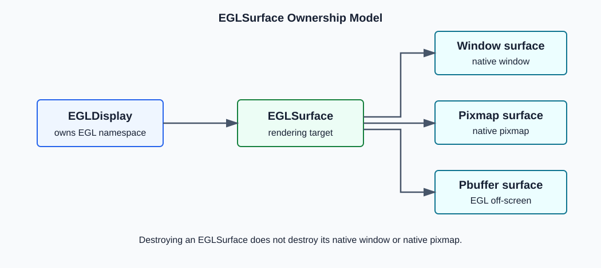
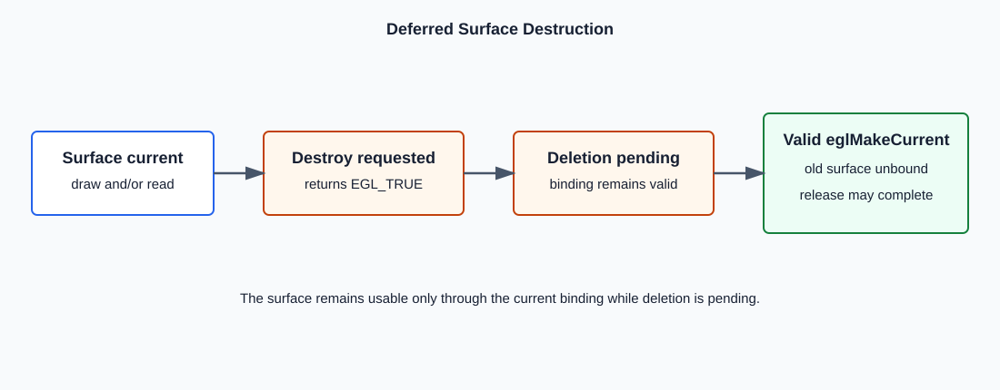
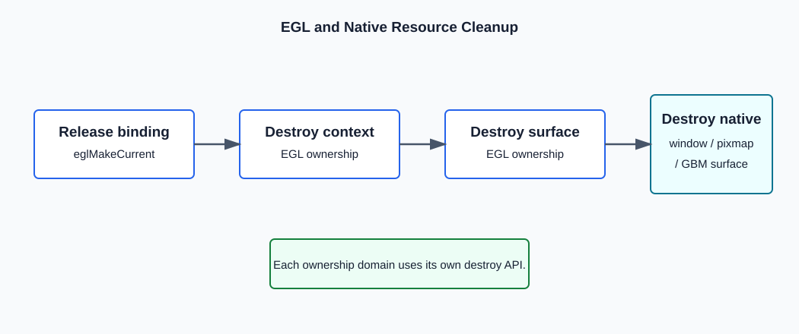

# EGL 1.0: `eglDestroySurface`

```c
EGLBoolean eglDestroySurface(EGLDisplay dpy,
                             EGLSurface surface);
```

`eglDestroySurface`, window, pixmap veya pbuffer türündeki bir EGL rendering
surface ile ilişkili kaynakları silinmek üzere işaretler. Surface herhangi bir
thread'de current draw/read surface ise gerçek silme ertelenir.



## EGLSurface Neyi Temsil Eder?

`EGLSurface`, OpenGL ES rendering için color buffer ve config tarafından
tanımlanan depth, stencil veya multisample buffer'larına erişim sağlayan opaque
bir EGL handle'ıdır.

```text
EGLSurface
  +-- Window surface  -> native window ile ilişkili
  +-- Pixmap surface  -> native pixmap ile ilişkili
  +-- Pbuffer surface -> EGL tarafında off-screen buffer
```

Window/pixmap surface ile native nesne aynı nesne değildir. EGL surface'in
destroy edilmesi native window, native pixmap veya GBM surface'i otomatik olarak
destroy etmez.

## Parametreler

### `dpy`

`dpy`, surface'in oluşturulduğu initialize edilmiş EGL display'dir.

| Durum                                                      | Sonuç                                        |
| ---------------------------------------------------------- | --------------------------------------------- |
| Geçerli, initialize edilmiş ve surface'in sahibi display | `surface` geçerliyse işlem yürütülür. |
| `EGL_NO_DISPLAY` veya geçersiz handle                   | `EGL_FALSE`, `EGL_BAD_DISPLAY`.           |
| Initialize edilmemiş display                              | `EGL_FALSE`, `EGL_NOT_INITIALIZED`.       |

### `surface`

`surface`, `dpy` üzerinde bir EGL surface creation fonksiyonuyla oluşturulmuş
geçerli handle olmalıdır.

| Durum                            | Davranış                                                              |
| -------------------------------- | ----------------------------------------------------------------------- |
| Hiçbir thread'de current değil | Silme işaretlenir; kaynaklar en kısa sürede serbest bırakılabilir. |
| Current draw veya read surface   | `EGL_TRUE`; gerçek silme ertelenir.                                  |
| Geçersiz handle                 | `EGL_FALSE`, `EGL_BAD_SURFACE`.                                     |

## Draw Surface ve Read Surface

`eglMakeCurrent`, context ile iki surface binding'i kurar:

```c
eglMakeCurrent(dpy, draw_surface, read_surface, context);
```

- draw surface, rendering komutlarının hedefidir.
- read surface, pixel okuma/kopyalama işlemlerinin kaynağı olabilir.
- Aynı surface her iki rol için de kullanılabilir.

Bir surface bu rollerden herhangi birinde current ise `eglDestroySurface`
sonrası gerçek release ertelenir.



## Ertelenmiş Silme

Current surface destroy edildiğinde:

1. Surface ve kaynakları silinmek üzere işaretlenir.
2. `eglDestroySurface` `EGL_TRUE` döndürür.
3. Mevcut current binding geçerliliğini korur.
4. Surface yalnızca current kaldığı sürece kullanılabilir.
5. İlgili thread'in sonraki geçerli `eglMakeCurrent` çağrısı eski binding'i kaldırır.
6. Artık current olmayan surface'in gerçek silinmesi tamamlanabilir.

**Release için yaygın çağrı:**

```c
eglMakeCurrent(dpy,
               EGL_NO_SURFACE,
               EGL_NO_SURFACE,
               EGL_NO_CONTEXT);
```

Bu çağrı tek başına surface'i destroy etmez; yalnızca calling thread'in
current binding'ini kaldırır.

## EGLSurface ve Native Nesne Yaşam Döngüsü

Window surface için iki ayrı sahiplik alanı vardır:

```text
EGL ownership                     Platform ownership
-------------                     ------------------
EGLSurface                        X11 Window
                                  wl_surface / wl_egl_window
                                  HWND
                                  gbm_surface
```

Bu projedeki GBM cleanup sırası kavramsal olarak:

```c
eglMakeCurrent(dpy,
               EGL_NO_SURFACE,
               EGL_NO_SURFACE,
               EGL_NO_CONTEXT);

eglDestroySurface(dpy, egl_surface);
gbm_surface_destroy(gbm_surface);
```

Native nesne EGLSurface hala ona bağlı ve kullanılırken yok edilmemelidir.
Kesin sıralama platform entegrasyonunun kurallarına da bağlıdır.



## Window, Pixmap ve Pbuffer Farkı

| Surface türü | Native nesne                | Destroy sonrası ayrı cleanup               |
| -------------- | --------------------------- | -------------------------------------------- |
| Window         | Native window vardır       | Native window platform API'siyle yok edilir. |
| Pixmap         | Native pixmap vardır       | Native pixmap platform API'siyle yok edilir. |
| Pbuffer        | Ayrı native pencere yoktur | EGL pbuffer kaynaklarını EGL yönetir.     |

`eglDestroySurface` üç surface türü için de aynı API'dir; fark,
surface'in oluşturulma kaynağı ve native nesne sahipliğindedir.

## Dönüş Değeri ve Hatalar

| Sonuç        | Anlam                                                     |
| ------------- | --------------------------------------------------------- |
| `EGL_TRUE`  | Silme isteği kabul edildi; release ertelenmiş olabilir. |
| `EGL_FALSE` | İşlem başarısız;`eglGetError` ile hata okunur.     |

| Koşul                                        | Hata                    |
| --------------------------------------------- | ----------------------- |
| EGL`dpy` için initialize edilmemiş        | `EGL_NOT_INITIALIZED` |
| `dpy` geçerli display değil               | `EGL_BAD_DISPLAY`     |
| `surface` geçerli rendering surface değil | `EGL_BAD_SURFACE`     |

## Temel Kullanım

```c
if (eglDestroySurface(dpy, surface) == EGL_FALSE) {
    EGLint error = eglGetError();
    /* Handle the error. */
}

surface = EGL_NO_SURFACE;
```

Başarılı destroy sonrası uygulama eski opaque handle'ı yeniden
kullanmamalıdır. Değişkeni `EGL_NO_SURFACE` yapmak yanlış kullanımı
azaltır; EGL tarafındaki destroy işleminin yerine geçmez.

## Bölüm Özeti

- Fonksiyon window, pixmap ve pbuffer surface'leri silinmek üzere işaretler.
- Current surface'in gerçek silinmesi sonraki geçerli `eglMakeCurrent` çağrısına ertelenir.
- Draw ve read binding'lerinden herhangi biri deferred destruction için yeterlidir.
- EGLSurface ile native window/pixmap/GBM surface farklı nesnelerdir.
- Başarılı `EGL_TRUE`, fiziksel belleğin aynı anda serbest kaldığını garanti etmez.

## Kaynak

- EGL 1.0 Specification, Section 3.5.4, Destroying Rendering Surfaces.
