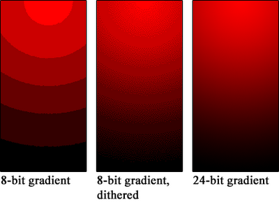

# EGL 1.0: `eglGetConfigAttrib`

```c
EGLBoolean eglGetConfigAttrib(EGLDisplay dpy,
                              EGLConfig config,
                              EGLint attribute,
                              EGLint *value);
```

`eglGetConfigAttrib`, bir `EGLConfig` içindeki tek bir attribute değerini sorgular.

`EGLConfig`, oluşturulacak `EGLSurface` için şu özellikleri tarif eder:

- color buffer component boyutları
- depth/stencil buffer boyutları
- multisampling bilgisi
- desteklenen surface tipleri
- native visual bilgileri
- transparency bilgileri
- pbuffer limitleri

## Kavramsal Akış

```text
EGLDisplay
  |
  +-- EGLConfig #1
  |     +-- EGL_RED_SIZE
  |     +-- EGL_GREEN_SIZE
  |     +-- EGL_SURFACE_TYPE
  |     +-- ...
  |
  +-- EGLConfig #2
        +-- EGL_RED_SIZE
        +-- EGL_GREEN_SIZE
        +-- EGL_SURFACE_TYPE
        +-- ...
```

`eglGetConfigAttrib` sadece bir `EGLConfig` ve bir `attribute` için değer döndürür.

Bu fonksiyon bir ayar yapmaz ve config'i değiştirmez. Örneğin
`EGL_SAMPLES` değerini sorgulamak multisampling'i açmaz; yalnızca config'in
kaç sample sağlayacağını bildirir. Kullanılacak özellikler surface ve context
oluşturulmadan önce config seçimiyle belirlenir.

## Parametreler

### `dpy`

| Değer                                | Sonuç                                                                  |
| ------------------------------------- | ----------------------------------------------------------------------- |
| Geçerli ve initialized`EGLDisplay` | Diğer parametreler de geçerliyse sorgu başarılıdır.               |
| `EGL_NO_DISPLAY`                    | Başarısız. Genel EGL hata modeliyle`EGL_BAD_DISPLAY` beklenir.     |
| Geçersiz display handle              | Başarısız. Genel EGL hata modeliyle`EGL_BAD_DISPLAY` beklenir.     |
| Initialize edilmemiş display         | Başarısız. Genel EGL hata modeliyle`EGL_NOT_INITIALIZED` beklenir. |

### `config`

| Değer                                               | Sonuç                                        |
| ---------------------------------------------------- | --------------------------------------------- |
| `dpy` üzerinden alınmış geçerli `EGLConfig` | Attribute değeri`*value` içine yazılır. |
| `eglGetConfigs` ile alınmış config              | Geçerli.                                     |
| `eglChooseConfig` ile alınmış config            | Geçerli.                                     |
| Başka`EGLDisplay`'e ait config                    | Geçerli config sayılmaz; başarısız.      |
| Geçersiz config handle                              | Başarısız. Tipik hata`EGL_BAD_CONFIG`.   |

EGL 1.0 notu:

```text
EGLConfig handle'ları, ait oldukları EGLDisplay terminate edilene kadar geçerlidir.
```

### `attribute`

`attribute`, EGL 1.0 Table 3.1 içinde tanımlı bir `EGLConfig` attribute'u olmalıdır. Geçersizse:

```text
eglGetConfigAttrib(...) == EGL_FALSE
eglGetError() == EGL_BAD_ATTRIBUTE
```

### `value`

| Değer               | Sonuç                                                                   |
| -------------------- | ------------------------------------------------------------------------ |
| Geçerli`EGLint *` | Sonuç bu adrese yazılır.                                              |
| `NULL`             | EGL 1.0 bunu geçerli kullanım olarak tanımlamaz; gerçek storage ver. |

Doğru kullanım:

```c
EGLint red_bits = 0;
if (!eglGetConfigAttrib(dpy, config, EGL_RED_SIZE, &red_bits)) {
    EGLint err = eglGetError();
}
```

## EGL 1.0 Geçerli Attribute Listesi

| Attribute                       |     Tip | Anlam                                                             |
| ------------------------------- | ------: | ----------------------------------------------------------------- |
| `EGL_BUFFER_SIZE`             | integer | Color buffer toplam bit derinliği.                               |
| `EGL_RED_SIZE`                | integer | Red component bit sayısı.                                       |
| `EGL_GREEN_SIZE`              | integer | Green component bit sayısı.                                     |
| `EGL_BLUE_SIZE`               | integer | Blue component bit sayısı.                                      |
| `EGL_ALPHA_SIZE`              | integer | Alpha component bit sayısı.                                     |
| `EGL_CONFIG_CAVEAT`           |    enum | `EGL_NONE`, `EGL_SLOW_CONFIG`, `EGL_NON_CONFORMANT_CONFIG`. |
| `EGL_CONFIG_ID`               | integer | Unique config id.                                                 |
| `EGL_DEPTH_SIZE`              | integer | Depth buffer bit sayısı.                                        |
| `EGL_LEVEL`                   | integer | Framebuffer level.                                                |
| `EGL_MAX_PBUFFER_WIDTH`       | integer | Maksimum pbuffer genişliği.                                     |
| `EGL_MAX_PBUFFER_HEIGHT`      | integer | Maksimum pbuffer yüksekliği.                                    |
| `EGL_MAX_PBUFFER_PIXELS`      | integer | Maksimum pbuffer pixel sayısı.                                  |
| `EGL_NATIVE_RENDERABLE`       | boolean | Native rendering API surface'e render edebilir mi?                |
| `EGL_NATIVE_VISUAL_ID`        | integer | Platform-dependent native visual id.                              |
| `EGL_NATIVE_VISUAL_TYPE`      | integer | Platform-dependent native visual type.                            |
| `EGL_SAMPLE_BUFFERS`          | integer | Multisample buffer sayısı;`0` veya `1`.                     |
| `EGL_SAMPLES`                 | integer | Pixel başına sample sayısı.                                   |
| `EGL_STENCIL_SIZE`            | integer | Stencil buffer bit sayısı.                                      |
| `EGL_SURFACE_TYPE`            | bitmask | Desteklenen surface tipleri.                                      |
| `EGL_TRANSPARENT_TYPE`        |    enum | `EGL_NONE` veya `EGL_TRANSPARENT_RGB`.                        |
| `EGL_TRANSPARENT_RED_VALUE`   | integer | Transparent red key.                                              |
| `EGL_TRANSPARENT_GREEN_VALUE` | integer | Transparent green key.                                            |
| `EGL_TRANSPARENT_BLUE_VALUE`  | integer | Transparent blue key.                                             |

## Attribute Ayrıntıları

### Color Buffer: bit sayısı gerçekte neyi değiştirir?

```text
EGL_BUFFER_SIZE = EGL_RED_SIZE
                + EGL_GREEN_SIZE
                + EGL_BLUE_SIZE
                + EGL_ALPHA_SIZE
```

Örnek:

```text
R=8, G=8, B=8, A=8 -> EGL_BUFFER_SIZE = 32
R=5, G=6, B=5, A=0 -> EGL_BUFFER_SIZE = 16
```

Buradaki bit sayıları bir rengin bellekte kaç farklı tamsayı seviyesiyle
tutulabildiğini belirler. Bir component `n` bit ise alabileceği değer sayısı
`2^n`, saklanan tamsayı aralığı ise `0 ... 2^n - 1` olur.

| Component bit sayısı | Ayrı seviye sayısı | Tamsayı aralığı | Normalize edilmiş iki komşu seviye arası |
| ---------------------: | --------------------: | ------------------: | ------------------------------------------: |
|                  3 bit |                     8 |            `0..7` |                           `1/7 ≈ 0,1429` |
|                  5 bit |                    32 |           `0..31` |                          `1/31 ≈ 0,0323` |
|                  6 bit |                    64 |           `0..63` |                          `1/63 ≈ 0,0159` |
|                  8 bit |                   256 |          `0..255` |                        `1/255 ≈ 0,00392` |

Örneğin kırmızı component 3 bit olduğunda yalnızca şu normalize edilmiş
değerler temsil edilebilir:

```text
0/7, 1/7, 2/7, 3/7, 4/7, 5/7, 6/7, 7/7
```

OpenGL ES işlemleri veya `glClearColor` ara bir değer üretse bile sonuç color buffer'a
yazılırken en yakın temsil edilebilir seviyeye quantize edilir. Dolayısıyla 3
bit kırmızı, yumuşak bir kırmızı gradyanda basamakların belirginleşmesine
(`color banding`) yol açabilir. 5 bitte 32, 8 bitte 256 seviye bulunduğu için
geçiş giderek daha pürüzsüz görünür.



#### Yaygın color format karşılaştırması

| Format   | Config değerleri | Alpha | Toplam teorik RGB renk | Tipik sonuç                                                                                |
| -------- | ----------------- | ----: | ---------------------: | ------------------------------------------------------------------------------------------- |
| RGB332   | R3 G3 B2 A0       |   Yok |                    256 | Çok düşük bellek, belirgin banding                                                      |
| RGB565   | R5 G6 B5 A0       |   Yok |                 65.536 | 16 bit ekranlarda yaygın; yeşile insan gözü daha duyarlı olduğu için 6 bit ayrılır |
| RGB888   | R8 G8 B8 A0       |   Yok |             16.777.216 | Yüksek renk doğruluğu, alpha kanalı yok                                                 |
| RGBA8888 | R8 G8 B8 A8       | 8 bit |             16.777.216 | Renge ek olarak 256 alpha seviyesi                                                          |

`EGL_BUFFER_SIZE`, yalnızca bir pixel'in color buffer kısmındaki toplam bit
sayısıdır. Ekran çözünürlüğü, depth/stencil buffer'ları, MSAA sample'ları ve
kaç adet sunum buffer'ı bulunduğu bu değere dahil değildir.

1920 × 1080 tek bir color buffer için kaba alt sınır hesabı:

```text
RGB565:   1920 * 1080 * 16 / 8 = 4.147.200 byte ≈ 3,96 MiB
RGBA8888: 1920 * 1080 * 32 / 8 = 8.294.400 byte ≈ 7,91 MiB
```

Bu yalnızca teorik payload hesabıdır. Satır hizalama, tiling, sıkıştırma,
driver metadata'sı ve birden fazla buffer gerçek bellek kullanımını
değiştirebilir.

#### `EGL_ALPHA_SIZE` ne sağlar, ne sağlamaz?

Alpha component genellikle saydamlık/opaklık bilgisini taşır:

| `EGL_ALPHA_SIZE` | Saklanabilen alpha seviyeleri                                       |
| -----------------: | ------------------------------------------------------------------- |
|                  0 | Alpha component yoktur.                                             |
|                  1 | Yalnızca tamamen saydam veya tamamen opak gibi iki değer vardır. |
|                  8 | `0..255`, yani 256 alpha seviyesi vardır.                        |

Ancak alpha buffer bulunması tek başına blending'i açmaz, pencereyi masaüstüne
karşı saydam yapmaz ve `EGL_TRANSPARENT_RGB` anlamına gelmez. OpenGL ES
blending ayrı bir render state'idir; native pencere kompozisyonu da platformun
pencere sistemi/compositor kurallarına bağlıdır. EGL 1.0'ın aşağıda anlatılan
transparent RGB özelliği ise alpha değil, exact RGB color key kullanır.

### Ancillary buffer'lar: depth ve stencil

Depth ve stencil, color buffer'ın parçaları değildir; bu yüzden bitleri
`EGL_BUFFER_SIZE` toplamına girmez.

#### `EGL_DEPTH_SIZE`

Depth buffer her fragment'ın kameraya göre derinlik değerini saklar ve öndeki
yüzeyin arkadakini kapatmasını sağlar.

| Değer | Anlam ve pratik etki                                                                                  |
| -----: | ----------------------------------------------------------------------------------------------------- |
|      0 | Depth buffer yoktur;`GL_DEPTH_TEST` ile güvenilir gizli yüzey eleme yapılamaz.                   |
|     16 | Daha az bellek/bant genişliği, fakat birbirine yakın yüzeylerde`z-fighting` riski daha yüksek. |
|     24 | Daha yüksek depth hassasiyeti; 3B sahnelerde sık tercih edilir.                                     |

`n` bit depth teorik olarak `2^n` saklama kodu verir: 16 bit 65.536, 24 bit
16.777.216 kod. Fakat perspektif projeksiyonda bu hassasiyet dünya uzayına
eşit dağılmaz; near plane yakınında daha fazla, far plane tarafında daha az
hassasiyet vardır. Bu nedenle yalnızca 16 bitten 24 bite çıkmak yerine gereksiz
derecede küçük `near` ve çok büyük `far` değerlerinden de kaçınmak gerekir.

#### `EGL_STENCIL_SIZE`

Stencil buffer pixel başına küçük bir tamsayı/bit maskesi tutar. Maskeleme,
ayna/portal bölgeleri, outline ve çok geçişli render tekniklerinde kullanılır.

```text
0 bit -> stencil buffer yok
1 bit -> 0 veya 1
8 bit -> 0..255; sekiz ayrı bit bayrak olarak da kullanılabilir
```

8 bit stencil “sekiz kat daha kaliteli görüntü” demek değildir; uygulamanın
daha çok stencil değeri veya bağımsız maske biti kullanabilmesi demektir.

### Multisampling: `EGL_SAMPLE_BUFFERS` ve `EGL_SAMPLES`

Normal, tek sample'lı rasterization'da pixel için çoğunlukla tek coverage örneği
vardır. Üçgen o örnek noktasını kapsıyorsa pixel tamamen boyanır, kapsamıyorsa
boyanmaz. Eğik kenarlar bu yüzden merdiven biçiminde (`aliasing`) görünebilir.

MSAA'da her pixel içinde birden fazla sample konumu test edilir. 4× MSAA için
bir kenarın pixel içindeki dört sample'dan ikisini kaplaması yaklaşık yüzde 50
coverage üretir. Sunum öncesindeki resolve işleminde sample sonuçları tek pixel
rengine birleştirilir; kenar daha yumuşak görünür.

| Attribute              | Örnek değer | Doğru yorum                                                              |
| ---------------------- | ------------: | ------------------------------------------------------------------------- |
| `EGL_SAMPLE_BUFFERS` |             0 | Multisample buffer yoktur ve`EGL_SAMPLES` da 0'dır.                    |
| `EGL_SAMPLE_BUFFERS` |             1 | Bir multisample buffer vardır. Bu değer sample sayısı değildir.      |
| `EGL_SAMPLES`        |             4 | Multisample buffer içinde pixel başına dört sample vardır: 4× MSAA. |

Önemli ayrım:

```text
EGL_SAMPLE_BUFFERS = 1, EGL_SAMPLES = 4
```

“Dört ayrı framebuffer” veya “quad buffering” demek değildir. Bir multisample
buffer ve onun her pixel'inde dört sample demektir. EGL 1.0'da
`EGL_SAMPLE_BUFFERS` yalnızca `0` ya da `1` olabilir. Multisample config'te
color, depth ve stencil bit büyüklükleri sample başına ilgili `EGL_*_SIZE`
attribute'larıyla tarif edilir; ayrı single-sample depth/stencil buffer bulunmaz.


Yukarıdaki ilk diyagramda artı işaretleri tek sample konumunu gösterir. Ortadaki
karar tamamen içeride/dışarıda, sağdaki sonuç ise sert basamaklı kenardır.


İkinci diyagramda her pixel'deki dört daire dört sample konumudur. Kapsanan
sample sayısı 0/4, 1/4, 2/4, 3/4 veya 4/4 olabildiği için kenarda ara coverage
değerleri oluşur.

MSAA'nın bedeli daha fazla sample coverage/depth/stencil çalışması, bellek ve
bant genişliğidir. 4× her durumda tam dört kat yavaşlık demek değildir; GPU'nun
mimarisi, sıkıştırma ve sahnenin shader maliyeti sonucu değiştirir. MSAA esas
olarak geometri kenarlarını düzeltir; texture içindeki yüksek frekans, shader
aliasing'i veya hareket aliasing'ini tek başına tamamen çözmez.

Config seçerken:

```c
const EGLint attrs[] = {
    EGL_SAMPLE_BUFFERS, 1,
    EGL_SAMPLES,        4,
    EGL_NONE
};
```

Bu liste en az bir sample buffer ve en az dört sample ister. Seçilen config'in
gerçekte kaç sample verdiği yine `eglGetConfigAttrib` ile okunmalıdır; istek 4
iken dönen değer implementation'ın config listesine göre 4 veya daha büyük
olabilir.

### `EGL_SURFACE_TYPE`: tek değer değil bitmask

Bitmask döner:

```c
EGLint surface_type = 0;
eglGetConfigAttrib(dpy, config, EGL_SURFACE_TYPE, &surface_type);

if (surface_type & EGL_WINDOW_BIT) {
    /* eglCreateWindowSurface için uygundur */
}

if (surface_type & EGL_PIXMAP_BIT) {
    /* eglCreatePixmapSurface için uygundur */
}

if (surface_type & EGL_PBUFFER_BIT) {
    /* eglCreatePbufferSurface için uygundur */
}
```

Geçerli bitler:

| Bit                 | Anlam                             |
| ------------------- | --------------------------------- |
| `EGL_WINDOW_BIT`  | Window surface oluşturulabilir.  |
| `EGL_PIXMAP_BIT`  | Pixmap surface oluşturulabilir.  |
| `EGL_PBUFFER_BIT` | Pbuffer surface oluşturulabilir. |

Örneğin sonuç `EGL_WINDOW_BIT | EGL_PBUFFER_BIT` ise aynı config window ve
pbuffer surface oluşturabilir, fakat pixmap oluşturamaz. Bu nedenle eşitlik
yerine bit testi yapılır:

```c
/* Yanlış: başka destek bitleri de set ise false olur. */
if (surface_type == EGL_WINDOW_BIT) { /* ... */ }

/* Doğru: window desteği maskenin içinde var mı? */
if ((surface_type & EGL_WINDOW_BIT) != 0) { /* ... */ }
```

### Pbuffer limitleri

Üç limit birlikte sağlanmalıdır:

```text
width  <= EGL_MAX_PBUFFER_WIDTH
height <= EGL_MAX_PBUFFER_HEIGHT
width * height <= EGL_MAX_PBUFFER_PIXELS
```

Örneğin width ve height limiti 4096, pixel limiti 4.194.304 ise 4096 × 4096
boyutlar ayrı ayrı limite uysa bile çarpım 16.777.216 olduğu için bu pbuffer
istenemez. 2048 × 2048 ise pixel limitine tam uyar.

Bu değerler garanti edilmiş boş bellek miktarı değildir. EGL 1.0'a göre
`EGL_MAX_PBUFFER_PIXELS` statik bir üst sınırdır ve başka kaynakların framebuffer
belleğiyle yarışmadığını varsayar; limit içindeki bir istek bile çalışma anında
`EGL_BAD_ALLOC` ile başarısız olabilir.

### `EGL_CONFIG_ID`, `EGL_LEVEL` ve `EGL_CONFIG_CAVEAT`

#### `EGL_CONFIG_ID`

Display içindeki config'i ayırt eden küçük pozitif tamsayıdır. Loglarda bir
config'i tekrar tanımak veya `eglChooseConfig` ile tam o ID'yi istemek için
kullanışlıdır. Bir kalite puanı değildir; ID 12'nin ID 4'ten daha iyi olduğu
anlamına gelmez.

#### `EGL_LEVEL`

Native framebuffer katmanını belirtir. `0` normal katmandır; pozitif değerler
overlay, negatif değerler underlay katmanlarını temsil edebilir. Bunun görünür
etkisi ve desteklenip desteklenmediği native pencere sistemine bağlıdır. Bu değer
3B sahnedeki object Z sırası veya `EGL_DEPTH_SIZE` ile ilgili değildir.

#### `EGL_CONFIG_CAVEAT`

| Değer                        | Anlam                                                                                                                                               |
| ----------------------------- | --------------------------------------------------------------------------------------------------------------------------------------------------- |
| `EGL_NONE`                  | Config için bilinen caveat yoktur; genellikle ilk tercih budur.                                                                                    |
| `EGL_SLOW_CONFIG`           | Render düşük performanslı olabilir; örneğin format donanımda doğal olmayıp dönüşüm veya yazılım yolu gerektirebilir.                 |
| `EGL_NON_CONFORMANT_CONFIG` | Bu config'e render etmek gerekli OpenGL ES conformance testlerini geçmez. “Kesin çalışmaz” değil, standart uyumluluk garantisi yok demektir. |

### Native Visual

`EGL_NATIVE_VISUAL_ID` ve `EGL_NATIVE_VISUAL_TYPE` platforma bağlıdır.

EGL 1.0 davranışı:

| Durum                                            | `EGL_NATIVE_VISUAL_ID` | `EGL_NATIVE_VISUAL_TYPE` |
| ------------------------------------------------ | -----------------------: | -------------------------: |
| Config window destekliyor ve native visual varsa |     Platform-specific id |     Platform-specific type |
| Config window desteklemiyor                      |                    `0` |               `EGL_NONE` |
| Associated native visual yok                     |                    `0` |               `EGL_NONE` |

GBM kullanırken modern Mesa EGL tarafında `EGL_NATIVE_VISUAL_ID` pratikte GBM/DRM formatını seçmek için kullanışlı olabilir. Bu EGL 1.0 spec'in platform-dependent native visual alanına girer.

### `EGL_NATIVE_RENDERABLE`

`EGL_TRUE`, native pencere sisteminin rendering API'lerinin bu config ile
oluşturulan surface'e render edebildiğini bildirir. Bu EGL/OpenGL ES
rendering'inin hızlı olduğu anlamına gelmez ve native API ile GL'nin aynı
surface'e eşzamanlı, senkronizasyonsuz yazabileceği anlamına da gelmez. İki API
aynı buffer'ı kullanıyorsa sıralama için EGL 1.0'daki `eglWaitNative` ve
`eglWaitGL` gibi senkronizasyon kuralları gerekir.

### Transparency: alpha blending değil, color key

| Attribute                                       | Anlam                                                                                             |
| ----------------------------------------------- | ------------------------------------------------------------------------------------------------- |
| `EGL_TRANSPARENT_TYPE == EGL_NONE`            | Bu config ile oluşturulan window'larda transparent pixel yoktur.                                 |
| `EGL_TRANSPARENT_TYPE == EGL_TRANSPARENT_RGB` | Framebuffer'daki RGB değerleri üç key değeriyle tam eşleşen pixel transparent kabul edilir. |

`EGL_TRANSPARENT_TYPE == EGL_NONE` ise şu değerler tanımsızdır:

- `EGL_TRANSPARENT_RED_VALUE`
- `EGL_TRANSPARENT_GREEN_VALUE`
- `EGL_TRANSPARENT_BLUE_VALUE`

`EGL_TRANSPARENT_TYPE == EGL_TRANSPARENT_RGB` ise bu değerler component bit derinliği aralığında integer framebuffer değerleridir.

Her component için aralık ayrı hesaplanır:

```text
red key   : 0 .. (2^EGL_RED_SIZE)   - 1
green key : 0 .. (2^EGL_GREEN_SIZE) - 1
blue key  : 0 .. (2^EGL_BLUE_SIZE)  - 1
```

RGB565 config'te key değerleri `(0, 63, 0)` ise framebuffer'da saklanan tam
yeşil pixel transparent olur:

```text
(R=0, G=63, B=0)  -> transparent
(R=0, G=62, B=0)  -> opaque; key ile tam eşleşmedi
```

Bu mekanizma kısmi saydamlık üretmez: pixel ya key ile eşleşir ve transparent
olur ya da eşleşmez. Kenar yumuşatma veya blending sonucu key renginin biraz
değişmesi eşleşmeyi bozabilir. Bu nedenle `EGL_TRANSPARENT_RGB`, 8 bit alpha
kanalındaki 256 opacity seviyesinin yerine geçen bir özellik değildir.

Transparency bilgisi config'in window davranışını tarif eder; pbuffer'ın zaten
native ekranda görünen bir penceresi yoktur.

## Config'leri somut olarak karşılaştırma

Aşağıdaki iki varsayımsal config de pencere oluşturabilir, fakat kullanım
amaçları farklıdır:

| Attribute                |     Config A |     Config B | Sonuç                                                                  |
| ------------------------ | -----------: | -----------: | ----------------------------------------------------------------------- |
| R/G/B/A                  |      5/6/5/0 |      8/8/8/8 | A daha az color belleği kullanır; B daha hassas renk ve alpha saklar. |
| Depth                    |           16 |           24 | B karmaşık 3B sahnelerde daha az z-fighting riski taşır.            |
| Stencil                  |            0 |            8 | Yalnızca B stencil tekniklerini destekler.                             |
| Sample buffers / samples |          0/0 |          1/4 | B 4× MSAA ile geometri kenarlarını yumuşatabilir.                   |
| Caveat                   | `EGL_NONE` | `EGL_NONE` | İkisinde de bildirilen performans/uyumluluk caveat'i yoktur.           |

Config B daha çok özellik sağladığı için otomatik olarak her uygulamada “daha
iyi” değildir. Basit 2B arayüzde Config A bellek ve bant genişliği tasarrufu
sağlayabilir; alpha, stencil, yüksek depth hassasiyeti ve MSAA gereken 3B
sahnede Config B doğru seçim olabilir.

Bir config'i seçtikten sonra en kritik değerleri birlikte doğrulamak için:

```c
static EGLBoolean get_attrib(EGLDisplay dpy, EGLConfig config,
                             EGLint name, EGLint *out)
{
    if (eglGetConfigAttrib(dpy, config, name, out) == EGL_TRUE) {
        return EGL_TRUE;
    }

    fprintf(stderr, "eglGetConfigAttrib(0x%04x) failed: 0x%04x\n",
            name, eglGetError());
    return EGL_FALSE;
}

EGLint red, green, blue, alpha;
EGLint depth, stencil, sample_buffers, samples, surface_type;

if (get_attrib(dpy, config, EGL_RED_SIZE, &red) &&
    get_attrib(dpy, config, EGL_GREEN_SIZE, &green) &&
    get_attrib(dpy, config, EGL_BLUE_SIZE, &blue) &&
    get_attrib(dpy, config, EGL_ALPHA_SIZE, &alpha) &&
    get_attrib(dpy, config, EGL_DEPTH_SIZE, &depth) &&
    get_attrib(dpy, config, EGL_STENCIL_SIZE, &stencil) &&
    get_attrib(dpy, config, EGL_SAMPLE_BUFFERS, &sample_buffers) &&
    get_attrib(dpy, config, EGL_SAMPLES, &samples) &&
    get_attrib(dpy, config, EGL_SURFACE_TYPE, &surface_type)) {
    printf("RGBA=%d/%d/%d/%d depth=%d stencil=%d MSAA=%d x%d window=%s\n",
           red, green, blue, alpha, depth, stencil,
           sample_buffers, samples,
           (surface_type & EGL_WINDOW_BIT) ? "yes" : "no");
}
```

## EGL 1.0 Dışındaki Attribute'lar

Şu token'lar modern EGL header'larında olabilir ama EGL 1.0 Table 3.1 config attribute listesinde yoktur:

| Token                          | Neden dikkat edilmeli                                                               |
| ------------------------------ | ----------------------------------------------------------------------------------- |
| `EGL_RENDERABLE_TYPE`        | EGL 1.0 config attribute listesinde yoktur; sonraki EGL sürümlerinde yaygındır. |
| `EGL_BIND_TO_TEXTURE_RGB`    | EGL 1.0 Table 3.1 parçası değildir.                                              |
| `EGL_BIND_TO_TEXTURE_RGBA`   | EGL 1.0 Table 3.1 parçası değildir.                                              |
| `EGL_MIN_SWAP_INTERVAL`      | EGL 1.0 Table 3.1 parçası değildir.                                              |
| `EGL_MAX_SWAP_INTERVAL`      | EGL 1.0 Table 3.1 parçası değildir.                                              |
| `EGL_CONTEXT_CLIENT_VERSION` | Context creation attribute'tur; EGL 1.0 Table 3.1 config attribute'u değildir.     |
| `EGL_WIDTH`                  | Surface attribute'tur; config attribute değildir.                                  |
| `EGL_HEIGHT`                 | Surface attribute'tur; config attribute değildir.                                  |

EGL 1.0 uyumu hedefleniyorsa `eglGetConfigAttrib` için yukarıdaki geçerli liste dışına çıkma.

## `eglChooseConfig` ile İlişki

`eglGetConfigAttrib`, seçilmiş config'i okur. Config seçme işi `eglChooseConfig` veya `eglGetConfigs` ile yapılır.

EGL 1.0 default/match davranışlarından bazıları:

| Attribute                |            Default | Match tipi                                     |
| ------------------------ | -----------------: | ---------------------------------------------- |
| `EGL_BUFFER_SIZE`      |              `0` | En az istenen değeri karşılayan config'ler. |
| `EGL_RED_SIZE`         |              `0` | En az istenen değeri karşılayan config'ler. |
| `EGL_GREEN_SIZE`       |              `0` | En az istenen değeri karşılayan config'ler. |
| `EGL_BLUE_SIZE`        |              `0` | En az istenen değeri karşılayan config'ler. |
| `EGL_ALPHA_SIZE`       |              `0` | En az istenen değeri karşılayan config'ler. |
| `EGL_DEPTH_SIZE`       |              `0` | En az istenen değeri karşılayan config'ler. |
| `EGL_STENCIL_SIZE`     |              `0` | En az istenen değeri karşılayan config'ler. |
| `EGL_SURFACE_TYPE`     | `EGL_WINDOW_BIT` | Mask match.                                    |
| `EGL_TRANSPARENT_TYPE` |       `EGL_NONE` | Exact match.                                   |

Bu tablo `eglGetConfigAttrib` çağrısının kendisini değil, sorguladığın config'in nasıl seçilmiş olabileceğini anlamayı kolaylaştırır.

## Hata Matrisi

| Durum                                                                             | Sonuç                                                   |
| --------------------------------------------------------------------------------- | -------------------------------------------------------- |
| `dpy` geçerli, `config` geçerli, `attribute` geçerli, `value` geçerli | `EGL_TRUE`, `*value` yazılır.                      |
| `attribute` EGL 1.0 config attribute'u değil                                   | `EGL_FALSE`, `EGL_BAD_ATTRIBUTE`.                    |
| `config` geçersiz                                                              | `EGL_FALSE`, tipik hata `EGL_BAD_CONFIG`.            |
| `dpy` geçersiz                                                                 | `EGL_FALSE`, tipik hata `EGL_BAD_DISPLAY`.           |
| `dpy` initialize edilmemiş                                                     | `EGL_FALSE`, tipik hata `EGL_NOT_INITIALIZED`.       |
| `value == NULL`                                                                 | EGL 1.0 geçerli kullanım olarak tanımlamaz; kullanma. |

## Temel Kullanım

```c
EGLint red = 0;
EGLint green = 0;
EGLint blue = 0;
EGLint surface_type = 0;

eglGetConfigAttrib(dpy, config, EGL_RED_SIZE, &red);
eglGetConfigAttrib(dpy, config, EGL_GREEN_SIZE, &green);
eglGetConfigAttrib(dpy, config, EGL_BLUE_SIZE, &blue);
eglGetConfigAttrib(dpy, config, EGL_SURFACE_TYPE, &surface_type);
```

## Tüm EGL 1.0 Attribute'larını Sorgulama

```c
static const EGLint attrs[] = {
    EGL_BUFFER_SIZE,
    EGL_RED_SIZE,
    EGL_GREEN_SIZE,
    EGL_BLUE_SIZE,
    EGL_ALPHA_SIZE,
    EGL_CONFIG_CAVEAT,
    EGL_CONFIG_ID,
    EGL_DEPTH_SIZE,
    EGL_LEVEL,
    EGL_MAX_PBUFFER_WIDTH,
    EGL_MAX_PBUFFER_HEIGHT,
    EGL_MAX_PBUFFER_PIXELS,
    EGL_NATIVE_RENDERABLE,
    EGL_NATIVE_VISUAL_ID,
    EGL_NATIVE_VISUAL_TYPE,
    EGL_SAMPLE_BUFFERS,
    EGL_SAMPLES,
    EGL_STENCIL_SIZE,
    EGL_SURFACE_TYPE,
    EGL_TRANSPARENT_TYPE,
};

for (unsigned i = 0; i < sizeof(attrs) / sizeof(attrs[0]); ++i) {
    EGLint value = 0;
    if (eglGetConfigAttrib(dpy, config, attrs[i], &value)) {
        printf("attr 0x%04x = %d\n", attrs[i], value);
    } else {
        printf("attr 0x%04x failed: 0x%04x\n", attrs[i], eglGetError());
    }
}

EGLint transparent_type = EGL_NONE;
if (eglGetConfigAttrib(dpy, config,
                       EGL_TRANSPARENT_TYPE, &transparent_type) &&
    transparent_type == EGL_TRANSPARENT_RGB) {
    EGLint key_r, key_g, key_b;
    eglGetConfigAttrib(dpy, config, EGL_TRANSPARENT_RED_VALUE, &key_r);
    eglGetConfigAttrib(dpy, config, EGL_TRANSPARENT_GREEN_VALUE, &key_g);
    eglGetConfigAttrib(dpy, config, EGL_TRANSPARENT_BLUE_VALUE, &key_b);
    printf("transparent RGB key = (%d, %d, %d)\n", key_r, key_g, key_b);
}
```

Transparent component değerleri `EGL_TRANSPARENT_TYPE == EGL_NONE` iken
tanımsız olduğu için örnek kod bunları yalnızca type gerçekten
`EGL_TRANSPARENT_RGB` olduğunda okur.

## Bölüm Özeti

- Bu fonksiyon config seçmez; seçilmiş config'i okur.
- Attribute sorgulamak ilgili özelliği açmaz veya config'i değiştirmez.
- Her çağrı tek attribute döndürür.
- `n` bit component `2^n` ayrı tamsayı seviyesi saklar; daha az bit daha fazla color banding oluşturabilir.
- `EGL_ALPHA_SIZE` ile `EGL_TRANSPARENT_RGB` aynı özellik değildir; ikincisi exact RGB color key'dir.
- `EGL_SAMPLE_BUFFERS = 1, EGL_SAMPLES = 4`, dört buffer değil pixel başına dört sample kullanan bir multisample buffer demektir.
- EGL 1.0 uyumu için sadece Table 3.1 attribute'larını kullan.
- `EGL_SURFACE_TYPE` bitmask'tir; exact integer gibi yorumlama.
- `EGL_NATIVE_VISUAL_ID` platform-dependent olduğundan anlamı X11, GBM veya başka native platforma göre değişebilir.

## Kaynak

Attribute tanımları, sınırlar ve EGL 1.0'a özgü davranışlar için Khronos'un
[EGL 1.0 Specification](https://registry.khronos.org/EGL/specs/eglspec.1.0.pdf)
belgesindeki 3.4 “Configuration Management” bölümü esas alınmıştır.
