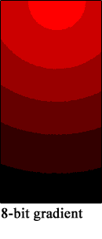
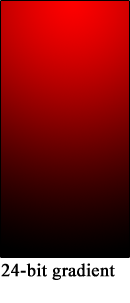
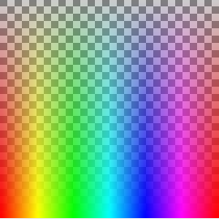
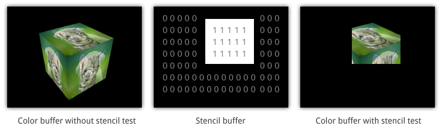
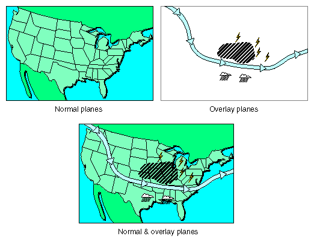

# EGL 1.0: `eglGetConfigAttrib`

```c
EGLBoolean eglGetConfigAttrib(EGLDisplay dpy,
                              EGLConfig config,
                              EGLint attribute,
                              EGLint *value);
```

`eglGetConfigAttrib`, bir `EGLConfig` içindeki tek bir attribute değerini sorgular.

`EGLConfig`, oluşturulacak `EGLSurface` için şu özellikleri tarif eder:

- color buffer component boyutları
- depth/stencil buffer boyutları
- multisampling bilgisi
- desteklenen surface tipleri
- native visual bilgileri
- transparency bilgileri
- pbuffer limitleri

## Kavramsal Akış

```text
EGLDisplay
  |
  +-- EGLConfig #1
  |     +-- EGL_RED_SIZE
  |     +-- EGL_GREEN_SIZE
  |     +-- EGL_SURFACE_TYPE
  |     +-- ...
  |
  +-- EGLConfig #2
        +-- EGL_RED_SIZE
        +-- EGL_GREEN_SIZE
        +-- EGL_SURFACE_TYPE
        +-- ...
```

`eglGetConfigAttrib` sadece bir `EGLConfig` ve bir `attribute` için değer döndürür.

Bu fonksiyon bir **ayar yapmaz** ve **config'i değiştirmez**. Örneğin `EGL_SAMPLES` değerini sorgulamak multisampling'i açmaz; yalnızca config'in kaç sample sağlayacağını bildirir. Kullanılacak özellikler surface ve context oluşturulmadan önce config seçimiyle belirlenir.

## Parametreler

### `dpy`

| Değer                                | Sonuç                                                                  |
| ------------------------------------- | ----------------------------------------------------------------------- |
| Geçerli ve initialized`EGLDisplay` | Diğer parametreler de geçerliyse sorgu başarılıdır.               |
| `EGL_NO_DISPLAY`                    | Başarısız. Genel EGL hata modeliyle`EGL_BAD_DISPLAY` beklenir.     |
| Geçersiz display handle              | Başarısız. Genel EGL hata modeliyle`EGL_BAD_DISPLAY` beklenir.     |
| Initialize edilmemiş display         | Başarısız. Genel EGL hata modeliyle`EGL_NOT_INITIALIZED` beklenir. |

### `config`

| Değer                                               | Sonuç                                        |
| ---------------------------------------------------- | --------------------------------------------- |
| `dpy` üzerinden alınmış geçerli `EGLConfig` | Attribute değeri`*value` içine yazılır. |
| `eglGetConfigs` ile alınmış config              | Geçerli.                                     |
| `eglChooseConfig` ile alınmış config            | Geçerli.                                     |
| Başka`EGLDisplay`'e ait config                    | Geçerli config sayılmaz; başarısız.      |
| Geçersiz config handle                              | Başarısız. Tipik hata`EGL_BAD_CONFIG`.   |

EGL 1.0 notu:

```text
EGLConfig handle'ları, ait oldukları EGLDisplay terminate edilene kadar geçerlidir.
```

### `attribute`

`attribute`, EGL 1.0 Table 3.1 içinde tanımlı bir `EGLConfig` attribute'u olmalıdır. Geçersizse:

```C
eglGetConfigAttrib(...) == EGL_FALSE
eglGetError() == EGL_BAD_ATTRIBUTE
```

### `value`

| Değer               | Sonuç                                                                   |
| -------------------- | ------------------------------------------------------------------------ |
| Geçerli`EGLint *` | Sonuç bu adrese yazılır.                                              |
| `NULL`             | EGL 1.0 bunu geçerli kullanım olarak tanımlamaz; gerçek storage ver. |

Doğru kullanım:

```C
EGLint red_bits = 0;
if (!eglGetConfigAttrib(dpy, config, EGL_RED_SIZE, &red_bits)) {
    EGLint err = eglGetError();
}
```

## EGL 1.0'da Geçerli Attribute Listesi

| Attribute                       |     Tip | Anlam                                                                  |
| ------------------------------- | ------: | ---------------------------------------------------------------------- |
| `EGL_BUFFER_SIZE`             | integer | Color buffer toplam bit derinliği.                                    |
| `EGL_RED_SIZE`                | integer | Red component bit sayısı.                                            |
| `EGL_GREEN_SIZE`              | integer | Green component bit sayısı.                                          |
| `EGL_BLUE_SIZE`               | integer | Blue component bit sayısı.                                           |
| `EGL_ALPHA_SIZE`              | integer | Alpha component bit sayısı.                                          |
| `EGL_CONFIG_CAVEAT`           |    enum | `EGL_NONE`, `EGL_SLOW_CONFIG`,<br />`EGL_NON_CONFORMANT_CONFIG`. |
| `EGL_CONFIG_ID`               | integer | Unique config id.                                                      |
| `EGL_DEPTH_SIZE`              | integer | Depth buffer bit sayısı.                                             |
| `EGL_LEVEL`                   | integer | Native framebuffer katmanı; pencere z-order'ı değil.                |
| `EGL_MAX_PBUFFER_WIDTH`       | integer | Maksimum pbuffer genişliği.                                          |
| `EGL_MAX_PBUFFER_HEIGHT`      | integer | Maksimum pbuffer yüksekliği.                                         |
| `EGL_MAX_PBUFFER_PIXELS`      | integer | Maksimum pbuffer pixel sayısı.                                       |
| `EGL_NATIVE_RENDERABLE`       | boolean | Native rendering API'nin surface'e erişebilme durumu.                  |
| `EGL_NATIVE_VISUAL_ID`        | integer | Platform-dependent native visual id.                                   |
| `EGL_NATIVE_VISUAL_TYPE`      | integer | Platform-dependent native visual type.                                 |
| `EGL_SAMPLE_BUFFERS`          | integer | Multisample buffer sayısı;`0` veya `1`.                          |
| `EGL_SAMPLES`                 | integer | Pixel başına sample sayısı.                                        |
| `EGL_STENCIL_SIZE`            | integer | Stencil buffer bit sayısı.                                           |
| `EGL_SURFACE_TYPE`            | bitmask | Desteklenen surface tipleri.                                           |
| `EGL_TRANSPARENT_TYPE`        |    enum | `EGL_NONE` veya `EGL_TRANSPARENT_RGB`.                             |
| `EGL_TRANSPARENT_RED_VALUE`   | integer | Transparent red key.                                                   |
| `EGL_TRANSPARENT_GREEN_VALUE` | integer | Transparent green key.                                                 |
| `EGL_TRANSPARENT_BLUE_VALUE`  | integer | Transparent blue key.                                                  |

## Attribute Ayrıntıları

### Color Buffer Component Bit Sayısının Etkisi

```
EGL_BUFFER_SIZE = EGL_RED_SIZE
                + EGL_GREEN_SIZE
                + EGL_BLUE_SIZE
                + EGL_ALPHA_SIZE
```

Örnek:

```
R=8, G=8, B=8, A=8 -> EGL_BUFFER_SIZE = 32
R=5, G=6, B=5, A=0 -> EGL_BUFFER_SIZE = 16
```

Buradaki bit sayıları bir rengin bellekte kaç farklı tamsayı seviyesiyle tutulabildiğini belirler. Bir component `n` bit ise alabileceği değer sayısı `2^n`, saklanan tamsayı aralığı ise `0 ... 2^n - 1` olur.

| Component bit sayısı | Ayrı seviye sayısı | Tamsayı aralığı | Normalize edilmiş iki komşu seviye arası |
| ---------------------: | --------------------: | ------------------: | ------------------------------------------: |
|                  3 bit |                     8 |            `0..7` |                           `1/7 ≈ 0,1429` |
|                  5 bit |                    32 |           `0..31` |                          `1/31 ≈ 0,0323` |
|                  6 bit |                    64 |           `0..63` |                          `1/63 ≈ 0,0159` |
|                  8 bit |                   256 |          `0..255` |                        `1/255 ≈ 0,00392` |

Örneğin kırmızı component 3 bit olduğunda yalnızca şu normalize edilmiş değerler temsil edilebilir:

```text
0/7, 1/7, 2/7, 3/7, 4/7, 5/7, 6/7, 7/7
```

OpenGL ES işlemleri veya `glClearColor` ara bir değer üretse bile sonuç color buffer'a yazılırken en yakın temsil edilebilir seviyeye quantize edilir. Dolayısıyla 3 bit kırmızı, yumuşak bir kırmızı gradyanda basamakların belirginleşmesine (`color banding`) yol açabilir. 5 bitte 32, 8 bitte 256 seviye bulunduğu için geçiş giderek daha pürüzsüz görünür.



#### Yaygın Color Formatlarının Karşılaştırılması

| Format   | Config değerleri | Alpha | Toplam teorik RGB renk | Tipik sonuç                                                                                |
| -------- | ----------------- | ----: | ---------------------: | ------------------------------------------------------------------------------------------- |
| RGB332   | R3 G3 B2 A0       |   Yok |                    256 | Çok düşük bellek, belirgin banding                                                      |
| RGB565   | R5 G6 B5 A0       |   Yok |                 65.536 | 16 bit ekranlarda yaygın; yeşile insan gözü daha duyarlı olduğu için 6 bit ayrılır |
| RGB888   | R8 G8 B8 A0       |   Yok |             16.777.216 | Yüksek renk doğruluğu, alpha kanalı yok                                                 |
| RGBA8888 | R8 G8 B8 A8       | 8 bit |             16.777.216 | Renge ek olarak 256 alpha seviyesi                                                          |

`EGL_BUFFER_SIZE`, yalnızca bir pixel'in color buffer kısmındaki toplam bit sayısıdır. Ekran çözünürlüğü, depth/stencil buffer'ları, MSAA sample'ları ve kaç adet sunum buffer'ı bulunduğu bu değere dahil değildir.

1920 × 1080 tek bir color buffer için kaba alt sınır hesabı:

```text
RGB565:   1920 * 1080 * 16 / 8 = 4.147.200 byte ≈ 3,96 MiB
RGBA8888: 1920 * 1080 * 32 / 8 = 8.294.400 byte ≈ 7,91 MiB
```

Bu yalnızca teorik payload hesabıdır. Satır hizalama, tiling, sıkıştırma, driver metadata'sı ve birden fazla buffer gerçek bellek kullanımını değiştirebilir.


#### `EGL_ALPHA_SIZE` Kapsamı ve Sınırlamaları

EGL 1.0 specification bu iki attribute'u farklı şeyler olarak tanımlar:

- Table 3.1'de `EGL_ALPHA_SIZE`, yalnızca “color buffer'daki Alpha bitlerinin sayısı”dır.
- `EGL_TRANSPARENT_TYPE` ise bir config'in transparent pixel destekleyip desteklemediğini belirtir.

Dolayısıyla EGL 1.0 açısından alpha ile transparency aynı şey değildir:

- **Alpha**, her pixel ile birlikte saklanabilen sayısal bir component'tir. OpenGL ES gibi rendering API'leri bu değeri blending hesabında kullanabilir.
- **Transparency (saydamlık)**, birleştirme sonucunda arka planın ne kadar göründüğüdür. Alpha bu sonucu üretmek için kullanılabilir; fakat alpha değerinin varlığı tek başına saydamlık oluşturmaz.

Kavramsal ayrım şu şekilde özetlenebilir: alpha **veri**, blending bu veriyi kullanabilen **işlem**, saydamlık ise ekranda görülebilen **sonuç**tur. EGL 1.0 specification alpha değerinin blending'de nasıl kullanılacağını tanımlamaz.

`EGL_ALPHA_SIZE`, color buffer'da pixel başına alpha component'i için kaç bit ayrıldığını bildirir:

| `EGL_ALPHA_SIZE` | Saklanabilen alpha seviyeleri                     |
| -----------------: | ------------------------------------------------- |
|                  0 | Alpha component yoktur.                           |
|                  1 | İki alpha değeri saklanabilir:`0` veya `1`. |
|                  8 | `0..255`, yani 256 alpha seviyesi saklanabilir. |

Örneğin RGBA8888'de alpha değeri `128` olan bir pixel, standart alpha blending ile opak bir arka planın üzerine çizilirse kaynak renk ile arka plan yaklaşık yarı yarıya karışır. Blending kapalıysa aynı `128` değeri buffer'da bulunmasına rağmen çizilen pixel otomatik olarak yarı saydam görünmez; kaynak renk doğrudan yazılabilir.

Benzer biçimde alpha buffer bulunması pencereyi masaüstüne karşı otomatik olarak saydam yapmaz. Bunun için pencere sistemi/compositor'ın surface alpha'sını desteklemesi ve kullanması gerekir.

EGL 1.0'daki `EGL_TRANSPARENT_RGB` ise farklı bir mekanizmadır. Specification'a göre framebuffer'dan okunan red, green ve blue değerlerinin üç transparent değerle **tam eşleştiği** pixel transparent çizilir. Eşleşmede alpha değeri yer almadığı için bu, alpha blending değil RGB color key yöntemidir. Dolayısıyla kavramlar şöyle ayrılır:

| Kavram                  | Tanım                                                      | Kısmi saydamlık desteği                      |
| ----------------------- | --------------------------------------------------------- | ----------------------------------------------- |
| `EGL_ALPHA_SIZE`      | Pixel başına saklanabilen alpha bitlerini               | Tek başına hayır                             |
| OpenGL ES blending      | Kaynak ve hedef renklerin nasıl karıştırılacağını | Seçilen blending işlemine bağlı olarak evet |
| `EGL_TRANSPARENT_RGB` | Tam eşleşen tek bir RGB renginin saydam sayılmasını  | Hayır; pixel ya eşleşir ya eşleşmez        |



Damalı bir arka plan üzerine birleştirilmiş RGBA görsel örneği. Alpha değeri üstte %0, altta %100'dür.

### Ancillary buffer'lar: depth ve stencil

Depth ve stencil, color buffer'ın parçaları değildir; bu yüzden bitleri `EGL_BUFFER_SIZE` toplamına girmez.

#### `EGL_DEPTH_SIZE`

Depth buffer her fragment'ın kameraya göre derinlik değerini saklar ve öndeki yüzeyin arkadakini kapatmasını sağlar.

| Değer | Anlam ve pratik etki                                                                                  |
| -----: | ----------------------------------------------------------------------------------------------------- |
|      0 | Depth buffer yoktur;`GL_DEPTH_TEST` ile güvenilir gizli yüzey eleme yapılamaz.                   |
|     16 | Daha az bellek/bant genişliği, fakat birbirine yakın yüzeylerde`z-fighting` riski daha yüksek. |
|     24 | Daha yüksek depth hassasiyeti; 3B sahnelerde sık tercih edilir.                                     |

`Z-fighting`, birbirine çok yakın iki yüzeyin depth değerleri aynı saklama seviyesine yuvarlandığında depth test'in hangisinin önde olduğunu kararlı biçimde ayıramamasıdır. Sonuçta yüzeyler ekranda birbirinin içinden geçiyormuş gibi titreyebilir veya benekli/çizgili görünebilir.

`n` bit depth teorik olarak `2^n` saklama kodu verir: 16 bit 65.536, 24 bit 16.777.216 kod. Fakat perspektif projeksiyonda bu hassasiyet dünya uzayına eşit dağılmaz; near plane yakınında daha fazla, far plane tarafında daha az hassasiyet vardır. Bu nedenle yalnızca 16 bitten 24 bite çıkmak yerine gereksiz derecede küçük `near` ve çok büyük `far` değerlerinden de kaçınmak gerekir.

#### `EGL_STENCIL_SIZE`

Stencil buffer, color ve depth bilgilerinden ayrı olarak her pixel için küçük bir tamsayı/bit maskesi saklar. Bu değer ekranda doğrudan görünmez; o pixel'e gelen fragment'ın çizilip çizilmeyeceğini kontrol eden bir maske gibi kullanılır.

Örneğin önce yalnızca bir ayna şeklinin kapladığı pixellerin stencil değerine `1` yazılabilir. Sonraki çizim geçişinde stencil değeri `1` olan pixeller kabul edilip diğerleri reddedilirse sahne yalnızca aynanın içinde görünür. OpenGL ES, stencil test'in sonucuna göre değeri koruyabilir, artırabilir, azaltabilir veya başka bir değerle değiştirebilir.

Bu mekanizma maskeleme, ayna/portal bölgeleri, outline ve çok geçişli render tekniklerinde kullanılır.



```text
0 bit -> stencil buffer yok
1 bit -> 0 veya 1
8 bit -> 0..255; sekiz ayrı bit bayrak olarak da kullanılabilir
```

8 bit stencil “sekiz kat daha kaliteli görüntü” demek değildir; uygulamanın daha çok stencil değeri veya bağımsız maske biti kullanabilmesi demektir.

### Multisampling: `EGL_SAMPLE_BUFFERS` ve `EGL_SAMPLES`

Normal, tek sample'lı rasterization'da pixel için çoğunlukla tek coverage örneği vardır. Üçgen o örnek noktasını kapsıyorsa pixel tamamen boyanır, kapsamıyorsa boyanmaz. Eğik kenarlar bu yüzden merdiven biçiminde (`aliasing`) görünebilir.

MSAA'da her pixel içinde birden fazla sample konumu test edilir. 4× MSAA için bir kenarın pixel içindeki dört sample'dan ikisini kaplaması yaklaşık yüzde 50 coverage üretir. Sunum öncesindeki resolve işleminde sample sonuçları tek pixel rengine birleştirilir; kenar daha yumuşak görünür.

| Attribute              | Örnek değer | Doğru yorum                                                              |
| ---------------------- | ------------: | ------------------------------------------------------------------------- |
| `EGL_SAMPLE_BUFFERS` |             0 | Multisample buffer yoktur ve`EGL_SAMPLES` da 0'dır.                    |
| `EGL_SAMPLE_BUFFERS` |             1 | Bir multisample buffer vardır. Bu değer sample sayısı değildir.      |
| `EGL_SAMPLES`        |             4 | Multisample buffer içinde pixel başına dört sample vardır: 4× MSAA. |

Önemli ayrım:

```text
EGL_SAMPLE_BUFFERS = 1, EGL_SAMPLES = 4
```

“Dört ayrı framebuffer” veya “quad buffering” demek değildir. Bir multisample buffer ve onun her pixel'inde dört sample demektir. EGL 1.0'da `EGL_SAMPLE_BUFFERS` yalnızca `0` ya da `1` olabilir. Multisample config'te color, depth ve stencil bit büyüklükleri sample başına ilgili `EGL_*_SIZE` attribute'larıyla tarif edilir; ayrı single-sample depth/stencil buffer bulunmaz.


Yukarıdaki ilk diyagramda artı işaretleri tek sample konumunu gösterir. Ortadaki karar tamamen içeride/dışarıda, sağdaki sonuç ise sert basamaklı kenardır.


İkinci diyagramda her pixel'deki dört daire dört sample konumudur. Kapsanan sample sayısı 0/4, 1/4, 2/4, 3/4 veya 4/4 olabildiği için kenarda ara coverage değerleri oluşur.

MSAA'nın bedeli daha fazla sample coverage/depth/stencil çalışması, bellek ve bant genişliğidir. 4× her durumda tam dört kat yavaşlık demek değildir; GPU'nun mimarisi, sıkıştırma ve sahnenin shader maliyeti sonucu değiştirir. MSAA esas olarak geometri kenarlarını düzeltir; texture içindeki yüksek frekans, shader aliasing'i veya hareket aliasing'ini tek başına tamamen çözmez.

Config seçerken:

```c
const EGLint attrs[] = {
    EGL_SAMPLE_BUFFERS, 1,
    EGL_SAMPLES,        4,
    EGL_NONE
};
```

Bu liste en az bir sample buffer ve en az dört sample ister. Seçilen config'in gerçekte kaç sample verdiği yine `eglGetConfigAttrib` ile okunmalıdır; istek 4 iken dönen değer implementation'ın config listesine göre 4 veya daha büyük olabilir.

### `EGL_SURFACE_TYPE` Bitmask Yapısı

Bitmask döner:

```c
EGLint surface_type = 0;
eglGetConfigAttrib(dpy, config, EGL_SURFACE_TYPE, &surface_type);

if (surface_type & EGL_WINDOW_BIT) {
    /* eglCreateWindowSurface için uygundur */
}

if (surface_type & EGL_PIXMAP_BIT) {
    /* eglCreatePixmapSurface için uygundur */
}

if (surface_type & EGL_PBUFFER_BIT) {
    /* eglCreatePbufferSurface için uygundur */
}
```

Geçerli bitler:

| Bit                 | Anlam                             |
| ------------------- | --------------------------------- |
| `EGL_WINDOW_BIT`  | Window surface oluşturulabilir.  |
| `EGL_PIXMAP_BIT`  | Pixmap surface oluşturulabilir.  |
| `EGL_PBUFFER_BIT` | Pbuffer surface oluşturulabilir. |

#### Pixmap ve Pbuffer Karşılaştırması

İkisi de ekranda doğrudan görünmeyen **off-screen** rendering surface'idir; temel fark color buffer'ın nereden geldiği ve EGL dışından erişilip erişilememesidir.

| Özellik                     | Pixmap surface                                                                 | Pbuffer surface                                                                          |
| ---------------------------- | ------------------------------------------------------------------------------ | ---------------------------------------------------------------------------------------- |
| Color buffer kaynağı        | Native pencere sistemi tarafından önceden oluşturulan pixmap sağlar.       | `eglCreatePbufferSurface` çağrısında EGL ayırır.                                 |
| Native nesne                | Platforma özgü bir<br />`NativePixmapType` handle'ı vardır.                | Yalnızca EGL tarafından yönetilen bir `EGLSurface` vardır.                        |
| Boyut kaynağı               | Önceden oluşturulmuş native pixmap'ın boyutudur.                            | `EGL_WIDTH` ve `EGL_HEIGHT` attribute'larıdır.                                   |
| Native API erişimi          | Native 2B/GUI API'leri aynı pixmap'a erişebilir.                             | EGL 1.0 native API erişimini garanti etmez.                                             |
| EGL 1.0 buffer modeli        | Single-buffered; render sonucu doğrudan native pixmap'tadır.                 | Back-buffered; fakat bağlı bir pencere olmadığı için ekrana sunulmaz.              |
| Tipik amaç                  | OpenGL ES ile native çizim API'leri arasında ortak bir görüntü kullanmak. | Ara görüntü, geçici render hedefi veya ekranda gösterilmeyecek GL çizimi üretmek. |

Pixmap burada PNG/JPEG gibi bir resim dosyası değildir. Native pencere sisteminin oluşturduğu, ekran dışında duran çizilebilir bir pixel belleğidir. Önce platform API'siyle pixmap oluşturulur; ardından bu handle EGL'ye verilir:

```text
native pixmap oluştur
        |
        v
eglCreatePixmapSurface(dpy, config, native_pixmap, ...)
        |
        v
OpenGL ES aynı native pixmap'ın color buffer'ına çizer
        |
        v
native API pixmap'ı okuyabilir veya başka yerde kullanabilir
```

Native pixmap'ın formatı seçilen `EGLConfig` ile uyumlu olmalıdır; örneğin color component derinlikleri uyuşmazsa `eglCreatePixmapSurface` `EGL_BAD_MATCH` ile başarısız olabilir. OpenGL ES çizimi bittikten sonra pixmap'a native API ile erişmeden önce iki rendering akışının `eglWaitGL` gibi bir mekanizmayla senkronize edilmesi gerekir.

Pbuffer'da ise önceden oluşturulan native bir buffer verilmez. Boyutlar EGL'ye bildirilir ve gerekli off-screen kaynak EGL tarafından ayrılır:

```text
eglCreatePbufferSurface(dpy, config, { WIDTH, HEIGHT, ... })
        |
        v
EGL off-screen color/depth/stencil buffer'larını ayırır
        |
        v
OpenGL ES pbuffer'a çizer; bağlı bir pencere olmadığı için sonuç
kendiliğinden ekranda görünmez
```

Seçim, kullanım amacına göre yapılır: Görüntünün native pixmap API'leriyle paylaşılması gerekiyorsa **pixmap**; EGL/OpenGL ES içinde kalacak bağımsız bir off-screen render hedefi gerekiyorsa **pbuffer** daha uygun modeldir. Gerçek destek platforma ve config'in ilgili bitine bağlıdır.

Örneğin sonuç `EGL_WINDOW_BIT | EGL_PBUFFER_BIT` ise aynı config window ve pbuffer surface oluşturabilir, fakat pixmap oluşturamaz. Bu nedenle eşitlik yerine bit testi yapılır:

```c
/* Yanlış: başka destek bitleri de set ise false olur. */
if (surface_type == EGL_WINDOW_BIT) { /* ... */ }

/* Doğru: window desteğinin maskede bulunup bulunmadığını test eder. */
if ((surface_type & EGL_WINDOW_BIT) != 0) { /* ... */ }
```

### Pbuffer Limitleri

Üç limit birlikte sağlanmalıdır:

```text
width  <= EGL_MAX_PBUFFER_WIDTH
height <= EGL_MAX_PBUFFER_HEIGHT
width * height <= EGL_MAX_PBUFFER_PIXELS
```

Örneğin width ve height limiti 4096, pixel limiti 4.194.304 ise 4096 × 4096 boyutlar ayrı ayrı limite uysa bile çarpım 16.777.216 olduğu için bu pbuffer istenemez. 2048 × 2048 ise pixel limitine tam uyar.

Bu değerler garanti edilmiş boş bellek miktarı değildir. EGL 1.0'a göre `EGL_MAX_PBUFFER_PIXELS` statik bir üst sınırdır ve başka kaynakların framebuffer belleğiyle yarışmadığını varsayar; limit içindeki bir istek bile çalışma anında `EGL_BAD_ALLOC` ile başarısız olabilir.

### `EGL_CONFIG_ID`, `EGL_LEVEL` ve `EGL_CONFIG_CAVEAT`

#### `EGL_CONFIG_ID`

Display içindeki config'i ayırt eden küçük pozitif tamsayıdır. Loglarda bir config'i tekrar tanımak veya `eglChooseConfig` ile tam o ID'yi istemek için kullanışlıdır. Bir kalite puanı değildir; ID 12'nin ID 4'ten daha iyi olduğu anlamına gelmez.

#### `EGL_LEVEL`

`EGL_LEVEL` değerinin anlaşılması için öncelikle framebuffer ve plane kavramlarının ayrılması gerekir:

- **Framebuffer**, ekrana gönderilecek pixel renklerinin tutulduğu bellektir. “Native framebuffer” denmesi, bu belleğin ve ekrana gönderilme yönteminin EGL tarafından değil işletim sisteminin pencere/görüntü altyapısı tarafından sağlandığını anlatır. Buradaki terim bir OpenGL framebuffer object'i (FBO) değildir.
- **Plane**, görüntü donanımının ekrana gönderirken kullanabildiği bağımsız bir görüntü katmanıdır. Her plane kendi pixel buffer'ına sahip olabilir. Ekran denetleyicisi bu plane'leri üst üste birleştirerek monitöre giden son görüntüyü oluşturur.

Bunu üst üste konmuş saydam asetatlara benzetebiliriz:

```text
                Monitörde görülen son görüntü
                              ^
                              | donanım birleştirir

level +1   [ overlay plane: örneğin video görüntüsü       ]
level  0   [ ana/default plane: masaüstü ve normal içerik ]
level -1   [ underlay plane: ana plane'in arkasındaki     ]
```

**Default framebuffer/plane (`level 0`)**, ekranın normal görüntüsünün bulunduğu ana katmandır. **Overlay plane**, bundan ayrı tutulan ve donanım tarafından ana görüntünün üzerine yerleştirilen buffer'dır. Örneğin bazı sistemler bir videoyu önce masaüstü görüntüsüne pixel pixel kopyalamak yerine ayrı bir overlay plane'den gösterebilir. **Underlay plane** ise ana katmanın altında birleştirilir ve ancak üzerindeki katmanların saydam bölgelerinden görülebilir.



Buradaki “level sırası”, uygulama pencerelerinin listesini sıralamak demek değildir. Görüntü donanımının bağımsız plane'leri hangi genel katmanda birleştireceğini tarif eder:

```text
pozitif level  -> default plane'in üstündeki overlay framebuffer'lar
level 0        -> display'in default framebuffer'ı
negatif level  -> default plane'in altındaki underlay framebuffer'lar
```

`EGL_LEVEL`, bir `EGLConfig` ile oluşturulan **window surface'in hangi framebuffer level'a uygun olduğunu** bildirir. `eglGetConfigAttrib` bunu yalnızca sorgular; mevcut pencereyi başka bir plane'e taşımaz veya öne getirmez.

Örneğin iki normal pencere de `EGL_LEVEL = 0` kullanabilir. Kullanıcı birine tıklayınca onun diğer pencerenin önüne gelmesini pencere yöneticisi/compositor sağlar; iki pencerenin `EGL_LEVEL` değeri yine `0` kalır. Aynı biçimde 3B sahne içindeki nesnelerin önde veya arkada olması da `EGL_LEVEL` ile değil depth buffer ve `GL_DEPTH_TEST` ile belirlenir.

| Kavram             | Belirlediği ilişki                                                      | Örnek                                         |
| ------------------ | ---------------------------------------------------------------------- | ---------------------------------------------- |
| `EGL_LEVEL`      | Window surface'in kullanılacağı donanım/native görüntü plane'i     | Default plane veya özel video overlay plane'i |
| Pencere z-order'ı | Aynı masaüstündeki pencerelerin örtüşme sırası                       | Tıklanan pencerenin öne gelmesi              |
| Depth/Z değeri    | Aynı 3B çizimdeki yüzeylerin örtüşme sırası                         | Öndeki küpün arkadaki duvarı kapatması    |

Config seçiminde `EGL_LEVEL` için varsayılan değer `0`dır ve eşleşme **exact** yapılır. EGL 1.0'a göre bu attribute için `EGL_DONT_CARE` kullanılamaz. Çoğu uygulama yalnızca level `0` kullanır; overlay/underlay level desteği platforma özgüdür ve hiç bulunmayabilir.

#### `EGL_CONFIG_CAVEAT`

| Değer                        | Anlam                                                                                                                                               |
| ----------------------------- | --------------------------------------------------------------------------------------------------------------------------------------------------- |
| `EGL_NONE`                  | Config için bilinen caveat yoktur; genellikle ilk tercih budur.                                                                                    |
| `EGL_SLOW_CONFIG`           | Render düşük performanslı olabilir; örneğin format donanımda doğal olmayıp dönüşüm veya yazılım yolu gerektirebilir.                 |
| `EGL_NON_CONFORMANT_CONFIG` | Bu config'e render etmek gerekli OpenGL ES conformance testlerini geçmez. “Kesin çalışmaz” değil, standart uyumluluk garantisi yok demektir. |

### Native Visual

Bu bağlamdaki “visual” terimi günlük anlamındaki görüntüyü ifade etmez; bir pencere veya ekranda görünen nesne değildir. Native pencere sisteminin bir pencerenin pixel'lerini **hangi biçimde saklayıp yorumlayacağını** tarif eden platform nesnesi ya da format tanımıdır.

İlişki, üç taraflı bir uyumluluk sözleşmesi olarak gösterilebilir:

```text
EGLConfig                         native visual
---------------------------      ---------------------------
R/G/B/A bitleri             <--> native pixel/color formatı
window surface desteği           native pencere formatı
        \                              /
         \                            /
          +-- uyumlu native window --+
                        |
                        v
              eglCreateWindowSurface
```

**Native** denmesinin nedeni bu tanımın EGL'ye değil, EGL'nin üzerinde çalıştığı pencere sistemine ait olmasıdır. EGL, kendi `EGLConfig` özellikleriyle native pencerenin formatı arasında köprü kurar. EGL 1.0 bunun platformlar arasında tek bir anlamı olduğunu varsaymaz.

#### Uyumluluk Gereksinimi

OpenGL ES'in ürettiği color buffer ile native pencerenin beklediği pixel düzeni uyumlu olmalıdır. Örneğin seçilen config RGB565 bir window buffer tarif ederken native pencere farklı ve uyumsuz bir formatla oluşturulmuşsa EGL bu pencereyi o config ile doğrudan kullanamayabilir. `eglCreateWindowSurface` sırasında native pencerenin attribute'ları config ile uyuşmazsa `EGL_BAD_MATCH` oluşabilir.

Bu yüzden bazı platformlarda genel oluşturma sırası şöyledir:

```text
1. EGLConfig seç
2. Config'in EGL_NATIVE_VISUAL_ID değerini sorgula
3. O ID'ye uygun native pencereyi oluştur
4. Native pencereyi eglCreateWindowSurface'e ver
```

#### ID ve Type Ayrımı

| Attribute                  | Anlam                                                                                   | Kapsam dışı                                                           |
| -------------------------- | --------------------------------------------------------------------------------------- | ---------------------------------------------------------------------- |
| `EGL_NATIVE_VISUAL_ID`   | Config'e karşılık gelen belirli native visual/format için platform kimliği         | Bir`EGLConfig`, pencere veya `EGLSurface` handle'ı değildir      |
| `EGL_NATIVE_VISUAL_TYPE` | Native platformun visual'ı sınıflandırmak için kullandığı platforma özgü tür | EGL'nin bütün platformlarda ortak tanımladığı bir enum değildir |

Birden fazla `EGLConfig` aynı native visual'a karşılık gelebilir. Örneğin iki config aynı native pencere color formatını kullanırken farklı depth, stencil veya multisampling özellikleri sunabilir. Bu nedenle `EGL_CONFIG_ID` ile `EGL_NATIVE_VISUAL_ID` aynı kimlik değildir:

```text
EGLConfig #7  (RGB888, depth 16, stencil 0) --+
                                                +--> native visual ID 42
EGLConfig #9  (RGB888, depth 24, stencil 8) --+
```

`EGL_CONFIG_ID`, EGL'nin tüm rendering configuration'ını tanır. Native visual ID ise yalnızca native pencere sistemi tarafındaki karşılığı tanır.

#### X11 Platform Örneği

EGL 1.0 specification'ın verdiği örnekte `EGL_NATIVE_VISUAL_ID`, bir X11 `Visual` nesnesinin XID'sidir. Uygulama bu ID ile uygun X11 visual bilgisini bulur, gerekiyorsa ona uygun colormap oluşturur ve X11 penceresini o visual ile yaratır. Ardından pencere handle'ını `eglCreateWindowSurface` çağrısına verir:

```text
EGLConfig
   |
   +-- eglGetConfigAttrib(..., EGL_NATIVE_VISUAL_ID, &visual_id)
   |
   v
X11 Visual + uygun Colormap
   |
   v
X11 Window
   |
   v
eglCreateWindowSurface(..., x11_window, ...)
```

Bu X11'e özgü bir örnektir; başka platformlarda sayı bir pixel/buffer formatını veya tamamen farklı bir native tanımı ifade edebilir. Taşınabilir kod bu sayının anlamını tahmin etmemeli, kullanılan EGL platformunun kurallarına göre yorumlamalıdır.

#### `0` ve `EGL_NONE` Döndürülen Durumlar

EGL 1.0 davranışı:

| Durum                                                      | `EGL_NATIVE_VISUAL_ID` | `EGL_NATIVE_VISUAL_TYPE` |
| ---------------------------------------------------------- | -----------------------: | -------------------------: |
| Config window destekliyor ve ilişkili native visual varsa |     Platform-specific ID |     Platform-specific type |
| Config window desteklemiyor                                |                    `0` |               `EGL_NONE` |
| Config'in ilişkili native visual'ı yok                   |                    `0` |               `EGL_NONE` |

Bu değerlerin bulunmaması config'in tamamen kullanılamaz olduğu anlamına gelmez; config pbuffer veya pixmap gibi başka surface türlerini destekliyor olabilir.

Son olarak `EGL_NATIVE_VISUAL_ID`, EGL 1.0'da `eglChooseConfig` listesine yazılsa bile seçim sırasında dikkate alınmaz; esas kullanım seçilmiş config'den değeri **sorgulamaktır**. `EGL_NATIVE_VISUAL_TYPE` ise window surface istendiğinde platforma özgü bir type'a göre exact config eşleştirmesinde kullanılabilir.

### `EGL_NATIVE_RENDERABLE`

`EGL_TRUE`, native pencere sisteminin rendering API'lerinin bu config ile oluşturulan surface'e render edebildiğini bildirir. Bu EGL/OpenGL ES rendering'inin hızlı olduğu anlamına gelmez ve native API ile GL'nin aynı surface'e eşzamanlı, senkronizasyonsuz yazabileceği anlamına da gelmez. İki API aynı buffer'ı kullanıyorsa sıralama için EGL 1.0'daki `eglWaitNative` ve `eglWaitGL` gibi senkronizasyon kuralları gerekir.

### Transparency: Alpha Blending ve Color Key Ayrımı

| Attribute                                       | Anlam                                                                                             |
| ----------------------------------------------- | ------------------------------------------------------------------------------------------------- |
| `EGL_TRANSPARENT_TYPE == EGL_NONE`            | Bu config ile oluşturulan window'larda transparent pixel yoktur.                                 |
| `EGL_TRANSPARENT_TYPE == EGL_TRANSPARENT_RGB` | Framebuffer'daki RGB değerleri üç key değeriyle tam eşleşen pixel transparent kabul edilir. |

#### Amaç ve Kullanım Alanları

Amaç, dikdörtgen bir native pencerenin belirli pixellerini **saydam bölge** olarak işaretlemektir. Pencerenin color buffer'ında key rengi bulunan yerde pencerenin kendi rengi yerine arkasındaki native görüntü görünür; key olmayan pixeller pencerenin normal içeriğini gösterir.

```text
Window surface'in color buffer'ı

[ key ][ key ][ logo ][ logo ][ key ]
[ key ][ logo][ logo ][ logo ][ key ]
[ key ][ key ][ logo ][ key  ][ key ]
    |      |                    |
    v      v                    v
 arkası  içerik               arkası
 görünür görünür              görünür
```

Tipik kullanım alanları şunlardır:

- Dikdörtgen pencerenin içinde yuvarlak logo, gösterge veya başka düzensiz biçimli bir içerik gösterip çevresini görünmez yapmak.
- HUD/OSD gibi yalnızca yazı ve simgelerin görünmesi, geri kalan pencere alanından alttaki görüntünün görünmeye devam etmesi.
- Video bir underlay plane'de gösterilirken üstteki arayüz katmanında video alanına karşılık gelen pixelleri key rengiyle doldurarak saydam bir bölge oluşturmak.
- Per-pixel alpha compositing sağlamayan native sistemlerde basit, iki durumlu pencere saydamlığı elde etmek.

Bu özellik yalnızca pixel'in **görsel sonucunu** etkiler. Saydam görünen bölgenin fare/dokunma olaylarını alttaki pencereye geçirip geçirmeyeceğini EGL belirlemez; input region ve hit-testing native pencere sisteminin ayrı kurallarıdır.

#### Kullanım Akışı

Önce `EGL_TRANSPARENT_RGB` destekleyen bir window config istenir:

```c
const EGLint wanted[] = {
    EGL_SURFACE_TYPE,     EGL_WINDOW_BIT,
    EGL_TRANSPARENT_TYPE, EGL_TRANSPARENT_RGB,
    EGL_NONE
};

EGLConfig config;
EGLint config_count = 0;
eglChooseConfig(dpy, wanted, &config, 1, &config_count);
```

Bu çağrı özelliği sonradan açmaz; transparent davranış sunan bir config arar. Böyle bir config yoksa `config_count` sıfır olabilir. Config bulunduktan sonra implementation'ın belirlediği gerçek key değerleri sorgulanır:

```c
EGLint key_r, key_g, key_b;
eglGetConfigAttrib(dpy, config, EGL_TRANSPARENT_RED_VALUE,   &key_r);
eglGetConfigAttrib(dpy, config, EGL_TRANSPARENT_GREEN_VALUE, &key_g);
eglGetConfigAttrib(dpy, config, EGL_TRANSPARENT_BLUE_VALUE,  &key_b);
```

Ardından bu config ile uyumlu native window ve `EGLSurface` oluşturulur. Uygulama, arkasının görünmesini istediği pixellere tam olarak bu RGB key'ini; görünür olmasını istediği yerlere başka renkleri çizer. Örneğin RGB565 config key olarak `(0, 63, 0)` bildiriyorsa kavramsal kullanım şöyledir:

```c
/* Key rengini değiştirebilecek state'leri kapat. */
glDisable(GL_BLEND);
glDisable(GL_DITHER);

/* RGB565 (0, 63, 0) -> normalize edilmiş (0.0, 1.0, 0.0). */
glClearColor(0.0f, 1.0f, 0.0f, 1.0f);
glClear(GL_COLOR_BUFFER_BIT);

/* Ardından yalnızca görünmesi gereken şekilleri key dışındaki renklerle çiz. */
draw_visible_content();

eglSwapBuffers(dpy, surface);
```

Native pencere sistemi, sunum sırasında key rengiyle eşleşen pixelleri transparent kabul eder. Bu işlem `eglSwapBuffers` içinde ayrıca verilen bir transparency parametresiyle kontrol edilmez; davranış surface'in oluşturulduğu `EGLConfig` tarafından tarif edilmiştir.

#### Color Key Sınırlamaları ve Alpha Compositing ile Karşılaştırma

Color key basit ve bazı native overlay/window sistemleriyle doğrudan uyumludur; fakat önemli sınırlamaları vardır:

- Yalnızca tamamen saydam veya tamamen opak sonucu vardır; yüzde 20 ya da yüzde 70 saydamlık üretmez.
- Key olarak ayrılan RGB rengi opak içerikte kullanılamaz; kullanılması durumunda ilgili pixeller de saydam kabul edilir.
- Blending, dithering, filtering veya MSAA kenar pixellerinin rengini az da olsa değiştirirse exact eşleşme bozulabilir.
- Yumuşak, anti-aliased saydam kenarlar için uygun değildir.
- Desteği ve arka planın nasıl gösterileceği native platforma bağlıdır.

Bu nedenle color key daha çok keskin sınırlı saydam bölgeler ve native overlay uyumluluğu için kullanılır; kademeli saydamlık gereken bir arayüzde alpha compositing daha uygun mekanizmadır.

`EGL_TRANSPARENT_TYPE == EGL_NONE` ise şu değerler tanımsızdır:

- `EGL_TRANSPARENT_RED_VALUE`
- `EGL_TRANSPARENT_GREEN_VALUE`
- `EGL_TRANSPARENT_BLUE_VALUE`

`EGL_TRANSPARENT_TYPE == EGL_TRANSPARENT_RGB` ise bu değerler component bit derinliği aralığında integer framebuffer değerleridir.

Her component için aralık ayrı hesaplanır:

```text
red key   : 0 .. (2^EGL_RED_SIZE)   - 1
green key : 0 .. (2^EGL_GREEN_SIZE) - 1
blue key  : 0 .. (2^EGL_BLUE_SIZE)  - 1
```

Buradaki formül **saydamlığı tetikleyen değeri değil**, transparent key'in seçilebileceği sayısal aralığı gösterir. Örneğin `EGL_GREEN_SIZE = 6` ise maksimum saklama değeri `2^6 - 1 = 63` olur. Ancak green değerinin `63` olması tek başına pixeli saydam yapmaz.

Bir pixel'in saydam olması için şu dört koşulun tamamı gerekir:

```text
EGL_TRANSPARENT_TYPE == EGL_TRANSPARENT_RGB

pixel.R == EGL_TRANSPARENT_RED_VALUE
pixel.G == EGL_TRANSPARENT_GREEN_VALUE
pixel.B == EGL_TRANSPARENT_BLUE_VALUE
```

Yani üç component **aynı anda ve tam olarak** config'in bildirdiği key değerleriyle eşleşmelidir. Key değerlerinin maksimum olması da gerekmez. RGB565 bir config `(R=7, G=12, B=3)` key'ini bildirse yalnızca framebuffer'da tam olarak `(7, 12, 3)` saklanan pixeller bu mekanizmayla saydam kabul edilir.

Önceki `(0, 63, 0)` örneğinde key özellikle tam yeşil seçildiği için yalnızca tam yeşil pixel transparent olur:

```text
(R=0, G=63, B=0)  -> transparent
(R=0, G=62, B=0)  -> opaque; key ile tam eşleşmedi
(R=1, G=63, B=0)  -> opaque; üç component birlikte eşleşmedi
```

Bu mekanizma kısmi saydamlık üretmez: pixel ya key ile eşleşir ve transparent olur ya da eşleşmez ve bu mekanizma açısından opak kalır. Alpha component'i bu karşılaştırmaya katılmaz. Kenar yumuşatma veya blending sonucu key renginin biraz değişmesi eşleşmeyi bozabilir. Bu nedenle `EGL_TRANSPARENT_RGB`, 8 bit alpha kanalındaki 256 opacity seviyesinin yerine geçen bir özellik değildir.

Transparency bilgisi config'in window davranışını tarif eder; pbuffer'ın zaten native ekranda görünen bir penceresi yoktur.

## EGLConfig Karşılaştırma Örneği

Aşağıdaki iki varsayımsal config de pencere oluşturabilir, fakat kullanım amaçları farklıdır:

| Attribute                |     Config A |     Config B | Sonuç                                                                  |
| ------------------------ | -----------: | -----------: | ----------------------------------------------------------------------- |
| R/G/B/A                  |      5/6/5/0 |      8/8/8/8 | A daha az color belleği kullanır; B daha hassas renk ve alpha saklar. |
| Depth                    |           16 |           24 | B karmaşık 3B sahnelerde daha az z-fighting riski taşır.            |
| Stencil                  |            0 |            8 | Yalnızca B stencil tekniklerini destekler.                             |
| Sample buffers / samples |          0/0 |          1/4 | B 4× MSAA ile geometri kenarlarını yumuşatabilir.                   |
| Caveat                   | `EGL_NONE` | `EGL_NONE` | İkisinde de bildirilen performans/uyumluluk caveat'i yoktur.           |

Config B daha çok özellik sağladığı için otomatik olarak her uygulamada “daha iyi” değildir. Basit 2B arayüzde Config A bellek ve bant genişliği tasarrufu sağlayabilir; alpha, stencil, yüksek depth hassasiyeti ve MSAA gereken 3B sahnede Config B doğru seçim olabilir.

Bir config'i seçtikten sonra en kritik değerleri birlikte doğrulamak için:

```c
static EGLBoolean get_attrib(EGLDisplay dpy, EGLConfig config,
                             EGLint name, EGLint *out)
{
    if (eglGetConfigAttrib(dpy, config, name, out) == EGL_TRUE) {
        return EGL_TRUE;
    }

    fprintf(stderr, "eglGetConfigAttrib(0x%04x) failed: 0x%04x\n",
            name, eglGetError());
    return EGL_FALSE;
}

EGLint red, green, blue, alpha;
EGLint depth, stencil, sample_buffers, samples, surface_type;

if (get_attrib(dpy, config, EGL_RED_SIZE, &red) &&
    get_attrib(dpy, config, EGL_GREEN_SIZE, &green) &&
    get_attrib(dpy, config, EGL_BLUE_SIZE, &blue) &&
    get_attrib(dpy, config, EGL_ALPHA_SIZE, &alpha) &&
    get_attrib(dpy, config, EGL_DEPTH_SIZE, &depth) &&
    get_attrib(dpy, config, EGL_STENCIL_SIZE, &stencil) &&
    get_attrib(dpy, config, EGL_SAMPLE_BUFFERS, &sample_buffers) &&
    get_attrib(dpy, config, EGL_SAMPLES, &samples) &&
    get_attrib(dpy, config, EGL_SURFACE_TYPE, &surface_type)) {
    printf("RGBA=%d/%d/%d/%d depth=%d stencil=%d MSAA=%d x%d window=%s\n",
           red, green, blue, alpha, depth, stencil,
           sample_buffers, samples,
           (surface_type & EGL_WINDOW_BIT) ? "yes" : "no");
}
```

## EGL 1.0 Dışındaki Attribute'lar

Şu token'lar modern EGL header'larında olabilir ama EGL 1.0 Table 3.1 config attribute listesinde yoktur:

| Token                          | Neden dikkat edilmeli                                                               |
| ------------------------------ | ----------------------------------------------------------------------------------- |
| `EGL_RENDERABLE_TYPE`        | EGL 1.0 config attribute listesinde yoktur; sonraki EGL sürümlerinde yaygındır. |
| `EGL_BIND_TO_TEXTURE_RGB`    | EGL 1.0 Table 3.1 parçası değildir.                                              |
| `EGL_BIND_TO_TEXTURE_RGBA`   | EGL 1.0 Table 3.1 parçası değildir.                                              |
| `EGL_MIN_SWAP_INTERVAL`      | EGL 1.0 Table 3.1 parçası değildir.                                              |
| `EGL_MAX_SWAP_INTERVAL`      | EGL 1.0 Table 3.1 parçası değildir.                                              |
| `EGL_CONTEXT_CLIENT_VERSION` | Context creation attribute'tur; EGL 1.0 Table 3.1 config attribute'u değildir.     |
| `EGL_WIDTH`                  | Surface attribute'tur; config attribute değildir.                                  |
| `EGL_HEIGHT`                 | Surface attribute'tur; config attribute değildir.                                  |

EGL 1.0 uyumu hedefleniyorsa `eglGetConfigAttrib` için yukarıdaki geçerli liste dışına çıkma.

## `eglChooseConfig` ile İlişki

`eglGetConfigAttrib`, seçilmiş config'i okur. Config seçme işi `eglChooseConfig` veya `eglGetConfigs` ile yapılır.

EGL 1.0 default/match davranışlarından bazıları:

| Attribute                |            Default | Match tipi                                     |
| ------------------------ | -----------------: | ---------------------------------------------- |
| `EGL_BUFFER_SIZE`      |              `0` | En az istenen değeri karşılayan config'ler. |
| `EGL_RED_SIZE`         |              `0` | En az istenen değeri karşılayan config'ler. |
| `EGL_GREEN_SIZE`       |              `0` | En az istenen değeri karşılayan config'ler. |
| `EGL_BLUE_SIZE`        |              `0` | En az istenen değeri karşılayan config'ler. |
| `EGL_ALPHA_SIZE`       |              `0` | En az istenen değeri karşılayan config'ler. |
| `EGL_DEPTH_SIZE`       |              `0` | En az istenen değeri karşılayan config'ler. |
| `EGL_STENCIL_SIZE`     |              `0` | En az istenen değeri karşılayan config'ler. |
| `EGL_SURFACE_TYPE`     | `EGL_WINDOW_BIT` | Mask match.                                    |
| `EGL_TRANSPARENT_TYPE` |       `EGL_NONE` | Exact match.                                   |

Bu tablo `eglGetConfigAttrib` çağrısının kendisini değil, sorgulanan config'in nasıl seçilmiş olabileceğini açıklamayı amaçlar.

## Hata Matrisi

| Durum                                                                             | Sonuç                                                   |
| --------------------------------------------------------------------------------- | -------------------------------------------------------- |
| `dpy` geçerli, `config` geçerli, `attribute` geçerli, `value` geçerli | `EGL_TRUE`, `*value` yazılır.                      |
| `attribute` EGL 1.0 config attribute'u değil                                   | `EGL_FALSE`, `EGL_BAD_ATTRIBUTE`.                    |
| `config` geçersiz                                                              | `EGL_FALSE`, tipik hata `EGL_BAD_CONFIG`.            |
| `dpy` geçersiz                                                                 | `EGL_FALSE`, tipik hata `EGL_BAD_DISPLAY`.           |
| `dpy` initialize edilmemiş                                                     | `EGL_FALSE`, tipik hata `EGL_NOT_INITIALIZED`.       |
| `value == NULL`                                                                 | EGL 1.0 geçerli kullanım olarak tanımlamaz; kullanma. |

## Temel Kullanım

```c
EGLint red = 0;
EGLint green = 0;
EGLint blue = 0;
EGLint surface_type = 0;

eglGetConfigAttrib(dpy, config, EGL_RED_SIZE, &red);
eglGetConfigAttrib(dpy, config, EGL_GREEN_SIZE, &green);
eglGetConfigAttrib(dpy, config, EGL_BLUE_SIZE, &blue);
eglGetConfigAttrib(dpy, config, EGL_SURFACE_TYPE, &surface_type);
```

## Tüm EGL 1.0 Attribute'larını Sorgulama

```c
static const EGLint attrs[] = {
    EGL_BUFFER_SIZE,
    EGL_RED_SIZE,
    EGL_GREEN_SIZE,
    EGL_BLUE_SIZE,
    EGL_ALPHA_SIZE,
    EGL_CONFIG_CAVEAT,
    EGL_CONFIG_ID,
    EGL_DEPTH_SIZE,
    EGL_LEVEL,
    EGL_MAX_PBUFFER_WIDTH,
    EGL_MAX_PBUFFER_HEIGHT,
    EGL_MAX_PBUFFER_PIXELS,
    EGL_NATIVE_RENDERABLE,
    EGL_NATIVE_VISUAL_ID,
    EGL_NATIVE_VISUAL_TYPE,
    EGL_SAMPLE_BUFFERS,
    EGL_SAMPLES,
    EGL_STENCIL_SIZE,
    EGL_SURFACE_TYPE,
    EGL_TRANSPARENT_TYPE,
};

for (unsigned i = 0; i < sizeof(attrs) / sizeof(attrs[0]); ++i) {
    EGLint value = 0;
    if (eglGetConfigAttrib(dpy, config, attrs[i], &value)) {
        printf("attr 0x%04x = %d\n", attrs[i], value);
    } else {
        printf("attr 0x%04x failed: 0x%04x\n", attrs[i], eglGetError());
    }
}

EGLint transparent_type = EGL_NONE;
if (eglGetConfigAttrib(dpy, config,
                       EGL_TRANSPARENT_TYPE, &transparent_type) &&
    transparent_type == EGL_TRANSPARENT_RGB) {
    EGLint key_r, key_g, key_b;
    eglGetConfigAttrib(dpy, config, EGL_TRANSPARENT_RED_VALUE, &key_r);
    eglGetConfigAttrib(dpy, config, EGL_TRANSPARENT_GREEN_VALUE, &key_g);
    eglGetConfigAttrib(dpy, config, EGL_TRANSPARENT_BLUE_VALUE, &key_b);
    printf("transparent RGB key = (%d, %d, %d)\n", key_r, key_g, key_b);
}
```

Transparent component değerleri `EGL_TRANSPARENT_TYPE == EGL_NONE` iken tanımsız olduğu için örnek kod bunları yalnızca type gerçekten `EGL_TRANSPARENT_RGB` olduğunda okur.

## Bölüm Özeti

- Bu fonksiyon config seçmez; seçilmiş config'i okur.
- Attribute sorgulamak ilgili özelliği açmaz veya config'i değiştirmez.
- Her çağrı tek attribute döndürür.
- `n` bit component `2^n` ayrı tamsayı seviyesi saklar; daha az bit daha fazla color banding oluşturabilir.
- `EGL_ALPHA_SIZE` ile `EGL_TRANSPARENT_RGB` aynı özellik değildir; ikincisi exact RGB color key'dir.
- `EGL_SAMPLE_BUFFERS = 1, EGL_SAMPLES = 4`, dört buffer değil pixel başına dört sample kullanan bir multisample buffer demektir.
- EGL 1.0 uyumu için sadece Table 3.1 attribute'larını kullan.
- `EGL_SURFACE_TYPE` bitmask'tir; exact integer gibi yorumlama.
- `EGL_NATIVE_VISUAL_ID` platform-dependent olduğundan anlamı X11, GBM veya başka native platforma göre değişebilir.
