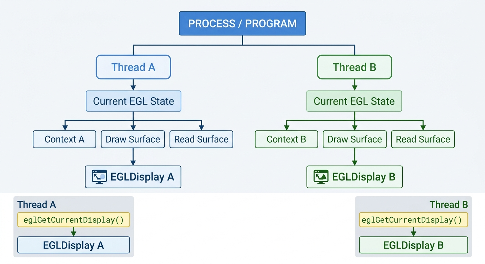
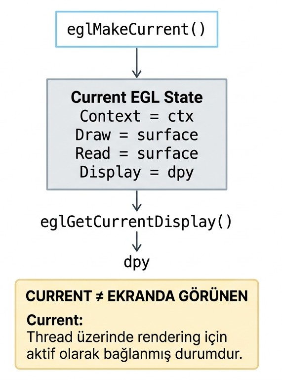

# EGL 1.0: `eglGetCurrentDisplay`

```c
EGLDisplay eglGetCurrentDisplay(void);
```

`eglGetCurrentDisplay`, çağıran thread üzerinde **current durumda olan EGL context ile ilişkili `EGLDisplay` handle'ını** döndürür.

Bu fonksiyon yeni bir display oluşturmaz, display'i initialize etmez ve herhangi bir context'i current hale getirmez. Yalnızca mevcut EGL durumunu sorgular.

Kısa özet:

* Parametre almaz.
* Current context varsa ilişkili `EGLDisplay` döner.
* Current context yoksa `EGL_NO_DISPLAY` döner.
* Display'in yalnızca initialize edilmiş olması yeterli değildir.
* Fonksiyonun davranışı parametreye değil, çağıran thread'in current EGL state'ine bağlıdır.



## Kavramsal Akış

```text
Thread
  |
  +-- current EGLContext
  |
  +-- current draw EGLSurface
  |
  +-- current read EGLSurface
  |
  +-- current EGLDisplay
```

`eglGetCurrentDisplay`, bu thread-local current state içerisindeki display'i sorgular.

Başka bir ifadeyle fonksiyon şu soruya cevap verir:

```text
"Bu fonksiyonu çağıran thread üzerinde
current olan EGLContext hangi EGLDisplay'e bağlı?"
```

## Thread Nedir?

**Thread**, bir program içerisindeki bağımsız yürütme veya çalışma akışıdır.

Bir program çalıştığında işletim sistemi tarafından bir process oluşturulur. Bu process içerisinde bir veya birden fazla thread bulunabilir.

Basit bir programda yalnızca bir ana thread bulunabilir:

```text
Program / Process
      |
      v
 Main Thread
      |
      +-- EGL işlemleri
      +-- OpenGL ES işlemleri
      +-- diğer program kodları
```

Daha büyük bir uygulamada birden fazla thread aynı process içerisinde farklı işler yapabilir:

```text
Program / Process
      |
      +-- Thread 1 → kullanıcı arayüzü
      |
      +-- Thread 2 → rendering
      |
      +-- Thread 3 → dosya veya veri işlemleri
```

Thread'ler aynı programa ait olabilir ancak kendi yürütme akışlarına sahiptir.

EGL açısından önemli olan nokta, **current state'in thread-local olmasıdır**.

Bu, her thread'in kendine ait current EGL state'e sahip olabileceği anlamına gelir.

Örneğin:

```text
Thread 1
  |
  +-- Current Context = Context A
  +-- Current Display = Display A


Thread 2
  |
  +-- Current Context = Context B
  +-- Current Display = Display B
```

Bu durumda:

```c
eglGetCurrentDisplay();
```

Thread 1 üzerinden çağrılırsa `Display A`, Thread 2 üzerinden çağrılırsa `Display B` dönebilir.

Dolayısıyla `eglGetCurrentDisplay`:

```text
"Programın herhangi bir yerinde kullanılan display hangisidir?"
```

sorusunu cevaplamaz.

Bunun yerine:

```text
"Bu çağrıyı yapan thread'in current context'i
hangi EGLDisplay'e bağlıdır?"
```

sorusunu cevaplar.



## Current Context Nedir?

Bir **EGLContext**, OpenGL ES gibi bir rendering API'nin çalışma durumunu temsil eden EGL nesnesidir.

Context içerisinde rendering işlemleriyle ilişkili çeşitli state bilgileri tutulabilir. Örneğin aktif rendering durumu, kullanılan kaynaklarla ilişkiler ve OpenGL ES tarafındaki çalışma bilgileri context ile ilişkilidir.

**Current context**, belirli bir thread üzerinde şu anda rendering işlemleri için aktif olarak bağlanmış olan context'tir.

Buradaki **current** kelimesi:

* ekranda görünen pencere,
* ön plandaki uygulama,
* kullanıcının seçtiği pencere,
* fiziksel monitörde o anda görünen görüntü

anlamına gelmez.

Current olmak, bir context'in belirli bir thread üzerinde rendering işlemleri için **aktif olarak bağlanmış olması** anlamına gelir.

Örneğin:

```c
eglMakeCurrent(dpy, surface, surface, ctx);
```

başarılı olduğunda `ctx`, çağrıyı yapan thread'in current context'i olur.

Kavramsal olarak:

```text
Thread
   |
   v
Current EGLContext
   |
   v
Rendering işlemleri bu context ile yürütülür
```

## Current State Nedir?

**Current state**, thread üzerinde o anda current durumda bulunan EGL nesnelerinin oluşturduğu durumdur.

EGL açısından bu durum kavramsal olarak şunları içerir:

```text
Current EGL State
      |
      +-- current EGLContext
      |
      +-- current draw EGLSurface
      |
      +-- current read EGLSurface
      |
      +-- ilişkili EGLDisplay
```

Current state tek bir handle veya tek bir nesne değildir.

Bir thread üzerinde hangi context'in, hangi surface'lerin ve bunlarla ilişkili hangi display'in aktif durumda olduğunu ifade eden genel durumdur.

Bu state `eglMakeCurrent` çağrısıyla oluşturulur veya değiştirilir.

Örneğin:

```c
eglMakeCurrent(dpy, surface, surface, ctx);
```

sonrasında kavramsal olarak:

```text
Current EGL State

Context      = ctx
Draw Surface = surface
Read Surface = surface
Display      = dpy
```

şeklinde bir durum oluşur.

## Current Context, Current State ve Current Display Farkı

Bu kavramlar birbirine bağlıdır ancak aynı şeyi ifade etmez.

### Current Context

Current context, thread üzerinde rendering için aktif olan `EGLContext` nesnesidir.

```text
Current Context
      |
      v
EGLContext
```

Örneğin:

```text
Context A
```

thread üzerinde current olabilir.

### Current State

Current state, yalnızca context'ten oluşmaz.

Thread üzerinde current olarak bağlı olan:

```text
Context
+
Draw Surface
+
Read Surface
+
ilişkili Display
```

bilgilerinin tamamını ifade eder.

Yani:

```text
Current Context
       ↓
Current State'in bir parçasıdır.
```

### Current Display

Current display ise current context'in ilişkili olduğu `EGLDisplay`'dir.

```text
Current Context
       |
       v
İlişkili EGLDisplay
       |
       v
Current Display
```

Dolayısıyla:

```text
Current State
    |
    +-- Current Context
    |
    +-- Current Draw Surface
    |
    +-- Current Read Surface
    |
    +-- Current Display
```

şeklinde düşünülebilir.

Kısaca:

```text
Current Context
→ aktif EGLContext

Current State
→ thread üzerindeki bütün current EGL ilişkilerinin durumu

Current Display
→ current context'in bağlı olduğu EGLDisplay
```

`eglGetCurrentDisplay` yalnızca bu yapı içerisindeki **current display** bilgisini döndürür.

## Parametreler

Fonksiyon parametre almaz:

```c
eglGetCurrentDisplay(void);
```

Bu nedenle davranışı fonksiyona verilen bir değere göre değişmez.

Görevdeki “parametreleri değiştirerek davranışı gözlemleme” yaklaşımı burada uygulanamaz.

Bunun yerine current EGL state değiştirilerek fonksiyonun davranışı gözlemlenir.

## `eglGetDisplay` ile Farkı

`eglGetDisplay`:

```c
EGLDisplay eglGetDisplay(EGLNativeDisplayType display_id);
```

native display'den bir EGL display handle'ı elde eder.

Kavramsal olarak:

```text
Native display
      |
      v
eglGetDisplay
      |
      v
EGLDisplay
```

`eglGetCurrentDisplay` ise:

```c
EGLDisplay eglGetCurrentDisplay(void);
```

current context'in ilişkili olduğu display'i sorgular.

```text
Current context
      |
      v
eglGetCurrentDisplay
      |
      v
İlişkili EGLDisplay
```

Temel fark:

```text
eglGetDisplay
→ Bir native display'den EGLDisplay elde eder.

eglGetCurrentDisplay
→ Zaten mevcut olan current EGL state içerisindeki
  EGLDisplay'i sorgular.
```

`eglGetCurrentDisplay` yeni bir display oluşturmaz veya elde etmeye çalışmaz. Yalnızca thread'in current state'inde hangi display'in bulunduğunu kontrol eder.

## `eglInitialize` ile Farkı

```text
eglInitialize
    |
    v
Display EGL kullanımı için initialize edilir
```

Ancak initialization işlemi tek başına current state oluşturmaz.

Örneğin:

```text
eglGetDisplay
      |
      v
EGLDisplay elde edildi
      |
      v
eglInitialize
      |
      v
Display initialize edildi
      |
      v
Current Context YOK
      |
      v
eglGetCurrentDisplay
      |
      v
EGL_NO_DISPLAY
```

Dolayısıyla bir display'in mevcut ve initialize edilmiş olması, onun current display olduğu anlamına gelmez.

Current display olabilmesi için o display ile ilişkili bir context'in thread üzerinde current hale getirilmiş olması gerekir.

## `eglMakeCurrent` ile İlişki

`eglMakeCurrent`, thread'in current EGL state'ini oluşturur veya değiştirir.

Örnek:

```c
eglMakeCurrent(dpy, surface, surface, ctx);
```

Bu çağrının başarılı olması durumunda:

```text
Thread
  |
  +-- Current Context = ctx
  |
  +-- Current Draw Surface = surface
  |
  +-- Current Read Surface = surface
  |
  +-- Current Display = dpy
```

durumu oluşur.

Daha sonra:

```c
EGLDisplay current = eglGetCurrentDisplay();
```

çağrısı yapıldığında:

```text
current == dpy
```

olur.

Yani `eglMakeCurrent` state'i **değiştirir veya oluşturur**, `eglGetCurrentDisplay` ise bu state'i **sorgular**.

Bu fark önemlidir:

```text
eglMakeCurrent
→ current state üzerinde değişiklik yapar

eglGetCurrentDisplay
→ current state'i değiştirmez,
  yalnızca display bilgisini okur
```

Current state aşağıdaki çağrı ile serbest bırakılabilir:

```c
eglMakeCurrent(
    dpy,
    EGL_NO_SURFACE,
    EGL_NO_SURFACE,
    EGL_NO_CONTEXT
);
```

Bu işlemden sonra thread üzerinde current context kalmaz.

Dolayısıyla:

```c
eglGetCurrentDisplay();
```

tekrar:

```text
EGL_NO_DISPLAY
```

döndürür.

`eglMakeCurrent` ayrıntıları için ilgili bölüme bakınız.

## `EGL_NO_DISPLAY` Her Zaman Hata Değildir

`eglGetCurrentDisplay()` için:

```c
EGL_NO_DISPLAY
```

sonucu current context bulunmadığında normal bir state sonucu olabilir.

Örneğin program henüz yeni başlamış olsun:

```text
Program başladı
      |
      v
EGLDisplay henüz current değil
      |
      v
Current context yok
      |
      v
eglGetCurrentDisplay()
      |
      v
EGL_NO_DISPLAY
```

Bu durum tek başına EGL API hatası oluştuğu anlamına gelmez.

Aynı şekilde yalnızca:

```c
eglGetDisplay(...)
```

ve:

```c
eglInitialize(...)
```

çağrılarının yapılmış olması da current state oluşturmaz.

## Thread-Local Durum

Current EGL state **thread-local**'dır.

Örneğin aynı uygulamada:

```text
Thread A
   |
   +-- Context A
   +-- Display A


Thread B
   |
   +-- Context B
   +-- Display B
```

olabilir.

Bu nedenle aynı anda:

```text
Thread A:
eglGetCurrentDisplay() → Display A

Thread B:
eglGetCurrentDisplay() → Display B
```

sonucu alınabilir.

Başka bir thread üzerinde current context bulunmuyorsa:

```text
Thread C:
eglGetCurrentDisplay() → EGL_NO_DISPLAY
```

olabilir.

Dolayısıyla `eglGetCurrentDisplay`, programın global EGL durumunu sorgulayan bir fonksiyon değildir.

Fonksiyon yalnızca kendisini çağıran thread'in current EGL state'ini değerlendirir.

## Temel Kullanım

```c
EGLDisplay current = eglGetCurrentDisplay();

if (current == EGL_NO_DISPLAY) {
    printf("Current EGL display yok.\n");
} else {
    printf("Current EGLDisplay: %p\n", (void *)current);
}
```

Bu fonksiyon özellikle mevcut EGL durumunu kontrol etmek için kullanılabilir.

Örneğin bir fonksiyon kendisine `EGLDisplay` parametresi verilmeden, thread üzerinde hangi display'in current olduğunu öğrenebilir:

```c
void check_current_display(void)
{
    EGLDisplay current = eglGetCurrentDisplay();

    if (current == EGL_NO_DISPLAY) {
        printf("Bu thread üzerinde current EGL display yok.\n");
        return;
    }

    printf("Current EGLDisplay: %p\n", (void *)current);
}
```

Ayrıca mevcut state'in beklenen display ile ilişkili olup olmadığını kontrol etmek için de kullanılabilir:

```c
if (eglGetCurrentDisplay() == expected_display) {
    printf("Beklenen display current durumda.\n");
}
```

Bu nedenle `eglGetCurrentDisplay`, yeni bir EGL nesnesi oluşturan fonksiyondan çok mevcut EGL durumunu **sorgulayan ve doğrulayan yardımcı bir fonksiyon** olarak düşünülebilir.

## Bölüm Özeti

* `eglGetCurrentDisplay` parametre almaz.
* Dönüş tipi `EGLDisplay`'dir.
* Fonksiyonu çağıran thread'in current context'i varsa onun bağlı olduğu display'i döndürür.
* Current context yoksa `EGL_NO_DISPLAY` döndürür.
* Thread, program içerisindeki bağımsız yürütme akışıdır.
* Bir program bir veya birden fazla thread içerebilir.
* EGL current state thread-local'dır; farklı thread'lerin farklı current context ve display'leri olabilir.
* Current context, thread üzerinde rendering için aktif olan `EGLContext`'tir.
* Current state, current context, draw surface, read surface ve ilişkili display durumunun tamamını ifade eder.
* Current display, current context'in bağlı olduğu `EGLDisplay`'dir.
* “Current” kavramı ekranda görünen pencere veya fiziksel monitörde gösterilen görüntü anlamına gelmez.
* Display'in yalnızca oluşturulmuş veya initialize edilmiş olması yeterli değildir.
* Current state `eglMakeCurrent` ile oluşturulur veya değiştirilir.
* `eglMakeCurrent` current state'i değiştirirken `eglGetCurrentDisplay` yalnızca mevcut state'i sorgular.
* Current context release edildiğinde `eglGetCurrentDisplay` tekrar `EGL_NO_DISPLAY` döndürür.
* `EGL_NO_DISPLAY`, bu fonksiyonda normal bir state sonucu olabilir ve her zaman EGL API hatası anlamına gelmez.
* `eglGetCurrentDisplay` yeni bir display oluşturmaz; mevcut thread-local EGL durumundaki display'i sorgular.
