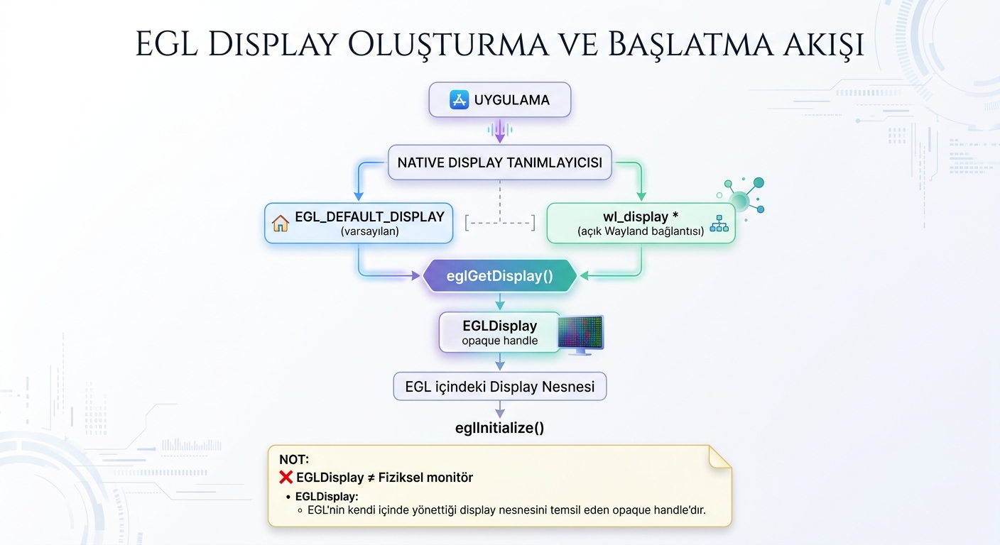

# EGL 1.0: `eglGetDisplay`

```c
EGLDisplay eglGetDisplay(EGLNativeDisplayType display_id);
```

`eglGetDisplay`, native görüntüleme sistemine ait bir display tanımlayıcısını EGL tarafından kullanılabilecek bir `EGLDisplay` handle'ı ile ilişkilendirmek için kullanılır.

Başarılı olduğunda fonksiyon, EGL'nin kendi içinde yönettiği bir display nesnesini temsil eden `EGLDisplay` değerini döndürür.

Kısa özet:

* Girdi: `EGLNativeDisplayType`
* Çıktı: `EGLDisplay`
* Başarısızlık değeri: `EGL_NO_DISPLAY`
* `EGL_DEFAULT_DISPLAY`, varsayılan native display'i istemek için kullanılır.
* `EGLDisplay`, fiziksel monitörün kendisi değil, EGL'nin kullandığı opaque handle'dır.
* `eglGetDisplay` display'i initialize etmez; bunun için `eglInitialize` gerekir.

## Kavramsal Akış

```text
Native display
    |
    v
eglGetDisplay
    |
    v
EGLDisplay handle
    |
    v
eglInitialize
```

`eglGetDisplay`, native platform ile EGL arasındaki ilk bağlantı noktalarından biridir.

Buradaki **native** ifadesi, EGL'nin dışında bulunan ve işletim sistemi veya pencereleme sistemi tarafından sağlanan platforma özgü yapıları ifade eder. Örneğin Linux üzerinde Wayland ve X11 farklı native görüntüleme sistemleridir.

Native görüntüleme sistemi, uygulamaların işletim sisteminin pencereleme ve görüntüleme altyapısıyla iletişim kurmasını sağlar. Bu nedenle EGL'deki display kavramı doğrudan fiziksel monitör anlamına gelmez.



## Parametreler

### `display_id`

`display_id`, hangi native display'in EGL tarafında temsil edileceğini belirtir.

Bu nedenle `display_id` bir **display tanımlayıcısı** olarak düşünülebilir. Başka bir ifadeyle EGL'ye hangi native görüntüleme ortamı veya display bağlantısı ile çalışılacağını bildirir.

Bu bölümde kullanılan kavramlar kısaca şu şekilde ayrılabilir:

* **Display:** Bir görüntüleme ortamını temsil eden genel kavramdır. Doğrudan fiziksel monitör anlamına gelmez.
* **Display tanımlayıcısı:** Hangi native display'in kullanılacağını EGL'ye bildiren değerdir. `display_id` bu görevi görür.
* **Display bağlantısı:** Uygulamanın native görüntüleme sistemiyle kurduğu bağlantıdır. Wayland'daki `wl_display *` buna örnektir.
* **Display nesnesi:** EGL veya başka bir API'nin belirli bir görüntüleme ortamını kendi içinde temsil etmek ve onunla ilgili durumu yönetmek için kullandığı yazılımsal nesnedir.
* **Native:** EGL'nin kendisine ait olmayan, işletim sistemi veya pencereleme sistemi tarafından sağlanan platforma özgü yapıları ifade eder.
* **Native display sistemi:** Wayland veya X11 gibi platformun görüntüleme ve pencereleme altyapısıdır.
* **Native görüntüleme ortamı:** Uygulamanın içerisinde çalıştığı native görüntüleme sistemini ve bu sistemle olan ilişkisini genel olarak ifade eder.

`EGLNativeDisplayType` platforma bağımlıdır. Ubuntu header dosyalarında farklı platformlar için örneğin şu tanımlar bulunur:

```c
typedef struct wl_display *EGLNativeDisplayType;
typedef Display *EGLNativeDisplayType;
typedef void *EGLNativeDisplayType;
typedef int EGLNativeDisplayType;
```

Aynı anda bunların hepsi aktif değildir; platform header'ları uygun tanımı seçer.

`EGL_DEFAULT_DISPLAY` yaygın EGL başlıklarında şu şekilde tanımlanır:

```c
#define EGL_DEFAULT_DISPLAY EGL_CAST(EGLNativeDisplayType,0)
```

`EGL_DEFAULT_DISPLAY`, uygulamanın belirli bir native display bağlantısını açıkça vermediği durumda kullanılır. Bu değer ile EGL'den platform için varsayılan native display'in kullanılması istenir.

Buradaki “default display” ifadesi doğrudan “varsayılan fiziksel monitör” şeklinde yorumlanmamalıdır. EGL açısından varsayılan native görüntüleme ortamının kullanılmasını ifade eder.

| `display_id` değeri           | Anlamı                                                                  |
| -------------------------------- | ------------------------------------------------------------------------ |
| `EGL_DEFAULT_DISPLAY`          | Varsayılan native display için bir`EGLDisplay` istenir.              |
| Geçerli Wayland`wl_display *` | Belirtilen native Wayland bağlantısı için bir`EGLDisplay` istenir. |

## `EGLDisplay` Nedir?

`EGLDisplay`, EGL'nin kendi içinde yönettiği bir display nesnesini temsil eden **opaque handle**'dır.

Bir **handle**, bir API içerisindeki nesneyi temsil eden bir tanımlayıcı veya referans olarak düşünülebilir. Uygulama gerçek EGL display nesnesine doğrudan erişmez. Bunun yerine `eglGetDisplay`, EGL'nin kendi içinde tuttuğu display nesnesine daha sonraki EGL çağrılarında erişilebilmesini sağlayan bir `EGLDisplay` değeri döndürür.

Örneğin:

```text
0x629b25a1cdf0
```

gibi bir değer gözlemlenebilir.

Bu değer:

* çözünürlük değildir,
* ekran numarası değildir,
* GPU numarası değildir,
* EGL sürümü değildir,
* fiziksel monitörün kendisi veya adresi değildir.

Örneğin:

```c
EGLDisplay dpy = eglGetDisplay(EGL_DEFAULT_DISPLAY);
```

satırındaki `dpy`, ekrandaki görüntüyü veya fiziksel monitörü temsil etmez. EGL'nin kendi içinde tuttuğu display ile ilgili durumu temsil eden bir handle'dır.

Uygulama EGL'nin içindeki gerçek display nesnesine doğrudan erişemez. Handle'ın arkasındaki veri yapısının nasıl oluşturulduğu, hangi bilgileri tuttuğu veya EGL implementation'ının bu nesneyi nasıl yönettiği uygulamadan gizlidir.

Bu nedenle `EGLDisplay` bir **opaque handle** olarak tanımlanır. “Opaque”, handle'ın arkasındaki gerçek yapının uygulama tarafından görülmediği ve yorumlanmadığı anlamına gelir.

Uygulama handle'ı yalnızca daha sonraki EGL fonksiyonlarına geri verir:

```c
eglInitialize(dpy, &major, &minor);
```

Bu çağrıda EGL, `dpy` handle'ının kendi içinde hangi display nesnesini temsil ettiğini bilir ve işlemi ilgili display üzerinde gerçekleştirir.

Opaque handle kullanımı EGL'nin kendi iç yapısını uygulamadan gizlemesine, implementation detaylarını gerektiğinde değiştirebilmesine ve farklı native platformların aynı EGL API'si üzerinden kullanılabilmesine olanak sağlar.

`eglInitialize` ayrıntıları için ilgili bölüme bakınız.

## `EGL_DEFAULT_DISPLAY`

En temel kullanım:

```c
EGLDisplay dpy = eglGetDisplay(EGL_DEFAULT_DISPLAY);

if (dpy == EGL_NO_DISPLAY) {
    /* Display elde edilemedi. */
}
```

Bu kullanımda native display bağlantısını uygulamanın kendisinin açması gerekmez. Uygulama EGL'ye belirli bir native display bağlantısı vermek yerine, platformun varsayılan native display'inin kullanılmasını ister.

Kavramsal olarak:

```text
eglGetDisplay(EGL_DEFAULT_DISPLAY)

        |
        v

Platform için varsayılan
native display kullanılır

        |
        v

EGLDisplay
```

şeklinde düşünülebilir.

## Açık Wayland Display Bağlantısı

Wayland kullanıldığında açık bir native display bağlantısı şu şekilde oluşturulabilir:

```c
struct wl_display *wayland_display = wl_display_connect(NULL);

EGLDisplay dpy =
    eglGetDisplay((EGLNativeDisplayType)wayland_display);
```

`wl_display_connect` bir EGL fonksiyonu değildir; Wayland API'sine aittir.

`wl_display *`, fiziksel monitörü değil, uygulamanın Wayland görüntüleme sistemiyle kurduğu bağlantıyı temsil eder.

`EGL_DEFAULT_DISPLAY` ile açık Wayland bağlantısı arasındaki temel fark, native display'in nasıl belirtildiğidir:

```text
EGL_DEFAULT_DISPLAY
    |
    +-- Native display seçimi EGL/platforma bırakılır.

Açık Wayland bağlantısı
    |
    +-- Uygulama belirli bir wl_display * bağlantısını EGL'ye verir.
```

Her iki durumda da `eglGetDisplay` sonucunda bir `EGLDisplay` handle'ı elde edilir. Fark, bu handle'ın ilişkilendirileceği native display'in uygulama tarafından açıkça verilip verilmemesidir.

## `eglGetDisplay` ve `eglInitialize` İlişkisi

```text
eglGetDisplay
    |
    v
EGLDisplay handle elde edilir
    |
    v
eglInitialize
    |
    v
Display EGL kullanımı için initialize edilir
```

`eglGetDisplay` başarılı olsa bile display henüz initialize edilmiş sayılmaz.

`eglGetDisplay`, native display ile ilişkili EGL display nesnesini temsil eden handle'ın elde edilmesini sağlar. Display'in EGL işlemleri için hazırlanması ise daha sonra `eglInitialize` ile gerçekleştirilir.

## Temel Kullanım

```c
EGLDisplay dpy = eglGetDisplay(EGL_DEFAULT_DISPLAY);

if (dpy == EGL_NO_DISPLAY) {
    EGLint err = eglGetError();
}
```

## Bölüm Özeti

* `eglGetDisplay` bir native display'den `EGLDisplay` handle'ı elde eder.
* Tek parametresi `display_id`'dir.
* `display_id`, hangi native display'in kullanılacağını belirten tanımlayıcıdır.
* `display_id`, `EGLNativeDisplayType` türündedir ve platforma bağımlıdır.
* Native display doğrudan fiziksel monitör anlamına gelmez.
* `EGL_DEFAULT_DISPLAY`, varsayılan native display'in kullanılmasını istemek için kullanılır.
* Geçerli explicit native display değerleri de verilebilir.
* Wayland'da `wl_display *`, uygulamanın native Wayland görüntüleme sistemiyle kurduğu bağlantıyı temsil eder.
* `EGLDisplay`, EGL'nin kendi display nesnesini temsil eden opaque handle'dır.
* Handle, API içerisindeki bir nesneyi temsil eden tanımlayıcı veya referanstır.
* Uygulama EGL'nin gerçek display nesnesine ve iç yapısına doğrudan erişmez.
* `EGLDisplay` fiziksel monitör, ekran numarası veya GPU numarası değildir.
* Handle'ın sayısal değeri uygulama tarafından yorumlanmamalıdır.
* `EGL_DEFAULT_DISPLAY` kullanımında native display seçimi EGL/platforma bırakılır; açık Wayland kullanımında belirli bir `wl_display *` uygulama tarafından verilir.
* Başarısızlıkta `EGL_NO_DISPLAY` döner.
* `eglGetDisplay` display'i initialize etmez; sonraki adım tipik olarak `eglInitialize`'dır.
