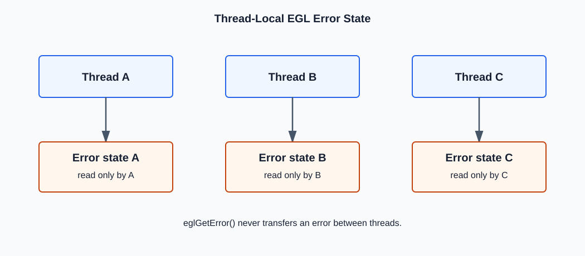
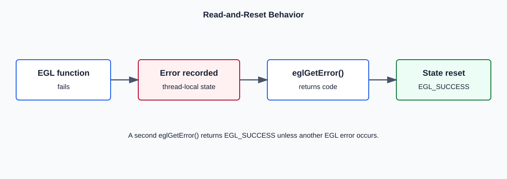
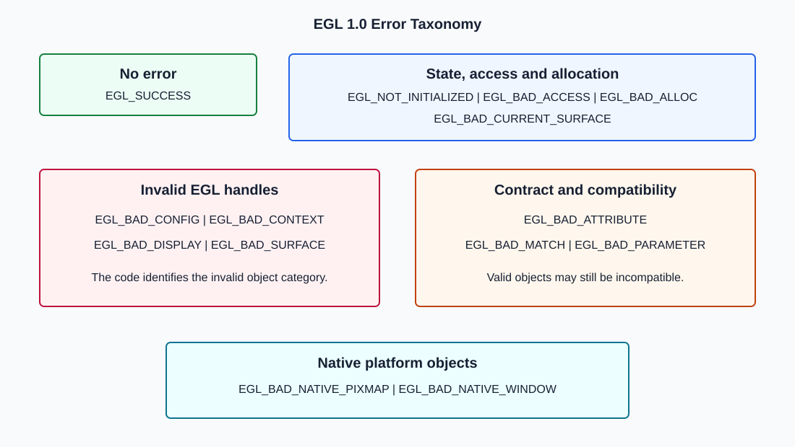

# EGL 1.0: `eglGetError`

```c
EGLint eglGetError(void);
```

`eglGetError`, calling thread için kaydedilmiş EGL hata durumunu döndürür.
Parametre almaz. Dönen değer ya `EGL_SUCCESS` ya da EGL tarafından tanımlanan
bir hata kodudur.

Fonksiyon bir hata oluşturmaz ve başarısız işlemi düzeltmez. Daha önceki EGL
çağrılarının calling thread üzerinde bıraktığı error state'i okur.



## Error State Modeli

EGL error state thread'e özeldir:

```text
Thread A -> EGL error state A
Thread B -> EGL error state B
Thread C -> EGL error state C
```

Thread A'da oluşan hata Thread B'nin `eglGetError()` çağrısıyla okunmaz.
Her thread kendi EGL çağrılarının hata durumunu kendi içinde okumalıdır.

Bir EGL fonksiyonu hata oluşturduğunda error state hata koduna ayarlanır.
`eglGetError()` bu kodu döndürdükten sonra state `EGL_SUCCESS` değerine
resetlenir.

```c
EGLBoolean result = eglDestroySurface(dpy, invalid_surface);

if (result == EGL_FALSE) {
    EGLint first = eglGetError();
    EGLint second = eglGetError();
}
```

```text
first  -> ilgili hata kodu
second -> arada yeni hata yoksa EGL_SUCCESS
```



## Doğru Kullanım Sırası

EGL fonksiyonları genellikle başarı/başarısızlığı kendi dönüş değerleriyle
bildirir. `eglGetError` yalnızca başarısız sonucunun nedenini okumak için
kullanılmalıdır.

```c
EGLSurface surface = eglCreateWindowSurface(
    dpy,
    config,
    native_window,
    NULL
);

if (surface == EGL_NO_SURFACE) {
    EGLint error = eglGetError();
    /* Decode and handle error here. */
}
```

Hata oluşturan çağrı ile `eglGetError` arasına başka EGL çağrıları
yerleştirilmemelidir. Aradaki çağrı yeni bir error state oluşturabilir ve
hangi işlemin hangi hataya ait olduğunu belirsizleştirir.

```c
/* Fragile ordering */
EGLBoolean result = eglMakeCurrent(dpy, draw, read, context);
eglSwapInterval(dpy, 1);
EGLint error = eglGetError();
```

Bu kodda okunan hata `eglMakeCurrent` veya `eglSwapInterval` ile ilişkili
olabilir. Her başarısız sonuç hemen işlenmelidir.

## EGL 1.0 Hata Kodları

EGL 1.0'da `EGL_SUCCESS` dahil 14 temel sonuç vardır.

| Kod | Hex | Anlam |
| --- | ---: | --- |
| `EGL_SUCCESS` | `0x3000` | Kayıtlı hata yoktur. |
| `EGL_NOT_INITIALIZED` | `0x3001` | EGL ilgili display için initialize edilmemiş veya initialize edilememiştir. |
| `EGL_BAD_ACCESS` | `0x3002` | EGL istenen kaynağa erişememiş veya erişim kuralı ihlal edilmiştir. |
| `EGL_BAD_ALLOC` | `0x3003` | İşlem için gerekli kaynak ayrılamamıştır. |
| `EGL_BAD_ATTRIBUTE` | `0x3004` | Attribute listesinde tanınmayan attribute/değer vardır. |
| `EGL_BAD_CONFIG` | `0x3005` | Bir `EGLConfig` argümanı geçerli config değildir. |
| `EGL_BAD_CONTEXT` | `0x3006` | Bir `EGLContext` argümanı geçerli context değildir. |
| `EGL_BAD_CURRENT_SURFACE` | `0x3007` | Calling thread'in current surface'i artık geçerli değildir. |
| `EGL_BAD_DISPLAY` | `0x3008` | Bir `EGLDisplay` argümanı geçerli display değildir. |
| `EGL_BAD_MATCH` | `0x3009` | Argümanlar tek tek geçerli olsa da birbirleriyle uyumsuzdur. |
| `EGL_BAD_NATIVE_PIXMAP` | `0x300A` | Native pixmap geçerli değildir ve durum algılanabilmiştir. |
| `EGL_BAD_NATIVE_WINDOW` | `0x300B` | Native window geçerli değildir ve durum algılanabilmiştir. |
| `EGL_BAD_PARAMETER` | `0x300C` | Bir veya daha fazla parametre değeri geçersizdir. |
| `EGL_BAD_SURFACE` | `0x300D` | Bir `EGLSurface` argümanı geçerli surface değildir. |



## Hata Kodlarını Yorumlama

### `EGL_SUCCESS`

Kayıtlı hata olmadığını bildirir. Önceki bir EGL fonksiyonunun başarılı
olduğunu kanıtlamak için tek başına kullanılmamalıdır; önce o fonksiyonun
kendi dönüş değeri kontrol edilmelidir.

### `EGL_NOT_INITIALIZED`

EGL'nin belirtilen display için kullanıma hazır olmadığını gösterir.
Display handle'ı geçerli olabilir; sorun initialization state'idir.

```text
valid display handle != initialized display
```

### `EGL_BAD_ACCESS`

Kaynak geçerli olsa bile erişim kuralları nedeniyle kullanılamadığını
gösterir. Başka bir thread'de current olan context'i aynı anda kullanmaya
çalışmak tipik örnektir. Bu hata geçersiz handle hatası değildir.

### `EGL_BAD_ALLOC`

Display, config ve diğer argümanlar geçerli olsa bile driver veya platform
gerekli kaynakları ayıramamıştır. GPU belleği, native pencere ilişkisi veya
implementation içi nesne allocation'ları buna neden olabilir.

### `EGL_BAD_ATTRIBUTE`

Attribute listesinde ilgili fonksiyonun tanımadığı bir isim/değer vardır.
Bir token'ın EGL header'larında tanımlı olması, her fonksiyonun attribute
listesinde geçerli olduğu anlamına gelmez.

### `EGL_BAD_CONFIG`, `EGL_BAD_CONTEXT`, `EGL_BAD_DISPLAY`, `EGL_BAD_SURFACE`

Bu kodlar opaque EGL handle kategorisini kesin olarak belirtir:

| Kod | Kontrol edilmesi gereken nesne |
| --- | --- |
| `EGL_BAD_CONFIG` | Config hangi display'den alındı, hala geçerli mi? |
| `EGL_BAD_CONTEXT` | Context oluşturuldu mu, destroy edilmiş mi? |
| `EGL_BAD_DISPLAY` | Display handle geçerli mi? |
| `EGL_BAD_SURFACE` | Surface oluşturuldu mu, destroy edilmiş mi? |

`EGL_NOT_INITIALIZED` ile `EGL_BAD_DISPLAY` aynı değildir: ilki geçerli bir
display'in state sorununu, ikincisi display handle sorununu ifade eder.

### `EGL_BAD_CURRENT_SURFACE`

Calling thread'e current olarak bağlanmış draw/read surface'in native veya
EGL tarafında artık geçerli olmadığını ifade eder. Bu kod, fonksiyona doğrudan
verilen rastgele bir surface argümanı için kullanılan `EGL_BAD_SURFACE` ile
karıştırılmamalıdır.

### `EGL_BAD_MATCH`

Argümanların her biri kendi başına geçerli olabilir; fakat birlikte geçerli
bir işlem oluşturmazlar.

```text
valid context + valid surface + incompatible configs -> EGL_BAD_MATCH
window config without EGL_WINDOW_BIT                  -> EGL_BAD_MATCH
```

### `EGL_BAD_PARAMETER`

Opaque nesne handle'larından bağımsız genel değer/pointer kısıtı ihlalini
ifade eder. Zorunlu output pointer'ının `NULL` olması veya enum aralığı
dışındaki bir değer buna örnek olabilir.

### `EGL_BAD_NATIVE_PIXMAP` ve `EGL_BAD_NATIVE_WINDOW`

Bu hatalar EGL handle'ı değil platform nesnesini hedefler. EGL 1.0,
implementation'ların geçersiz native handle'ları her durumda algılayabilmesini
garanti etmez.

## Return Değeri ile Hata Kodunu Birlikte Kullanma

| Fonksiyon tipi | Başarısız return örneği | Sonraki adım |
| --- | --- | --- |
| `EGLBoolean` döndüren | `EGL_FALSE` | Hemen `eglGetError()`. |
| `EGLSurface` döndüren | `EGL_NO_SURFACE` | Hemen `eglGetError()`. |
| `EGLContext` döndüren | `EGL_NO_CONTEXT` | Hemen `eglGetError()`. |
| `EGLDisplay` döndüren | `EGL_NO_DISPLAY` | Fonksiyon sözleşmesine göre değerlendir; gerekirse `eglGetError()`. |

Getter fonksiyonlarında sentinel değer her zaman hata anlamına gelmeyebilir.
Örneğin current context yokken `eglGetCurrentContext()` normal olarak
`EGL_NO_CONTEXT` döndürebilir. Her fonksiyonun kendi sözleşmesi dikkate
alınmalıdır.

## Hata Adını Yazdırma

```c
static const char *egl_error_name(EGLint error)
{
    switch (error) {
    case EGL_SUCCESS:             return "EGL_SUCCESS";
    case EGL_NOT_INITIALIZED:     return "EGL_NOT_INITIALIZED";
    case EGL_BAD_ACCESS:          return "EGL_BAD_ACCESS";
    case EGL_BAD_ALLOC:           return "EGL_BAD_ALLOC";
    case EGL_BAD_ATTRIBUTE:       return "EGL_BAD_ATTRIBUTE";
    case EGL_BAD_CONFIG:          return "EGL_BAD_CONFIG";
    case EGL_BAD_CONTEXT:         return "EGL_BAD_CONTEXT";
    case EGL_BAD_CURRENT_SURFACE: return "EGL_BAD_CURRENT_SURFACE";
    case EGL_BAD_DISPLAY:         return "EGL_BAD_DISPLAY";
    case EGL_BAD_MATCH:           return "EGL_BAD_MATCH";
    case EGL_BAD_NATIVE_PIXMAP:   return "EGL_BAD_NATIVE_PIXMAP";
    case EGL_BAD_NATIVE_WINDOW:   return "EGL_BAD_NATIVE_WINDOW";
    case EGL_BAD_PARAMETER:       return "EGL_BAD_PARAMETER";
    case EGL_BAD_SURFACE:         return "EGL_BAD_SURFACE";
    default:                      return "UNKNOWN_EGL_ERROR";
    }
}
```

```c
if (eglMakeCurrent(dpy, draw, read, context) == EGL_FALSE) {
    EGLint error = eglGetError();
    fprintf(stderr, "eglMakeCurrent failed: %s (0x%04x)\n",
            egl_error_name(error), error);
}
```

## Sık Hatalar

- Her EGL çağrısından sonra koşulsuz `eglGetError` çağırmak.
- Başarısız return değerini kontrol etmeden yalnızca error state'e bakmak.
- Hata oluşturan çağrı ile `eglGetError` arasına başka EGL çağrısı koymak.
- Aynı hatayı iki kez okuyabileceğini varsaymak.
- Bir thread'in hatasını başka thread'den okumaya çalışmak.
- `EGL_BAD_MATCH` ile geçersiz handle hatalarını aynı kabul etmek.

## Bölüm Özeti

- `eglGetError` calling thread'in EGL error state'ini okur.
- Okuma sonrası state `EGL_SUCCESS` değerine resetlenir.
- Önce EGL fonksiyonunun kendi return değeri kontrol edilmelidir.
- Hata, başarısız çağrıdan hemen sonra okunmalıdır.
- Handle, state, allocation, compatibility ve native platform hataları ayrı anlam taşır.

## Kaynak

- EGL 1.0 Specification, Section 3.1, Errors.
