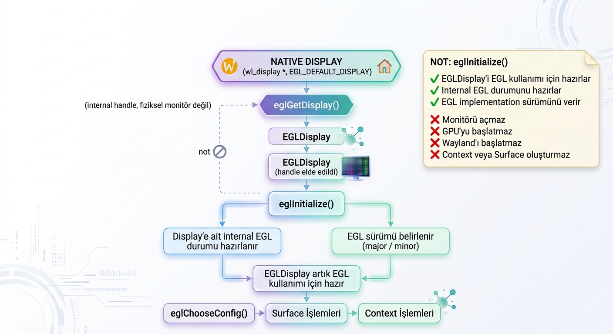
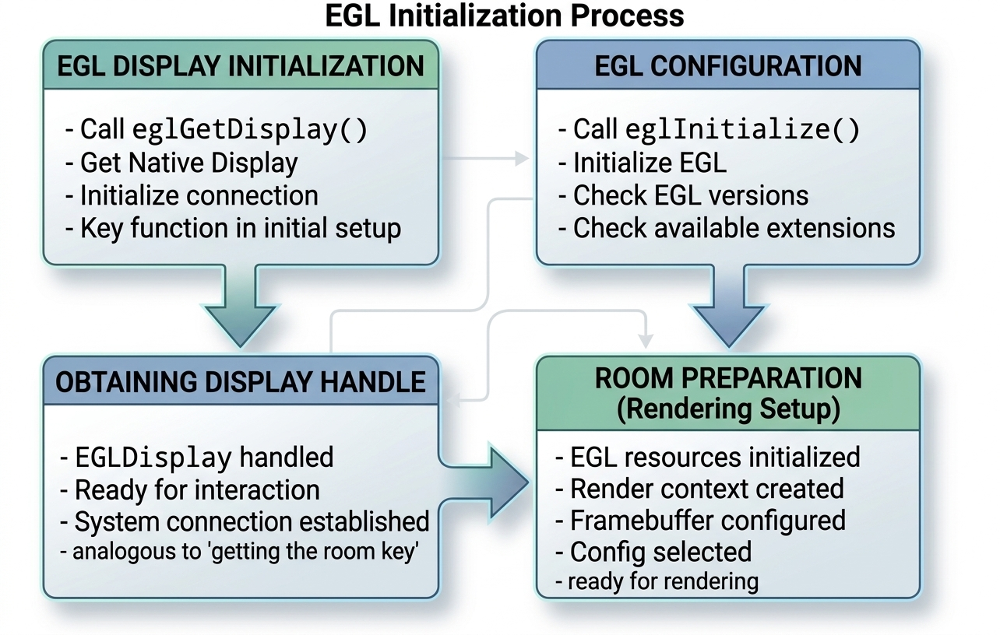

# EGL 1.0: `eglInitialize`

```c
EGLBoolean eglInitialize(EGLDisplay dpy,
                         EGLint *major,
                         EGLint *minor);
```

`eglInitialize`, daha önce `eglGetDisplay` ile elde edilmiş geçerli bir `EGLDisplay`'i EGL kullanımı için **initialize eder**, yani kullanılabilir duruma getirir. İstenirse EGL implementation sürümünü `major` ve `minor` output parametreleri üzerinden döndürür.

Buradaki **initialize etmek**, fiziksel ekranı, GPU'yu, Wayland'ı veya işletim sistemini başlatmak anlamına gelmez. Daha doğru anlamıyla, ilgili `EGLDisplay` için EGL tarafındaki gerekli çalışma durumunun hazırlanması ve display'in sonraki EGL işlemlerinde kullanılabilir hale getirilmesidir.

Kısa özet:

* `dpy`: initialize edilecek EGL display.
* `major`: major EGL sürümünün yazılacağı output pointer.
* `minor`: minor EGL sürümünün yazılacağı output pointer.
* Başarılı çağrı: `EGL_TRUE`
* Başarısız çağrı: `EGL_FALSE`
* Geçersiz display için hata kodu: `EGL_BAD_DISPLAY`



## Kavramsal Akış

```text
Native display
    |
    v
eglGetDisplay
    |
    v
EGLDisplay
    |
    v
eglInitialize
    |
    +-- EGL display kullanıma hazırlanır
    |
    +-- Gerekli internal EGL durumu oluşturulur/hazırlanır
    |
    +-- major/minor istenirse sürüm bilgisi alınır
```

`eglGetDisplay`, bir native display ile ilişkili `EGLDisplay` handle'ını elde eder. Ancak bu handle'ın elde edilmiş olması, display'in EGL işlemleri için tamamen hazır olduğu anlamına gelmez.

`eglInitialize`, bu display'i EGL tarafında kullanılabilir duruma getirir.

Bu işlem sırasında EGL implementation'ı, kendi iç yapısında ilgili display için gerekli olan **internal state**'i hazırlar. Bu internal durum uygulamaya doğrudan gösterilmez ve implementation detayına bağlıdır.

Kavramsal olarak initialization sırasında EGL implementation'ı örneğin:

* platform ve driver tarafıyla ilgili EGL durumunu kurabilir,
* bu display üzerinde kullanılabilecek EGL özelliklerini hazırlayabilir,
* display'e ait gerekli internal kaynakları ve bilgileri düzenleyebilir,
* kullanılacak EGL implementation sürümünü belirleyebilir.

Bu işlemlerin tam olarak nasıl gerçekleştirildiği EGL implementation'ına bağlıdır. Uygulama bu iç işlemleri doğrudan görmez; yalnızca `eglInitialize` çağrısının başarılı veya başarısız olduğunu gözlemler.

Initialization işlemini kavramsal olarak bir otel örneğiyle düşünmek mümkündür:

```text
eglGetDisplay
→ Otelin belirli bir odasına ait anahtarı almak

eglInitialize
→ Anahtarın temsil ettiği odanın kullanım için hazırlanması
```

Bu benzetmede `EGLDisplay` anahtar gibi düşünülebilir. Anahtarın elde edilmiş olması odanın kullanıma hazır olduğu anlamına gelmez. `eglInitialize`, ilgili display'in EGL işlemleri için hazırlanmasına karşılık gelir.

Bu yalnızca kavramsal bir benzetmedir; EGL içinde gerçek anlamda bir “oda” veya “anahtar” yapısı bulunmaz.



## Parametreler

### `dpy`

`dpy`, initialize edilecek geçerli bir `EGLDisplay` olmalıdır.

| `dpy`                                       | Sonuç                                                           |
| --------------------------------------------- | ---------------------------------------------------------------- |
| Geçerli, initialize edilmemiş`EGLDisplay` | Initialization işlemi yapılabilir.                             |
| `EGL_NO_DISPLAY`                            | `EGL_FALSE` döner ve `EGL_BAD_DISPLAY` hata durumu oluşur. |

Normal akış:

```c
EGLDisplay dpy = eglGetDisplay(EGL_DEFAULT_DISPLAY);
eglInitialize(dpy, &major, &minor);
```

Burada iki işlem birbirinden ayrıdır:

```text
eglGetDisplay
    |
    v
EGLDisplay handle elde edilir
    |
    v
eglInitialize
    |
    v
EGLDisplay, EGL işlemleri için kullanılabilir hale gelir
```

Başka bir ifadeyle:

* `eglGetDisplay`, EGL display handle'ını elde eder.
* `eglInitialize`, bu handle'ın temsil ettiği display için EGL tarafındaki çalışma durumunu hazırlar.

`eglGetDisplay` için ilgili bölüme bakınız.

### `major`

`major`, major EGL sürüm numarasının yazılabileceği `EGLint *` output parametresidir.

```c
EGLint major = -1;
eglInitialize(dpy, &major, &minor);
```

Başlangıç değeri verilmesi, fonksiyonun output parametresini güncelleyip güncellemediğinin izlenmesini kolaylaştırır.

### `minor`

`minor`, minor EGL sürüm numarasının yazılabileceği `EGLint *` output parametresidir.

```c
EGLint minor = -1;
eglInitialize(dpy, &major, &minor);
```

`major` ve `minor`, EGL implementation'ının sunduğu EGL sürümünü ifade eder.

Örneğin:

```text
major = 1
minor = 5
```

sonucu:

```text
EGL 1.5
```

anlamına gelir.

Bu değer:

* işletim sistemi sürümü değildir,
* Wayland sürümü değildir,
* GPU sürümü değildir,
* OpenGL ES sürümü değildir.

Burada belirtilen sürüm, kullanılan EGL implementation'ının sunduğu EGL sürümüdür.

Initialization işleminin temel amacı yalnızca sürüm bilgisini öğrenmek değildir. Sürüm bilgisi, initialization sırasında istenirse uygulamaya verilen ek bir output'tur.

## `NULL` Kullanımı

Sürüm numarası bilgisine ihtiyaç duyulmuyorsa output pointer'ları `NULL` olarak verilebilir:

```c
eglInitialize(dpy, &major, &minor);
eglInitialize(dpy, NULL, &minor);
eglInitialize(dpy, &major, NULL);
eglInitialize(dpy, NULL, NULL);
```

Örneğin:

```c
eglInitialize(dpy, NULL, NULL);
```

çağrısında `major` ve `minor` sürüm bilgileri alınmaz; ancak display yine EGL kullanımı için initialize edilir.

Bu durum, `eglInitialize` fonksiyonunun temel görevinin sürüm bilgisini döndürmek değil, `EGLDisplay`'i EGL işlemleri için kullanılabilir hale getirmek olduğunu gösterir.

## Hata Matrisi

| Durum                                        | Sonuç                                                              |
| -------------------------------------------- | ------------------------------------------------------------------- |
| Geçerli display, iki output pointer         | `EGL_TRUE`; sürüm bilgisi output parametrelerine yazılır.     |
| Geçerli display, iki output pointer`NULL` | `EGL_TRUE`; sürüm bilgisi alınmadan display initialize edilir. |
| `dpy == EGL_NO_DISPLAY`                    | `EGL_FALSE`, `EGL_BAD_DISPLAY`                                  |

## Temel Kullanım

```c
EGLDisplay dpy = eglGetDisplay(EGL_DEFAULT_DISPLAY);

if (dpy == EGL_NO_DISPLAY) {
    return 1;
}

EGLint major;
EGLint minor;

if (!eglInitialize(dpy, &major, &minor)) {
    EGLint err = eglGetError();
    return 1;
}

printf("EGL version: %d.%d\n", major, minor);
```

Başarılı bir `eglInitialize` çağrısından sonra display, sonraki display-bağımlı EGL işlemlerinde kullanılabilecek duruma gelir.

Örneğin tipik akışta daha sonra:

```text
eglChooseConfig
EGLSurface işlemleri
EGLContext işlemleri
```

gibi aşamalara geçilebilir.

`eglInitialize` bu nesneleri doğrudan oluşturmaz. Yalnızca bunlarla ilgili sonraki EGL işlemlerinin üzerinde çalışacağı display seviyesindeki EGL durumunu hazırlar.

## Bölüm Özeti

* `eglInitialize`, geçerli bir `EGLDisplay`'i EGL kullanımı için initialize eder.
* Initialize etmek, display'i EGL işlemleri için kullanılabilir duruma getirmek anlamına gelir.
* Bu işlem fiziksel ekranı, GPU'yu, Wayland'ı veya işletim sistemini başlatmaz.
* EGL implementation'ı ilgili display için gerekli internal EGL durumunu hazırlar.
* Platform/driver ile ilişkili EGL durumu, gerekli internal bilgiler ve display seviyesindeki kaynaklar implementation tarafından hazırlanabilir.
* Bu işlemlerin tam olarak nasıl gerçekleştirildiği implementation detayına bağlıdır.
* `dpy`, geçerli bir `EGLDisplay` olmalıdır.
* `major` ve `minor`, EGL implementation sürümünü almak için kullanılan output pointer'larıdır.
* `major` ve `minor`, istenirse `NULL` verilebilir.
* Sürüm bilgisi alınmasa bile initialization işlemi gerçekleştirilebilir.
* `eglGetDisplay` handle'ı elde eder; `eglInitialize` bu handle'ın temsil ettiği display'i EGL işlemleri için hazırlar.
* `EGL_NO_DISPLAY` kullanımı `EGL_FALSE` ve `EGL_BAD_DISPLAY` hata durumu oluşturur.
* Driver warning mesajları ile EGL API hata sonucu aynı şey değildir.
