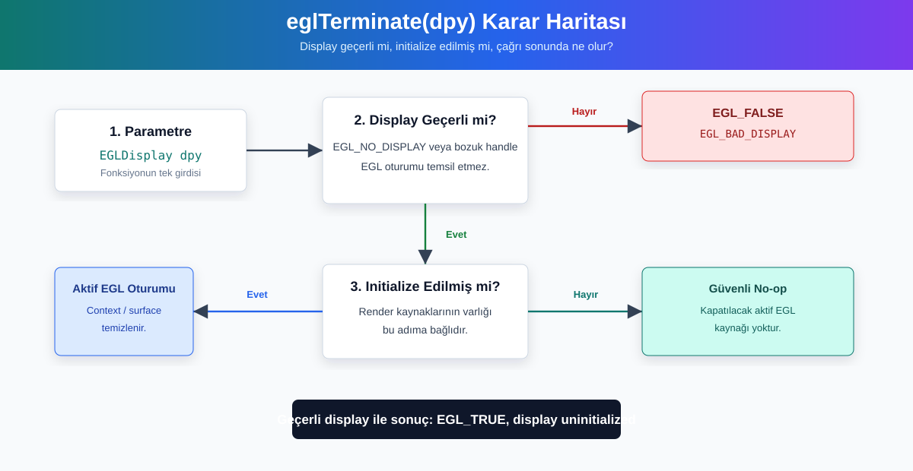
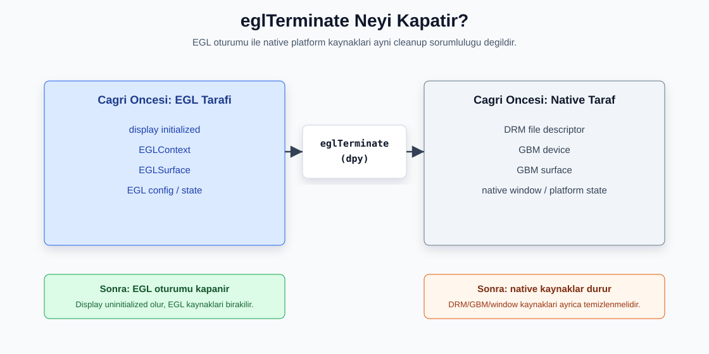
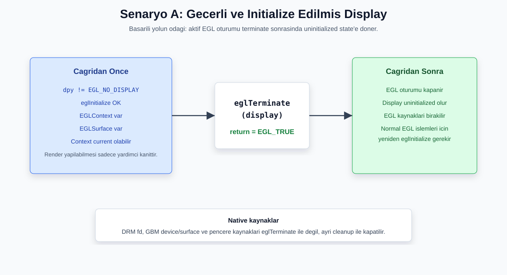
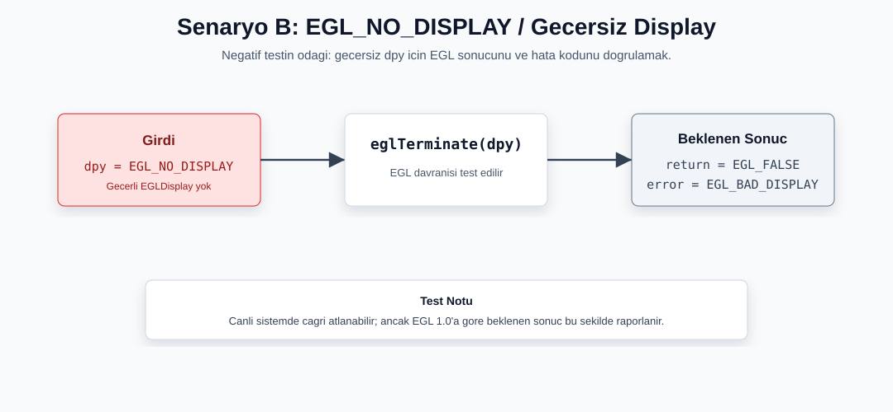
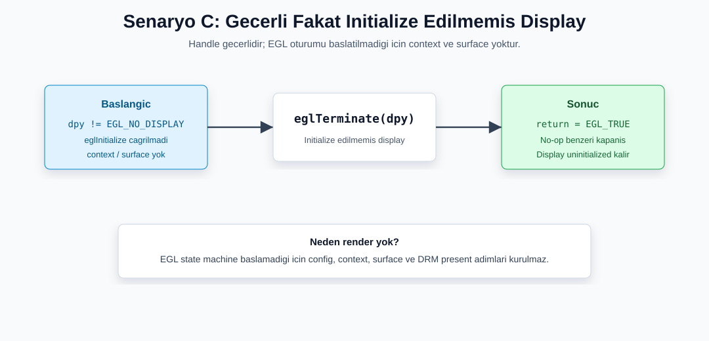
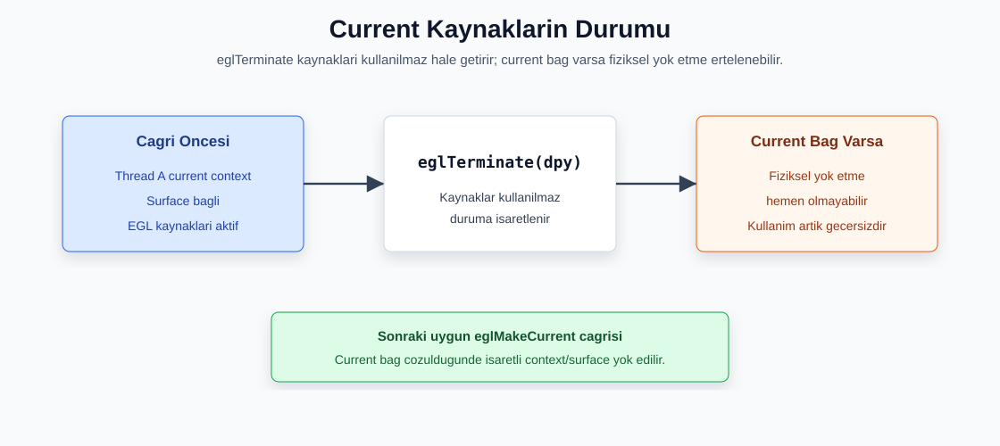

# EGL 1.0 Fonksiyon Incelemesi: `eglTerminate`

```c
EGLBoolean eglTerminate(EGLDisplay dpy);
```

`eglTerminate`, bir `EGLDisplay` uzerinden kurulmus EGL oturumunu sonlandirmak icin kullanilir. Basarili cagridan sonra display yeniden **uninitialized** duruma doner. Display'e bagli EGL kaynaklari, ornegin context ve surface nesneleri, EGL tarafindan birakilir; o anda current olan kaynaklar ise guvenli sekilde artik kullanilmamasi gereken kaynaklar olarak ele alinir.

Bu incelemede fonksiyonun tek parametresi olan `dpy` / `pDpyID` uc farkli durum uzerinden ele alinmistir:

| Senaryo | `pDpyID` durumu | Test dosyasi | Beklenen sonuc |
| :--- | :--- | :--- | :--- |
| A | Gecerli ve initialize edilmis display | `pDpyID/ScenarioA_ValidDisplay.c` | `eglTerminate(display)` `EGL_TRUE` dondurur ve display EGL acisindan uninitialized duruma doner. |
| B | `EGL_NO_DISPLAY` / gecersiz display | `pDpyID/ScenarioB_InvalidDisplay.c` | EGL acisindan beklenen sonuc `EGL_FALSE` ve `EGL_BAD_DISPLAY` hatasidir. |
| C | Gecerli fakat initialize edilmemis display | `pDpyID/ScenarioC_UninitializedDisplay.c` | Render hatti kurulmaz; gecerli display uzerinde `eglTerminate(display)` guvenli bicimde `EGL_TRUE` dondurur. |

## Kisa Ozet



`eglTerminate(dpy)` yalnizca EGL tarafindaki oturumu kapatir. DRM fd, GBM device, GBM surface veya native pencere sistemi kaynaklari ayrica temizlenmelidir. Bu nedenle orneklerde `eglTerminate` cagrisindan sonra veya hata yollarinda `destroy_drm_window(&nw)` ile native kaynak temizligi yapilir.

Fonksiyonun anlasilmasi icin en onemli ayrim sudur:

- `dpy` gecerli ve initialize edilmisse EGL kaynaklari kapatilir.
- `dpy` gecerli ama initialize edilmemisse veya daha once terminate edilmisse cagri hata sayilmaz; display zaten baslatilmamis durumdadir.
- `dpy` gecersizse fonksiyon basarili kabul edilmez ve `EGL_BAD_DISPLAY` beklenir.

## EGL ve Native Kaynak Ayrimi



`eglTerminate`, EGL tarafindaki display oturumunu ve bu oturuma bagli EGL kaynaklarini hedefler. DRM fd, GBM device, GBM surface ve native pencere kaynaklari EGL disindaki platform kaynaklaridir; bu nedenle ayri cleanup adimlariyla kapatilmalidir.

## Senaryo A: Gecerli ve Initialize Edilmis Display



Bu senaryoda program once native altyapi uzerinden gecerli bir `EGLDisplay` alir ve `eglInitialize` ile EGL oturumunu baslatir. Context ve surface olusturulduktan sonra `eglTerminate(display)` cagrilir.

**Kodun gosterdigi nokta:** Gecerli ve initialize edilmis `pDpyID`, `eglTerminate` icin dogru kullanim durumudur. Fonksiyon basarili oldugunda `EGL_TRUE` doner, EGL oturumu kapanir ve display EGL acisindan tekrar uninitialized hale gelir. Ucgen cizimi, sadece terminate oncesinde EGL oturumunun calisir durumda oldugunu gosteren yardimci kanittir.

**Beklenen terminal ciktisi ozeti:**

```text
Senaryo A: eglTerminate(pDpyID) Gecerli (Valid) Parametre Kullanimi
DRM/KMS ve GBM cihazi basariyla olusturuldu
EGL GBM display ... ile alindi
-> Gecerli bir pDpyID kullanildigi icin EGL Context basariyla olusturuldu.
-> Ekrana renkli bir ucgen ciziliyor...

Simdi eglTerminate(display) cagriliyor...
-> eglTerminate BASARILI (EGL_TRUE dondu).
-> EGL oturumu sonlandirildi ve display uninitialized duruma dondu.
```

**Gorsel yorum:** Bu senaryoda asil kanit, `eglTerminate(display)` cagrisinin `EGL_TRUE` donmesi ve display'in uninitialized duruma gecmesidir. Render ciktisi, EGL oturumunun terminate oncesinde aktif oldugunu gosteren ikincil kanittir.

## Senaryo B: `EGL_NO_DISPLAY` / Gecersiz Display



Bu negatif senaryoda `pDpyID` olarak `EGL_NO_DISPLAY` veya NULL benzeri gecersiz bir display degeri ele alinir. EGL acisindan bu cagri basarili kabul edilmez.

**Kodun gosterdigi nokta:** Gecerli bir display yoksa EGL oturumu da yoktur. EGL spesifikasyonu acisindan gecersiz display ile yapilan cagrilarda beklenen sonuc `EGL_FALSE` ve hata sinifi `EGL_BAD_DISPLAY`'dir. Test kodu canli sistemde bu negatif cagriyi atlayabilir; ancak beklenen EGL davranisi budur.

**Beklenen terminal ciktisi ozeti:**

```text
Senaryo B: eglTerminate(pDpyID) Hatali (EGL_NO_DISPLAY) Parametre Kullanimi
Bu negatif senaryoda pDpyID olarak EGL_NO_DISPLAY/NULL benzeri gecersiz bir deger kullanimi anlatilir.
Guvenlik nedeniyle gercek eglTerminate(EGL_NO_DISPLAY), EGL/GBM veya DRM cagrisi yapilmiyor.
Beklenen sonuc: EGL implementasyonu boyle bir display'i gecerli kabul etmemeli ve EGL_BAD_DISPLAY raporlamalidir.
SONUC: Gecerli display olmadigi icin context/surface olusturulmaz, cizim ve DRM present denenmez.
```

**Gorsel yorum:** Bu senaryoda ana odak render hattinin baslatilmamasi degil, `eglTerminate(EGL_NO_DISPLAY)` icin beklenen EGL sonucudur: `EGL_FALSE` ve `EGL_BAD_DISPLAY`.

## Senaryo C: Gecerli Fakat Initialize Edilmemis Display



Bu senaryoda DRM/KMS ve GBM altyapisi kurulur, ardindan gecerli bir `EGLDisplay` alinir. Ancak senaryo geregi `eglInitialize` cagrisi yapilmaz. Program dogrudan `eglTerminate(display)` cagirir.

EGL 1.0 davranisina gore display handle gecerli oldugu surece, display daha once initialize edilmemis veya zaten terminate edilmis olsa bile `eglTerminate` cagrisi hata uretmeden tamamlanabilir. Cunku EGL tarafinda kapatilacak aktif bir oturum veya render kaynagi yoktur.

**Kodun gosterdigi nokta:** `pDpyID` gecerlidir, fakat display initialize edilmedigi icin `eglGetConfigs`, `eglChooseConfig`, context olusturma, surface olusturma, cizim ve DRM present adimlari calistirilmaz. Buna ragmen `eglTerminate(display)` `EGL_TRUE` dondurur.

**Beklenen terminal ciktisi ozeti:**

```text
Senaryo C: eglTerminate(pDpyID) Initialize Edilmemis Parametre Kullanimi
DRM/KMS ve GBM cihazi basariyla olusturuldu
EGL GBM display ... ile alindi
Display gecerli alindi fakat INITIALIZE EDILMEDI.
Simdi eglTerminate(display) cagriliyor...

-> eglTerminate BASARILI (EGL_TRUE dondu).
-> Not: EGL spesifikasyonuna gore baslatilmamis display uzerinde terminate cagirmak serbesttir ve etkisi yoktur.

Bu display eglInitialize ile baslatilmadigi icin eglGetConfigs/eglChooseConfig, context, surface, cizim ve DRM present denenmeyecek.
SONUC: EGL Context olusturulamaz ve ekrana yeni bir gorsel basilmamalidir.
```

**Gorsel yorum:** Senaryo C'de display handle gecerli olsa da EGL state machine baslatilmadigi icin context ve surface yoktur. Bu nedenle `eglTerminate(display)` no-op benzeri bir kapanis davranisi gosterir ve `EGL_TRUE` doner.

## Current Kaynak Durumu



Bir context veya surface herhangi bir thread icin current durumdaysa, `eglTerminate` sonrasinda bu kaynaklar artik normal kullanim icin gecerli kabul edilmez. Ancak fiziksel yok etme islemi, current baglanti cozulecek sekilde sonraki uygun `eglMakeCurrent` cagrisina kadar ertelenebilir.

## Hata ve Durum Matrisi

| Durum | `eglTerminate` sonucu | Beklenen EGL hata durumu | Yan etki |
| :--- | :--- | :--- | :--- |
| `dpy` gecerli ve initialized | `EGL_TRUE` | `EGL_SUCCESS` | EGL oturumu sonlanir, display uninitialized olur. |
| `dpy` gecerli fakat uninitialized veya zaten terminated | `EGL_TRUE` | `EGL_SUCCESS` | Aktif EGL kaynagi olmadigi icin guvenli no-op davranisi gorulur. |
| `dpy == EGL_NO_DISPLAY` veya gecersiz | `EGL_FALSE` | `EGL_BAD_DISPLAY` | EGL state degismez; render hatti kurulmaz. |

> [!WARNING]
> `eglTerminate` sonrasinda ayni display artik initialized kabul edilmez. Bu display uzerinde yeniden normal EGL islemleri yapilacaksa once tekrar `eglInitialize` cagrilmalidir. Aksi halde `eglChooseConfig`, `eglCreateContext` veya `eglCreateWindowSurface` gibi cagrilar basarisiz olabilir.

## Guvenli Kullanim Kalibi

```c
#include <EGL/egl.h>
#include <stdio.h>

void safe_egl_cleanup(EGLDisplay dpy) {
    if (dpy == EGL_NO_DISPLAY) {
        printf("HATA: Gecersiz EGLDisplay (EGL_NO_DISPLAY).\n");
        return;
    }

    if (eglMakeCurrent(dpy, EGL_NO_SURFACE, EGL_NO_SURFACE, EGL_NO_CONTEXT) == EGL_FALSE) {
        printf("Uyari: current context birakilamadi. Hata: 0x%04X\n", eglGetError());
    }

    if (eglTerminate(dpy) == EGL_FALSE) {
        printf("HATA: eglTerminate basarisiz oldu. Hata: 0x%04X\n", eglGetError());
        return;
    }

    printf("BASARILI: EGL oturumu kapatildi.\n");
}
```

Bu kalipta once gecersiz display kontrol edilir. Ardindan varsa current context/surface baglantisi birakilir ve `eglTerminate` cagrilir. Native kaynaklarin temizligi bu fonksiyonun disinda ayrica yapilmalidir.

## Sonuc

`eglTerminate`, EGL yasam dongusunun kapanis fonksiyonudur. Senaryo A dogru ve tam kullanim yolunu gosterir: display alinir, initialize edilir, context/surface kurulur, cizim yapilir ve EGL oturumu kapatilir. Senaryo B hatali parametre yolunu gosterir: `EGL_NO_DISPLAY` gecerli bir EGL oturumu degildir. Senaryo C ise onemli bir sinir durumunu aciklar: display gecerli ama initialize edilmemisse render uretilemez, ancak `eglTerminate` guvenli bicimde basarili donebilir.

Bu uc senaryo birlikte degerlendirildiginde `pDpyID` parametresi icin temel kural nettir: `eglTerminate` cagrisi yalnizca gecerli bir `EGLDisplay` ile anlamlidir; initialize durumu fonksiyonun yapacagi isi degistirir, fakat gecersiz display her zaman hata sinifina girer.
