<!--
AUTO-GENERATED FILE. DO NOT EDIT DIRECTLY.
Run: python scripts/build_presentation.py
Source order: docs/other/presentation-order.txt
-->

# EGL 1.0 Fonksiyonları

Bu rapor, temel EGL 1.0 fonksiyonlarını tipik EGL yaşam döngüsüne göre sıralı biçimde sunar. Her fonksiyon bölümü bağımsız olarak sunulabilecek şekilde fonksiyonun amacı, parametreleri, dönüş değeri ve ilgili EGL kavramlarını içerir.

## İçindekiler

1. `eglGetDisplay`
2. `eglInitialize`
3. `eglGetConfigs`
4. `eglChooseConfig`
5. `eglGetConfigAttrib`
6. `eglCreateWindowSurface`
7. `eglCreateContext`
8. `eglMakeCurrent`
9. `eglGetCurrentDisplay`
10. `eglGetCurrentContext`
11. `eglSwapBuffers`
12. `eglDestroyContext`
13. `eglDestroySurface`
14. `eglTerminate`
15. `eglGetError`

---

# EGL 1.0: `eglGetDisplay`

```c
EGLDisplay eglGetDisplay(EGLNativeDisplayType display_id);
```

`eglGetDisplay`, native görüntüleme sistemine ait bir display tanımlayıcısını EGL tarafından kullanılabilecek bir `EGLDisplay` handle'ı ile ilişkilendirmek için kullanılır.

Kısa özet:

- Girdi: `EGLNativeDisplayType`
- Çıktı: `EGLDisplay`
- Başarısızlık değeri: `EGL_NO_DISPLAY`
- `EGL_DEFAULT_DISPLAY`, varsayılan native display'i istemek için kullanılır.
- `EGLDisplay`, fiziksel monitörün kendisi değil, EGL'nin kullandığı opaque handle'dır.
- `eglGetDisplay` display'i initialize etmez; bunun için `eglInitialize` gerekir.

## Kavramsal Akış

```text
Native display
    |
    v
eglGetDisplay
    |
    v
EGLDisplay handle
    |
    v
eglInitialize
```

`eglGetDisplay` native platform ile EGL arasındaki ilk bağlantı noktalarından biridir.

## Parametreler

### `display_id`

`display_id`, hangi native display'in EGL tarafında temsil edileceğini belirtir.

`EGLNativeDisplayType` platforma bağımlıdır. Ubuntu header dosyalarında farklı platformlar için örneğin şu tanımlar bulunur:

```c
typedef struct wl_display *EGLNativeDisplayType;
typedef Display *EGLNativeDisplayType;
typedef void *EGLNativeDisplayType;
typedef int EGLNativeDisplayType;
```

Aynı anda bunların hepsi aktif değildir; platform header'ları uygun tanımı seçer.

`EGL_DEFAULT_DISPLAY` yaygın EGL başlıklarında şu şekilde tanımlanır:

```c
#define EGL_DEFAULT_DISPLAY EGL_CAST(EGLNativeDisplayType,0)
```

| `display_id` değeri           | Anlamı                                                                  |
| -------------------------------- | ------------------------------------------------------------------------ |
| `EGL_DEFAULT_DISPLAY`          | Varsayılan native display için bir`EGLDisplay` istenir.              |
| Geçerli Wayland`wl_display *` | Belirtilen native Wayland bağlantısı için bir`EGLDisplay` istenir. |

## `EGLDisplay` Nedir?

`EGLDisplay`, uygulamanın iç yapısını yorumlamaması gereken bir EGL handle'ıdır.

Örnek:

```text
0x629b25a1cdf0
```

Bu değer:

- çözünürlük değildir,
- ekran numarası değildir,
- GPU numarası değildir,
- EGL sürümü değildir.

Uygulama bu handle'ı daha sonraki EGL çağrılarına geçirir:

```c
eglInitialize(display, &major, &minor);
```

`eglInitialize` ayrıntıları için ilgili bölüme bakınız.

## `EGL_DEFAULT_DISPLAY`

En temel kullanım:

```c
EGLDisplay dpy = eglGetDisplay(EGL_DEFAULT_DISPLAY);

if (dpy == EGL_NO_DISPLAY) {
    /* Display elde edilemedi. */
}
```

Bu kullanımda native display bağlantısını uygulamanın kendisinin açması gerekmez.

## Açık Wayland Display Bağlantısı

Wayland kullanıldığında açık bir native display bağlantısı şu şekilde oluşturulabilir:

```c
struct wl_display *wayland_display = wl_display_connect(NULL);

EGLDisplay dpy =
    eglGetDisplay((EGLNativeDisplayType)wayland_display);
```

`wl_display_connect` bir EGL fonksiyonu değildir; Wayland API'sine aittir.

## `eglGetDisplay` ve `eglInitialize` İlişkisi

```text
eglGetDisplay
    |
    v
EGLDisplay handle elde edilir
    |
    v
eglInitialize
    |
    v
Display EGL kullanımı için initialize edilir
```

`eglGetDisplay` başarılı olsa bile display henüz initialize edilmiş sayılmaz.

## Temel Kullanım

```c
EGLDisplay dpy = eglGetDisplay(EGL_DEFAULT_DISPLAY);

if (dpy == EGL_NO_DISPLAY) {
    EGLint err = eglGetError();
}
```

## Bölüm Özeti

- `eglGetDisplay` bir native display'den `EGLDisplay` handle'ı elde eder.
- Tek parametresi `display_id`'dir.
- `display_id`, `EGLNativeDisplayType` türündedir ve platforma bağımlıdır.
- `EGL_DEFAULT_DISPLAY`, varsayılan native display'i istemek için kullanılır.
- Geçerli explicit native display değerleri de verilebilir.
- Başarısızlıkta `EGL_NO_DISPLAY` döner.
- `EGLDisplay` opaque handle'dır; sayısal değeri yorumlanmamalıdır.
- `eglGetDisplay` display'i initialize etmez; sonraki adım tipik olarak `eglInitialize`'dır.

---

# EGL 1.0: `eglInitialize`

```c
EGLBoolean eglInitialize(EGLDisplay dpy,
                         EGLint *major,
                         EGLint *minor);
```

`eglInitialize`, bir `EGLDisplay` bağlantısını EGL kullanımı için initialize eder ve istenirse EGL implementation sürümünü `major` ve `minor` output parametreleri üzerinden döndürür.

Kısa özet:

- `dpy`: initialize edilecek EGL display.
- `major`: major sürüm output pointer'ı.
- `minor`: minor sürüm output pointer'ı.
- Başarılı çağrı: `EGL_TRUE`
- Başarısız çağrı: `EGL_FALSE`
- Geçersiz display için hata kodu: `EGL_BAD_DISPLAY`

## Kavramsal Akış

```text
Native display
    |
    v
eglGetDisplay
    |
    v
EGLDisplay
    |
    v
eglInitialize
    |
    +-- EGL bağlantısı initialize edilir
    |
    +-- major/minor istenirse sürüm bilgisi alınır
```

## Parametreler

### `dpy`

`dpy`, initialize edilecek geçerli bir `EGLDisplay` olmalıdır.

| `dpy`                                   | Sonuç                                                           |
| ----------------------------------------- | ---------------------------------------------------------------- |
| Geçerli, başlatılmamış`EGLDisplay` | Başlatma işlemi yapılabilir.                                  |
| `EGL_NO_DISPLAY`                        | `EGL_FALSE` döner ve `EGL_BAD_DISPLAY` hata durumu oluşur. |

Normal akış:

```c
EGLDisplay dpy = eglGetDisplay(EGL_DEFAULT_DISPLAY);
eglInitialize(dpy, &major, &minor);
```

`eglGetDisplay` için ilgili bölüme bakınız.

### `major`

`major`, major EGL sürüm numarasının yazılabileceği `EGLint *` output parametresidir.

```c
EGLint major = -1;
eglInitialize(dpy, &major, &minor);
```

Başlangıç değeri verilmesi, fonksiyonun output parametresini güncelleyip güncellemediğinin izlenmesini kolaylaştırır.

### `minor`

`minor`, minor EGL sürüm numarasının yazılabileceği `EGLint *` output parametresidir.

```c
EGLint minor = -1;
eglInitialize(dpy, &major, &minor);
```

## `NULL` Kullanımı

Sürüm numarası bilgisine ihtiyaç duyulmuyorsa output pointer'ları `NULL` olarak verilebilir:

```c
eglInitialize(dpy, &major, &minor);
eglInitialize(dpy, NULL, &minor);
eglInitialize(dpy, &major, NULL);
eglInitialize(dpy, NULL, NULL);
```

## Hata Matrisi

| Durum                                        | Sonuç                                                          |
| -------------------------------------------- | --------------------------------------------------------------- |
| Geçerli display, iki output pointer         | `EGL_TRUE`; sürüm bilgisi output parametrelerine yazılır. |
| Geçerli display, iki output pointer`NULL` | `EGL_TRUE`; sürüm bilgisi alınmadan display başlatılır. |
| `dpy == EGL_NO_DISPLAY`                    | `EGL_FALSE`, `EGL_BAD_DISPLAY`                              |

## Temel Kullanım

```c
EGLDisplay dpy = eglGetDisplay(EGL_DEFAULT_DISPLAY);

if (dpy == EGL_NO_DISPLAY) {
    return 1;
}

EGLint major;
EGLint minor;

if (!eglInitialize(dpy, &major, &minor)) {
    EGLint err = eglGetError();
    return 1;
}

printf("EGL version: %d.%d\n", major, minor);
```

## Bölüm Özeti

- `eglInitialize`, `EGLDisplay` bağlantısını EGL kullanımı için initialize eder.
- `dpy`, geçerli bir `EGLDisplay` olmalıdır.
- `major` ve `minor`, sürüm bilgisini almak için kullanılan output pointer'larıdır.
- `major` ve `minor`, istenirse `NULL` verilerek sürüm bilgisi alınmadan başlatma yapılabilir.
- `EGL_NO_DISPLAY` kullanımı `EGL_FALSE` ve `EGL_BAD_DISPLAY` üretti.
- Driver warning mesajları ile EGL API hata sonucu aynı şey değildir.

---

# EGL 1.0: `eglGetConfigs`

```c
EGLBoolean eglGetConfigs(EGLDisplay dpy,
                         EGLConfig *configs,
                         EGLint config_size,
                         EGLint *num_config);
```

`eglGetConfigs`, başlatılmış bir `EGLDisplay` üzerinde desteklenen bütün `EGLConfig` yapılandırmalarını okumak veya yalnızca kaç yapılandırma bulunduğunu öğrenmek için kullanılan EGL 1.0 fonksiyonudur. Kısaca, ekran/sürücü tarafındaki framebuffer seçeneklerinin ham envanterini verir.

Bu fonksiyon seçim yapmaz, filtre uygulamaz ve sıralama garantisi vermez. “Şu özelliklerde bir config istiyorum” denecekse doğru araç genellikle `eglChooseConfig` fonksiyonudur. `eglGetConfigs` ise sistemde ne olduğunu görmek, saymak ve tüm havuzu elle incelemek için kullanılır.

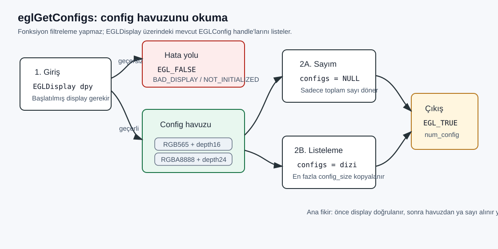

## Kısa Mantık

EGL tarafında her `EGLConfig`, yüzeyin nasıl bir framebuffer kullanacağını anlatır: renk tamponu kaç bit olacak, depth buffer var mı, pencere yüzeyi destekleniyor mu, OpenGL ES ile kullanılabilir mi gibi bilgiler bu yapılandırmalarda tutulur.

```text
Native Display -> EGLDisplay -> EGLConfig havuzu
                                |
                                +-- Config #1: RGB565, depth 16, window destekli
                                +-- Config #2: RGBA8888, depth 24, pbuffer destekli
                                +-- Config #N: ...
```

Uygulama bu havuzu aldıktan sonra her config'i `eglGetConfigAttrib` ile inceleyebilir.

## Parametreler

| Parametre | Görevi | Kritik nokta |
| --- | --- | --- |
| `dpy` | Sorgunun yapılacağı `EGLDisplay` handle'ı | `eglInitialize` ile başlatılmış olmalıdır. |
| `configs` | Config handle'larının yazılacağı dizi | `NULL` verilirse sadece toplam sayı öğrenilir. |
| `config_size` | `configs` dizisinin kapasitesi | `configs == NULL` iken dikkate alınmaz; dizi varsa en fazla bu kadar config kopyalanır. |
| `num_config` | Yazılan veya bulunan config sayısının döneceği adres | Geçerli bir `EGLint*` olmalıdır. |

## Davranış Özeti

| Çağrı biçimi | Ne olur? |
| --- | --- |
| `eglGetConfigs(dpy, NULL, 0, &n)` | Config listesi kopyalanmaz; sistemdeki toplam config sayısı `n` içine yazılır. |
| `eglGetConfigs(dpy, configs, size, &n)` | En fazla `size` adet config `configs` dizisine yazılır; kopyalanan adet `n` olur. |
| `config_size` toplam config sayısından küçükse | Hata değildir. Yalnızca dizinin alabileceği kadar config döner. |
| `dpy` geçersizse | `EGL_FALSE` döner; tipik hata `EGL_BAD_DISPLAY` olur. |
| `dpy` başlatılmamışsa | `EGL_FALSE` döner; hata `EGL_NOT_INITIALIZED` olur. |

## Neden Önemli?

Bir EGL uygulamasında context ve surface oluşturmak için uygun bir `EGLConfig` gerekir. Yanlış veya eksik config listesiyle çalışmak şu sorunlara yol açabilir:

* Pencere yüzeyi (`EGL_WINDOW_BIT`) desteklenmediği için surface oluşturulamayabilir.
* OpenGL ES 2.0 desteği (`EGL_OPENGL_ES2_BIT`) olmayan config seçilebilir.
* Depth buffer olmayan config ile 3B çizimde derinlik testi beklenen sonucu vermez.
* Küçük `config_size` yüzünden uygun config havuzun dışında kalabilir.

Bu yüzden pratikte en güvenli yöntem iki adımlı sorgudur: önce toplam sayıyı öğren, sonra o sayı kadar bellek ayırıp tüm listeyi oku.

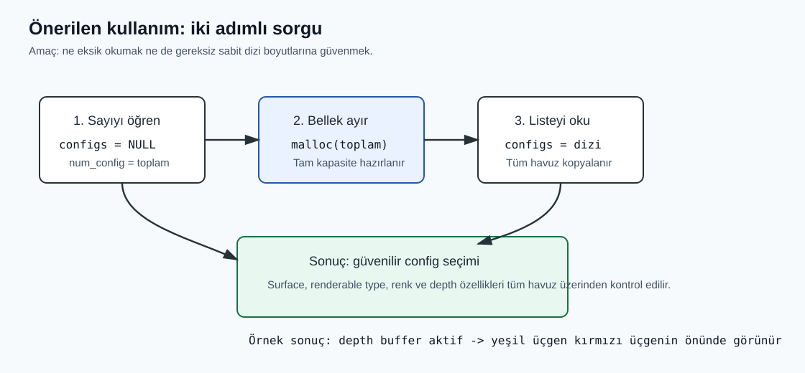

## Parametre Senaryoları

Aşağıdaki senaryolar repodaki C dosyalarıyla bire bir ilişkilidir. Çizim üreten örneklerde görsel sonuç, seçilen config ile surface/context kurulabildiğini gösterir. Çizim üretmeyen örneklerde ise doğru kanıt terminal çıktısıdır; çünkü amaç, hatalı veya bilinçli eksik parametre durumunda çizime geçilmemesi gerektiğini göstermektir.

### 1. `dpy` Parametresi

#### Senaryo A: Geçerli `EGLDisplay`

Kaynak dosya: `pDpyID_farki/senaryo_A_gecerli_display.c`

Native display açılır, bunun üzerinden `EGLDisplay` alınır ve `eglInitialize` başarılı olduktan sonra `eglGetConfigs` çağrılır. `dpy` geçerli olduğu için fonksiyon `EGL_TRUE` döner ve bulunan config sayısını `num_config` içine yazar. Kod daha sonra uygun bir config seçip yeşil zemin üzerinde beyaz üçgen çizer.

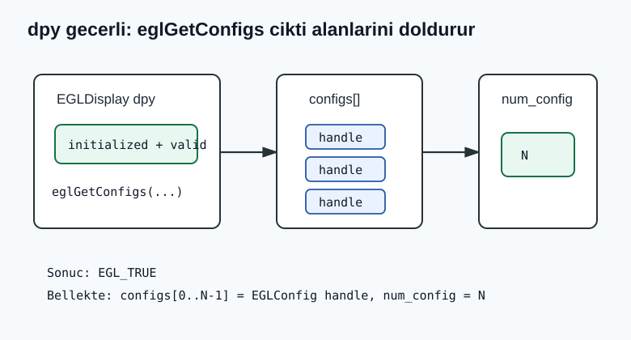

```text
BASARILI: Gecerli EGLDisplay ile eglGetConfigs <N> config dondurdu.
GORSEL SONUC: Secilen uygun config ile yesil zemin uzerine beyaz ucgen cizildi.
```

#### Senaryo B: Geçersiz `EGLDisplay`

Kaynak dosya: `pDpyID_farki/senaryo_B_gecersiz_display.c`

Bu senaryoda `dpy` olarak `EGL_NO_DISPLAY` verilir. Geçerli display olmadığı için `eglGetConfigs` başarısız olur ve beklenen hata `EGL_BAD_DISPLAY` değeridir. Surface veya context kurulmadığı için çizim yapılmaz.

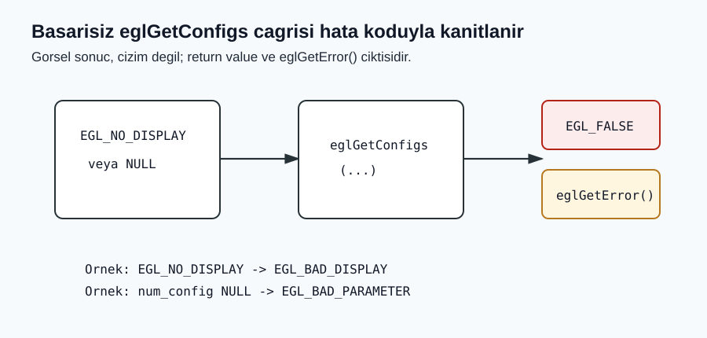

```text
BEKLENEN HATA: EGL_NO_DISPLAY ile eglGetConfigs basarisiz oldu.
EGL hata kodu: EGL_BAD_DISPLAY (0x3008)
GORSEL SONUC: Config alinmadigi icin context/surface olusturulmaz ve cizim yapilmaz.
```

### 2. `configs` Parametresi

#### Senaryo A: `configs = NULL` ile Sadece Sayım

Kaynak dosya: `pConfigs_farki/senaryo_A_sadece_sayim.c`

Bu kullanım iki adımlı sorgunun ilk adımıdır. `configs` parametresi `NULL`, `config_size` ise `0` verilir. EGL config listesini kopyalamaz; yalnızca toplam config sayısını `num_config` adresine yazar. Bu senaryoda çizim yapılmaması doğrudur, çünkü elde henüz kullanılacak config handle'ı yoktur.

```text
BASARILI: pConfigs=NULL ve config_size=0 ile sadece config sayisi sorgulandi.
Sistemde <N> adet EGLConfig var.
GORSEL SONUC: Bu senaryo bilerek cizim yapmaz; elde config handle olmadigi icin surface/context kurulmaz.
```

#### Senaryo B: Geçerli `configs` Dizisine Veri Okuma

Kaynak dosya: `pConfigs_farki/senaryo_B_veri_okuma.c`

Bu senaryoda `configs` geçerli bir dizi olarak verilir ve `config_size` dizinin kapasitesini belirtir. Başarılı çağrıdan sonra EGL, en fazla `config_size` kadar `EGLConfig` handle'ını diziye yazar. Kod bu config'ler arasından pencere yüzeyi ve OpenGL ES 2.0 destekleyen bir seçim yaparak lacivert zemin üzerinde sarı üçgen çizer.

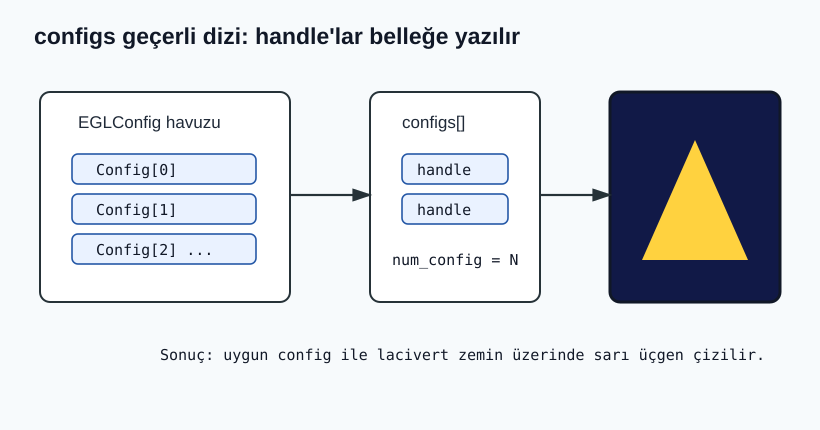

```text
BASARILI: pConfigs gecerli dizi oldugu icin <N> config bellege kopyalandi.
GORSEL SONUC: Okunan configlerden uygun olanla lacivert zemin uzerine sari ucgen cizildi.
```

### 3. `config_size` Parametresi

#### Senaryo A: Yetersiz Kapasite

Kaynak dosya: `ConfigSize_farki/senaryo_A_yetersiz_kapasite.c`

Önce sistemdeki gerçek config sayısı öğrenilir, ardından özellikle küçük bir kapasiteyle (`config_size = 2`) okuma yapılır. EGL bunu hata saymaz; yalnızca ilk iki config'i kopyalar. Risk şudur: ihtiyaç duyulan özelliklere sahip config, okunmayan kısımda kalabilir.

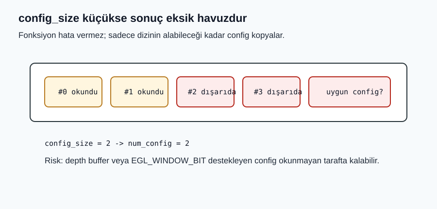

```text
Sistemde toplam <T> config var, fakat ConfigSize=2 oldugu icin sadece <N> tanesi okundu.
UYARI: Ilk 2 config icinde derinlik tamponu bulunamadi; 3B derinlik testi guvenilir degil.
GORSEL SONUC: Sadece sinirli havuz kullanildigi icin dogru config secimi garanti edilmez.
```

#### Senaryo B: Yeterli Kapasite

Kaynak dosya: `ConfigSize_farki/senaryo_B_yeterli_kapasite.c`

Bu senaryoda önce toplam config sayısı alınır, sonra tam bu sayı kadar bellek ayrılır. Böylece tüm config havuzu okunur ve depth buffer destekleyen uygun config güvenli şekilde seçilebilir. 3B çizimde yeşil üçgenin kırmızı üçgenin önünde görünmesi depth buffer kullanımını somutlaştırır.

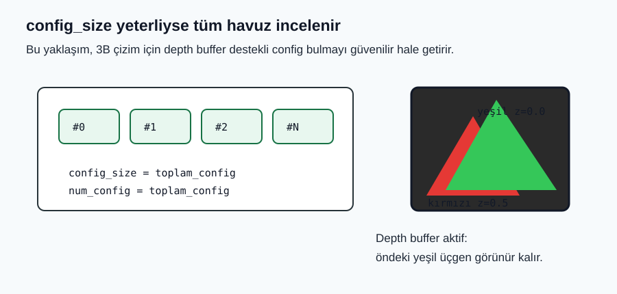

```text
BASARILI: Yeterli kapasite ile <N>/<T> config okundu ve derinlikli uygun config secildi.
GORSEL SONUC: Depth buffer aktif; yesil ucgen onde, kirmizi ucgen arkada kalir.
```

### 4. `num_config` Parametresi

#### Senaryo A: Geçerli `num_config` İşaretçisi

Kaynak dosya: `pNumConfig_farki/senaryo_A_gecerli_isaretci.c`

`num_config` geçerli bir `EGLint*` adresidir. `eglGetConfigs`, kaç config kopyaladığını bu adrese yazar. Kod daha sonra uygun config ile surface/context oluşturup mor zemin üzerinde camgöbeği üçgen çizer.

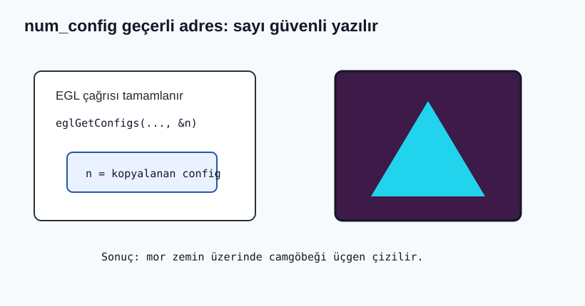

```text
BASARILI: pNumConfig gecerli isaretci oldugu icin EGL yazdigi config sayisini bildirdi: <N>
GORSEL SONUC: Uygun config ile mor zemin uzerine camgobegi ucgen cizildi.
```

#### Senaryo B: `num_config = NULL`

Kaynak dosya: `pNumConfig_farki/senaryo_B_null_verilmesi.c`

EGL 1.0 sözleşmesinde `num_config` çıkış parametresi zorunlu kabul edilmelidir. Bu parametre `NULL` verilirse bazı sürücüler temiz bir hata döndürmek yerine geçersiz adrese yazmaya çalışıp uygulamayı çökertebilir. Bu nedenle örnek kod gerçek EGL çağrısını bilerek yapmaz; üretim kodunun bu parametreyi çağrıdan önce reddetmesi gerektiğini gösterir.

```text
BEKLENEN HATA: pNumConfig=NULL EGL 1.0 icin gecersiz parametredir.
GUVENLI TEST: Bu ornek kasitli olarak eglGetConfigs(..., NULL) cagirmiyor.
NEDEN: Bazi EGL suruculeri gecersiz output pointer'i icin EGL_FALSE yerine process crash uretebilir.
DOGRU DAVRANIS: Uretim kodu pNumConfig NULL ise EGL cagrisindan once reddetmelidir.
GORSEL SONUC: Config sayisi guvenli sekilde alinamadigi icin cizim kurulmaz.
```

### 5. Profesyonel İki Adımlı Sorgu

Kaynak dosya: `harici_standart_senaryo/profesyonel_2_adimli_sorgu.c`

Bu senaryo gerçek uygulamalarda önerilen akışı gösterir:

1. `configs = NULL` ile toplam config sayısı öğrenilir.
2. Bu sayı kadar bellek ayrılır.
3. İkinci çağrıda tüm config listesi alınır.
4. Tüm havuz içinden ihtiyaçlara uygun config seçilir.

Bu yöntem hem bellek taşmasını önler hem de eksik havuz üzerinden yanlış config seçme riskini azaltır.

```text
Adim 1: Sistemde <T> adet EGLConfig oldugu tespit edildi.
Adim 2: <N> adet EGLConfig bellege alindi.
BASARILI: 2 adimli eglGetConfigs akisi ile tam config havuzu okunup uygun config secildi.
GORSEL SONUC: Depth buffer aktif; yesil ucgen kirmizi ucgenin onunde gorunur.
```

## Güvenli Kullanım Örneği

```c
#include <EGL/egl.h>
#include <stdio.h>
#include <stdlib.h>

EGLBoolean SafeGetEGLConfigs(EGLDisplay dpy) {
    EGLint total_configs = 0;

    if (dpy == EGL_NO_DISPLAY) {
        fprintf(stderr, "[Hata] Geçersiz EGLDisplay.\n");
        return EGL_FALSE;
    }

    if (eglGetConfigs(dpy, NULL, 0, &total_configs) != EGL_TRUE) {
        fprintf(stderr, "[Hata] Config sayısı okunamadı. Hata: 0x%04X\n", eglGetError());
        return EGL_FALSE;
    }

    if (total_configs <= 0) {
        printf("[Bilgi] Bu display için EGLConfig bulunamadı.\n");
        return EGL_TRUE;
    }

    EGLConfig *configs = (EGLConfig*)malloc((size_t)total_configs * sizeof(EGLConfig));
    if (configs == NULL) {
        fprintf(stderr, "[Hata] Config listesi için bellek ayrılamadı.\n");
        return EGL_FALSE;
    }

    EGLint copied_configs = 0;
    if (eglGetConfigs(dpy, configs, total_configs, &copied_configs) != EGL_TRUE) {
        fprintf(stderr, "[Hata] Config listesi okunamadı. Hata: 0x%04X\n", eglGetError());
        free(configs);
        return EGL_FALSE;
    }

    printf("Başarılı: %d/%d EGLConfig okundu.\n", copied_configs, total_configs);

    /*
     * Burada configs dizisi eglGetConfigAttrib ile incelenip
     * projenin istediği surface, renderable type, color ve depth özellikleri seçilir.
     */

    free(configs);
    return EGL_TRUE;
}
```

## Sunumda Vurgulanacak Sonuç

`eglGetConfigs` bir seçim fonksiyonu değil, config envanteri alma fonksiyonudur. En güvenli kullanım, önce toplam sayıyı öğrenmek ve sonra tüm listeyi okuyup gereken özellikleri `eglGetConfigAttrib` ile doğrulamaktır. `dpy` başlatılmış olmalı, `num_config` geçerli bir adres olmalı ve `config_size` küçük tutulursa fonksiyon hata vermese bile eksik config listesiyle çalışıldığı unutulmamalıdır.

---

# EGL 1.0: `eglChooseConfig`

```c
EGLBoolean eglChooseConfig(EGLDisplay dpy,
                           const EGLint *attrib_list,
                           EGLConfig *configs,
                           EGLint config_size,
                           EGLint *num_config);
```

`eglChooseConfig`, bir `EGLDisplay` üzerinde bulunan EGL configuration'ları uygulamanın verdiği attribute kriterlerine göre filtreleyip sıralamak için kullanılır.

Kısa özet:

- `dpy`: config'lerin aranacağı initialized display.
- `attrib_list`: attribute/value çiftleri.
- `configs`: eşleşen `EGLConfig` handle'larının yazılacağı buffer.
- `config_size`: output buffer kapasitesi.
- `num_config`: döndürülen config sayısının yazıldığı output pointer.
- Uygun config bulunmaması API hatası olmak zorunda değildir.
- `EGL_TRUE` + `num_config = 0` geçerli bir sonuçtur.

## Kavramsal Akış

```text
EGLDisplay
    |
    +-- Config #1
    +-- Config #2
    +-- Config #3
    +-- ...
            |
            v
      attrib_list kriterleri
            |
            v
      eglChooseConfig
            |
            v
      Eşleşen EGLConfig'ler
```

## Parametreler

### `dpy`

`dpy`, config seçim işleminin yapılacağı initialized `EGLDisplay`'dir.

| Değer                       | Sonuç                                                           |
| ---------------------------- | ---------------------------------------------------------------- |
| Geçerli initialized display | Config seçimi yapılabilir.                                     |
| `EGL_NO_DISPLAY`           | `EGL_FALSE` döner ve `EGL_BAD_DISPLAY` hata durumu oluşur. |

### `attrib_list`

`attrib_list`, attribute/value çiftlerinden oluşur ve `EGL_NONE` ile sonlandırılır.

Örnek:

```c
const EGLint attrs[] = {
    EGL_RED_SIZE,   8,
    EGL_GREEN_SIZE, 8,
    EGL_BLUE_SIZE,  8,
    EGL_NONE
};
```

Kavramsal görünüm:

```text
Attribute         Value
-----------------------
EGL_RED_SIZE        8
EGL_GREEN_SIZE      8
EGL_BLUE_SIZE       8
EGL_NONE            -
```

#### `EGL_NONE`

Listenin sonunu belirtir:

```c
const EGLint attrs[] = {
    EGL_RED_SIZE, 8,
    EGL_NONE
};
```

#### `attrib_list = NULL`

`attrib_list` parametresine `NULL` verildiğinde belirtilmeyen attribute'lar EGL'nin varsayılan seçim değerleriyle değerlendirilir:

```c
eglChooseConfig(dpy, NULL, NULL, 0, &num_config);
```

### `configs`

`configs`, eşleşen `EGLConfig` handle'larının yazılacağı output buffer'dır.

```c
EGLConfig configs[5];
```

Yalnızca toplam eşleşme sayısını öğrenmek için `NULL` kullanılabilir:

```c
eglChooseConfig(dpy, attrs, NULL, 0, &count);
```

### `config_size`

`config_size`, `configs` buffer'ının kapasitesidir.

```c
EGLConfig configs[5];
eglChooseConfig(dpy, attrs, configs, 5, &num_config);
```

`config_size = 5`, “5 config bul” değil, “output buffer en fazla 5 config alabilir” anlamına gelir.

### `num_config`

`num_config`, döndürülen config sayısının yazıldığı `EGLint *` output parametresidir.

```c
EGLint num_config = -1;
eglChooseConfig(dpy, attrs, configs, 5, &num_config);
```

`num_config` geçerli bir output pointer olmalıdır. `NULL` verilmesi `EGL_BAD_PARAMETER` hata durumuna neden olur.

## EGL 1.0 Seçim Attribute'ları

Yaygın EGL 1.0 seçim attribute'ları aşağıda verilmiştir:

| Attribute            | Anlam                                             |
| -------------------- | ------------------------------------------------- |
| `EGL_RED_SIZE`     | Red component bit sayısı için minimum kriter   |
| `EGL_GREEN_SIZE`   | Green component bit sayısı için minimum kriter |
| `EGL_BLUE_SIZE`    | Blue component bit sayısı için minimum kriter  |
| `EGL_ALPHA_SIZE`   | Alpha component bit sayısı için minimum kriter |
| `EGL_DEPTH_SIZE`   | Depth buffer bit sayısı için minimum kriter    |
| `EGL_STENCIL_SIZE` | Stencil buffer bit sayısı için minimum kriter  |
| `EGL_LEVEL`        | Framebuffer level                                 |
| `EGL_NONE`         | Attribute listesinin sonu                         |
| `EGL_DONT_CARE`    | Uygun attribute'larda bu kriteri önemseme        |

> Seçilen config'in gerçek attribute değerlerini okumak için `eglGetConfigAttrib` kullanılır. Ayrıntılar için `eglGetConfigAttrib` bölümüne bakınız.

## Boyut Attribute'larının Değerlendirilmesi

Şu ifade:

```c
EGL_RED_SIZE, 8
```

“red değeri kesin olarak 8 olmalı” şeklinde yorumlanmamalıdır.

Size attribute'larında istek minimum gereksinim olarak değerlendirilir.

Bu nedenle:

```text
EGL_RED_SIZE >= 8
```

şeklinde düşünmek daha doğrudur.

## Hata Matrisi

| Durum                                         | Sonuç                               |
| --------------------------------------------- | ------------------------------------ |
| Geçerli display + geçerli attribute listesi | `EGL_TRUE`                         |
| Uygun config yok                              | `EGL_TRUE`, `num_config = 0`     |
| `dpy == EGL_NO_DISPLAY`                     | `EGL_FALSE`, `EGL_BAD_DISPLAY`   |
| Tanınmayan attribute                         | `EGL_FALSE`, `EGL_BAD_ATTRIBUTE` |
| Geçersiz attribute/value                     | `EGL_FALSE`, `EGL_BAD_ATTRIBUTE` |
| `num_config == NULL`                        | `EGL_FALSE`, `EGL_BAD_PARAMETER` |

## Temel Sayı Sorgulama

```c
EGLint count = 0;

if (!eglChooseConfig(
        dpy,
        attrs,
        NULL,
        0,
        &count)) {
    EGLint err = eglGetError();
}
```

## Temel Config Alma

```c
EGLConfig configs[5];
EGLint count = 0;

if (!eglChooseConfig(
        dpy,
        attrs,
        configs,
        5,
        &count)) {
    EGLint err = eglGetError();
}
```

## `eglGetConfigAttrib` ile İlişki

`eglChooseConfig`, config seçer.

Seçilen config'in gerçek özelliklerini okumak için:

```c
eglGetConfigAttrib(dpy, config, EGL_RED_SIZE, &value);
```

kullanılır.

`eglGetConfigAttrib` fonksiyonunun ayrıntıları için ilgili bölüme bakınız.

## Bölüm Özeti

- `eglChooseConfig` beş parametre alır.
- `attrib_list`, attribute/value çiftlerinden oluşur ve `EGL_NONE` ile biter.
- Size attribute'ları minimum gereksinim gibi değerlendirilir.
- `configs = NULL`, yalnızca eşleşme sayısını sorgulamak için kullanılabilir.
- `config_size`, output buffer kapasitesidir.
- `num_config`, döndürülen config sayısını verir.
- `EGL_TRUE` dönüşü, tek başına eşleşen bir config bulunduğunu göstermez.
- `EGL_TRUE` + `num_config = 0` geçerli bir sonuçtur.
- `num_config = NULL`, `EGL_BAD_PARAMETER` hata durumuna neden olur.
- Geçersiz display, `EGL_BAD_DISPLAY` hata durumuna neden olur.
- Geçersiz attribute veya attribute/value kombinasyonu, `EGL_BAD_ATTRIBUTE` hata durumuna neden olur.
- Config sayıları ve handle değerleri implementasyona bağlıdır.

---

# EGL 1.0: `eglGetConfigAttrib`

```c
EGLBoolean eglGetConfigAttrib(EGLDisplay dpy,
                              EGLConfig config,
                              EGLint attribute,
                              EGLint *value);
```

`eglGetConfigAttrib`, bir `EGLConfig` içindeki tek bir attribute değerini sorgular.

`EGLConfig`, oluşturulacak `EGLSurface` için şu özellikleri tarif eder:

- color buffer component boyutları
- depth/stencil buffer boyutları
- multisampling bilgisi
- desteklenen surface tipleri
- native visual bilgileri
- transparency bilgileri
- pbuffer limitleri

## Kavramsal Akış

```text
EGLDisplay
  |
  +-- EGLConfig #1
  |     +-- EGL_RED_SIZE
  |     +-- EGL_GREEN_SIZE
  |     +-- EGL_SURFACE_TYPE
  |     +-- ...
  |
  +-- EGLConfig #2
        +-- EGL_RED_SIZE
        +-- EGL_GREEN_SIZE
        +-- EGL_SURFACE_TYPE
        +-- ...
```

`eglGetConfigAttrib` sadece bir `EGLConfig` ve bir `attribute` için değer döndürür.

Bu fonksiyon bir ayar yapmaz ve config'i değiştirmez. Örneğin
`EGL_SAMPLES` değerini sorgulamak multisampling'i açmaz; yalnızca config'in
kaç sample sağlayacağını bildirir. Kullanılacak özellikler surface ve context
oluşturulmadan önce config seçimiyle belirlenir.

## Parametreler

### `dpy`

| Değer                                | Sonuç                                                                  |
| ------------------------------------- | ----------------------------------------------------------------------- |
| Geçerli ve initialized`EGLDisplay` | Diğer parametreler de geçerliyse sorgu başarılıdır.               |
| `EGL_NO_DISPLAY`                    | Başarısız. Genel EGL hata modeliyle`EGL_BAD_DISPLAY` beklenir.     |
| Geçersiz display handle              | Başarısız. Genel EGL hata modeliyle`EGL_BAD_DISPLAY` beklenir.     |
| Initialize edilmemiş display         | Başarısız. Genel EGL hata modeliyle`EGL_NOT_INITIALIZED` beklenir. |

### `config`

| Değer                                               | Sonuç                                        |
| ---------------------------------------------------- | --------------------------------------------- |
| `dpy` üzerinden alınmış geçerli `EGLConfig` | Attribute değeri`*value` içine yazılır. |
| `eglGetConfigs` ile alınmış config              | Geçerli.                                     |
| `eglChooseConfig` ile alınmış config            | Geçerli.                                     |
| Başka`EGLDisplay`'e ait config                    | Geçerli config sayılmaz; başarısız.      |
| Geçersiz config handle                              | Başarısız. Tipik hata`EGL_BAD_CONFIG`.   |

EGL 1.0 notu:

```text
EGLConfig handle'ları, ait oldukları EGLDisplay terminate edilene kadar geçerlidir.
```

### `attribute`

`attribute`, EGL 1.0 Table 3.1 içinde tanımlı bir `EGLConfig` attribute'u olmalıdır. Geçersizse:

```text
eglGetConfigAttrib(...) == EGL_FALSE
eglGetError() == EGL_BAD_ATTRIBUTE
```

### `value`

| Değer               | Sonuç                                                                   |
| -------------------- | ------------------------------------------------------------------------ |
| Geçerli`EGLint *` | Sonuç bu adrese yazılır.                                              |
| `NULL`             | EGL 1.0 bunu geçerli kullanım olarak tanımlamaz; gerçek storage ver. |

Doğru kullanım:

```c
EGLint red_bits = 0;
if (!eglGetConfigAttrib(dpy, config, EGL_RED_SIZE, &red_bits)) {
    EGLint err = eglGetError();
}
```

## EGL 1.0 Geçerli Attribute Listesi

| Attribute                       |     Tip | Anlam                                                             |
| ------------------------------- | ------: | ----------------------------------------------------------------- |
| `EGL_BUFFER_SIZE`             | integer | Color buffer toplam bit derinliği.                               |
| `EGL_RED_SIZE`                | integer | Red component bit sayısı.                                       |
| `EGL_GREEN_SIZE`              | integer | Green component bit sayısı.                                     |
| `EGL_BLUE_SIZE`               | integer | Blue component bit sayısı.                                      |
| `EGL_ALPHA_SIZE`              | integer | Alpha component bit sayısı.                                     |
| `EGL_CONFIG_CAVEAT`           |    enum | `EGL_NONE`, `EGL_SLOW_CONFIG`, `EGL_NON_CONFORMANT_CONFIG`. |
| `EGL_CONFIG_ID`               | integer | Unique config id.                                                 |
| `EGL_DEPTH_SIZE`              | integer | Depth buffer bit sayısı.                                        |
| `EGL_LEVEL`                   | integer | Framebuffer level.                                                |
| `EGL_MAX_PBUFFER_WIDTH`       | integer | Maksimum pbuffer genişliği.                                     |
| `EGL_MAX_PBUFFER_HEIGHT`      | integer | Maksimum pbuffer yüksekliği.                                    |
| `EGL_MAX_PBUFFER_PIXELS`      | integer | Maksimum pbuffer pixel sayısı.                                  |
| `EGL_NATIVE_RENDERABLE`       | boolean | Native rendering API surface'e render edebilir mi?                |
| `EGL_NATIVE_VISUAL_ID`        | integer | Platform-dependent native visual id.                              |
| `EGL_NATIVE_VISUAL_TYPE`      | integer | Platform-dependent native visual type.                            |
| `EGL_SAMPLE_BUFFERS`          | integer | Multisample buffer sayısı;`0` veya `1`.                     |
| `EGL_SAMPLES`                 | integer | Pixel başına sample sayısı.                                   |
| `EGL_STENCIL_SIZE`            | integer | Stencil buffer bit sayısı.                                      |
| `EGL_SURFACE_TYPE`            | bitmask | Desteklenen surface tipleri.                                      |
| `EGL_TRANSPARENT_TYPE`        |    enum | `EGL_NONE` veya `EGL_TRANSPARENT_RGB`.                        |
| `EGL_TRANSPARENT_RED_VALUE`   | integer | Transparent red key.                                              |
| `EGL_TRANSPARENT_GREEN_VALUE` | integer | Transparent green key.                                            |
| `EGL_TRANSPARENT_BLUE_VALUE`  | integer | Transparent blue key.                                             |

## Attribute Ayrıntıları

### Color Buffer: bit sayısı gerçekte neyi değiştirir?

```text
EGL_BUFFER_SIZE = EGL_RED_SIZE
                + EGL_GREEN_SIZE
                + EGL_BLUE_SIZE
                + EGL_ALPHA_SIZE
```

Örnek:

```text
R=8, G=8, B=8, A=8 -> EGL_BUFFER_SIZE = 32
R=5, G=6, B=5, A=0 -> EGL_BUFFER_SIZE = 16
```

Buradaki bit sayıları bir rengin bellekte kaç farklı tamsayı seviyesiyle
tutulabildiğini belirler. Bir component `n` bit ise alabileceği değer sayısı
`2^n`, saklanan tamsayı aralığı ise `0 ... 2^n - 1` olur.

| Component bit sayısı | Ayrı seviye sayısı | Tamsayı aralığı | Normalize edilmiş iki komşu seviye arası |
| ---------------------: | --------------------: | ------------------: | ------------------------------------------: |
|                  3 bit |                     8 |            `0..7` |                           `1/7 ≈ 0,1429` |
|                  5 bit |                    32 |           `0..31` |                          `1/31 ≈ 0,0323` |
|                  6 bit |                    64 |           `0..63` |                          `1/63 ≈ 0,0159` |
|                  8 bit |                   256 |          `0..255` |                        `1/255 ≈ 0,00392` |

Örneğin kırmızı component 3 bit olduğunda yalnızca şu normalize edilmiş
değerler temsil edilebilir:

```text
0/7, 1/7, 2/7, 3/7, 4/7, 5/7, 6/7, 7/7
```

OpenGL ES işlemleri veya `glClearColor` ara bir değer üretse bile sonuç color buffer'a
yazılırken en yakın temsil edilebilir seviyeye quantize edilir. Dolayısıyla 3
bit kırmızı, yumuşak bir kırmızı gradyanda basamakların belirginleşmesine
(`color banding`) yol açabilir. 5 bitte 32, 8 bitte 256 seviye bulunduğu için
geçiş giderek daha pürüzsüz görünür.


#### Yaygın color format karşılaştırması

| Format   | Config değerleri | Alpha | Toplam teorik RGB renk | Tipik sonuç                                                                                |
| -------- | ----------------- | ----: | ---------------------: | ------------------------------------------------------------------------------------------- |
| RGB332   | R3 G3 B2 A0       |   Yok |                    256 | Çok düşük bellek, belirgin banding                                                      |
| RGB565   | R5 G6 B5 A0       |   Yok |                 65.536 | 16 bit ekranlarda yaygın; yeşile insan gözü daha duyarlı olduğu için 6 bit ayrılır |
| RGB888   | R8 G8 B8 A0       |   Yok |             16.777.216 | Yüksek renk doğruluğu, alpha kanalı yok                                                 |
| RGBA8888 | R8 G8 B8 A8       | 8 bit |             16.777.216 | Renge ek olarak 256 alpha seviyesi                                                          |

`EGL_BUFFER_SIZE`, yalnızca bir pixel'in color buffer kısmındaki toplam bit
sayısıdır. Ekran çözünürlüğü, depth/stencil buffer'ları, MSAA sample'ları ve
kaç adet sunum buffer'ı bulunduğu bu değere dahil değildir.

1920 × 1080 tek bir color buffer için kaba alt sınır hesabı:

```text
RGB565:   1920 * 1080 * 16 / 8 = 4.147.200 byte ≈ 3,96 MiB
RGBA8888: 1920 * 1080 * 32 / 8 = 8.294.400 byte ≈ 7,91 MiB
```

Bu yalnızca teorik payload hesabıdır. Satır hizalama, tiling, sıkıştırma,
driver metadata'sı ve birden fazla buffer gerçek bellek kullanımını
değiştirebilir.

#### `EGL_ALPHA_SIZE` ne sağlar, ne sağlamaz?

Alpha component genellikle saydamlık/opaklık bilgisini taşır:

| `EGL_ALPHA_SIZE` | Saklanabilen alpha seviyeleri                                       |
| -----------------: | ------------------------------------------------------------------- |
|                  0 | Alpha component yoktur.                                             |
|                  1 | Yalnızca tamamen saydam veya tamamen opak gibi iki değer vardır. |
|                  8 | `0..255`, yani 256 alpha seviyesi vardır.                        |

Ancak alpha buffer bulunması tek başına blending'i açmaz, pencereyi masaüstüne
karşı saydam yapmaz ve `EGL_TRANSPARENT_RGB` anlamına gelmez. OpenGL ES
blending ayrı bir render state'idir; native pencere kompozisyonu da platformun
pencere sistemi/compositor kurallarına bağlıdır. EGL 1.0'ın aşağıda anlatılan
transparent RGB özelliği ise alpha değil, exact RGB color key kullanır.

### Ancillary buffer'lar: depth ve stencil

Depth ve stencil, color buffer'ın parçaları değildir; bu yüzden bitleri
`EGL_BUFFER_SIZE` toplamına girmez.

#### `EGL_DEPTH_SIZE`

Depth buffer her fragment'ın kameraya göre derinlik değerini saklar ve öndeki
yüzeyin arkadakini kapatmasını sağlar.

| Değer | Anlam ve pratik etki                                                                                  |
| -----: | ----------------------------------------------------------------------------------------------------- |
|      0 | Depth buffer yoktur;`GL_DEPTH_TEST` ile güvenilir gizli yüzey eleme yapılamaz.                   |
|     16 | Daha az bellek/bant genişliği, fakat birbirine yakın yüzeylerde`z-fighting` riski daha yüksek. |
|     24 | Daha yüksek depth hassasiyeti; 3B sahnelerde sık tercih edilir.                                     |

`n` bit depth teorik olarak `2^n` saklama kodu verir: 16 bit 65.536, 24 bit
16.777.216 kod. Fakat perspektif projeksiyonda bu hassasiyet dünya uzayına
eşit dağılmaz; near plane yakınında daha fazla, far plane tarafında daha az
hassasiyet vardır. Bu nedenle yalnızca 16 bitten 24 bite çıkmak yerine gereksiz
derecede küçük `near` ve çok büyük `far` değerlerinden de kaçınmak gerekir.

#### `EGL_STENCIL_SIZE`

Stencil buffer pixel başına küçük bir tamsayı/bit maskesi tutar. Maskeleme,
ayna/portal bölgeleri, outline ve çok geçişli render tekniklerinde kullanılır.

```text
0 bit -> stencil buffer yok
1 bit -> 0 veya 1
8 bit -> 0..255; sekiz ayrı bit bayrak olarak da kullanılabilir
```

8 bit stencil “sekiz kat daha kaliteli görüntü” demek değildir; uygulamanın
daha çok stencil değeri veya bağımsız maske biti kullanabilmesi demektir.

### Multisampling: `EGL_SAMPLE_BUFFERS` ve `EGL_SAMPLES`

Normal, tek sample'lı rasterization'da pixel için çoğunlukla tek coverage örneği
vardır. Üçgen o örnek noktasını kapsıyorsa pixel tamamen boyanır, kapsamıyorsa
boyanmaz. Eğik kenarlar bu yüzden merdiven biçiminde (`aliasing`) görünebilir.

MSAA'da her pixel içinde birden fazla sample konumu test edilir. 4× MSAA için
bir kenarın pixel içindeki dört sample'dan ikisini kaplaması yaklaşık yüzde 50
coverage üretir. Sunum öncesindeki resolve işleminde sample sonuçları tek pixel
rengine birleştirilir; kenar daha yumuşak görünür.

| Attribute              | Örnek değer | Doğru yorum                                                              |
| ---------------------- | ------------: | ------------------------------------------------------------------------- |
| `EGL_SAMPLE_BUFFERS` |             0 | Multisample buffer yoktur ve`EGL_SAMPLES` da 0'dır.                    |
| `EGL_SAMPLE_BUFFERS` |             1 | Bir multisample buffer vardır. Bu değer sample sayısı değildir.      |
| `EGL_SAMPLES`        |             4 | Multisample buffer içinde pixel başına dört sample vardır: 4× MSAA. |

Önemli ayrım:

```text
EGL_SAMPLE_BUFFERS = 1, EGL_SAMPLES = 4
```

“Dört ayrı framebuffer” veya “quad buffering” demek değildir. Bir multisample
buffer ve onun her pixel'inde dört sample demektir. EGL 1.0'da
`EGL_SAMPLE_BUFFERS` yalnızca `0` ya da `1` olabilir. Multisample config'te
color, depth ve stencil bit büyüklükleri sample başına ilgili `EGL_*_SIZE`
attribute'larıyla tarif edilir; ayrı single-sample depth/stencil buffer bulunmaz.


Yukarıdaki ilk diyagramda artı işaretleri tek sample konumunu gösterir. Ortadaki
karar tamamen içeride/dışarıda, sağdaki sonuç ise sert basamaklı kenardır.


İkinci diyagramda her pixel'deki dört daire dört sample konumudur. Kapsanan
sample sayısı 0/4, 1/4, 2/4, 3/4 veya 4/4 olabildiği için kenarda ara coverage
değerleri oluşur.

MSAA'nın bedeli daha fazla sample coverage/depth/stencil çalışması, bellek ve
bant genişliğidir. 4× her durumda tam dört kat yavaşlık demek değildir; GPU'nun
mimarisi, sıkıştırma ve sahnenin shader maliyeti sonucu değiştirir. MSAA esas
olarak geometri kenarlarını düzeltir; texture içindeki yüksek frekans, shader
aliasing'i veya hareket aliasing'ini tek başına tamamen çözmez.

Config seçerken:

```c
const EGLint attrs[] = {
    EGL_SAMPLE_BUFFERS, 1,
    EGL_SAMPLES,        4,
    EGL_NONE
};
```

Bu liste en az bir sample buffer ve en az dört sample ister. Seçilen config'in
gerçekte kaç sample verdiği yine `eglGetConfigAttrib` ile okunmalıdır; istek 4
iken dönen değer implementation'ın config listesine göre 4 veya daha büyük
olabilir.

### `EGL_SURFACE_TYPE`: tek değer değil bitmask

Bitmask döner:

```c
EGLint surface_type = 0;
eglGetConfigAttrib(dpy, config, EGL_SURFACE_TYPE, &surface_type);

if (surface_type & EGL_WINDOW_BIT) {
    /* eglCreateWindowSurface için uygundur */
}

if (surface_type & EGL_PIXMAP_BIT) {
    /* eglCreatePixmapSurface için uygundur */
}

if (surface_type & EGL_PBUFFER_BIT) {
    /* eglCreatePbufferSurface için uygundur */
}
```

Geçerli bitler:

| Bit                 | Anlam                             |
| ------------------- | --------------------------------- |
| `EGL_WINDOW_BIT`  | Window surface oluşturulabilir.  |
| `EGL_PIXMAP_BIT`  | Pixmap surface oluşturulabilir.  |
| `EGL_PBUFFER_BIT` | Pbuffer surface oluşturulabilir. |

Örneğin sonuç `EGL_WINDOW_BIT | EGL_PBUFFER_BIT` ise aynı config window ve
pbuffer surface oluşturabilir, fakat pixmap oluşturamaz. Bu nedenle eşitlik
yerine bit testi yapılır:

```c
/* Yanlış: başka destek bitleri de set ise false olur. */
if (surface_type == EGL_WINDOW_BIT) { /* ... */ }

/* Doğru: window desteği maskenin içinde var mı? */
if ((surface_type & EGL_WINDOW_BIT) != 0) { /* ... */ }
```

### Pbuffer limitleri

Üç limit birlikte sağlanmalıdır:

```text
width  <= EGL_MAX_PBUFFER_WIDTH
height <= EGL_MAX_PBUFFER_HEIGHT
width * height <= EGL_MAX_PBUFFER_PIXELS
```

Örneğin width ve height limiti 4096, pixel limiti 4.194.304 ise 4096 × 4096
boyutlar ayrı ayrı limite uysa bile çarpım 16.777.216 olduğu için bu pbuffer
istenemez. 2048 × 2048 ise pixel limitine tam uyar.

Bu değerler garanti edilmiş boş bellek miktarı değildir. EGL 1.0'a göre
`EGL_MAX_PBUFFER_PIXELS` statik bir üst sınırdır ve başka kaynakların framebuffer
belleğiyle yarışmadığını varsayar; limit içindeki bir istek bile çalışma anında
`EGL_BAD_ALLOC` ile başarısız olabilir.

### `EGL_CONFIG_ID`, `EGL_LEVEL` ve `EGL_CONFIG_CAVEAT`

#### `EGL_CONFIG_ID`

Display içindeki config'i ayırt eden küçük pozitif tamsayıdır. Loglarda bir
config'i tekrar tanımak veya `eglChooseConfig` ile tam o ID'yi istemek için
kullanışlıdır. Bir kalite puanı değildir; ID 12'nin ID 4'ten daha iyi olduğu
anlamına gelmez.

#### `EGL_LEVEL`

Native framebuffer katmanını belirtir. `0` normal katmandır; pozitif değerler
overlay, negatif değerler underlay katmanlarını temsil edebilir. Bunun görünür
etkisi ve desteklenip desteklenmediği native pencere sistemine bağlıdır. Bu değer
3B sahnedeki object Z sırası veya `EGL_DEPTH_SIZE` ile ilgili değildir.

#### `EGL_CONFIG_CAVEAT`

| Değer                        | Anlam                                                                                                                                               |
| ----------------------------- | --------------------------------------------------------------------------------------------------------------------------------------------------- |
| `EGL_NONE`                  | Config için bilinen caveat yoktur; genellikle ilk tercih budur.                                                                                    |
| `EGL_SLOW_CONFIG`           | Render düşük performanslı olabilir; örneğin format donanımda doğal olmayıp dönüşüm veya yazılım yolu gerektirebilir.                 |
| `EGL_NON_CONFORMANT_CONFIG` | Bu config'e render etmek gerekli OpenGL ES conformance testlerini geçmez. “Kesin çalışmaz” değil, standart uyumluluk garantisi yok demektir. |

### Native Visual

`EGL_NATIVE_VISUAL_ID` ve `EGL_NATIVE_VISUAL_TYPE` platforma bağlıdır.

EGL 1.0 davranışı:

| Durum                                            | `EGL_NATIVE_VISUAL_ID` | `EGL_NATIVE_VISUAL_TYPE` |
| ------------------------------------------------ | -----------------------: | -------------------------: |
| Config window destekliyor ve native visual varsa |     Platform-specific id |     Platform-specific type |
| Config window desteklemiyor                      |                    `0` |               `EGL_NONE` |
| Associated native visual yok                     |                    `0` |               `EGL_NONE` |

GBM kullanırken modern Mesa EGL tarafında `EGL_NATIVE_VISUAL_ID` pratikte GBM/DRM formatını seçmek için kullanışlı olabilir. Bu EGL 1.0 spec'in platform-dependent native visual alanına girer.

### `EGL_NATIVE_RENDERABLE`

`EGL_TRUE`, native pencere sisteminin rendering API'lerinin bu config ile
oluşturulan surface'e render edebildiğini bildirir. Bu EGL/OpenGL ES
rendering'inin hızlı olduğu anlamına gelmez ve native API ile GL'nin aynı
surface'e eşzamanlı, senkronizasyonsuz yazabileceği anlamına da gelmez. İki API
aynı buffer'ı kullanıyorsa sıralama için EGL 1.0'daki `eglWaitNative` ve
`eglWaitGL` gibi senkronizasyon kuralları gerekir.

### Transparency: alpha blending değil, color key

| Attribute                                       | Anlam                                                                                             |
| ----------------------------------------------- | ------------------------------------------------------------------------------------------------- |
| `EGL_TRANSPARENT_TYPE == EGL_NONE`            | Bu config ile oluşturulan window'larda transparent pixel yoktur.                                 |
| `EGL_TRANSPARENT_TYPE == EGL_TRANSPARENT_RGB` | Framebuffer'daki RGB değerleri üç key değeriyle tam eşleşen pixel transparent kabul edilir. |

`EGL_TRANSPARENT_TYPE == EGL_NONE` ise şu değerler tanımsızdır:

- `EGL_TRANSPARENT_RED_VALUE`
- `EGL_TRANSPARENT_GREEN_VALUE`
- `EGL_TRANSPARENT_BLUE_VALUE`

`EGL_TRANSPARENT_TYPE == EGL_TRANSPARENT_RGB` ise bu değerler component bit derinliği aralığında integer framebuffer değerleridir.

Her component için aralık ayrı hesaplanır:

```text
red key   : 0 .. (2^EGL_RED_SIZE)   - 1
green key : 0 .. (2^EGL_GREEN_SIZE) - 1
blue key  : 0 .. (2^EGL_BLUE_SIZE)  - 1
```

RGB565 config'te key değerleri `(0, 63, 0)` ise framebuffer'da saklanan tam
yeşil pixel transparent olur:

```text
(R=0, G=63, B=0)  -> transparent
(R=0, G=62, B=0)  -> opaque; key ile tam eşleşmedi
```

Bu mekanizma kısmi saydamlık üretmez: pixel ya key ile eşleşir ve transparent
olur ya da eşleşmez. Kenar yumuşatma veya blending sonucu key renginin biraz
değişmesi eşleşmeyi bozabilir. Bu nedenle `EGL_TRANSPARENT_RGB`, 8 bit alpha
kanalındaki 256 opacity seviyesinin yerine geçen bir özellik değildir.

Transparency bilgisi config'in window davranışını tarif eder; pbuffer'ın zaten
native ekranda görünen bir penceresi yoktur.

## Config'leri somut olarak karşılaştırma

Aşağıdaki iki varsayımsal config de pencere oluşturabilir, fakat kullanım
amaçları farklıdır:

| Attribute                |     Config A |     Config B | Sonuç                                                                  |
| ------------------------ | -----------: | -----------: | ----------------------------------------------------------------------- |
| R/G/B/A                  |      5/6/5/0 |      8/8/8/8 | A daha az color belleği kullanır; B daha hassas renk ve alpha saklar. |
| Depth                    |           16 |           24 | B karmaşık 3B sahnelerde daha az z-fighting riski taşır.            |
| Stencil                  |            0 |            8 | Yalnızca B stencil tekniklerini destekler.                             |
| Sample buffers / samples |          0/0 |          1/4 | B 4× MSAA ile geometri kenarlarını yumuşatabilir.                   |
| Caveat                   | `EGL_NONE` | `EGL_NONE` | İkisinde de bildirilen performans/uyumluluk caveat'i yoktur.           |

Config B daha çok özellik sağladığı için otomatik olarak her uygulamada “daha
iyi” değildir. Basit 2B arayüzde Config A bellek ve bant genişliği tasarrufu
sağlayabilir; alpha, stencil, yüksek depth hassasiyeti ve MSAA gereken 3B
sahnede Config B doğru seçim olabilir.

Bir config'i seçtikten sonra en kritik değerleri birlikte doğrulamak için:

```c
static EGLBoolean get_attrib(EGLDisplay dpy, EGLConfig config,
                             EGLint name, EGLint *out)
{
    if (eglGetConfigAttrib(dpy, config, name, out) == EGL_TRUE) {
        return EGL_TRUE;
    }

    fprintf(stderr, "eglGetConfigAttrib(0x%04x) failed: 0x%04x\n",
            name, eglGetError());
    return EGL_FALSE;
}

EGLint red, green, blue, alpha;
EGLint depth, stencil, sample_buffers, samples, surface_type;

if (get_attrib(dpy, config, EGL_RED_SIZE, &red) &&
    get_attrib(dpy, config, EGL_GREEN_SIZE, &green) &&
    get_attrib(dpy, config, EGL_BLUE_SIZE, &blue) &&
    get_attrib(dpy, config, EGL_ALPHA_SIZE, &alpha) &&
    get_attrib(dpy, config, EGL_DEPTH_SIZE, &depth) &&
    get_attrib(dpy, config, EGL_STENCIL_SIZE, &stencil) &&
    get_attrib(dpy, config, EGL_SAMPLE_BUFFERS, &sample_buffers) &&
    get_attrib(dpy, config, EGL_SAMPLES, &samples) &&
    get_attrib(dpy, config, EGL_SURFACE_TYPE, &surface_type)) {
    printf("RGBA=%d/%d/%d/%d depth=%d stencil=%d MSAA=%d x%d window=%s\n",
           red, green, blue, alpha, depth, stencil,
           sample_buffers, samples,
           (surface_type & EGL_WINDOW_BIT) ? "yes" : "no");
}
```

## EGL 1.0 Dışındaki Attribute'lar

Şu token'lar modern EGL header'larında olabilir ama EGL 1.0 Table 3.1 config attribute listesinde yoktur:

| Token                          | Neden dikkat edilmeli                                                               |
| ------------------------------ | ----------------------------------------------------------------------------------- |
| `EGL_RENDERABLE_TYPE`        | EGL 1.0 config attribute listesinde yoktur; sonraki EGL sürümlerinde yaygındır. |
| `EGL_BIND_TO_TEXTURE_RGB`    | EGL 1.0 Table 3.1 parçası değildir.                                              |
| `EGL_BIND_TO_TEXTURE_RGBA`   | EGL 1.0 Table 3.1 parçası değildir.                                              |
| `EGL_MIN_SWAP_INTERVAL`      | EGL 1.0 Table 3.1 parçası değildir.                                              |
| `EGL_MAX_SWAP_INTERVAL`      | EGL 1.0 Table 3.1 parçası değildir.                                              |
| `EGL_CONTEXT_CLIENT_VERSION` | Context creation attribute'tur; EGL 1.0 Table 3.1 config attribute'u değildir.     |
| `EGL_WIDTH`                  | Surface attribute'tur; config attribute değildir.                                  |
| `EGL_HEIGHT`                 | Surface attribute'tur; config attribute değildir.                                  |

EGL 1.0 uyumu hedefleniyorsa `eglGetConfigAttrib` için yukarıdaki geçerli liste dışına çıkma.

## `eglChooseConfig` ile İlişki

`eglGetConfigAttrib`, seçilmiş config'i okur. Config seçme işi `eglChooseConfig` veya `eglGetConfigs` ile yapılır.

EGL 1.0 default/match davranışlarından bazıları:

| Attribute                |            Default | Match tipi                                     |
| ------------------------ | -----------------: | ---------------------------------------------- |
| `EGL_BUFFER_SIZE`      |              `0` | En az istenen değeri karşılayan config'ler. |
| `EGL_RED_SIZE`         |              `0` | En az istenen değeri karşılayan config'ler. |
| `EGL_GREEN_SIZE`       |              `0` | En az istenen değeri karşılayan config'ler. |
| `EGL_BLUE_SIZE`        |              `0` | En az istenen değeri karşılayan config'ler. |
| `EGL_ALPHA_SIZE`       |              `0` | En az istenen değeri karşılayan config'ler. |
| `EGL_DEPTH_SIZE`       |              `0` | En az istenen değeri karşılayan config'ler. |
| `EGL_STENCIL_SIZE`     |              `0` | En az istenen değeri karşılayan config'ler. |
| `EGL_SURFACE_TYPE`     | `EGL_WINDOW_BIT` | Mask match.                                    |
| `EGL_TRANSPARENT_TYPE` |       `EGL_NONE` | Exact match.                                   |

Bu tablo `eglGetConfigAttrib` çağrısının kendisini değil, sorguladığın config'in nasıl seçilmiş olabileceğini anlamayı kolaylaştırır.

## Hata Matrisi

| Durum                                                                             | Sonuç                                                   |
| --------------------------------------------------------------------------------- | -------------------------------------------------------- |
| `dpy` geçerli, `config` geçerli, `attribute` geçerli, `value` geçerli | `EGL_TRUE`, `*value` yazılır.                      |
| `attribute` EGL 1.0 config attribute'u değil                                   | `EGL_FALSE`, `EGL_BAD_ATTRIBUTE`.                    |
| `config` geçersiz                                                              | `EGL_FALSE`, tipik hata `EGL_BAD_CONFIG`.            |
| `dpy` geçersiz                                                                 | `EGL_FALSE`, tipik hata `EGL_BAD_DISPLAY`.           |
| `dpy` initialize edilmemiş                                                     | `EGL_FALSE`, tipik hata `EGL_NOT_INITIALIZED`.       |
| `value == NULL`                                                                 | EGL 1.0 geçerli kullanım olarak tanımlamaz; kullanma. |

## Temel Kullanım

```c
EGLint red = 0;
EGLint green = 0;
EGLint blue = 0;
EGLint surface_type = 0;

eglGetConfigAttrib(dpy, config, EGL_RED_SIZE, &red);
eglGetConfigAttrib(dpy, config, EGL_GREEN_SIZE, &green);
eglGetConfigAttrib(dpy, config, EGL_BLUE_SIZE, &blue);
eglGetConfigAttrib(dpy, config, EGL_SURFACE_TYPE, &surface_type);
```

## Tüm EGL 1.0 Attribute'larını Sorgulama

```c
static const EGLint attrs[] = {
    EGL_BUFFER_SIZE,
    EGL_RED_SIZE,
    EGL_GREEN_SIZE,
    EGL_BLUE_SIZE,
    EGL_ALPHA_SIZE,
    EGL_CONFIG_CAVEAT,
    EGL_CONFIG_ID,
    EGL_DEPTH_SIZE,
    EGL_LEVEL,
    EGL_MAX_PBUFFER_WIDTH,
    EGL_MAX_PBUFFER_HEIGHT,
    EGL_MAX_PBUFFER_PIXELS,
    EGL_NATIVE_RENDERABLE,
    EGL_NATIVE_VISUAL_ID,
    EGL_NATIVE_VISUAL_TYPE,
    EGL_SAMPLE_BUFFERS,
    EGL_SAMPLES,
    EGL_STENCIL_SIZE,
    EGL_SURFACE_TYPE,
    EGL_TRANSPARENT_TYPE,
};

for (unsigned i = 0; i < sizeof(attrs) / sizeof(attrs[0]); ++i) {
    EGLint value = 0;
    if (eglGetConfigAttrib(dpy, config, attrs[i], &value)) {
        printf("attr 0x%04x = %d\n", attrs[i], value);
    } else {
        printf("attr 0x%04x failed: 0x%04x\n", attrs[i], eglGetError());
    }
}

EGLint transparent_type = EGL_NONE;
if (eglGetConfigAttrib(dpy, config,
                       EGL_TRANSPARENT_TYPE, &transparent_type) &&
    transparent_type == EGL_TRANSPARENT_RGB) {
    EGLint key_r, key_g, key_b;
    eglGetConfigAttrib(dpy, config, EGL_TRANSPARENT_RED_VALUE, &key_r);
    eglGetConfigAttrib(dpy, config, EGL_TRANSPARENT_GREEN_VALUE, &key_g);
    eglGetConfigAttrib(dpy, config, EGL_TRANSPARENT_BLUE_VALUE, &key_b);
    printf("transparent RGB key = (%d, %d, %d)\n", key_r, key_g, key_b);
}
```

Transparent component değerleri `EGL_TRANSPARENT_TYPE == EGL_NONE` iken
tanımsız olduğu için örnek kod bunları yalnızca type gerçekten
`EGL_TRANSPARENT_RGB` olduğunda okur.

## Bölüm Özeti

- Bu fonksiyon config seçmez; seçilmiş config'i okur.
- Attribute sorgulamak ilgili özelliği açmaz veya config'i değiştirmez.
- Her çağrı tek attribute döndürür.
- `n` bit component `2^n` ayrı tamsayı seviyesi saklar; daha az bit daha fazla color banding oluşturabilir.
- `EGL_ALPHA_SIZE` ile `EGL_TRANSPARENT_RGB` aynı özellik değildir; ikincisi exact RGB color key'dir.
- `EGL_SAMPLE_BUFFERS = 1, EGL_SAMPLES = 4`, dört buffer değil pixel başına dört sample kullanan bir multisample buffer demektir.
- EGL 1.0 uyumu için sadece Table 3.1 attribute'larını kullan.
- `EGL_SURFACE_TYPE` bitmask'tir; exact integer gibi yorumlama.
- `EGL_NATIVE_VISUAL_ID` platform-dependent olduğundan anlamı X11, GBM veya başka native platforma göre değişebilir.

## Kaynak

Attribute tanımları, sınırlar ve EGL 1.0'a özgü davranışlar için Khronos'un
[EGL 1.0 Specification](https://registry.khronos.org/EGL/specs/eglspec.1.0.pdf)
belgesindeki 3.4 “Configuration Management” bölümü esas alınmıştır.

---

# EGL 1.0: `eglCreateWindowSurface` senaryolu

```c
EGLSurface eglCreateWindowSurface(
    EGLDisplay dpy,
    EGLConfig config,
    NativeWindowType win,
    const EGLint *attrib_list
);
```

## 1. Bu Fonksiyon Ne Yapar?

`eglCreateWindowSurface`, daha önce native platform tarafından oluşturulmuş bir **native window / native surface** üzerinde OpenGL ES'in çizim yapabileceği bir `EGLSurface` oluşturur.

Buradaki en önemli nokta şudur:

> `eglCreateWindowSurface()` native window'u kendisi oluşturmaz. Var olan native nesnenin üzerine EGL tarafında bir rendering surface oluşturur.

Bu projede X11 veya Wayland kullanılmadığı için native window rolünü Mesa/GBM tarafındaki:

```c
struct gbm_surface *
```

nesnesi üstlenir.

Temel kullanım:

```c
EGLSurface egl_surface = eglCreateWindowSurface(
    egl_display,
    egl_config,
    (EGLNativeWindowType)gbm_surface,
    NULL
);
```

---

# 2. Önce Büyük Resim

Bu projede görüntü zinciri kabaca şöyledir:

```text
/dev/dri/card*
      |
      v
    DRM/KMS
      |
      v
 gbm_device
      |
      v
 gbm_surface
      |
      | NativeWindowType olarak EGL'e verilir
      v
eglCreateWindowSurface()
      |
      v
  EGLSurface
      |
      v
 eglMakeCurrent()
      |
      v
 OpenGL ES 2.0
```

Burada iki farklı surface kavramı vardır:

```text
struct gbm_surface *  -> GBM / native platform surface'i
EGLSurface            -> EGL / OpenGL ES rendering surface'i
```

Yani:

```text
GBM surface
    |
    | EGL'e native window olarak verilir
    v
EGLSurface
    |
    | OpenGL ES buraya render eder
    v
Rendering
```

---

# 3. Parametrelerin Genel Mantığı

Fonksiyonun dört parametresi vardır:

```c
eglCreateWindowSurface(
    dpy,
    config,
    win,
    attrib_list
);
```

Bunları basit şekilde şöyle düşünebiliriz:

```text
dpy
-> Hangi EGL display üzerinde çalışıyorum?

config
-> Surface'in framebuffer / pixel özellikleri nasıl olacak?

win
-> Hangi native surface üzerine EGLSurface oluşturuyorum?

attrib_list
-> Surface oluşturulurken ek EGL window attribute'u var mı?
```

Bu dokümanda her parametre için:

1. Parametrenin ne yaptığı,
2. Parametre değiştirilince sürecin nasıl değiştiği,
3. Örnek kod,
4. Beklenen veya kavramsal çıktı,
5. Flow chart

ayrı ayrı gösterilecektir.

> Önemli: Aşağıdaki bazı çıktılar **örnek/beklenen çıktıdır**. Gerçek çalıştırma sonucu gibi sunulmamalıdır. Amaç parametrenin sürece etkisini açıkça göstermektir.

---

# 4. Birinci Parametre: `dpy`

```c
EGLDisplay dpy
```

## 4.1 `dpy` Nedir?

`dpy`, oluşturulacak `EGLSurface` nesnesinin hangi `EGLDisplay` üzerinde oluşturulacağını belirler.

Basitçe:

```text
dpy = "Hangi EGL display bağlantısı üzerinde çalışıyorum?"
```

Bu projede display zinciri:

```text
DRM file descriptor
        |
        v
gbm_create_device()
        |
        v
struct gbm_device *
        |
        v
EGLDisplay
```

şeklindedir.

Normal kullanım:

```c
EGLSurface surface = eglCreateWindowSurface(
    egl_display,
    egl_config,
    (EGLNativeWindowType)gbm_surface,
    NULL
);
```

Burada:

```text
dpy = egl_display
```

olur.

---

## 4.2 `dpy` Neyi Değiştirir?

`dpy` değiştiğinde fonksiyonun çalışacağı EGL display bağlantısı değişir.

Geçerli bir `EGLDisplay` verilirse, diğer parametreler de uygunsa surface oluşturulabilir.

Geçerli olmayan bir display verilirse surface oluşturulamaz.

Bu yüzden `dpy` için en anlaşılır karşılaştırma:

```text
Geçerli EGLDisplay
        vs
EGL_NO_DISPLAY
```

şeklindedir.

---

## 4.3 Senaryo A - Geçerli `EGLDisplay`

```c
EGLSurface surface_valid = eglCreateWindowSurface(
    egl_display,
    egl_config,
    (EGLNativeWindowType)gbm_surface,
    NULL
);

if (surface_valid != EGL_NO_SURFACE) {
    printf("VALID DPY TEST: SUCCESS\n");
} else {
    printf("VALID DPY TEST: FAILED\n");
    printf("EGL error = 0x%X\n", eglGetError());
}
```

Beklenen mantık:

```text
Geçerli EGLDisplay
        |
        v
eglCreateWindowSurface()
        |
        v
Display kabul edilir
        |
        v
Diğer parametreler de uygunsa
        |
        v
EGLSurface oluşturulur
```

Örnek beklenen terminal çıktısı:

```text
VALID DPY TEST: SUCCESS
```

---

## 4.4 Senaryo B - `EGL_NO_DISPLAY`

Bu sefer diğer üç parametre aynı tutulur.

Yalnızca:

```text
dpy
```

değiştirilir.

```c
EGLSurface surface_invalid = eglCreateWindowSurface(
    EGL_NO_DISPLAY,
    egl_config,
    (EGLNativeWindowType)gbm_surface,
    NULL
);

if (surface_invalid == EGL_NO_SURFACE) {
    printf("INVALID DPY TEST: FAILED AS EXPECTED\n");

    EGLint error = eglGetError();

    printf("EGL error = 0x%X\n", error);
}
```

Beklenen mantık:

```text
EGL_NO_DISPLAY
        |
        v
eglCreateWindowSurface()
        |
        v
Geçerli EGL display yok
        |
        v
Surface oluşturulamaz
        |
        v
EGL_NO_SURFACE
        |
        v
eglGetError()
```

Örnek beklenen terminal çıktısı:

```text
INVALID DPY TEST: FAILED AS EXPECTED
EGL error = 0x....
```

Gerçek hata kodu çalıştırılan EGL implementation'dan alınmalıdır.

---

## 4.5 `dpy` İçin Flow Chart

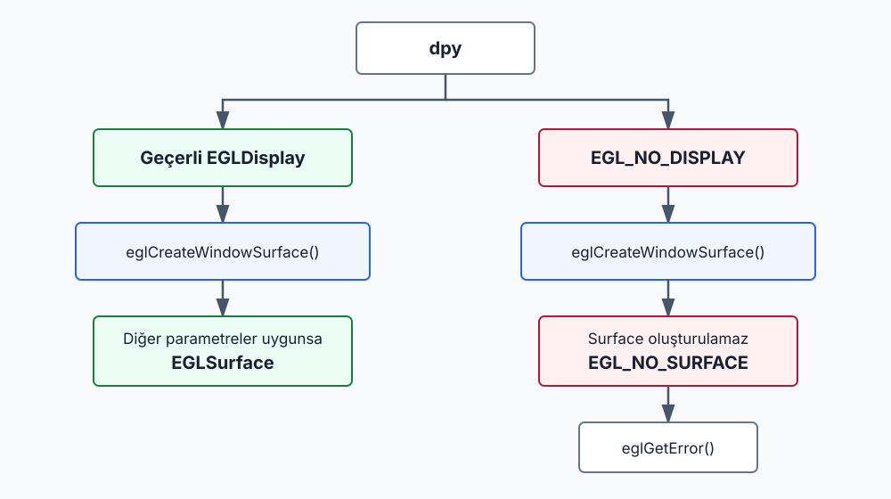

---

## 4.6 Rastgele Bir Değer Yazılırsa?

`dpy` bir `EGLDisplay` handle'ı bekler.

Bu yüzden:

```c
EGLDisplay fake_dpy =
    (EGLDisplay)0x1234;
```

gibi rastgele bir değer üretmek doğru API kullanımı değildir.

Kavramsal olarak:

```text
Rastgele değer
      |
      v
Geçerli EGLDisplay değil
      |
      v
Surface oluşturulması beklenmez
```

Kontrollü test için rastgele değer yerine:

```c
EGL_NO_DISPLAY
```

kullanmak daha doğru ve anlaşılır bir yöntemdir.

---

## 4.7 `dpy` Neyi Değiştirmez?

`dpy` aşağıdaki özellikleri doğrudan belirlemez:

```text
Çözünürlük
RGB bit sayıları
GBM pixel formatı
Native window
Surface attribute'ları
```

Yani:

```text
dpy
-> display bağlantısını seçer
```

ama:

```text
config
-> pixel/framebuffer özelliklerini

win
-> native target'ı

attrib_list
-> ek window surface attribute listesini
```

belirler.

---

# 5. İkinci Parametre: `config`

```c
EGLConfig config
```

## 5.1 `config` Nedir?

`config`, oluşturulacak surface'in framebuffer / pixel yapılandırmasını temsil eder.

Bu parametredeki senaryonun odağı config'in renk, depth veya stencil
değerlerini birbirleriyle karşılaştırmak değildir. Bu özellikler config
seçimi ve sorgulamasıyla ilgilidir. Ayrıntılar için
[`eglGetConfigAttrib`](eglGetConfigAttrib.md) dokümanına bakılmalıdır.

Bu fonksiyon açısından `config` iki temel senaryoya sahiptir:

```text
1. Geçerli EGLConfig
2. Geçersiz EGLConfig
```

---

## 5.2 Senaryo A - Geçerli `EGLConfig`

Geçerli senaryoda `config`:

```text
- dpy ile aynı EGLDisplay'a ait olmalıdır,
- EGL tarafından döndürülmüş geçerli bir handle olmalıdır,
- window surface oluşturmayı desteklemelidir.
```

Config seçilirken `EGL_SURFACE_TYPE` içinde `EGL_WINDOW_BIT`
istenmesi bu son koşulu sağlar:

```c
const EGLint config_attribs[] = {
    EGL_SURFACE_TYPE, EGL_WINDOW_BIT,
    EGL_NONE
};

EGLConfig valid_config;
EGLint num_configs = 0;

eglChooseConfig(
    egl_display,
    config_attribs,
    &valid_config,
    1,
    &num_configs
);

EGLSurface surface = eglCreateWindowSurface(
    egl_display,
    valid_config,
    (EGLNativeWindowType)gbm_surface,
    NULL
);
```

`num_configs > 0` ise ve diğer parametreler de geçerliyse beklenen sonuç:

```text
surface != EGL_NO_SURFACE
```

---

## 5.3 Senaryo B - Geçersiz `EGLConfig`

Geçersiz, uydurma veya `dpy` için tanımlı olmayan bir config handle'ı
verilirse surface oluşturulamaz.

```c
EGLConfig invalid_config = (EGLConfig)0;

EGLSurface surface = eglCreateWindowSurface(
    egl_display,
    invalid_config,
    (EGLNativeWindowType)gbm_surface,
    NULL
);

if (surface == EGL_NO_SURFACE) {
    printf("EGL error = 0x%X\n", eglGetError());
}
```

Beklenen sonuç:

```text
surface = EGL_NO_SURFACE
error   = EGL_BAD_CONFIG
```

> `(EGLConfig)0` yalnızca geçersiz handle senaryosunu göstermek içindir;
> geçerli bir config oluşturma yöntemi değildir.

---

## 5.4 `config` İçin Flow Chart

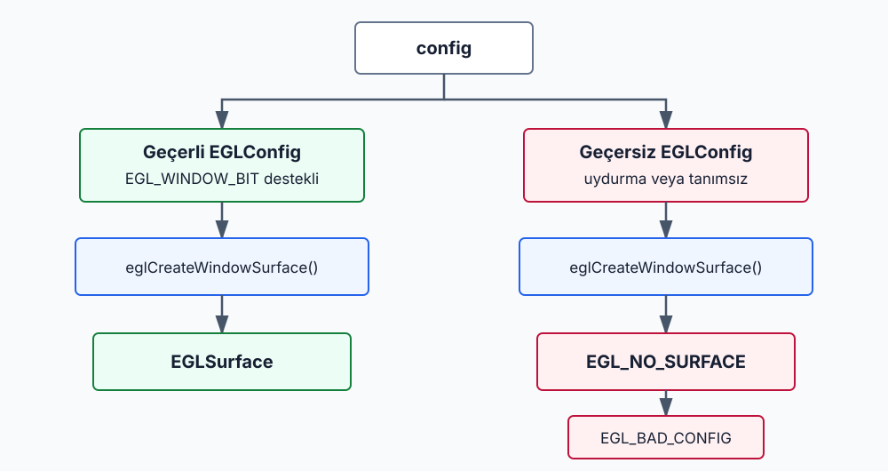

Config'in renk, alpha, depth, stencil ve diğer attribute değerleri bu iki
senaryonun alt konusu değildir. Bu değerler
[`eglGetConfigAttrib`](eglGetConfigAttrib.md) ile incelenir.

---

# 6. Üçüncü Parametre: `win`

```c
NativeWindowType win
```

## 6.1 `win` Nedir?

`win`, EGL'in üzerine `EGLSurface` oluşturacağı native window / native surface handle'ıdır.

EGL 1.0 gerçek native window türünü platforma bırakır. Bu nedenle
`EGLNativeWindowType` projeden projeye değişir:

```text
Platform / entegrasyon   Native window kaynağı
----------------------   ---------------------------
X11                      X11 Window
Wayland                  wl_egl_window / surface
Windows                  Native window handle (HWND)
Mesa/GBM                 struct gbm_surface *
Diğer platformlar         Platformun native window handle'ı
```

Kullanılacak gerçek tür, projenin EGL platform entegrasyonuna ve EGL
header'larındaki `EGLNativeWindowType` tanımına bağlıdır.

Bu projede:

```text
Mesa/GBM -> struct gbm_surface *
```

kullanılır.

Yani:

```c
win = (EGLNativeWindowType)gbm_surface;
```

---

## 6.2 Platforma Göre `win` Senaryoları

Her projede aynı anda bütün native window türleri kullanılmaz. `dpy` hangi
platform için oluşturulduysa `win` de o platformun beklediği native nesne
olmalıdır.

### Senaryo A - X11

```c
Window x11_window = /* XCreateWindow() ile oluşturulan pencere */;

EGLSurface surface = eglCreateWindowSurface(
    egl_display,
    egl_config,
    (EGLNativeWindowType)x11_window,
    NULL
);
```

### Senaryo B - Wayland

Wayland entegrasyonunda yaygın kullanım, `wl_surface` temel alınarak
oluşturulan bir `wl_egl_window` nesnesini EGL'e vermektir.

```c
struct wl_egl_window *wayland_window = /* platform tarafında oluşturulur */;

EGLSurface surface = eglCreateWindowSurface(
    egl_display,
    egl_config,
    (EGLNativeWindowType)wayland_window,
    NULL
);
```

### Senaryo C - Windows

```c
HWND native_window = /* Win32 tarafında oluşturulan pencere */;

EGLSurface surface = eglCreateWindowSurface(
    egl_display,
    egl_config,
    (EGLNativeWindowType)native_window,
    NULL
);
```

### Senaryo D - Bu Projede Mesa/GBM

```c
struct gbm_surface *gbm_surface = /* gbm_surface_create() sonucu */;

EGLSurface surface = eglCreateWindowSurface(
    egl_display,
    egl_config,
    (EGLNativeWindowType)gbm_surface,
    NULL
);
```

Ortak kural:

> `win`, aktif EGL platformuyla uyumlu ve geçerli bir native window olmalıdır.

Uyumsuz, yok edilmiş veya uydurma bir native window verilirse beklenen sonuç
`EGL_NO_SURFACE`, hata ise `EGL_BAD_NATIVE_WINDOW` olur.

### Bu Projede Farklı Native Target Örneği

`win` parametresi değiştiğinde oluşturulan `EGLSurface`'in hangi native surface'e bağlı olduğu değişir.

Örneğin iki farklı GBM surface düşünelim:

```c
struct gbm_surface *gbm_surface_A;
struct gbm_surface *gbm_surface_B;
```

Bunlardan:

```c
EGLSurface surface_A =
    eglCreateWindowSurface(
        egl_display,
        egl_config,
        (EGLNativeWindowType)gbm_surface_A,
        NULL
    );
```

ve:

```c
EGLSurface surface_B =
    eglCreateWindowSurface(
        egl_display,
        egl_config,
        (EGLNativeWindowType)gbm_surface_B,
        NULL
    );
```

oluşturulabilir.

Burada:

```text
dpy         = aynı
config      = aynı
attrib_list = aynı

win         = farklı
```

olduğu için native target değişmiştir.

---

## 6.3 `win` İçin Flow Chart

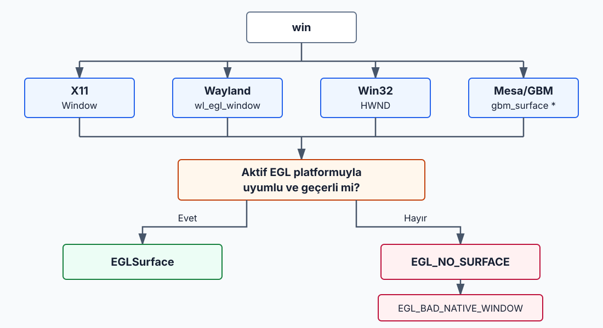

Ana sonuç:

> `win` türü projeden projeye değişir; verilen nesne aktif EGL platformuyla
> uyumlu olmalıdır.

---

# 7. Dördüncü Parametre: `attrib_list`

```c
const EGLint *attrib_list
```

## 7.1 `attrib_list` Nedir?

Bu parametre, window surface oluşturulurken kullanılabilecek surface attribute listesini temsil eder.

Ancak `eglCreateWindowSurface()` için EGL 1.0 core standardında önemli bir durum vardır:

> EGL 1.0 core'da bu fonksiyon için tanımlanmış değiştirilebilir window-surface attribute yoktur.

Bu nedenle normal kullanım:

```c
NULL
```

veya:

```c
const EGLint attrs[] = {
    EGL_NONE
};
```

şeklindedir.

---

## 7.2 Senaryo A - `NULL`

```c
EGLSurface surfaceA =
    eglCreateWindowSurface(
        egl_display,
        egl_config,
        (EGLNativeWindowType)gbm_surface,
        NULL
    );
```

Anlamı:

```text
attrib_list = NULL
        |
        v
Ek window surface attribute'u yok
```

---

## 7.3 Senaryo B - `{ EGL_NONE }`

```c
const EGLint attrs[] = {
    EGL_NONE
};

EGLSurface surfaceB =
    eglCreateWindowSurface(
        egl_display,
        egl_config,
        (EGLNativeWindowType)gbm_surface,
        attrs
    );
```

Burada:

```c
EGL_NONE
```

attribute listesinin bittiğini belirtir.

Yani:

```text
Liste başlıyor
      |
      v
İlk değer EGL_NONE
      |
      v
Liste hemen bitiyor
      |
      v
Ek attribute yok
```

---

## 7.4 `NULL` ile `{ EGL_NONE }` Arasında Görsel Fark Var mı?

EGL 1.0 core açısından:

```text
NULL
```

ve:

```text
{ EGL_NONE }
```

ikisi de ek window-surface attribute verilmediğini ifade eder.

Bu nedenle burada:

```text
kırmızı ekran
vs
mavi ekran
```

gibi anlamlı bir görsel fark beklenmez.

Bu parametre için en doğru kanıt türü **flow chart**'tır.

---

## 7.5 `attrib_list` İçin Flow Chart

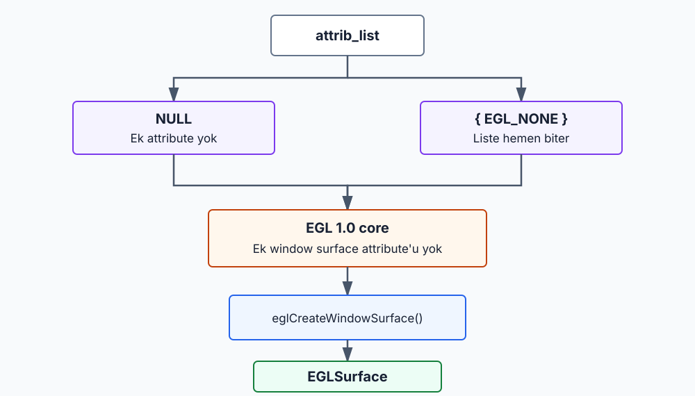

---

## 7.6 Neden Başka Bir Core Senaryo Yoktur?

Teknik olarak bir `EGLint` dizisi verilebilir:

```c
const EGLint attrs[] = {
    EGL_NONE
};
```

Ancak EGL 1.0 core'da `eglCreateWindowSurface()` için anlamlı bir window-surface attribute tanımlı değildir.

Örneğin:

```c
const EGLint attrs[] = {
    EGL_RED_SIZE, 8,
    EGL_NONE
};
```

yazmak doğru değildir.

Çünkü:

```c
EGL_RED_SIZE
```

`eglCreateWindowSurface()` için window-surface attribute değildir.

Bu tür özellikler:

```c
eglChooseConfig()
```

tarafında config seçimi için kullanılır.

Yani:

```text
EGL_RED_SIZE
      |
      v
eglChooseConfig()
```

doğrudur.

Ama:

```text
EGL_RED_SIZE
      |
      v
eglCreateWindowSurface attrib_list
```

EGL 1.0 core açısından doğru kullanım değildir.

---

## 7.7 Extension'lar Ne Olur?

Platform veya EGL extension'ları ilerleyen sürümlerde/uygulamalarda ek attribute'lar tanımlayabilir.

Ancak bunlar:

```text
EGL 1.0 core
```

davranışı değildir.

Bu dokümanın kapsamı EGL 1.0 olduğu için normal kullanım:

```c
NULL
```

veya:

```c
{ EGL_NONE }
```

olarak ele alınır.

---

# 8. Fonksiyonun Dönüş Değeri

Fonksiyonun dönüş tipi:

```c
EGLSurface
```

Başarı durumunda:

```text
geçerli EGLSurface handle
```

döner.

Başarısız olduğunda:

```c
EGL_NO_SURFACE
```

döner.

Örnek:

```c
EGLSurface surface =
    eglCreateWindowSurface(
        egl_display,
        egl_config,
        (EGLNativeWindowType)gbm_surface,
        NULL
    );

if (surface == EGL_NO_SURFACE) {
    EGLint error = eglGetError();

    printf(
        "eglCreateWindowSurface failed: 0x%X\n",
        error
    );
}
```

---

# EGL 1.0 Fonksiyon İncelemesi: `eglCreateContext`

```c
EGLContext eglCreateContext(EGLDisplay dpy,
                            EGLConfig config,
                            EGLContext share_context,
                            const EGLint *attrib_list);
```

`eglCreateContext`, EGL tarafında OpenGL ES komutlarının çalışacağı rendering context'i oluşturur. Context; çizim durumunu, bağlanacak client API bilgisini ve GPU tarafında kullanılacak bazı kaynak ilişkilerini temsil eder. Tek başına ekrana çizim yapmaz. Oluşturulan context'in gerçekten çizim yapabilmesi için daha sonra bir surface ile birlikte `eglMakeCurrent` çağrısına verilmesi gerekir.

Bu çalışmanın amacı, `eglCreateContext` fonksiyonundaki dört parametrenin sadece formal birer argüman olmadığını; ekranda görülen sonucu, kaynak paylaşımını ve çalışma yolunu doğrudan etkilediğini göstermektir.

| Parametre | İncelenen fark | Senaryo klasörü |
|---|---|---|
| `dpy` | Ana ekran ile yedek ekran display seçimi | `pDpyID_farki/` |
| `config` | Depth buffer yok/var seçimi | `uConfigID_farki/` |
| `share_context` | Kaynak paylaşımı yok/var seçimi | `uShareContext_farki/` |
| `attrib_list` | EGL 1.0 varsayılan kullanım ile GLES2 context talebi | `pAttribList_farki/` |

## Genel Çalışma Modeli

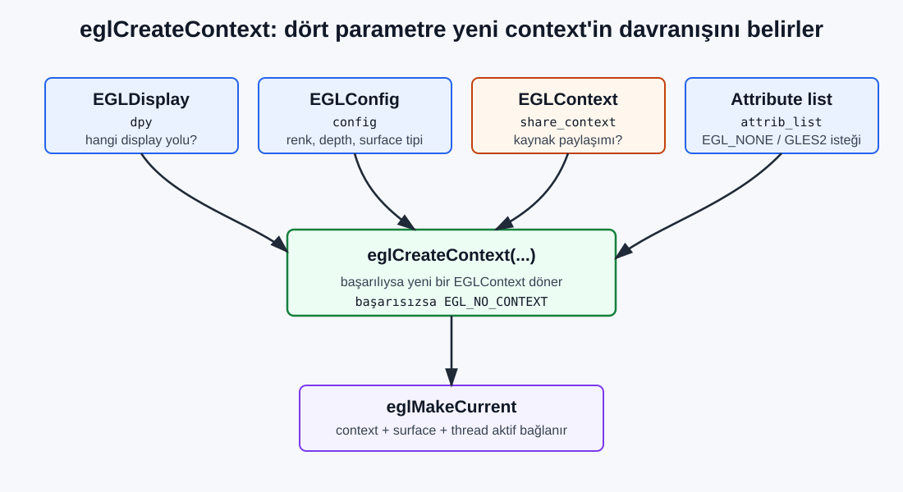

Temel fikir şudur: `eglCreateContext`, display bağlantısı (`dpy`), framebuffer özellikleri (`config`), isteğe bağlı ortak context (`share_context`) ve context attribute listesi (`attrib_list`) bilgilerini birleştirerek yeni bir `EGLContext` üretir.

```text
Native Display / GBM device
        |
        v
eglGetDisplay + eglInitialize
        |
        v
eglChooseConfig
        |
        v
eglCreateContext
        |
        v
eglCreateWindowSurface + eglMakeCurrent
        |
        v
OpenGL ES çizimi
```

Bu akışta `eglCreateContext` kritik bir eşiktir. Çünkü bu çağrıdan sonra artık hangi display üzerinde, hangi framebuffer özellikleriyle, hangi kaynak paylaşım ilişkisiyle ve hangi client API beklentisiyle çizim yapılacağı belirlenmiş olur.

## 1. Parametre: `dpy` (`EGLDisplay`)

`dpy`, context'in hangi EGL display bağlantısı üzerinde oluşturulacağını belirler. Çok ekranlı sistemlerde bu parametre, çizim yolunun ana kokpit ekranına mı yoksa yedek/standby ekrana mı bağlanacağını etkiler.

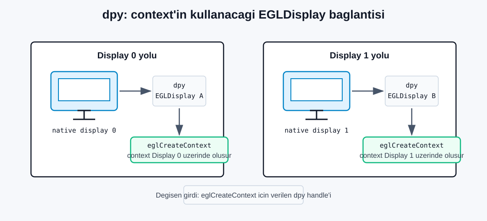

### Senaryo A: Ana ekran

Kaynak dosya: `pDpyID_farki/senaryo_A_ana_ekran.c`

Bu senaryoda `init_native_display_at(0)` ile 0 numaralı bağlı ekran seçilir. Ardından bu native display üzerinden `EGLDisplay` alınır ve context bu display üzerinde oluşturulur.

Beklenen çıktı:

```text
--- SENARYO A: pDpyID - Kokpit Ana Ekrani (PFD) ---
DEGER A: dpy = ana ekranin EGLDisplay handle'i.
 -> GORSEL SONUC: Ana ekran senaryosu koyu mavi zemin,
    camgobegi alt bant ve yesil ucgen cizer.
```

Görsel yorum: Ana ekran yolu koyu mavi zemin, camgöbeği alt bant ve yeşil üçgen ile temsil edilmiştir. Burada amaç, context'in 0 numaralı display yolunda oluşturulduğunu gözle seçilebilir hale getirmektir.

### Senaryo B: Yedek ekran

Kaynak dosya: `pDpyID_farki/senaryo_B_yedek_ekran.c`

Bu senaryoda `init_native_display_at(1)` ile ikinci bağlı ekran hedeflenir. Sistemde ikinci connector yoksa yardımcı kod 0 numaralı ekrana düşebilir; yine de farklı renk/desen kullanıldığı için seçilen senaryo görsel olarak ayırt edilir.

Beklenen çıktı:

```text
--- SENARYO B: pDpyID - Yedek Ekran (Standby/EICAS) ---
DEGER B: dpy = yedek ekran icin secilen EGLDisplay/native display yolu.
 -> GORSEL SONUC: Yedek ekran senaryosu kahverengi zemin,
    turuncu ust bant ve sari ucgen cizer.
```

Sonuç: `dpy` değiştiğinde context farklı native display yoluna bağlanır. Bu nedenle çizimin hangi fiziksel ya da mantıksal ekranda görüneceği `dpy` seçimiyle ilişkilidir.

## 2. Parametre: `config` (`EGLConfig`)

`config`, context'in birlikte kullanılacağı framebuffer özelliklerini belirler. Renk kanal boyutları, surface tipi, renderable API ve depth buffer gibi özellikler `EGLConfig` seçiminde yer alır. Bu çalışmada özellikle `EGL_DEPTH_SIZE` farkı incelenmiştir.

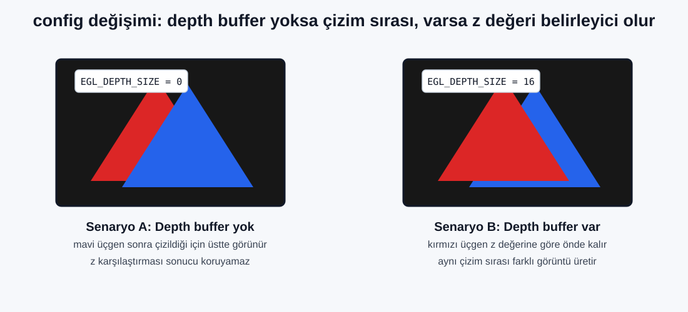

### Senaryo A: Depth buffer yok

Kaynak dosya: `uConfigID_farki/senaryo_A_derinlik_yok.c`

Bu senaryoda config attribute listesinde `EGL_DEPTH_SIZE, 0` kullanılır. Kodda depth test açılsa bile depth buffer olmadığı için z karşılaştırması beklenen şekilde çalışmaz; çizim sırası daha baskın hale gelir.

Beklenen çıktı:

```text
--- SENARYO A: uConfigID - Derinlik Tamponu Olmayan Config (EGL_DEPTH_SIZE = 0) ---
DEGER A: config = EGL_DEPTH_SIZE 0.
 -> GORSEL SONUC: Derinlik tamponu yok.
    Son cizilen mavi ucgen kirmizinin ustune biner.
```

Görsel yorum: Kırmızı üçgen önce, mavi üçgen sonra çizilir. Depth buffer olmadığı için son çizilen mavi üçgen üstte görünür.

### Senaryo B: Depth buffer var

Kaynak dosya: `uConfigID_farki/senaryo_B_derinlik_var.c`

Bu senaryoda config attribute listesinde `EGL_DEPTH_SIZE, 16` kullanılır. Aynı iki üçgen aynı sırayla çizilir; fakat depth buffer devrede olduğu için z değeri sonucu belirler.

Beklenen çıktı:

```text
--- SENARYO B: uConfigID - Derinlik Tamponu Olan Config (EGL_DEPTH_SIZE = 16) ---
DEGER B: config = EGL_DEPTH_SIZE 16.
 -> GORSEL SONUC: Derinlik tamponu var.
    Kirmizi ucgen onde kalir, mavi ucgen arkada elenir.
```

Sonuç: `config` parametresindeki depth buffer seçimi, aynı çizim komutlarının ekranda farklı sonuç üretmesine neden olur. Bu yüzden `EGLConfig`, yalnızca renk formatı seçimi değil, render davranışını etkileyen temel bir karardır.

## 3. Parametre: `share_context` (`EGLContext`)

`share_context`, yeni context'in mevcut bir context ile GL nesnelerini paylaşıp paylaşmayacağını belirler. Texture, buffer object ve benzeri bazı GL kaynakları paylaşılabilir. Buna karşılık viewport, current program, enable/disable state gibi context state'leri context'e özgü kalır.

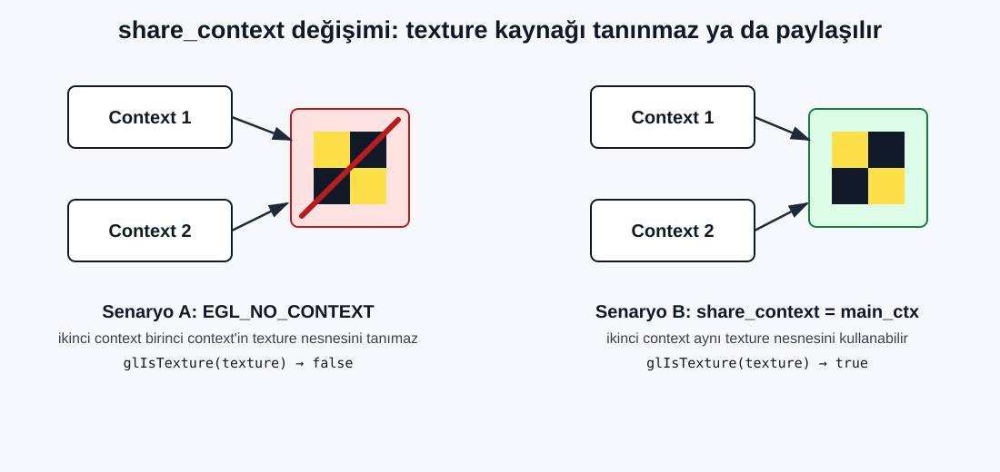

### Senaryo A: Paylaşım yok

Kaynak dosya: `uShareContext_farki/senaryo_A_paylasim_yok.c`

Bu senaryoda iki context de `EGL_NO_CONTEXT` ile oluşturulur. Birinci context içinde sarı-siyah checkerboard texture oluşturulur. İkinci context'e geçildiğinde `glIsTexture(texture)` kontrolü yapılır.

Beklenen çıktı:

```text
--- SENARYO A: uShareContext - Paylasim Yok (EGL_NO_CONTEXT) ---
[VRAM] 1. baglamda sari-siyah doku yaratildi. Texture ID: <id>

DEGER A: share_context = EGL_NO_CONTEXT
 -> SONUC: 2. baglam 1. baglamin dokusunu TANIMIYOR.
 -> GORSEL SONUC: Texture paylasilamadigi icin ekranda kirmizi hata/desen alani gorulur.
```

Görsel yorum: İkinci context birinci context'te üretilen texture nesnesini tanımaz. Bu nedenle texture yerine hata/desen alanı gösterilir.

### Senaryo B: Ortak context

Kaynak dosya: `uShareContext_farki/senaryo_B_ortak_context.c`

Bu senaryoda önce `main_ctx` oluşturulur. Sonra ikinci context şu şekilde oluşturulur:

```c
EGLContext shared_ctx = eglCreateContext(display, config, main_ctx, ctx_attribs);
```

Bu kullanımda ikinci context, birinci context'in paylaşıma uygun GL nesnelerini görebilir.

Beklenen çıktı:

```text
--- SENARYO B: uShareContext - Ortak Context (Paylasimli) ---
[VRAM] 1. baglamda sari-siyah doku yaratildi. Texture ID: <id>

DEGER B: share_context = main_ctx
 -> SONUC: 2. baglam 1. baglamin dokusunu TANIYOR.
 -> GORSEL SONUC: Paylasim calisinca 1. context'te uretilen
    sari-siyah doku 2. context'te gorunur.
```

Sonuç: `share_context = EGL_NO_CONTEXT` izolasyon sağlar. Geçerli bir context handle'ı verilirse kaynak paylaşımı yapılabilir. Çok ekranlı kokpit uygulamalarında bu özellik; font, sembol, harita texture'ı ve ortak buffer gibi GPU kaynaklarının tekrar tekrar yüklenmesini önler.

## 4. Parametre: `attrib_list` (`const EGLint *`)

`attrib_list`, context oluşturulurken istenen ek özellikleri anahtar-değer çiftleriyle belirtir. Liste mutlaka `EGL_NONE` ile bitmelidir.

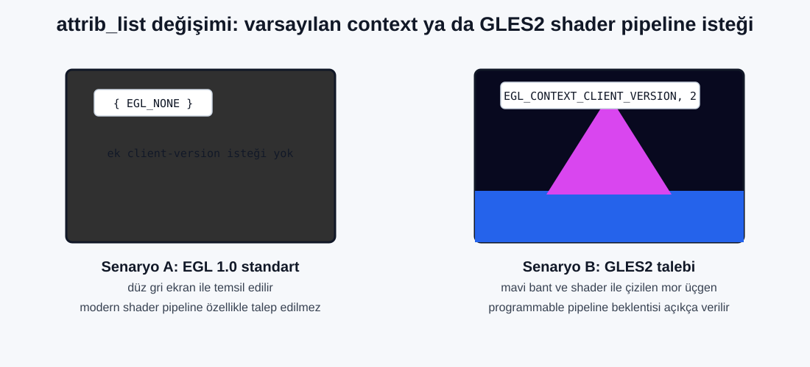

### Senaryo A: EGL 1.0 standart kullanım

Kaynak dosya: `pAttribList_farki/senaryo_A_egl10_standart.c`

Bu senaryoda attribute listesi sadece `EGL_NONE` içerir:

```c
EGLint egl10_attribs[] = { EGL_NONE };
```

Beklenen çıktı:

```text
--- SENARYO A: pAttribList - EGL 1.0 Standart Kullanimi ---
DEGER A: pAttribList = { EGL_NONE }
 -> SONUC: EGL 1.0 standart bicimde ek client-version istegi vermeden context olusturur.
 -> GORSEL SONUC: Duz gri ekran. Shader/modern pipeline talebi yapilmadi.
    Aktif OpenGL ES versiyonu: <sistemden gelen GL_VERSION>
```

Görsel yorum: Ek client-version talebi yapılmadığı için senaryo düz gri ekranla temsil edilmiştir.

### Senaryo B: Modern pipeline talebi

Kaynak dosya: `pAttribList_farki/senaryo_B_modern_pipeline.c`

Bu senaryoda attribute listesinde GLES2 context istenir:

```c
EGLint modern_attribs[] = {
    EGL_CONTEXT_CLIENT_VERSION, 2,
    EGL_NONE
};
```

Beklenen çıktı:

```text
--- SENARYO B: pAttribList - Modern Pipeline (EGL_CONTEXT_CLIENT_VERSION) ---
DEGER B: pAttribList = { EGL_CONTEXT_CLIENT_VERSION, 2, EGL_NONE }
 -> SONUC: GLES2/SC2.0 icin programmable shader pipeline talep edildi.
 -> GORSEL SONUC: Koyu zemin uzerinde mavi bant ve shader ile cizilen mor ucgen gorulur.
    Aktif OpenGL ES versiyonu: <sistemden gelen GL_VERSION>
```

Sonuç: `attrib_list`, context'in hangi client API beklentisiyle oluşturulacağını somutlaştırır. EGL 1.0 temelinde attribute listesi sınırlıdır; pratik sistemlerde ise `EGL_CONTEXT_CLIENT_VERSION` gibi alanlar GLES2 ve üstü pipeline seçimi için önemlidir.

## Hata Durumları

Fonksiyon başarısız olursa `EGL_NO_CONTEXT` döner. Hata nedeni `eglGetError()` ile okunmalıdır.

| Durum | Beklenen hata |
|---|---|
| `dpy` geçerli bir display değilse | `EGL_BAD_DISPLAY` |
| `dpy` initialize edilmemişse | `EGL_NOT_INITIALIZED` |
| `config` geçersizse | `EGL_BAD_CONFIG` |
| `share_context` geçersizse | `EGL_BAD_CONTEXT` |
| Context'ler paylaşım için uyumsuzsa | `EGL_BAD_MATCH` |
| `attrib_list` geçersiz attribute içeriyorsa | `EGL_BAD_ATTRIBUTE` |
| Bellek/GPU kaynağı yetersizse | `EGL_BAD_ALLOC` |

## Güvenli Kullanım Örneği

```c
#include <EGL/egl.h>
#include <stdio.h>

EGLContext CreateCheckedContext(EGLDisplay dpy,
                                EGLConfig config,
                                EGLContext shared_ctx) {
    const EGLint attrib_list[] = {
        EGL_CONTEXT_CLIENT_VERSION, 2,
        EGL_NONE
    };

    EGLContext context = eglCreateContext(dpy, config, shared_ctx, attrib_list);
    if (context == EGL_NO_CONTEXT) {
        EGLint err = eglGetError();
        fprintf(stderr, "eglCreateContext basarisiz oldu. EGL hata kodu: 0x%04x\n", err);
        return EGL_NO_CONTEXT;
    }

    return context;
}
```

## Pratik Özet

| Parametre | Değiştiğinde ne olur? | Bu projedeki somut kanıt |
|---|---|---|
| `dpy` | Context farklı display/native ekran yolu üzerinde oluşturulur. | Ana ekran ve yedek ekran farklı renk/desen üretir. |
| `config` | Framebuffer özellikleri değişir. | Depth yokken mavi üçgen üstte; depth varken kırmızı üçgen önde kalır. |
| `share_context` | GL nesnelerinin context'ler arasında paylaşılıp paylaşılmayacağı belirlenir. | Paylaşım yokken texture tanınmaz; paylaşım varken checkerboard texture görünür. |
| `attrib_list` | Context'in istenen client API/pipeline davranışı belirlenir. | `{ EGL_NONE }` gri ekran; GLES2 talebi shader ile mor üçgen üretir. |

`eglCreateContext` bu nedenle yalnızca bir handle üretme fonksiyonu değildir. Parametreleri; context'in hangi display üzerinde yaşayacağını, hangi framebuffer özelliklerini kullanacağını, hangi kaynakları paylaşacağını ve hangi API beklentisiyle çalışacağını belirler.

---

# EGL 1.0: `eglMakeCurrent`

```c
EGLBoolean eglMakeCurrent(EGLDisplay dpy,
                          EGLSurface draw,
                          EGLSurface read,
                          EGLContext ctx);
```

`eglMakeCurrent`, bir `EGLContext` nesnesini çağıran thread'in current rendering context'i yapar. Aynı çağrıda iki surface bağlanır:

- `draw`: OpenGL ES çizim komutlarının yazdığı framebuffer.
- `read`: `glReadPixels` gibi okuma komutlarının okuduğu framebuffer.

En yaygın kullanımda `draw` ve `read` aynı surface'tir:

```c
eglMakeCurrent(dpy, surface, surface, ctx);
```

## Kavramsal Akış

EGL 1.0 açısından current context thread-local bir durumdur:

```text
Thread
  |
  +-- current EGLDisplay
  +-- current EGLContext
  +-- current draw EGLSurface
  +-- current read EGLSurface
```

`eglMakeCurrent` bu dörtlüyü değiştirir. OpenGL ES komutları doğrudan `EGLContext` handle'ına parametre olarak verilmez; komutlar çağıran thread'in current context'i üzerinden çalışır.

Context'i bir “OpenGL ES makinesinin durumu”, surface'i ise bu makinenin
okuduğu/yazdığı pixel depoları gibi düşünmek yararlıdır:

```text
EGLContext -> renk, depth test, blending, texture binding gibi GL state
draw       -> sonuçların yazıldığı color/depth/stencil buffer'ları
read       -> pixel okuma işlemlerinin kaynak buffer'ı
thread     -> GL komutlarını hangi current bağlantının yorumlayacağını belirler
```

Depth, stencil ve multisample buffer'lar context'in içinde değil, surface ile
ilişkilidir. Aynı uyumlu surface'e farklı zamanlarda farklı context'ler bağlanırsa
bu surface buffer'larını paylaşırlar; her context'in GL state'i ise kendisine aittir.

## Parametreler

### `dpy`

`dpy`, context ve surface nesnelerinin ait olduğu initialized `EGLDisplay` olmalıdır.

| Değer                                | Sonuç                                                                  |
| ------------------------------------- | ----------------------------------------------------------------------- |
| Geçerli ve initialized`EGLDisplay` | Diğer parametreler de geçerliyse çağrı başarılıdır.            |
| `EGL_NO_DISPLAY`                    | Başarısız. Genel EGL hata modeliyle`EGL_BAD_DISPLAY` beklenir.     |
| Geçersiz display handle              | Başarısız. Genel EGL hata modeliyle`EGL_BAD_DISPLAY` beklenir.     |
| Initialize edilmemiş display         | Başarısız. Genel EGL hata modeliyle`EGL_NOT_INITIALIZED` beklenir. |

Pratik kural:

```c
EGLDisplay dpy = eglGetDisplay(native_display);
eglInitialize(dpy, &major, &minor);
```

`eglInitialize` başarılı olmadan `eglMakeCurrent` çağırma.

### `draw`

`draw`, çizim hedefidir.

| Değer                                                                        | Sonuç                                                         |
| ----------------------------------------------------------------------------- | -------------------------------------------------------------- |
| `ctx` ile uyumlu geçerli `EGLSurface`                                    | Geçerli. OpenGL ES draw komutları buraya yazar.              |
| `read` ile aynı surface                                                    | Geçerli ve normal kullanım.                                  |
| `read`'den farklı ama uyumlu surface                                       | Geçerli.                                                      |
| `EGL_NO_SURFACE` ve `ctx == EGL_NO_CONTEXT` ve `read == EGL_NO_SURFACE` | Geçerli. Current context release edilir.                      |
| `EGL_NO_SURFACE` ve `ctx != EGL_NO_CONTEXT`                               | Başarısız,`EGL_BAD_MATCH`.                                |
| Geçersiz surface                                                             | Başarısız,`EGL_BAD_SURFACE`.                              |
| Yok edilmiş surface                                                          | Başarısız veya sonraki framebuffer davranışı tanımsız. |
| Native window'u geçersiz window surface                                      | Başarısız,`EGL_BAD_NATIVE_WINDOW`.                        |
| `ctx` ile uyumsuz surface                                                   | Başarısız,`EGL_BAD_MATCH`.                                |
| Başka thread'de başka context'e bağlı surface                             | Başarısız,`EGL_BAD_ACCESS`.                               |

### `read`

`read`, framebuffer okuma kaynağıdır.

| Değer                                                                        | Sonuç                                        |
| ----------------------------------------------------------------------------- | --------------------------------------------- |
| `ctx` ile uyumlu geçerli `EGLSurface`                                    | Geçerli.`glReadPixels` buradan okur.       |
| `draw` ile aynı surface                                                    | Geçerli ve normal kullanım.                 |
| `draw`'dan farklı ama uyumlu surface                                       | Geçerli.                                     |
| `EGL_NO_SURFACE` ve `ctx == EGL_NO_CONTEXT` ve `draw == EGL_NO_SURFACE` | Geçerli. Current context release edilir.     |
| `EGL_NO_SURFACE` ve `ctx != EGL_NO_CONTEXT`                               | Başarısız,`EGL_BAD_MATCH`.               |
| Geçersiz surface                                                             | Başarısız,`EGL_BAD_SURFACE`.             |
| Yok edilmiş surface                                                          | Başarısız veya readback sonucu tanımsız. |
| Native window'u geçersiz window surface                                      | Başarısız,`EGL_BAD_NATIVE_WINDOW`.       |
| `ctx` ile uyumsuz surface                                                   | Başarısız,`EGL_BAD_MATCH`.               |
| Başka thread'de başka context'e bağlı surface                             | Başarısız,`EGL_BAD_ACCESS`.              |

### `ctx`

`ctx`, current yapılacak rendering context'tir.

| Değer                                                                     | Sonuç                                       |
| -------------------------------------------------------------------------- | -------------------------------------------- |
| Geçerli`EGLContext`                                                     | Çağıran thread'in current context'i olur. |
| `EGL_NO_CONTEXT`, `draw == EGL_NO_SURFACE`, `read == EGL_NO_SURFACE` | Geçerli. Current context kaldırılır.     |
| `EGL_NO_CONTEXT`, ama `draw` veya `read` gerçek surface             | Başarısız,`EGL_BAD_MATCH`.              |
| Geçersiz context                                                          | Başarısız,`EGL_BAD_CONTEXT`.            |
| Başka thread'de current olan context                                      | Başarısız,`EGL_BAD_ACCESS`.             |
| Surface'lerle uyumsuz context                                              | Başarısız,`EGL_BAD_MATCH`.              |

## Geçerli Kombinasyonlar

### 1. Normal bind

```c
eglMakeCurrent(dpy, surface, surface, ctx);
```

Sonuç:

```text
Thread current context = ctx
Thread draw surface    = surface
Thread read surface    = surface
```

### 2. Ayrı draw/read surface

```c
eglMakeCurrent(dpy, draw_surface, read_surface, ctx);
```

Sonuç:

```text
Draw commands -> draw_surface
Read commands -> read_surface
```

Bu kullanım daha nadirdir ama EGL 1.0 tarafından desteklenir.

### 3. Current context'i bırakma

```c
eglMakeCurrent(dpy, EGL_NO_SURFACE, EGL_NO_SURFACE, EGL_NO_CONTEXT);
```

Bu, EGL 1.0'da current context'i release etmenin doğru biçimidir.

## “Context ile surface uyumlu” ne demektir?

EGL 1.0'da yalnızca handle'ların geçerli olması yetmez. Context ve surface:

- aynı `EGLDisplay` ile oluşturulmuş olmalı,
- color ve ancillary buffer derinlikleri uyumlu olmalıdır.

Ancillary buffer; depth, stencil ve multisample buffer gibi color dışındaki
buffer'ları kapsar. Örneğin context'in config'i RGBA8888 + depth24 + stencil8
iken surface RGB565 + depth16 ise ikisi geçerli EGL nesneleri olsa bile birlikte
current yapılamaz ve `EGL_BAD_MATCH` oluşur.

Config ID'lerinin aynı olması zorunlu değildir. İki farklı config handle'ı aynı
display üzerinde aynı color/ancillary buffer derinliklerini tarif ediyorsa uyumlu
olabilir. Buna karşılık bit büyüklükleri aynı olsa bile farklı display'lerde
oluşturulan nesneler uyumlu değildir.

| Context config | Surface config | Display | Sonuç |
| -------------- | -------------- | ------- | ----- |
| RGBA8, D24, S8 | RGBA8, D24, S8 | Aynı | Uyumlu olabilir. |
| RGBA8, D24, S8 | RGB565, D16, S0 | Aynı | `EGL_BAD_MATCH` |
| RGBA8, D24, S8 | RGBA8, D24, S8 | Farklı | `EGL_BAD_MATCH` |

## Ayrı draw/read surface için somut örnek

İki surface de context ile uyumluysa çizim ve okuma hedefleri ayrılabilir:

```c
eglMakeCurrent(dpy, window_surface, pbuffer_surface, ctx);

/* Çizim komutları window_surface'e gider. */
glClear(GL_COLOR_BUFFER_BIT);

/* Pixel okuma pbuffer_surface'ten gelir. */
glReadPixels(0, 0, width, height, GL_RGBA, GL_UNSIGNED_BYTE, pixels);
```

Bu çağrı pbuffer içeriğini window'a kopyalamaz. Yalnızca aynı context için draw
ve read yönlerinin hangi surface'i kullandığını belirler.

## İki thread arasında context devretme

Bir context aynı anda yalnızca bir thread'de current olabilir. Thread A'da
current olan `ctx` doğrudan Thread B'de bağlanırsa `EGL_BAD_ACCESS` oluşur.
Güvenli mantıksal sıra şöyledir:

```text
Thread A: GL işini bitir
Thread A: eglMakeCurrent(dpy, EGL_NO_SURFACE, EGL_NO_SURFACE, EGL_NO_CONTEXT)
Thread A -> Thread B: uygulama düzeyinde mutex/condition ile haber ver
Thread B: eglMakeCurrent(dpy, surface, surface, ctx)
```

EGL çağrıları uygulamanın thread'leri arasındaki iş teslim protokolünün yerini
almaz; aynı context'e erişimi uygulama ayrıca senkronize etmelidir.

## Geçersiz Kombinasyon Matrisi

| `draw`             | `read`             | `ctx`            | Sonuç                        |
| -------------------- | -------------------- | ------------------ | ----------------------------- |
| surface              | surface              | context            | Geçerli, uyumluysalar.       |
| surface A            | surface B            | context            | Geçerli, ikisi de uyumluysa. |
| `EGL_NO_SURFACE`   | `EGL_NO_SURFACE`   | `EGL_NO_CONTEXT` | Geçerli release çağrısı. |
| surface              | surface              | `EGL_NO_CONTEXT` | `EGL_BAD_MATCH`             |
| `EGL_NO_SURFACE`   | surface              | context            | `EGL_BAD_MATCH`             |
| surface              | `EGL_NO_SURFACE`   | context            | `EGL_BAD_MATCH`             |
| `EGL_NO_SURFACE`   | `EGL_NO_SURFACE`   | context            | `EGL_BAD_MATCH`             |
| invalid surface      | surface              | context            | `EGL_BAD_SURFACE`           |
| surface              | invalid surface      | context            | `EGL_BAD_SURFACE`           |
| surface              | surface              | invalid context    | `EGL_BAD_CONTEXT`           |
| incompatible surface | surface              | context            | `EGL_BAD_MATCH`             |
| surface              | incompatible surface | context            | `EGL_BAD_MATCH`             |

## Hata Kodları

| Hata                        | Ne zaman                                                                                                                               |
| --------------------------- | -------------------------------------------------------------------------------------------------------------------------------------- |
| `EGL_BAD_MATCH`           | Surface/context uyumsuzsa;`EGL_NO_CONTEXT`/`EGL_NO_SURFACE` kombinasyonu yanlışsa; draw/read aynı anda belleğe sığamıyorsa. |
| `EGL_BAD_ACCESS`          | `ctx` başka thread'de current ise; `draw` veya `read` başka thread'de bir context'e bağlıysa.                                |
| `EGL_BAD_CONTEXT`         | `ctx` geçerli EGL context değilse.                                                                                                 |
| `EGL_BAD_SURFACE`         | `draw` veya `read` geçerli EGL surface değilse.                                                                                  |
| `EGL_BAD_NATIVE_WINDOW`   | Surface'in altında yatan native window artık geçerli değilse.                                                                      |
| `EGL_BAD_CURRENT_SURFACE` | Önceki current context'in flush edilmemiş komutları varsa ve önceki surface artık geçerli değilse.                              |
| `EGL_BAD_ALLOC`           | Draw/read için gerekli ancillary buffer'lar ayrılamazsa.                                                                             |

## Durum Değişimi

Başarılı çağrı öncesi:

```text
Thread current context = old_ctx
Thread draw surface    = old_draw
Thread read surface    = old_read
```

Başarılı `eglMakeCurrent(dpy, draw, read, ctx)` sonrası:

```text
old_ctx flush edilir
old_ctx artık current değildir

Thread current context = ctx
Thread draw surface    = draw
Thread read surface    = read
```

Başarılı release sonrası:

```text
eglMakeCurrent(dpy, EGL_NO_SURFACE, EGL_NO_SURFACE, EGL_NO_CONTEXT)

Thread current context = EGL_NO_CONTEXT
Thread draw surface    = EGL_NO_SURFACE
Thread read surface    = EGL_NO_SURFACE
```

## Viewport ve Scissor Notu

EGL 1.0 spec'ine göre bir context ilk kez current yapıldığında viewport ve scissor boyutları draw surface boyutuna ayarlanır:

```text
glViewport(0, 0, draw_width, draw_height)
glScissor(0, 0, draw_width, draw_height)
```

Bu yalnızca context'in ilk current yapılma anı için önemlidir. Sonraki bind işlemlerinde viewport/scissor'ın otomatik güncelleneceğini varsayma.

## Yok Etme Sonrası Davranış

`eglMakeCurrent` başarılı olduktan sonra:

- `draw` destroy edilirse render komutları işlenebilir ama framebuffer state tanımsız olur.
- `read` destroy edilirse `glReadPixels` gibi okuma sonuçları tanımsız olur.
- Native window/pixmap destroy edilirse de ilgili surface için aynı mantık geçerlidir.

Bu yüzden güvenli kapanış sırası genelde şudur:

```c
eglMakeCurrent(dpy, EGL_NO_SURFACE, EGL_NO_SURFACE, EGL_NO_CONTEXT);
eglDestroySurface(dpy, surface);
eglDestroyContext(dpy, ctx);
eglTerminate(dpy);
```

## Temel Kullanım

```c
EGLDisplay dpy = eglGetDisplay(native_display);
eglInitialize(dpy, &major, &minor);

EGLConfig config = /* eglChooseConfig ile alınmış config */;
EGLSurface surface = /* eglCreateWindowSurface veya eglCreatePbufferSurface */;
EGLContext ctx = eglCreateContext(dpy, config, EGL_NO_CONTEXT, NULL);

if (!eglMakeCurrent(dpy, surface, surface, ctx)) {
    EGLint err = eglGetError();
}

/* OpenGL ES komutları */

eglMakeCurrent(dpy, EGL_NO_SURFACE, EGL_NO_SURFACE, EGL_NO_CONTEXT);
```

## Bölüm Özeti

- `eglMakeCurrent` thread-local current context'i değiştirir.
- OpenGL ES komutlarının hangi context/surface üzerinde çalışacağını bu çağrı belirler.
- `draw` çizim hedefidir, `read` okuma hedefidir.
- Context GL state'ini, surface ise color/depth/stencil gibi framebuffer depolarını taşır.
- Uyum için nesnelerin aynı display'e ait olması ve color/ancillary buffer derinliklerinin eşleşmesi gerekir.
- `EGL_NO_CONTEXT` sadece iki surface de `EGL_NO_SURFACE` ise geçerlidir.
- Context veya surface başka thread'de bağlıysa `EGL_BAD_ACCESS` beklenir.
- Surface/context format ve display açısından uyumsuzsa `EGL_BAD_MATCH` beklenir.

## Kaynak

Bağlama, uyumluluk, thread ve hata kuralları için Khronos'un
[EGL 1.0 Specification](https://registry.khronos.org/EGL/specs/eglspec.1.0.pdf)
belgesindeki 2.2 ve 3.6.3 bölümleri esas alınmıştır.

---

# EGL 1.0: `eglGetCurrentDisplay`

```c
EGLDisplay eglGetCurrentDisplay(void);
```

`eglGetCurrentDisplay`, çağıran thread üzerinde current durumda olan EGL context ile ilişkili `EGLDisplay` handle'ını döndürür.

Kısa özet:

- Parametre almaz.
- Current context varsa ilişkili `EGLDisplay` döner.
- Current context yoksa `EGL_NO_DISPLAY` döner.
- Display'in yalnızca initialize edilmiş olması yeterli değildir.
- Davranışı parametreye değil current EGL state'e bağlıdır.

## Kavramsal Akış

```text
Thread
  |
  +-- current EGLContext
  |
  +-- current draw EGLSurface
  |
  +-- current read EGLSurface
  |
  +-- current EGLDisplay
```

`eglGetCurrentDisplay`, bu thread-local current state içindeki display'i sorgular.

## Parametreler

Fonksiyon parametre almaz:

```c
eglGetCurrentDisplay(void);
```

Bu nedenle görevdeki “parametreleri değiştirerek davranışı gözlemleme” yaklaşımı burada uygulanamaz.

Bunun yerine current EGL state değiştirildi.

## `eglGetDisplay` ile Farkı

`eglGetDisplay`:

```c
EGLDisplay eglGetDisplay(EGLNativeDisplayType display_id);
```

Native display'den EGL display handle'ı elde eder.

`eglGetCurrentDisplay`:

```c
EGLDisplay eglGetCurrentDisplay(void);
```

Current context'in bağlı olduğu display'i sorgular.

```text
eglGetDisplay
native display -> EGLDisplay

eglGetCurrentDisplay
current context -> ilişkili EGLDisplay
```

## `eglInitialize` ile Farkı

```text
eglInitialize
    |
    v
Display EGL kullanımı için initialize edilir
```

Bu işlem tek başına current state oluşturmaz:

```text
eglInitialize başarılı
    |
    v
eglGetCurrentDisplay == EGL_NO_DISPLAY
```

## `eglMakeCurrent` ile İlişki

`eglMakeCurrent`, current state'i değiştirir:

```c
eglMakeCurrent(dpy, surface, surface, ctx);
```

Başarılı bir çağrıdan sonra `eglGetCurrentDisplay()` ilgili display'i döndürür.

Release:

```c
eglMakeCurrent(
    dpy,
    EGL_NO_SURFACE,
    EGL_NO_SURFACE,
    EGL_NO_CONTEXT
);
```

sonrasında `eglGetCurrentDisplay()` tekrar `EGL_NO_DISPLAY` döndürür.

`eglMakeCurrent` ayrıntıları için ilgili bölüme bakınız.

## `EGL_NO_DISPLAY` Her Zaman Hata Değildir

`eglGetCurrentDisplay()` için:

```c
EGL_NO_DISPLAY
```

current context bulunmadığında normal bir state sonucudur.

Örneğin:

```text
Program yeni başladı
Current context yok
eglGetCurrentDisplay -> EGL_NO_DISPLAY
```

Bu tek başına “EGL API hatası oluştu” anlamına gelmez.

## Thread-Local Durum

Current state thread-local'dır.

`eglGetCurrentDisplay`:

```text
“Programın herhangi bir yerinde kullanılan display hangisi?”
```

sorusunu değil:

```text
“Bu çağrıyı yapan thread'in current context'i hangi display'e bağlı?”
```

sorusunu cevaplar.

## Temel Kullanım

```c
EGLDisplay current = eglGetCurrentDisplay();

if (current == EGL_NO_DISPLAY) {
    printf("Current EGL display yok.\n");
} else {
    printf("Current EGLDisplay: %p\n", (void *)current);
}
```

## Bölüm Özeti

- `eglGetCurrentDisplay` parametre almaz.
- Dönüş tipi `EGLDisplay`'dir.
- Current context varsa onun bağlı olduğu display'i döndürür.
- Current context yoksa `EGL_NO_DISPLAY` döndürür.
- Display'in yalnızca oluşturulmuş veya initialize edilmiş olması yeterli değildir.
- Current state `eglMakeCurrent` ile oluşturulur/değiştirilir.
- Current context release edilince sonuç tekrar `EGL_NO_DISPLAY` olur.
- `EGL_NO_DISPLAY` bu fonksiyonda normal bir state sonucu olabilir.
- Current state thread-local'dır.

---

# EGL 1.0 Fonksiyon İncelemesi: `eglGetCurrentContext`

```c
EGLContext eglGetCurrentContext(void);
```

`eglGetCurrentContext`, çağrıyı yapan thread üzerinde o anda aktif olan `EGLContext` handle değerini döndürür. Fonksiyon parametre almaz; EGL'in thread-local durumunu okur. Bu yüzden aktif context varsa o context döner, aktif context yoksa `EGL_NO_CONTEXT` döner.

Bu çalışmada fonksiyonun `void` parametreli yapısı iki pratik durum üzerinden incelenmiştir:

| Senaryo | Test Edilen Durum | Beklenen Sonuç |
|---|---|---|
| Senaryo A | `eglMakeCurrent` ile context aktif hale getirildikten sonra `eglGetCurrentContext()` çağrılır. | Fonksiyon, aktif context handle değerini döndürür ve OpenGL ES çizimi yapılabilir. |
| Senaryo B | Context önce aktif edilir, sonra `EGL_NO_CONTEXT` ile thread'den ayrılır. | Fonksiyon `EGL_NO_CONTEXT` döndürür; aktif context olmadığı için yeni çizim yapılmaz. |

## Fonksiyonun Temel Mantığı

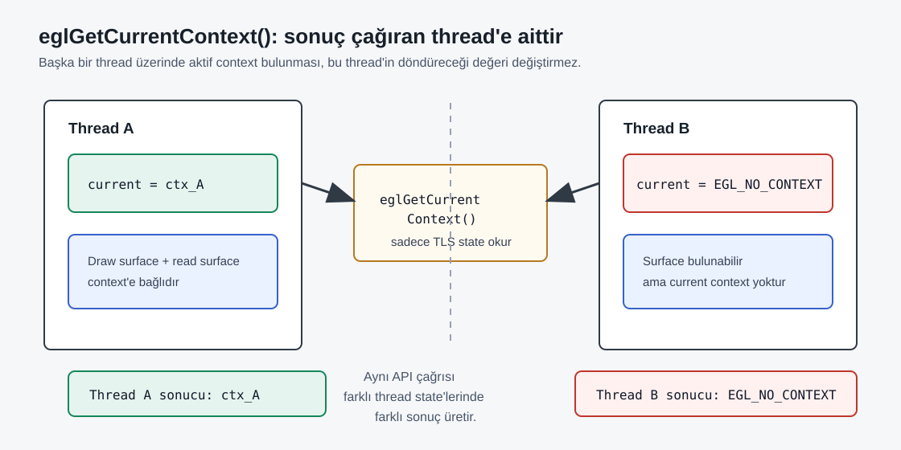

`eglGetCurrentContext` global bir context listesinde arama yapmaz. Sadece çağrıldığı thread'in EGL state bilgisini kontrol eder. Aynı programda başka bir thread üzerinde aktif context bulunması, bu thread için sonucu değiştirmez.

```text
Çağıran thread üzerinde aktif EGLContext varsa:
    eglGetCurrentContext() -> aktif EGLContext handle değeri

Çağıran thread üzerinde aktif EGLContext yoksa:
    eglGetCurrentContext() -> EGL_NO_CONTEXT
```

Bu davranış özellikle render kodlarında önemlidir. Çünkü OpenGL ES komutları, doğrudan fonksiyonlara verilen context ile değil, çağrıyı yapan thread'e current yapılmış context ile çalışır.

## Parametre İncelemesi

Spesifikasyona göre fonksiyonun parametresi yoktur.

| Parametre Biçimi | Anlamı | Testteki Etkisi |
|---|---|---|
| `void` | Fonksiyon argüman almaz. | Sonuç, tamamen çağıran thread'in mevcut EGL state durumuna bağlıdır. |

`eglGetCurrentContext` doğrudan `NativeWindowType`, `NativePixmapType`, attribute listesi, buffer tipi veya surface parametresi almaz. Ancak dönen context, daha önce `eglMakeCurrent(display, draw, read, context)` çağrısıyla bir draw/read surface çiftine bağlanmış olabilir.

## Senaryo A: Aktif Context Varken

Kaynak dosya: `void_param/scenario_a.c`

Bu senaryoda EGL/DRM/GBM ortamı hazırlanır. Ardından `eglMakeCurrent` ile oluşturulan context current yapılır. Sonrasında `eglGetCurrentContext()` çağrılır ve dönen handle, programın oluşturduğu `state.egl_context` ile karşılaştırılır.

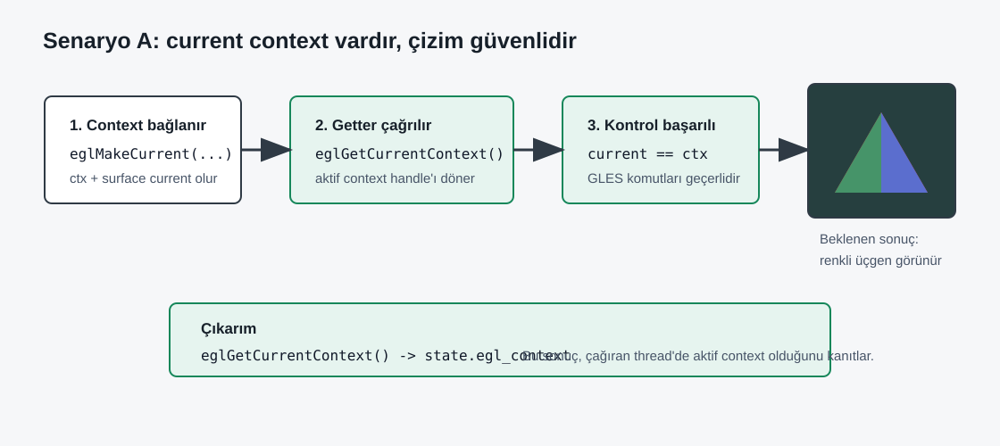

### Kod Akışı

```c
make_current_checked(&state,
                     state.egl_surface,
                     state.egl_surface,
                     state.egl_context,
                     "Context aktif edilemedi...");

EGLContext current = eglGetCurrentContext();

if (current == state.egl_context) {
    printf("BASARILI: aktif context dogru sekilde donduruldu.\n");
}
```

### Beklenen Terminal Çıktısı

Gerçek handle değeri çalıştırılan sisteme göre değişir. Bu nedenle `0x...` kısmı örnek gösterimdir.

```text
==================================================
SENARYO A: Aktif bir context varken eglGetCurrentContext cagirimi
==================================================
1. eglMakeCurrent basariyla cagirildi ve context aktif edildi.
2. BASARILI: eglGetCurrentContext aktif olan context'i (0x...) dogru sekilde dondurdu.
3. Cizim islemi baslatiliyor (Ekranda renkli bir ucgen gormelisiniz)...
4. Cizim tamamlandi, pencere 3 saniye acik kalacak.
```

### Görsel Çıktı

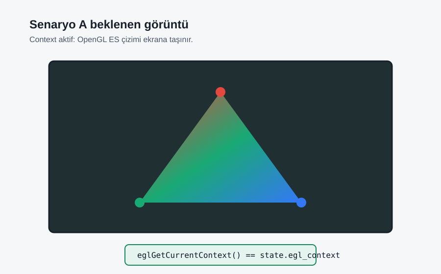

Context aktif olduğu için OpenGL ES komutları geçerli context üzerinde çalışır. Program önce arka planı koyu yeşilimsi renge temizler, sonra kırmızı, yeşil ve mavi köşelere sahip bir üçgen çizer. Son adımda `eglSwapBuffers` çağrısı ile çizilen görüntü ekrana taşınır.

## Senaryo B: Aktif Context Yokken

Kaynak dosya: `void_param/scenario_b.c`

Bu senaryoda context ilk başta aktif edilir ve ekran kırmızıya temizlenir. Daha sonra aşağıdaki çağrı ile context thread'den ayrılır:

```c
eglMakeCurrent(display, EGL_NO_SURFACE, EGL_NO_SURFACE, EGL_NO_CONTEXT);
```

Bu detach işleminden sonra `eglGetCurrentContext()` çağrıldığında artık current context olmadığı için fonksiyonun `EGL_NO_CONTEXT` döndürmesi beklenir.

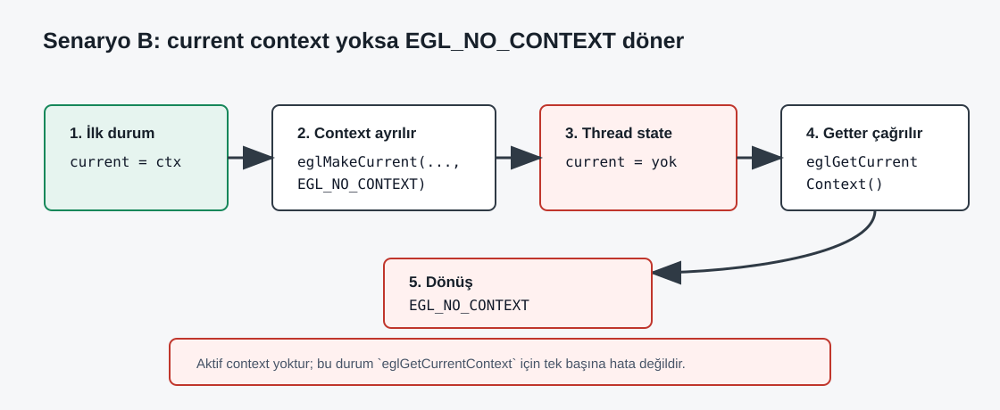

### Kod Akışı

```c
make_current_checked(&state,
                     EGL_NO_SURFACE,
                     EGL_NO_SURFACE,
                     EGL_NO_CONTEXT,
                     "Context detach edilemedi...");

EGLContext current = eglGetCurrentContext();

if (current == EGL_NO_CONTEXT) {
    printf("SONUC: eglGetCurrentContext() EGL_NO_CONTEXT dondurdu.\n");
}
```

### Beklenen Terminal Çıktısı

```text
==================================================
SENARYO B: Aktif bir context YOKKEN eglGetCurrentContext cagirimi
==================================================
1. eglMakeCurrent ile aktif context kapatiliyor (EGL_NO_CONTEXT geciliyor).
2. eglGetCurrentContext cagirildi.
-> SONUC: Beklendigi gibi eglGetCurrentContext() EGL_NO_CONTEXT dondurdu.

>>> Bu senaryoda aktif bir context olmadigi icin ucgen cizilemedi ve ekrana HICBIR SEY CIZILEMEDI. <<<

3. Gorsel ispat icin pencere 3 saniye acik tutuluyor. (Sadece kirmizi arka plan goreceksiniz, ucgen yok!)
```

### Görsel Çıktı

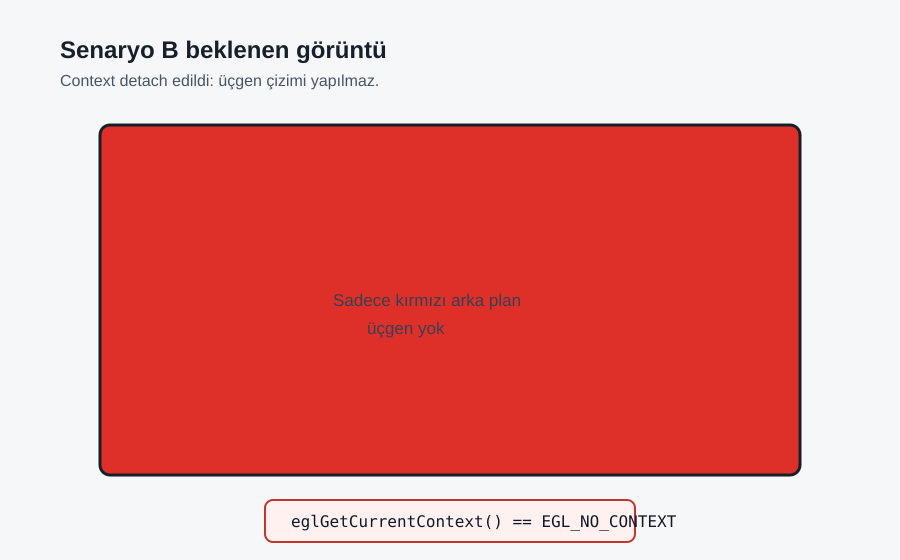

Bu senaryoda `eglGetCurrentContext()` sonucu `EGL_NO_CONTEXT` olduğu için üçgen çizilmez. Program, görsel ayrımı kolaylaştırmak için detach öncesinde ekranı kırmızıya temizler. Daha sonra sadece mevcut buffer'ı göstermek amacıyla context geçici olarak tekrar bağlanır ve `eglSwapBuffers` yapılır; bu aşamada yeni çizim komutu verilmez. Bu yüzden beklenen görüntü sadece kırmızı arka plandır.

## Sonuçların Karşılaştırması

| Kontrol Noktası | Senaryo A | Senaryo B |
|---|---|---|
| `eglMakeCurrent` sonrası thread state | Context aktif | Context detach edilmiş |
| `eglGetCurrentContext()` sonucu | `state.egl_context` | `EGL_NO_CONTEXT` |
| OpenGL ES çizimi yapılabilir mi? | Evet | Hayır, current context yoktur |
| Görsel çıktı | Koyu arka plan üzerinde renkli üçgen | Sadece kırmızı arka plan |
| Testin gösterdiği ana fikir | Fonksiyon aktif context'i doğru döndürür. | Aktif context yoksa güvenli biçimde `EGL_NO_CONTEXT` döner. |

## Hata Davranışı

`eglGetCurrentContext` bir getter fonksiyonudur. State değiştirmez, parametre doğrulaması yapmaz ve normal kullanımda yeni bir EGL hatası üretmesi beklenmez.

| Durum | Dönüş Değeri | Açıklama |
|---|---|---|
| EGL initialize edilmemişse | `EGL_NO_CONTEXT` | Current context olmadığı için boş context döner. |
| Mevcut thread'de context yoksa | `EGL_NO_CONTEXT` | Başka thread'deki context bu sonucu değiştirmez. |
| `eglMakeCurrent` başarılı olduysa | Aktif `EGLContext` | Dönen handle beklenen context ile karşılaştırılabilir. |

`EGL_BAD_MATCH`, `EGL_BAD_NATIVE_WINDOW` veya `EGL_BAD_SURFACE` gibi hatalar bu getter fonksiyonundan değil; genellikle `eglMakeCurrent`, `eglCreateWindowSurface` veya `eglSwapBuffers` gibi surface/context ilişkisini kuran çağrılardan kaynaklanır.

## Güvenli Kullanım Örneği

```c
#include <EGL/egl.h>
#include <stdio.h>

void perform_safe_rendering(EGLDisplay dpy,
                            EGLSurface draw,
                            EGLSurface read,
                            EGLContext ctx) {
    if (!eglMakeCurrent(dpy, draw, read, ctx)) {
        EGLint err = eglGetError();
        fprintf(stderr, "eglMakeCurrent basarisiz oldu: 0x%04X\n", err);
        return;
    }

    EGLContext current_ctx = eglGetCurrentContext();

    if (current_ctx == EGL_NO_CONTEXT) {
        fprintf(stderr, "Aktif context yok; cizim guvenli degil.\n");
        return;
    }

    if (current_ctx != ctx) {
        fprintf(stderr, "Aktif context beklenen context ile eslesmiyor.\n");
        eglMakeCurrent(dpy, EGL_NO_SURFACE, EGL_NO_SURFACE, EGL_NO_CONTEXT);
        return;
    }

    printf("Context dogrulandi. Cizim yapilabilir.\n");

    /* glClear, glDrawArrays, eglSwapBuffers ... */

    eglMakeCurrent(dpy, EGL_NO_SURFACE, EGL_NO_SURFACE, EGL_NO_CONTEXT);
}
```

## Pratik Özet

- `eglGetCurrentContext` parametre almaz; fonksiyon imzasındaki `void` bunu gösterir.
- Fonksiyonun sonucu çağıran thread'in EGL state bilgisine bağlıdır.
- Aktif context varsa gerçek `EGLContext` handle değeri döner.
- Aktif context yoksa `EGL_NO_CONTEXT` döner.
- Senaryo A, context doğrulamasını ve çizilebilir durumu gösterir.
- Senaryo B, context detach edildikten sonra yeni çizimin yapılamayacağını gösterir.

## Teslim Notu

Bu rapordaki SVG görselleri, kodun beklenen davranışını şematik olarak anlatmak için hazırlanmıştır. Donanım üzerinde alınmış gerçek ekran görüntüleri eklenmek istenirse aşağıdaki dosya adları kullanılabilir:

```text
assets/screenshots/scenario_a_triangle.png
assets/screenshots/scenario_b_red_background.png
```

Gerçek görüntüler EGL/GBM destekli Linux ortamında, `/dev/dri/card0` erişimi olan bir cihazda alınmalıdır. Bu çalışma Windows ortamında düzenlendiği için gerçek DRM/GBM ekran çıktısı yakalanmamıştır.

---

# EGL 1.0: `eglSwapBuffers`

```c
EGLBoolean eglSwapBuffers(EGLDisplay dpy,
                          EGLSurface surface);
```

`eglSwapBuffers`, EGL 1.0'da rendering sonrası color buffer'ı native window'a post etmek için kullanılır.

Kısa özet:

- Window surface için: color buffer native window'a post edilir.
- Pbuffer surface için: etkisi yoktur.
- Pixmap surface için: etkisi yoktur.
- EGL 1.0'da `surface`, çağıran thread'in current context'ine bağlı olmalıdır.

## Kavramsal Akış

Window surface için:

```text
OpenGL ES draw commands
        |
        v
EGL window surface back/color buffer
        |
        v
eglSwapBuffers
        |
        v
native window'a post/copy
```

Somut olarak bir frame boyunca ön ve arka buffer'ı şöyle düşünebiliriz:

```text
Frame N çizilirken:
  front buffer -> ekranda önceki frame görünür
  back buffer  -> OpenGL ES yeni frame'i çizer

eglSwapBuffers çağrısı:
  back buffer'daki tamamlanmış renk görüntüsü native window'a post edilir

Çağrıdan sonra:
  uygulama önceki color buffer içeriğinin korunduğunu varsayamaz
```

“Swap” adı her implementation'ın iki bellek adresini mutlaka değiştirdiği
anlamına gelmez. EGL 1.0'ın gözlemlenebilir garantisi color buffer'ın native
window'a post edilmesidir; driver copy, buffer exchange veya page flip benzeri
bir yöntem seçebilir.

GBM + DRM/KMS için daha uzun zincir gerekir:

```text
OpenGL ES
   |
   v
EGLSurface
   |
   v
GBM surface
   |
   v
eglSwapBuffers
   |
   v
GBM front BO hazır olur
   |
   v
gbm_surface_lock_front_buffer
   |
   v
DRM framebuffer
   |
   v
drmModeSetCrtc / drmModePageFlip
   |
   v
monitor
```

## Parametreler

### `dpy`

| Değer                                | Sonuç                                                                  |
| ------------------------------------- | ----------------------------------------------------------------------- |
| Geçerli ve initialized`EGLDisplay` | Diğer parametreler de geçerliyse çağrı çalışır.                |
| `EGL_NO_DISPLAY`                    | Başarısız. Genel EGL hata modeliyle`EGL_BAD_DISPLAY` beklenir.     |
| Geçersiz display handle              | Başarısız. Genel EGL hata modeliyle`EGL_BAD_DISPLAY` beklenir.     |
| Initialize edilmemiş display         | Başarısız. Genel EGL hata modeliyle`EGL_NOT_INITIALIZED` beklenir. |

### `surface`

| Değer                                                 | Sonuç                                                         |
| ------------------------------------------------------ | -------------------------------------------------------------- |
| Current context'e bağlı geçerli window surface      | Color buffer native window'a post edilir.                      |
| Current context'e bağlı geçerli pbuffer surface     | EGL 1.0'a göre etkisi yoktur.                                 |
| Current context'e bağlı geçerli pixmap surface      | EGL 1.0'a göre etkisi yoktur.                                 |
| Geçerli ama current context'e bağlı olmayan surface | Başarısız,`EGL_BAD_SURFACE`.                              |
| `EGL_NO_SURFACE`                                     | Başarısız,`EGL_BAD_SURFACE`.                              |
| Geçersiz surface                                      | Başarısız,`EGL_BAD_SURFACE`.                              |
| Yok edilmiş ve artık current olmayan surface          | Başarısız,`EGL_BAD_SURFACE`.                              |
| Native window'u geçersiz window surface               | Başarısız,`EGL_BAD_NATIVE_WINDOW`.                        |

Current durumdayken `eglDestroySurface` ile silinmek üzere işaretlenmiş bir
surface hemen yok olmaz; current kaldığı sürece geçerlidir. İlgili thread'deki
sonraki geçerli `eglMakeCurrent` ile bağlantı değiştiğinde gerçek silme
tamamlanır ve bundan sonraki swap girişimi `EGL_BAD_SURFACE` olur.

## EGL 1.0 Current Surface Şartı

EGL 1.0 spec'i için önemli kural:

```text
surface, çağıran thread'in current context'ine bağlı olmalıdır.
```

Doğru sıra:

```c
eglMakeCurrent(dpy, surface, surface, ctx);

/* OpenGL ES çizimleri */

eglSwapBuffers(dpy, surface);
```

Yanlış sıra:

```c
/* surface current yapılmadı */
eglSwapBuffers(dpy, surface);
```

Beklenen hata:

```text
EGL_FALSE
EGL_BAD_SURFACE
```

## Surface Tiplerine Göre Davranış

### Window Surface

```c
eglSwapBuffers(dpy, window_surface);
```

Başarı için:

- `dpy` initialized olmalı.
- `window_surface` geçerli olmalı.
- `window_surface` current context'e bağlı olmalı.
- Native window hala geçerli olmalı.

Başarı sonucu:

- `EGL_TRUE` döner.
- Color buffer native window'a post edilir.
- Surface color buffer içeriği swap sonrası tanımsız olur.
- Current context için implicit `glFlush` yapılır.

EGL 1.0 metni “color buffer copied to the native window” şeklinde tarif eder. Gerçek implementation bunu copy, page flip, buffer exchange veya platform-specific başka bir yolla gerçekleştirebilir; uygulama EGL 1.0 seviyesinde bu mekanizmaya güvenmemelidir.

### Pbuffer Surface

```c
eglSwapBuffers(dpy, pbuffer_surface);
```

EGL 1.0'a göre etkisi yoktur.

Pbuffer offscreen surface'tir:

```text
pbuffer -> native visible window yok
```

Bu yüzden `eglSwapBuffers` fiziksel görüntü üretmez. Pbuffer içeriğini kullanmak istiyorsan tipik yollar:

- aynı context içinde texture/copy/readback akışı
- `glReadPixels`
- başka EGL/OpenGL ES mekanizmaları

EGL 1.0 açısından `eglSwapBuffers` pbuffer için görüntü post etmez.

### Pixmap Surface

```c
eglSwapBuffers(dpy, pixmap_surface);
```

EGL 1.0'a göre etkisi yoktur.

Pixmap'e copy yapmak için ilişkili fonksiyon `eglCopyBuffers`'tır:

```c
eglCopyBuffers(dpy, surface, native_pixmap);
```

`eglSwapBuffers`, pixmap hedefli copy fonksiyonu değildir.

## Hata Matrisi

| Durum                                            | Sonuç                                             |
| ------------------------------------------------ | -------------------------------------------------- |
| Window surface current ve native window geçerli | `EGL_TRUE`; post yapılır.                      |
| Pbuffer surface current                          | `EGL_TRUE` dönebilir; etkisi yoktur.            |
| Pixmap surface current                           | `EGL_TRUE` dönebilir; etkisi yoktur.            |
| Surface current değil                           | `EGL_FALSE`, `EGL_BAD_SURFACE`.                |
| Surface geçersiz                                | `EGL_FALSE`, `EGL_BAD_SURFACE`.                |
| `surface == EGL_NO_SURFACE`                    | `EGL_FALSE`, `EGL_BAD_SURFACE`.                |
| Native window artık geçersiz                   | `EGL_FALSE`, `EGL_BAD_NATIVE_WINDOW`.          |
| `dpy` geçersiz                                | `EGL_FALSE`, tipik hata `EGL_BAD_DISPLAY`.     |
| `dpy` initialized değil                       | `EGL_FALSE`, tipik hata `EGL_NOT_INITIALIZED`. |

## Swap Sonrası Color Buffer Durumu

EGL 1.0 spec'i başarılı `eglSwapBuffers` sonrası surface color buffer içeriğinin tanımsız olduğunu söyler.

Yani şu varsayım yanlıştır:

```c
eglSwapBuffers(dpy, surface);

/* Yanlış varsayım: eski color buffer içeriği hala korunuyor */
```

Doğru pratik:

```c
/* Her frame'de gerekli içeriği yeniden çiz */
glClear(...);
draw_scene();
eglSwapBuffers(dpy, surface);
```

EGL 1.0 seviyesinde buffer preservation garantisi yoktur.

## Örtük `glFlush` Davranışı

EGL 1.0 posting semantics:

```text
Eğer dpy ve surface çağıran thread'in current context'ine aitse,
eglSwapBuffers implicit glFlush yapar.
```

Bu `glFinish` değildir.

| Fonksiyon          | Anlam                                                                                                |
| ------------------ | ---------------------------------------------------------------------------------------------------- |
| `glFlush`        | Komutların GPU'ya gönderilmesini başlatır; tamamlanmasını beklemek zorunda değildir.          |
| `glFinish`       | Önceki GL komutlarının tamamlanmasını bekler.                                                   |
| `eglSwapBuffers` | Posting sırasında implicit`glFlush` yapar; swap/post tamamlanması implementation'a bağlıdır. |

EGL 1.0 metni, sonraki OpenGL ES komutlarının hemen verilebileceğini ama posting bitene kadar yürütülmeyebileceğini belirtir. Window surface için bu zamanlama tipik olarak vertical retrace ile ilişkilidir.

Buradaki “typically” önemlidir: EGL 1.0 tek başına her swap'ın VSync beklediğini,
tearing'in kesin engellendiğini veya swap'ın monitör yenileme hızında sabit FPS
üreteceğini garanti etmez. Sunum yöntemi ve bloklama davranışı implementation ve
native platforma bağlıdır.

## Swap ne yapmaz?

- Yeni bir frame çizmez; o ana kadar üretilmiş color buffer'ı post eder.
- `glFinish` gibi bütün GPU işlerinin tamamlanmasını zorunlu olarak beklemez.
- Pbuffer'ı görünür pencereye dönüştürmez.
- GBM/DRM yolunda tek başına KMS scanout veya page flip programlamaz.
- Başarılı dönmesi, bir sonraki frame'de eski color içeriğinin korunacağını garanti etmez.

## Native Window Boyut Değişimi

Eğer native window swap öncesinde resize edilmişse, EGL surface native window ile uyumlu hale gelmelidir.

EGL implementation resize'ı daha önce şeffaf şekilde yapamadıysa, `eglSwapBuffers` bunu fark edip surface'i post öncesinde resize etmelidir.

Sonuçlar:

- Surface küçülürse bazı çizilmiş pixel'ler kaybolur.
- Surface büyürse yeni buffer alanlarının içeriği tanımsızdır.
- Uygulama kendi viewport/scissor ayarlarını güncellemekten sorumludur.

Örnek:

```c
/* Native window 800x600 -> 1024x768 olduysa */
glViewport(0, 0, 1024, 768);
draw_scene();
eglSwapBuffers(dpy, surface);
```

EGL surface resize edebilir, ama GL viewport'u senin uygulamanın sorumluluğundadır.

## `eglSwapBuffers` ve DRM/KMS

EGL tek başına fiziksel monitörü yönetmez. Bu özellikle GBM + DRM/KMS tarafında önemlidir.

`eglSwapBuffers` sonrası:

```text
GBM surface içinde render edilmiş front buffer hazır olur.
```

Ama fiziksel monitör için hala şu gerekir:

```c
struct gbm_bo *bo = gbm_surface_lock_front_buffer(gbm_surface);

/* bo handle/stride/format -> DRM framebuffer */
drmModeAddFB2(fd, width, height, format, handles, strides, offsets, &fb_id, 0);

/* CRTC artık bu framebuffer'ı scanout etsin */
drmModeSetCrtc(fd, crtc_id, fb_id, 0, 0, &connector_id, 1, &mode);
```

Animasyonda sonraki buffer'a geçmek için:

```c
drmModePageFlip(fd, crtc_id, next_fb_id, DRM_MODE_PAGE_FLIP_EVENT, user_data);
```

Özet:

| Katman    | Sorumluluk                                                       |
| --------- | ---------------------------------------------------------------- |
| OpenGL ES | Pixel üretir.                                                   |
| EGL       | Context/surface bağlar ve swap/post işlemini yapar.            |
| GBM       | GPU/display paylaşılabilir buffer nesneleri sağlar.           |
| DRM/KMS   | Framebuffer'ı CRTC/connector üzerinden monitöre scanout eder. |

## Temel Window Surface Kullanımı

```c
eglMakeCurrent(dpy, window_surface, window_surface, ctx);

glViewport(0, 0, width, height);
glClearColor(0.0f, 0.2f, 0.8f, 1.0f);
glClear(GL_COLOR_BUFFER_BIT);

if (!eglSwapBuffers(dpy, window_surface)) {
    EGLint err = eglGetError();
}
```

## Temel Pbuffer Kullanımı

```c
eglMakeCurrent(dpy, pbuffer_surface, pbuffer_surface, ctx);

glClearColor(1.0f, 0.0f, 0.0f, 1.0f);
glClear(GL_COLOR_BUFFER_BIT);

eglSwapBuffers(dpy, pbuffer_surface); /* EGL 1.0: no effect */
```

Pbuffer için `eglSwapBuffers` çağrısı öğretici olabilir ama görünür output beklenmemelidir.

## Bölüm Özeti

- `eglSwapBuffers` window surface için anlamlıdır.
- Pbuffer ve pixmap surface için etkisi yoktur.
- EGL 1.0'da surface current context'e bağlı olmalıdır.
- Başarılı swap sonrası color buffer içeriğini korunmuş sayma.
- `eglSwapBuffers` implicit `glFlush` yapar ama `glFinish` değildir.
- “Swap” fiziksel olarak mutlaka pointer değişimi demek değildir; gözlemlenebilir işlem window'a post edilmesidir.
- EGL 1.0 VSync, tearing engelleme veya sabit FPS garantisi vermez.
- GBM/DRM kullanıyorsan swap sonrası ayrıca BO alma ve KMS scanout gerekir.

## Kaynak

Posting, resize, implicit flush ve hata kuralları için Khronos'un
[EGL 1.0 Specification](https://registry.khronos.org/EGL/specs/eglspec.1.0.pdf)
belgesindeki 3.8 bölümü esas alınmıştır.

---

# EGL 1.0: `eglDestroyContext`

```c
EGLBoolean eglDestroyContext(
    EGLDisplay dpy,
    EGLContext ctx
);
```

## 1. Bu Fonksiyon Ne Yapar?

`eglDestroyContext`, bir `EGLContext` nesnesini silinmek üzere işaretler.
Context herhangi bir thread'de current değilse kaynakları mümkün olan en
kısa sürede serbest bırakılabilir. Context current ise gerçek silme işlemi
ertelenir.

```text
Current değil -> eglDestroyContext() -> silinebilir
Current       -> eglDestroyContext() -> silme için işaretlenir
                                      -> current kaldığı sürece geçerlidir
```

Fonksiyon iki parametre alır:

```text
dpy -> Context'in ait olduğu, initialize edilmiş EGLDisplay
ctx -> Silinecek EGLContext
```

---

# 2. Birinci Parametre: `dpy`

## 2.1 Senaryo A - Geçerli `EGLDisplay`

`dpy`, `ctx` nesnesinin oluşturulduğu initialize edilmiş display olmalıdır.

```c
EGLBoolean result = eglDestroyContext(
    egl_display,
    egl_context
);
```

`ctx` de geçerliyse beklenen sonuç:

```text
result = EGL_TRUE
```

## 2.2 Senaryo B - `EGL_NO_DISPLAY`

```c
EGLBoolean result = eglDestroyContext(
    EGL_NO_DISPLAY,
    egl_context
);

EGLint error = eglGetError();
```

Beklenen sonuç:

```text
result = EGL_FALSE
error  = EGL_BAD_DISPLAY
```

## 2.3 Initialize Edilmemiş Display

Handle geçerli olsa bile EGL ilgili display üzerinde initialize edilmemişse
işlem başarısız olur:

```text
result = EGL_FALSE
error  = EGL_NOT_INITIALIZED
```

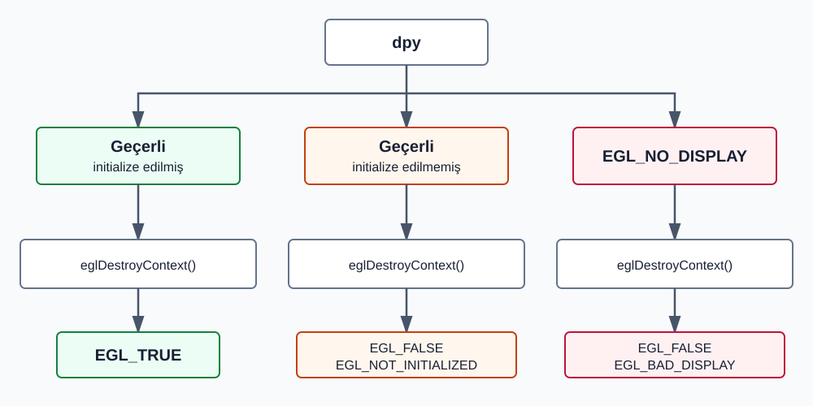

---

# 3. İkinci Parametre: `ctx`

## 3.1 Senaryo A - Geçerli ve Current Olmayan Context

Context herhangi bir thread'de current değilse silme isteği başarılı olur ve
kaynakları mümkün olan en kısa sürede serbest bırakılabilir.

```c
EGLBoolean result = eglDestroyContext(
    egl_display,
    egl_context
);
```

Beklenen sonuç:

```text
result = EGL_TRUE
```

Bu çağrıdan sonra uygulama `egl_context` handle'ını tekrar kullanmamalıdır.

## 3.2 Senaryo B - Geçerli ve Current Context

Current context için `eglDestroyContext` yine başarılı olur; fakat context
hemen serbest bırakılmaz.

```c
eglMakeCurrent(
    egl_display,
    egl_surface,
    egl_surface,
    egl_context
);

EGLBoolean result = eglDestroyContext(
    egl_display,
    egl_context
);
```

Beklenen davranış:

```text
result = EGL_TRUE
context = silme için işaretli, ancak hala current
```

Thread sonraki geçerli `eglMakeCurrent` çağrısıyla context'i bıraktığında
gerçek silme tamamlanabilir:

```c
eglMakeCurrent(
    egl_display,
    EGL_NO_SURFACE,
    EGL_NO_SURFACE,
    EGL_NO_CONTEXT
);
```

## 3.3 Senaryo C - Geçersiz `EGLContext`

```c
EGLContext invalid_context = (EGLContext)0;

EGLBoolean result = eglDestroyContext(
    egl_display,
    invalid_context
);

EGLint error = eglGetError();
```

Beklenen sonuç:

```text
result = EGL_FALSE
error  = EGL_BAD_CONTEXT
```

> `(EGLContext)0` yalnızca geçersiz handle senaryosunu göstermek içindir.

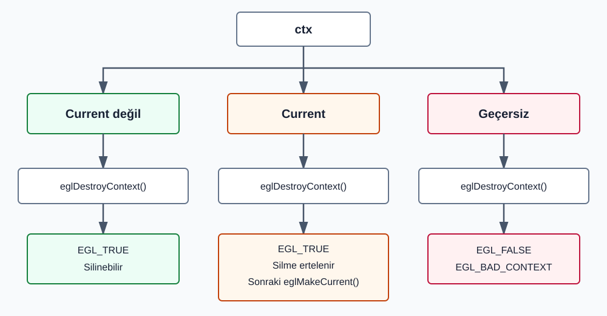

---

# 4. Current ve Current Olmayan Context Karşılaştırması

| Context durumu | `eglDestroyContext` sonucu | Gerçek silme |
| --- | --- | --- |
| Current değil | `EGL_TRUE` | Mümkün olan en kısa sürede |
| Current | `EGL_TRUE` | Sonraki geçerli `eglMakeCurrent` sonrası |
| Geçersiz handle | `EGL_FALSE` | Silinecek geçerli nesne yok |

`eglMakeCurrent(..., EGL_NO_CONTEXT)` context'i thread'den ayırır;
`eglDestroyContext()` ise context'i silinmek üzere işaretler. Bunlar aynı
işlem değildir.

---

# 5. Dönüş Değeri

```text
EGL_TRUE  -> Silme isteği kabul edildi
EGL_FALSE -> İşlem başarısız; eglGetError() ile hata okunmalı
```

`EGL_TRUE`, current context kaynaklarının o anda fiziksel olarak serbest
bırakıldığı anlamına gelmez.

---

# EGL 1.0: `eglDestroySurface`

```c
EGLBoolean eglDestroySurface(
    EGLDisplay dpy,
    EGLSurface surface
);
```

## 1. Bu Fonksiyon Ne Yapar?

`eglDestroySurface`, window, pbuffer veya pixmap türündeki bir `EGLSurface`
nesnesini silinmek üzere işaretler.

```text
Current değil -> eglDestroySurface() -> silinebilir
Current       -> eglDestroySurface() -> silme için işaretlenir
                                      -> current kaldığı sürece geçerlidir
```

Bu projede EGL surface ile GBM native surface ayrı nesnelerdir:

```text
eglDestroySurface()       -> EGLSurface nesnesini yönetir
gbm_surface_destroy()     -> struct gbm_surface nesnesini yönetir
```

Fonksiyon iki parametre alır:

```text
dpy     -> Surface'in ait olduğu, initialize edilmiş EGLDisplay
surface -> Silinecek EGLSurface
```

---

# 2. Birinci Parametre: `dpy`

## 2.1 Senaryo A - Geçerli `EGLDisplay`

```c
EGLBoolean result = eglDestroySurface(
    egl_display,
    egl_surface
);
```

`surface` aynı display'a ait ve geçerliyse beklenen sonuç:

```text
result = EGL_TRUE
```

## 2.2 Senaryo B - `EGL_NO_DISPLAY`

```c
EGLBoolean result = eglDestroySurface(
    EGL_NO_DISPLAY,
    egl_surface
);

EGLint error = eglGetError();
```

Beklenen sonuç:

```text
result = EGL_FALSE
error  = EGL_BAD_DISPLAY
```

## 2.3 Initialize Edilmemiş Display

```text
result = EGL_FALSE
error  = EGL_NOT_INITIALIZED
```

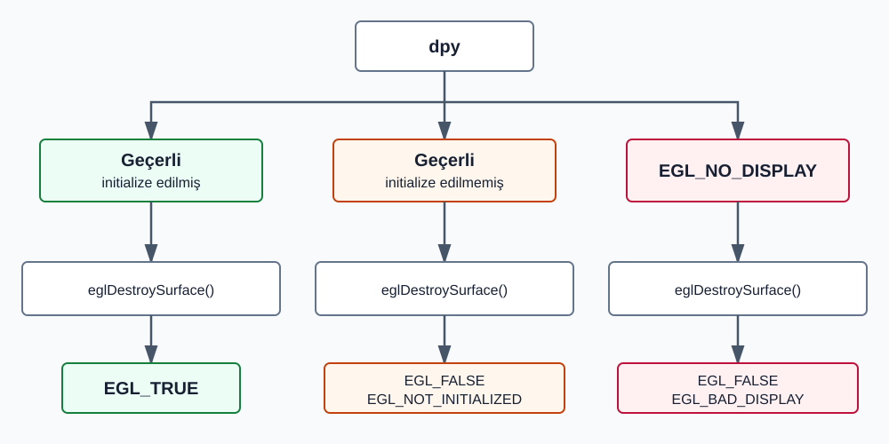

---

# 3. İkinci Parametre: `surface`

## 3.1 Senaryo A - Geçerli ve Current Olmayan Surface

Surface hiçbir thread'de current draw veya current read surface değilse silme
isteği başarılı olur ve kaynakları mümkün olan en kısa sürede serbest
bırakılabilir.

```c
EGLBoolean result = eglDestroySurface(
    egl_display,
    egl_surface
);
```

Beklenen sonuç:

```text
result = EGL_TRUE
```

## 3.2 Senaryo B - Geçerli ve Current Surface

Current draw veya read surface için silme isteği kabul edilir, fakat gerçek
silme ertelenir.

```c
eglMakeCurrent(
    egl_display,
    egl_surface,
    egl_surface,
    egl_context
);

EGLBoolean result = eglDestroySurface(
    egl_display,
    egl_surface
);
```

Beklenen davranış:

```text
result  = EGL_TRUE
surface = silme için işaretli, ancak hala current
```

Sonraki geçerli `eglMakeCurrent` çağrısı eski surface'i current durumdan
çıkardığında gerçek silme tamamlanabilir:

```c
eglMakeCurrent(
    egl_display,
    EGL_NO_SURFACE,
    EGL_NO_SURFACE,
    EGL_NO_CONTEXT
);
```

## 3.3 Senaryo C - Geçersiz `EGLSurface`

```c
EGLSurface invalid_surface = (EGLSurface)0;

EGLBoolean result = eglDestroySurface(
    egl_display,
    invalid_surface
);

EGLint error = eglGetError();
```

Beklenen sonuç:

```text
result = EGL_FALSE
error  = EGL_BAD_SURFACE
```

> `(EGLSurface)0` yalnızca geçersiz handle senaryosunu göstermek içindir.

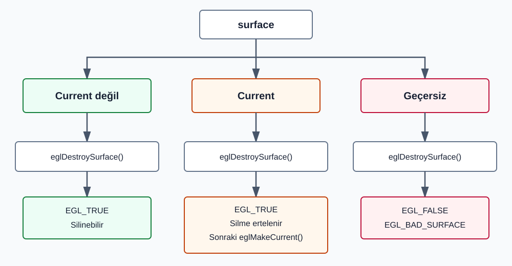

---

# 4. Current ve Current Olmayan Surface Karşılaştırması

| Surface durumu | `eglDestroySurface` sonucu | Gerçek silme |
| --- | --- | --- |
| Current değil | `EGL_TRUE` | Mümkün olan en kısa sürede |
| Current | `EGL_TRUE` | Sonraki geçerli `eglMakeCurrent` sonrası |
| Geçersiz handle | `EGL_FALSE` | Silinecek geçerli nesne yok |

EGL surface silindikten sonra ona karşılık gelen native window veya GBM
surface gerekiyorsa kendi platform API'siyle ayrıca temizlenmelidir.

---

# 5. Dönüş Değeri

```text
EGL_TRUE  -> Silme isteği kabul edildi
EGL_FALSE -> İşlem başarısız; eglGetError() ile hata okunmalı
```

`EGL_TRUE`, current surface kaynaklarının o anda fiziksel olarak serbest
bırakıldığı anlamına gelmez.

---

# EGL 1.0 Fonksiyon Incelemesi: `eglTerminate`

```c
EGLBoolean eglTerminate(EGLDisplay dpy);
```

`eglTerminate`, bir `EGLDisplay` uzerinden kurulmus EGL oturumunu sonlandirmak icin kullanilir. Basarili cagridan sonra display yeniden **uninitialized** duruma doner. Display'e bagli EGL kaynaklari, ornegin context ve surface nesneleri, EGL tarafindan birakilir; o anda current olan kaynaklar ise guvenli sekilde artik kullanilmamasi gereken kaynaklar olarak ele alinir.

Bu incelemede fonksiyonun tek parametresi olan `dpy` / `pDpyID` uc farkli durum uzerinden ele alinmistir:

| Senaryo | `pDpyID` durumu | Test dosyasi | Beklenen sonuc |
| :--- | :--- | :--- | :--- |
| A | Gecerli ve initialize edilmis display | `pDpyID/ScenarioA_ValidDisplay.c` | Render hatti kurulur, ucgen cizilir, `eglTerminate(display)` `EGL_TRUE` dondurur. |
| B | `EGL_NO_DISPLAY` / gecersiz display | `pDpyID/ScenarioB_InvalidDisplay.c` | Gecerli display olmadigi icin EGL/GBM/DRM hatti baslatilmaz; gercek cagrida beklenen hata `EGL_BAD_DISPLAY` olur. |
| C | Gecerli fakat initialize edilmemis display | `pDpyID/ScenarioC_UninitializedDisplay.c` | Render hatti kurulmaz; gecerli display uzerinde `eglTerminate(display)` guvenli bicimde `EGL_TRUE` dondurur. |

## Kisa Ozet


`eglTerminate(dpy)` yalnizca EGL tarafindaki oturumu kapatir. DRM fd, GBM device, GBM surface veya native pencere sistemi kaynaklari ayrica temizlenmelidir. Bu nedenle orneklerde `eglTerminate` cagrisindan sonra veya hata yollarinda `destroy_drm_window(&nw)` ile native kaynak temizligi yapilir.

Fonksiyonun anlasilmasi icin en onemli ayrim sudur:

- `dpy` gecerli ve initialize edilmisse EGL kaynaklari kapatilir.
- `dpy` gecerli ama initialize edilmemisse cagri hata sayilmaz; display zaten baslatilmamis durumdadir.
- `dpy` gecersizse fonksiyon basarili kabul edilmez ve `EGL_BAD_DISPLAY` beklenir.

## Senaryo A: Gecerli ve Initialize Edilmis Display


Bu senaryoda program once DRM/KMS ve GBM altyapisini kurar. Ardindan GBM device uzerinden gecerli bir `EGLDisplay` alir ve `eglInitialize` ile EGL oturumunu baslatir. Config secimi, window surface olusturma ve GLES2 context olusturma adimlari basarili olursa context current yapilir. Son olarak renkli ucgen cizilir, goruntu `drm_swap_buffers` ile ekrana sunulur ve `eglTerminate(display)` cagrilir.

**Kodun gosterdigi nokta:** Gecerli ve initialize edilmis `pDpyID`, `eglTerminate` icin dogru kullanim durumudur. Fonksiyon basarili oldugunda `EGL_TRUE` doner ve display EGL acisindan tekrar uninitialized hale gelir.

**Beklenen terminal ciktisi ozeti:**

```text
Senaryo A: eglTerminate(pDpyID) Gecerli (Valid) Parametre Kullanimi
DRM/KMS ve GBM cihazi basariyla olusturuldu
EGL GBM display ... ile alindi
-> Gecerli bir pDpyID kullanildigi icin EGL Context basariyla olusturuldu.
-> Ekrana renkli bir ucgen ciziliyor...

Simdi eglTerminate(display) cagriliyor...
-> eglTerminate BASARILI (EGL_TRUE dondu).
-> Gorsel Kanit: Ucgen basariyla cizildi ve ardindan EGL baglantisi temiz bir sekilde sonlandirildi.
```

**Gorsel yorum:** Semadaki ekran alani, programin basarili calismasinda olusan somut kaniti temsil eder: GLES2 ile cizilen kirmizi/yesil/mavi koseli ucgen DRM/KMS uzerinden fiziksel ekrana basilir. Bu nedenle Senaryo A yalnizca terminal ciktisiyla degil, gercek render sonucuyla da dogrulanabilir.

## Senaryo B: `EGL_NO_DISPLAY` / Gecersiz Display


Bu negatif senaryoda `pDpyID` olarak `EGL_NO_DISPLAY` veya NULL benzeri gecersiz bir display degeri ele alinir. Kod guvenlik ve sistem kararliligi icin gercek `eglTerminate(EGL_NO_DISPLAY)` cagrisi yapmaz; bunun yerine bu parametre sinifinin neden hatali oldugunu acikca gosterir.

**Kodun gosterdigi nokta:** Gecerli bir display yoksa EGL oturumu da yoktur. Bu durumda context, surface, cizim veya DRM present adimlari denenmemelidir. EGL spesifikasyonu acisindan gecersiz display ile yapilan cagrilarda beklenen hata sinifi `EGL_BAD_DISPLAY`'dir.

**Beklenen terminal ciktisi ozeti:**

```text
Senaryo B: eglTerminate(pDpyID) Hatali (EGL_NO_DISPLAY) Parametre Kullanimi
Bu negatif senaryoda pDpyID olarak EGL_NO_DISPLAY/NULL benzeri gecersiz bir deger kullanimi anlatilir.
Guvenlik nedeniyle gercek eglTerminate(EGL_NO_DISPLAY), EGL/GBM veya DRM cagrisi yapilmiyor.
Beklenen sonuc: EGL implementasyonu boyle bir display'i gecerli kabul etmemeli ve EGL_BAD_DISPLAY raporlamalidir.
SONUC: Gecerli display olmadigi icin context/surface olusturulmaz, cizim ve DRM present denenmez.
```

**Gorsel yorum:** Bu senaryoda ekranda ucgen veya yeni frame beklenmez. En guclu kanit, render hattinin hic baslatilmamasi ve terminal ciktisinda gecersiz display durumunun acikca raporlanmasidir.

## Senaryo C: Gecerli Fakat Initialize Edilmemis Display


Bu senaryoda DRM/KMS ve GBM altyapisi kurulur, ardindan gecerli bir `EGLDisplay` alinir. Ancak senaryo geregi `eglInitialize` cagrisi yapilmaz. Program dogrudan `eglTerminate(display)` cagirir.

EGL 1.0 davranisina gore display handle gecerli oldugu surece, display daha once initialize edilmemis olsa bile `eglTerminate` cagrisi hata uretmeden tamamlanabilir. Cunku EGL tarafinda kapatilacak aktif bir oturum veya render kaynagi yoktur.

**Kodun gosterdigi nokta:** `pDpyID` gecerlidir, fakat display initialize edilmedigi icin `eglGetConfigs`, `eglChooseConfig`, context olusturma, surface olusturma, cizim ve DRM present adimlari calistirilmaz. Buna ragmen `eglTerminate(display)` `EGL_TRUE` dondurur.

**Beklenen terminal ciktisi ozeti:**

```text
Senaryo C: eglTerminate(pDpyID) Initialize Edilmemis Parametre Kullanimi
DRM/KMS ve GBM cihazi basariyla olusturuldu
EGL GBM display ... ile alindi
Display gecerli alindi fakat INITIALIZE EDILMEDI.
Simdi eglTerminate(display) cagriliyor...

-> eglTerminate BASARILI (EGL_TRUE dondu).
-> Not: EGL spesifikasyonuna gore baslatilmamis display uzerinde terminate cagirmak serbesttir ve etkisi yoktur.

Bu display eglInitialize ile baslatilmadigi icin eglGetConfigs/eglChooseConfig, context, surface, cizim ve DRM present denenmeyecek.
SONUC: EGL Context olusturulamaz ve ekrana yeni bir gorsel basilmamalidir.
```

**Gorsel yorum:** Senaryo C'de display handle gecerli olsa da EGL state machine baslatilmadigi icin cizim hatti olusmaz. Bu nedenle beklenen gorsel sonuc "yeni goruntu yok" durumudur; dogrulama terminaldeki `EGL_TRUE` sonucu ve render adimlarinin atlanmasi uzerinden yapilir.

## Hata ve Durum Matrisi

| Durum | `eglTerminate` sonucu | Beklenen EGL hata durumu | Yan etki |
| :--- | :--- | :--- | :--- |
| `dpy` gecerli ve initialized | `EGL_TRUE` | `EGL_SUCCESS` | EGL oturumu sonlanir, display uninitialized olur. |
| `dpy` gecerli fakat uninitialized | `EGL_TRUE` | `EGL_SUCCESS` | Aktif EGL kaynagi olmadigi icin guvenli no-op davranisi gorulur. |
| `dpy == EGL_NO_DISPLAY` veya gecersiz | `EGL_FALSE` | `EGL_BAD_DISPLAY` | EGL state degismez; render hatti kurulmaz. |

> [!WARNING]
> `eglTerminate` sonrasinda ayni display artik initialized kabul edilmez. Bu display uzerinde yeniden normal EGL islemleri yapilacaksa once tekrar `eglInitialize` cagrilmalidir. Aksi halde `eglChooseConfig`, `eglCreateContext` veya `eglCreateWindowSurface` gibi cagrilar basarisiz olabilir.

## Guvenli Kullanim Kalibi

```c
#include <EGL/egl.h>
#include <stdio.h>

void safe_egl_cleanup(EGLDisplay dpy) {
    if (dpy == EGL_NO_DISPLAY) {
        printf("HATA: Gecersiz EGLDisplay (EGL_NO_DISPLAY).\n");
        return;
    }

    if (eglMakeCurrent(dpy, EGL_NO_SURFACE, EGL_NO_SURFACE, EGL_NO_CONTEXT) == EGL_FALSE) {
        printf("Uyari: current context birakilamadi. Hata: 0x%04X\n", eglGetError());
    }

    if (eglTerminate(dpy) == EGL_FALSE) {
        printf("HATA: eglTerminate basarisiz oldu. Hata: 0x%04X\n", eglGetError());
        return;
    }

    printf("BASARILI: EGL oturumu kapatildi.\n");
}
```

Bu kalipta once gecersiz display kontrol edilir. Ardindan varsa current context/surface baglantisi birakilir ve `eglTerminate` cagrilir. Native kaynaklarin temizligi bu fonksiyonun disinda ayrica yapilmalidir.

## Sonuc

`eglTerminate`, EGL yasam dongusunun kapanis fonksiyonudur. Senaryo A dogru ve tam kullanim yolunu gosterir: display alinir, initialize edilir, context/surface kurulur, cizim yapilir ve EGL oturumu kapatilir. Senaryo B hatali parametre yolunu gosterir: `EGL_NO_DISPLAY` gecerli bir EGL oturumu degildir. Senaryo C ise onemli bir sinir durumunu aciklar: display gecerli ama initialize edilmemisse render uretilemez, ancak `eglTerminate` guvenli bicimde basarili donebilir.

Bu uc senaryo birlikte degerlendirildiginde `pDpyID` parametresi icin temel kural nettir: `eglTerminate` cagrisi yalnizca gecerli bir `EGLDisplay` ile anlamlidir; initialize durumu fonksiyonun yapacagi isi degistirir, fakat gecersiz display her zaman hata sinifina girer.

## Kaynaklar

- Khronos EGL 1.0 Specification: `eglspec.1.0 (1).pdf`
- Khronos EGL Registry: https://registry.khronos.org/EGL/
- Khronos eski EGL spesifikasyonlari: https://registry.khronos.org/EGL/specs/

---

# EGL 1.0: `eglGetError`

```c
EGLint eglGetError(void);
```

## 1. Bu Fonksiyon Ne Yapar?

`eglGetError`, çağrı yapan thread için kaydedilmiş son EGL hata kodunu
döndürür. Parametre almadığı için senaryolar parametre değişikliğine göre
değil, daha önce çağrılan EGL fonksiyonunun oluşturduğu duruma göre kurulur.

```text
EGL fonksiyonu çağrılır
        |
        v
Dönüş değeri kontrol edilir
        |
        v
Başarısızsa hemen eglGetError() çağrılır
        |
        v
EGLint hata kodu alınır
```

`eglGetError()` hata kodunu döndürdükten sonra o thread'in hata durumu
`EGL_SUCCESS` olacak biçimde sıfırlanır. Bu nedenle hata, başarısız EGL
çağrısından hemen sonra ve yalnızca bir kez okunmalıdır.

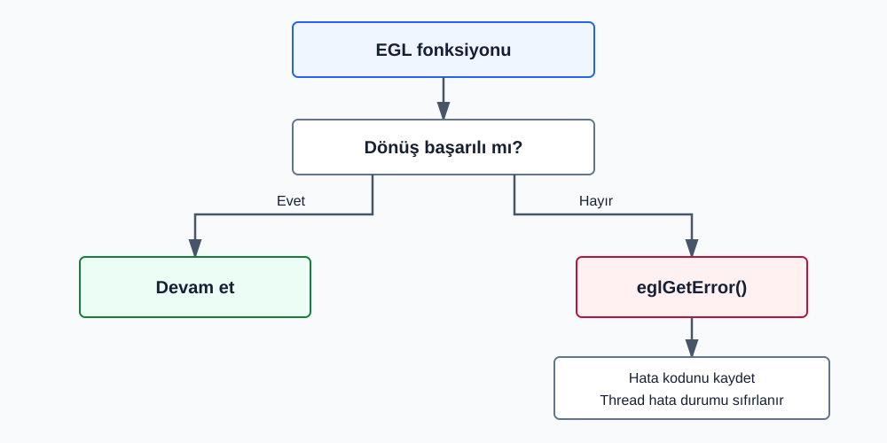

---

# 2. EGL 1.0 Dönüş Değerleri

EGL 1.0 kapsamında `eglGetError()` aşağıdaki 14 temel değerden birini
döndürebilir. `EGL_SUCCESS` teknik olarak hata değildir.

| Değer | Görülebileceği durum |
| --- | --- |
| `EGL_SUCCESS` | Kayıtlı hata yoktur. |
| `EGL_NOT_INITIALIZED` | EGL ilgili display için initialize edilmemiştir veya edilememiştir. |
| `EGL_BAD_ACCESS` | İstenen kaynağa erişim kuralı ihlal edilmiştir. |
| `EGL_BAD_ALLOC` | İşlem için kaynak ayrılamamıştır. |
| `EGL_BAD_ATTRIBUTE` | Attribute listesinde tanınmayan attribute/değer vardır. |
| `EGL_BAD_CONTEXT` | Bir context argümanı geçerli `EGLContext` değildir. |
| `EGL_BAD_CONFIG` | Bir config argümanı geçerli `EGLConfig` değildir. |
| `EGL_BAD_CURRENT_SURFACE` | Thread'in current surface'i artık geçerli değildir. |
| `EGL_BAD_DISPLAY` | Bir display argümanı geçerli `EGLDisplay` değildir. |
| `EGL_BAD_SURFACE` | Bir surface argümanı geçerli `EGLSurface` değildir. |
| `EGL_BAD_MATCH` | Argümanlar tek tek geçerli olsa da birbirleriyle uyumsuzdur. |
| `EGL_BAD_PARAMETER` | Bir veya daha fazla parametre değeri geçersizdir. |
| `EGL_BAD_NATIVE_PIXMAP` | Native pixmap geçersizdir ve implementation bunu algılayabilmiştir. |
| `EGL_BAD_NATIVE_WINDOW` | Native window geçersizdir ve implementation bunu algılayabilmiştir. |

---

# 3. Hata Senaryoları

## 3.1 Senaryo A - `EGL_SUCCESS`

Kayıtlı bir hata yokken:

```c
EGLint error = eglGetError();
```

beklenen sonuç:

```text
error = EGL_SUCCESS
```

## 3.2 Senaryo B - `EGL_NOT_INITIALIZED`

Geçerli fakat initialize edilmemiş bir display üzerinde initialize gerektiren
bir EGL işlemi yapıldığında görülebilir.

```c
EGLBoolean result = eglDestroyContext(dpy, context);
EGLint error = eglGetError();
```

```text
result = EGL_FALSE
error  = EGL_NOT_INITIALIZED
```

## 3.3 Senaryo C - `EGL_BAD_ACCESS`

Bir context başka bir thread'de current iken ikinci thread aynı context'i
current yapmaya çalışırsa kaynak erişim kuralı ihlal edilebilir.

```text
Thread A: context current
Thread B: aynı context ile eglMakeCurrent()
          -> EGL_FALSE
          -> EGL_BAD_ACCESS
```

Bu senaryo iki thread ve senkronizasyon gerektirir.

## 3.4 Senaryo D - `EGL_BAD_ALLOC`

`eglCreateContext`, `eglCreateWindowSurface` veya benzeri bir oluşturma işlemi
için gerekli kaynak ayrılamadığında görülebilir.

```text
Oluşturma fonksiyonu başarısız
-> EGL_NO_CONTEXT veya EGL_NO_SURFACE
-> eglGetError() = EGL_BAD_ALLOC
```

Kaynak tüketimini güvenli ve deterministik biçimde oluşturmak her ortamda
mümkün olmadığından bu senaryo implementation ve test ortamına bağlıdır.

## 3.5 Senaryo E - `EGL_BAD_ATTRIBUTE`

```c
const EGLint attributes[] = {
    0x7FFFFFFF, 1,
    EGL_NONE
};

EGLint num_config = 0;
EGLBoolean result = eglChooseConfig(
    dpy,
    attributes,
    NULL,
    0,
    &num_config
);

EGLint error = eglGetError();
```

```text
result = EGL_FALSE
error  = EGL_BAD_ATTRIBUTE
```

## 3.6 Senaryo F - `EGL_BAD_CONTEXT`

```c
EGLBoolean result = eglDestroyContext(
    dpy,
    (EGLContext)0
);

EGLint error = eglGetError();
```

```text
result = EGL_FALSE
error  = EGL_BAD_CONTEXT
```

## 3.7 Senaryo G - `EGL_BAD_CONFIG`

```c
EGLContext context = eglCreateContext(
    dpy,
    (EGLConfig)0,
    EGL_NO_CONTEXT,
    NULL
);

EGLint error = eglGetError();
```

```text
context = EGL_NO_CONTEXT
error   = EGL_BAD_CONFIG
```

## 3.8 Senaryo H - `EGL_BAD_CURRENT_SURFACE`

Calling thread'in current draw veya read surface'i artık geçerli değilse
sonraki EGL işlemi `EGL_BAD_CURRENT_SURFACE` üretebilir. Bu durum native
window yaşam döngüsüne ve implementation'a bağlı bir test düzeneği gerektirir.

## 3.9 Senaryo I - `EGL_BAD_DISPLAY`

```c
EGLBoolean result = eglInitialize(
    EGL_NO_DISPLAY,
    NULL,
    NULL
);

EGLint error = eglGetError();
```

```text
result = EGL_FALSE
error  = EGL_BAD_DISPLAY
```

## 3.10 Senaryo J - `EGL_BAD_SURFACE`

```c
EGLBoolean result = eglDestroySurface(
    dpy,
    (EGLSurface)0
);

EGLint error = eglGetError();
```

```text
result = EGL_FALSE
error  = EGL_BAD_SURFACE
```

## 3.11 Senaryo K - `EGL_BAD_MATCH`

Geçerli context ve surface nesneleri birbirleriyle uyumlu değilse:

```c
EGLBoolean result = eglMakeCurrent(
    dpy,
    incompatible_surface,
    incompatible_surface,
    context
);

EGLint error = eglGetError();
```

```text
result = EGL_FALSE
error  = EGL_BAD_MATCH
```

## 3.12 Senaryo L - `EGL_BAD_PARAMETER`

Bir EGL fonksiyonuna kendi sözleşmesine uymayan parametre değeri verildiğinde
görülebilir. Örneğin zorunlu output pointer'ını `NULL` vermek:

```c
EGLBoolean result = eglChooseConfig(
    dpy,
    NULL,
    NULL,
    0,
    NULL
);

EGLint error = eglGetError();
```

Beklenen hata `EGL_BAD_PARAMETER`'dır.

## 3.13 Senaryo M - `EGL_BAD_NATIVE_PIXMAP`

`eglCreatePixmapSurface` için verilen native pixmap geçersizse ve
implementation bunu algılayabiliyorsa görülür. Bu GBM window-surface
projesinin normal akışında native pixmap kullanılmadığı için platforma bağlı
bir senaryodur.

## 3.14 Senaryo N - `EGL_BAD_NATIVE_WINDOW`

```c
EGLSurface surface = eglCreateWindowSurface(
    dpy,
    config,
    (EGLNativeWindowType)0,
    NULL
);

EGLint error = eglGetError();
```

Implementation geçersiz native handle'ı algılayabiliyorsa:

```text
surface = EGL_NO_SURFACE
error   = EGL_BAD_NATIVE_WINDOW
```

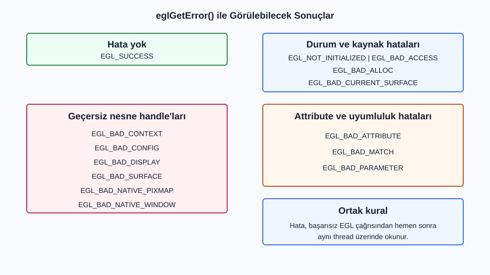

---

# 4. Hata Durumunun Okununca Sıfırlanması

```c
eglDestroySurface(dpy, (EGLSurface)0);

EGLint first_error = eglGetError();
EGLint second_error = eglGetError();
```

Beklenen mantık:

```text
first_error  = EGL_BAD_SURFACE
second_error = EGL_SUCCESS
```

Araya başka bir EGL fonksiyonu sokmak hata durumunu değiştirebileceğinden
`eglGetError()` başarısız çağrıdan hemen sonra kullanılmalıdır.

Hata durumu thread'e özeldir. Bir thread'de oluşan hata, başka bir thread'in
`eglGetError()` sonucuyla okunmaz.

---

# 5. Hata Adı Yardımcısı

```c
const char *egl_error_string(EGLint error)
{
    switch (error) {
        case EGL_SUCCESS:             return "EGL_SUCCESS";
        case EGL_NOT_INITIALIZED:     return "EGL_NOT_INITIALIZED";
        case EGL_BAD_ACCESS:          return "EGL_BAD_ACCESS";
        case EGL_BAD_ALLOC:           return "EGL_BAD_ALLOC";
        case EGL_BAD_ATTRIBUTE:       return "EGL_BAD_ATTRIBUTE";
        case EGL_BAD_CONTEXT:         return "EGL_BAD_CONTEXT";
        case EGL_BAD_CONFIG:          return "EGL_BAD_CONFIG";
        case EGL_BAD_CURRENT_SURFACE: return "EGL_BAD_CURRENT_SURFACE";
        case EGL_BAD_DISPLAY:         return "EGL_BAD_DISPLAY";
        case EGL_BAD_SURFACE:         return "EGL_BAD_SURFACE";
        case EGL_BAD_MATCH:           return "EGL_BAD_MATCH";
        case EGL_BAD_PARAMETER:       return "EGL_BAD_PARAMETER";
        case EGL_BAD_NATIVE_PIXMAP:   return "EGL_BAD_NATIVE_PIXMAP";
        case EGL_BAD_NATIVE_WINDOW:   return "EGL_BAD_NATIVE_WINDOW";
        default:                      return "UNKNOWN_EGL_ERROR";
    }
}
```

---

# Kaynakça

[EGL Spec 1.0](./eglspec.1.0.pdf)
